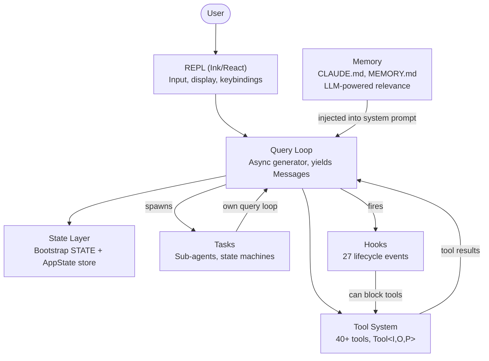
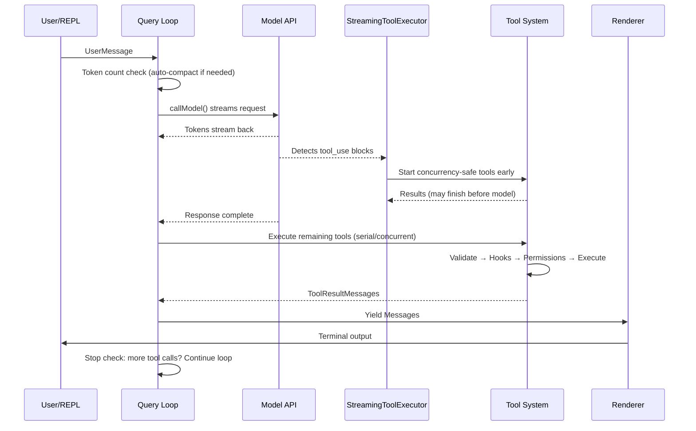
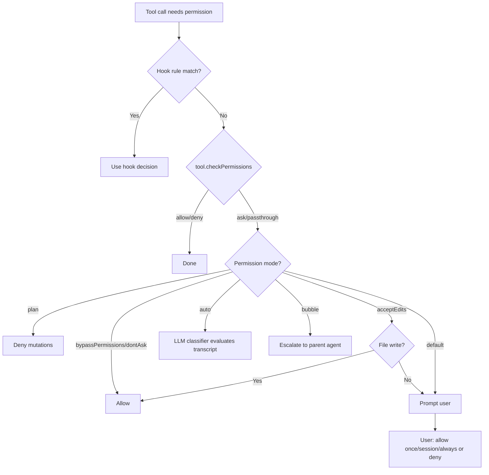
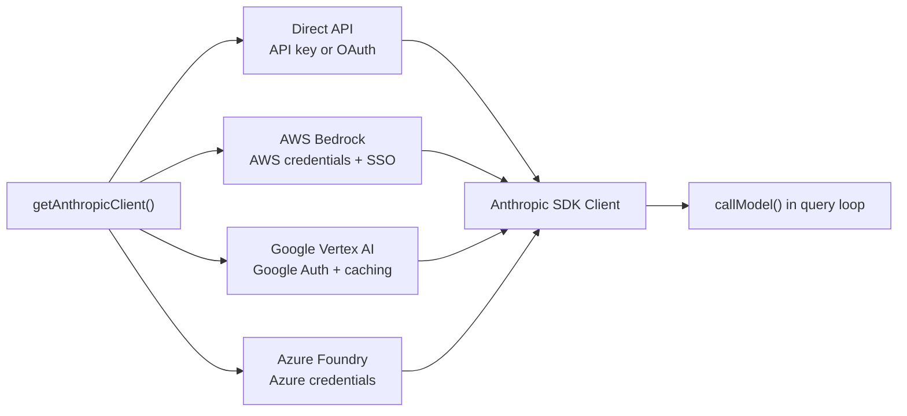
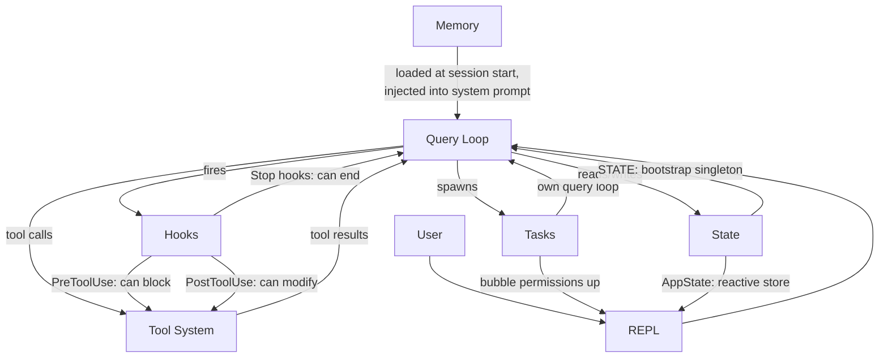

# Chương 1: Kiến trúc của một AI Agent

## What You're Looking At

Một CLI truyền thống là một hàm: nhận đối số, thực thi công việc, rồi thoát. `grep` không tự quyết định chạy thêm `sed`. `curl` không tự mở file rồi vá nội dung dựa trên thứ nó vừa tải về. Hợp đồng rất rõ: một lệnh, một hành động, đầu ra xác định.

Một agentic CLI phá vỡ toàn bộ hợp đồng đó. Nó nhận prompt ngôn ngữ tự nhiên, tự quyết định dùng tool nào, thực thi theo thứ tự tình huống yêu cầu, đánh giá kết quả, rồi lặp cho đến khi tác vụ hoàn tất hoặc người dùng dừng lại. "Chương trình" không còn là một chuỗi lệnh cố định -- nó là vòng lặp bao quanh một language model, nơi chuỗi lệnh được sinh ra ngay lúc runtime. Tool calls là side effects. Lập luận của model chính là control flow.

Claude Code là triển khai production của Anthropic cho ý tưởng này: một TypeScript monolith gần 2.000 file, biến terminal thành môi trường phát triển đầy đủ do Claude vận hành. Nó đã đến tay hàng trăm nghìn developer, nên mọi quyết định kiến trúc đều có hệ quả thực tế. Chương này đưa cho bạn mental model nền tảng. Có sáu abstractions định nghĩa toàn bộ hệ thống. Có một luồng dữ liệu thống nhất kết nối chúng. Khi bạn nắm được golden path từ keystroke đến output cuối cùng, các chương sau chỉ là phóng to từng đoạn của luồng đó.

Những gì bạn sắp đọc là một retrospective decomposition -- sáu abstractions này không được vẽ sẵn trên whiteboard ngay từ đầu. Chúng hình thành dưới áp lực vận hành một production agent cho lượng người dùng lớn. Hiểu chúng theo đúng hiện trạng (thay vì theo thiết kế lý tưởng ban đầu) là cách đặt kỳ vọng đúng cho phần còn lại của cuốn sách.

---

## The Six Key Abstractions

Claude Code được xây trên sáu abstractions cốt lõi. Mọi thứ khác -- hơn 400 utility files, terminal renderer được fork, vim emulation, cost tracker -- tồn tại để phục vụ sáu phần này.



Dưới đây là vai trò của từng phần và lý do nó tồn tại.

**1. The Query Loop** (`query.ts`, ~1,700 lines). Đây là async generator đóng vai trò nhịp tim của toàn hệ thống. Nó stream phản hồi từ model, thu thập tool calls, thực thi tool, thêm kết quả vào message history, rồi lặp tiếp. Mọi tương tác -- REPL, SDK, sub-agent, headless `--print` -- đều đi qua duy nhất hàm này. Nó yield `Message` objects để UI tiêu thụ. Kiểu trả về là discriminated union tên `Terminal`, mã hóa chính xác vì sao loop dừng: hoàn tất bình thường, user abort, cạn token budget, stop hook can thiệp, vượt max turns, hoặc unrecoverable error. Generator pattern -- thay vì callbacks hay event emitters -- cho backpressure tự nhiên, khả năng hủy sạch, và terminal states có typing rõ ràng. Chương 5 sẽ bóc tách chi tiết nội bộ loop này.

**2. The Tool System** (`Tool.ts`, `tools.ts`, `services/tools/`). Tool là mọi thứ agent có thể làm với thế giới bên ngoài: đọc file, chạy shell command, chỉnh sửa code, tìm web. Sự đơn giản ở mục tiêu này che giấu một lớp machinery đáng kể bên dưới. Mỗi tool triển khai interface phong phú bao gồm identity, schema, execution, permissions, và rendering. Tool không chỉ là hàm -- mỗi tool mang logic quyền riêng, khai báo concurrency, progress reporting, và UI rendering. Hệ thống chia tool calls thành concurrent batches và serial batches; một streaming executor còn có thể khởi chạy concurrency-safe tools trước cả khi model phát xong phản hồi. Chương 6 đi toàn bộ từ giao diện tool đến execution pipeline.

**3. Tasks** (`Task.ts`, `tasks/`). Tasks là các đơn vị công việc chạy nền -- chủ yếu là sub-agents. Chúng đi theo state machine: `pending -> running -> completed | failed | killed`. `AgentTool` spawn một `query()` generator mới với message history, tool set, và permission mode riêng. Tasks trao cho Claude Code khả năng đệ quy: agent có thể ủy quyền cho sub-agent, và sub-agent có thể ủy quyền tiếp.

**4. State** (hai tầng). Hệ thống giữ state ở hai lớp. Một mutable singleton (`STATE`) chứa khoảng 80 trường hạ tầng cấp session: working directory, model configuration, cost tracking, telemetry counters, session ID. Nó được set một lần lúc startup và mutate trực tiếp -- không reactive. Một reactive store tối giản (34 dòng, hình dạng Zustand) điều khiển UI: messages, input mode, tool approvals, progress indicators. Sự tách lớp này là có chủ đích: state hạ tầng đổi hiếm, không cần re-render; state UI đổi liên tục, bắt buộc phải re-render. Chương 3 phân tích kỹ two-tier architecture này.

**5. Memory** (`memdir/`). Đây là persistent context của agent qua nhiều sessions. Có ba tầng: project-level (`CLAUDE.md` trong repo), user-level (`~/.claude/MEMORY.md`), và team-level (chia sẻ bằng symlinks). Khi session bắt đầu, hệ thống quét toàn bộ memory files, parse frontmatter, rồi một LLM chọn memory nào relevant với cuộc hội thoại hiện tại. Memory là cơ chế để Claude Code "nhớ" conventions của codebase, quyết định kiến trúc, và lịch sử debugging của bạn.

**6. Hooks** (`hooks/`, `utils/hooks/`). Đây là user-defined lifecycle interceptors, kích hoạt ở 27 events khác nhau trên 4 execution types: shell commands, single-shot LLM prompts, multi-turn agent conversations, và HTTP webhooks. Hooks có thể block tool execution, modify inputs, inject context bổ sung, hoặc short-circuit toàn bộ query loop. Chính permission system cũng một phần được triển khai qua hooks -- `PreToolUse` hooks có thể deny tool calls trước cả khi interactive permission prompt xuất hiện.

---

## The Golden Path: From Keystroke to Output

Hãy lần theo một request đi xuyên hệ thống. Người dùng gõ "add error handling to the login function" rồi nhấn Enter.



Có ba điểm cần nhìn rõ trong flow này.

Thứ nhất, query loop là generator, không phải callback chain. REPL kéo messages từ nó bằng `for await`, nên backpressure diễn ra tự nhiên -- nếu UI không theo kịp, generator sẽ dừng chờ. Đây là lựa chọn có chủ đích thay cho event emitters hoặc observable streams.

Thứ hai, tool execution chồng lấp với model streaming. `StreamingToolExecutor` không chờ model phát xong mới chạy concurrency-safe tools. Một `Read` call có thể hoàn tất và trả kết quả trong lúc model còn đang generate phần còn lại. Đây là speculative execution -- nếu output cuối của model khiến tool call đó không còn hợp lệ (hiếm nhưng có), kết quả sẽ bị discard.

Thứ ba, toàn bộ loop là re-entrant. Khi model tạo tool calls, kết quả được append vào message history, rồi loop gọi model lại với context đã cập nhật. Không có pha riêng kiểu "xử lý kết quả tool" -- tất cả chỉ là một loop. Model tự quyết định lúc nào xong bằng cách không tạo thêm tool calls nữa.

---

## The Permission System

Claude Code có thể chạy shell commands tùy ý trên máy bạn. Nó chỉnh sửa files. Nó có thể spawn sub-processes, gửi network requests, và thay đổi git history. Nếu không có permission system, đó là một thảm họa bảo mật.

Hệ thống định nghĩa bảy permission modes, sắp từ thoáng nhất đến chặt nhất:

| Mode | Behavior |
|------|----------|
| `bypassPermissions` | Everything allowed. No checks. Internal/testing only. |
| `dontAsk` | All allowed, but still logged. No user prompts. |
| `auto` | Transcript classifier (LLM) decides allow/deny. |
| `acceptEdits` | File edits auto-approved; all other mutations prompt. |
| `default` | Standard interactive mode. User approves each action. |
| `plan` | Read-only. All mutations blocked. |
| `bubble` | Escalate decision to parent agent (sub-agent mode). |

Khi một tool call cần quyền, chuỗi phân giải diễn ra theo thứ tự nghiêm ngặt:



`auto` mode đáng để chú ý riêng. Nó chạy một LLM call nhẹ, tách biệt, để phân loại tool invocation theo transcript hiện tại. Classifier này thấy biểu diễn rút gọn của input tool rồi quyết định hành động đó có phù hợp với yêu cầu người dùng hay không. Đây là mode giúp Claude Code vận hành bán tự trị -- tự duyệt thao tác thường quy, nhưng gắn cờ khi thấy dấu hiệu lệch user intent.

Sub-agents mặc định ở `bubble` mode, nghĩa là không được tự phê duyệt hành động nguy hiểm của chính chúng. Permission request sẽ được đẩy lên parent agent, rồi cuối cùng tới người dùng nếu cần. Cơ chế này ngăn sub-agent lặng lẽ chạy lệnh phá hủy mà người dùng không biết.

---

## Multi-Provider Architecture

Claude Code nói chuyện với Claude qua bốn đường hạ tầng khác nhau, và phần còn lại của hệ thống không cần biết đường nào đang dùng.



Ý chính: Anthropic SDK cung cấp wrapper classes cho từng cloud provider, nhưng tất cả cùng lộ ra một interface giống direct API client. Factory `getAnthropicClient()` đọc environment variables và cấu hình để chọn provider, tạo client tương ứng, rồi trả về. Từ đó trở đi, `callModel()` và mọi caller khác đối xử nó như một Anthropic client chung.

Provider được chọn ở startup và lưu vào `STATE`. Query loop không cần kiểm tra provider nào đang active. Vì thế, đổi từ Direct API sang Bedrock chỉ là đổi cấu hình, không phải đổi code -- agent loop, tool system, và permission model đều provider-agnostic.

---

## The Build System

Claude Code được phát hành vừa như internal tool của Anthropic, vừa như public npm package. Một codebase phục vụ cả hai, với compile-time feature flags để quyết định phần nào được include.

```typescript
// Conditional imports guarded by feature flags
const reactiveCompact = feature('REACTIVE_COMPACT')
  ? require('./services/compact/reactiveCompact.js')
  : null
```

Hàm `feature()` đến từ `bun:bundle`, bundler API tích hợp sẵn của Bun. Ở build time, mỗi feature flag được resolve thành boolean literal. Sau đó dead code elimination của bundler sẽ xóa hẳn `require()` call nếu cờ là false -- module không được load, không vào bundle, và không được ship.

Pattern này rất nhất quán: một guard `feature()` cấp cao bao quanh `require()` call. `require()` được dùng thay vì `import` vì dynamic `require()` có thể bị bundler loại bỏ hoàn toàn khi guard là false, còn dynamic `import()` thì không (nó trả về Promise mà bundler buộc phải giữ).

Có một nghịch lý đáng chú ý. Source maps trong các bản npm đầu tiên chứa `sourcesContent` -- toàn bộ TypeScript source gốc, gồm cả các code paths chỉ dùng nội bộ. Feature flags đã loại runtime code thành công, nhưng source vẫn còn trong maps. Đó là cách mã nguồn Claude Code trở nên đọc được công khai.

---

## How the Pieces Connect

Sáu abstractions tạo thành một dependency graph:



Memory được bơm vào query loop như một phần của system prompt. Query loop điều phối tool execution. Tool results quay ngược vào query loop dưới dạng messages. Tasks là những query loops đệ quy với message histories tách biệt. Hooks chặn loop tại các điểm lifecycle xác định. State được đọc/ghi bởi toàn hệ thống, trong đó reactive store làm cầu nối sang UI.

Phụ thuộc vòng giữa query loop và tool system là đặc trưng quan trọng nhất của kiến trúc này. Model sinh tool calls. Tools thực thi và tạo kết quả. Kết quả được thêm vào message history. Model đọc kết quả và quyết định bước kế tiếp. Vòng này chạy cho đến khi model ngừng gọi tool hoặc một ràng buộc bên ngoài (token budget, max turns, user abort) kết thúc nó.

Liên kết với các chương sau như sau: golden path từ input tới output là sợi chỉ xuyên suốt cả sách. Chương 2 theo dõi quá trình bootstrap để hệ thống đi tới điểm có thể chạy luồng này. Chương 3 giải thích two-tier state architecture mà luồng này đọc/ghi. Chương 4 trình bày API layer mà query loop gọi. Các chương còn lại lần lượt zoom vào từng đoạn của luồng end-to-end bạn vừa thấy.

---

## Apply This

Nếu bạn đang xây một agentic system -- bất kỳ hệ thống nào mà LLM quyết định hành động tại runtime -- đây là những patterns từ kiến trúc Claude Code có thể chuyển giao trực tiếp.

**The generator loop pattern.** Dùng async generator cho agent loop, không dùng callbacks hay event emitters. Generator cho bạn backpressure tự nhiên (consumer kéo theo tốc độ riêng), hủy tác vụ sạch (`.return()` trên generator), và kiểu trả về rõ cho terminal states. Vấn đề nó giải quyết: ở callback-based agent loops, rất khó biết loop "xong" khi nào và vì sao. Generator biến termination thành thành phần hạng nhất trong type system.

**The self-describing tool interface.** Mỗi tool nên tự khai báo concurrency safety, permission requirements, và rendering behavior. Đừng nhét logic này vào một central orchestrator "biết" từng tool. Vấn đề nó giải quyết: central orchestrator sẽ thành god object, cứ thêm tool mới là phải sửa lõi. Self-describing tools scale tuyến tính -- thêm tool N+1 không cần thay đổi code cũ.

**Separate infrastructure state from reactive state.** Không phải mọi state đều cần kích hoạt UI update. Session configuration, cost tracking, telemetry nên ở một mutable object thường. Message history, progress indicators, approval queues nên ở reactive store. Vấn đề nó giải quyết: làm mọi thứ reactive tạo subscription overhead và tăng độ phức tạp cho loại state chỉ đổi một lần lúc startup nhưng bị đọc cả nghìn lần. Hai tầng là hai access patterns.

**Permission modes, not permission checks.** Định nghĩa một tập nhỏ named modes (plan, default, auto, bypass) và cho mọi permission decision đi qua mode. Đừng rải `if (isAllowed)` checks trong tool implementations. Vấn đề nó giải quyết: permission enforcement thiếu nhất quán. Khi mọi tool đi qua cùng mode-based resolution chain, bạn có thể suy luận security posture của hệ thống chỉ bằng mode đang active.

**Recursive agent architecture via tasks.** Sub-agents nên là các instance mới của chính agent loop với message history riêng, không phải special-cased code paths. Permission escalation đi lên qua `bubble` mode. Vấn đề nó giải quyết: logic sub-agent lệch khỏi loop chính, dẫn tới khác biệt tinh vi về hành vi và xử lý lỗi. Nếu sub-agent dùng cùng một loop, nó thừa hưởng toàn bộ guarantees tương tự.
