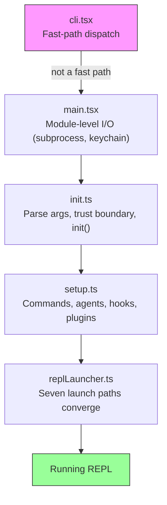
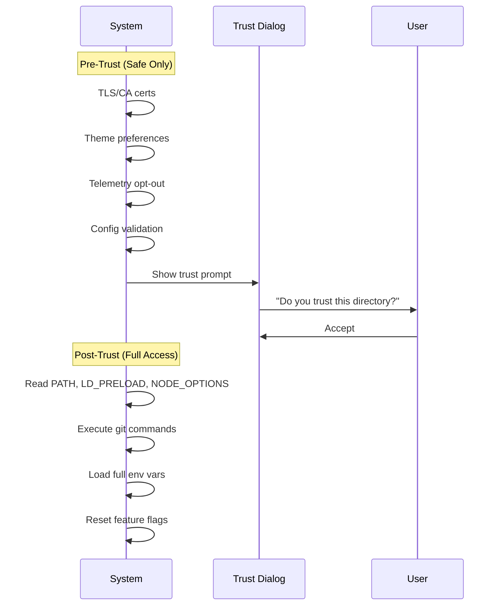

# Chương 2: Khởi động nhanh -- Bootstrap Pipeline

Nếu Chương 1 đưa cho bạn bản đồ kiến trúc của Claude Code, thì chương này đưa cho bạn tuyến đường nó đi để vào trạng thái sẵn sàng hoạt động. Mọi thành phần trong sáu abstraction -- query loop, tool system, state layers, hooks, memory -- đều phải được khởi tạo trước khi người dùng nhìn thấy con trỏ. Ngân sách cho toàn bộ việc đó: 300 milliseconds.

Ba trăm milliseconds là ngưỡng mà con người cảm nhận công cụ là tức thì. Vượt ngưỡng đó, CLI bắt đầu cho cảm giác ì ạch. Trượt xa hơn nữa, lập trình viên sẽ bỏ dùng. Mọi thứ trong chương này tồn tại để giữ hệ thống dưới ranh giới đó.

Bootstrap phải làm xong bốn việc: kiểm tra môi trường, dựng security boundaries, cấu hình communication layer, và render UI. Tất cả phải hoàn tất trong dưới 300ms. Insight kiến trúc ở đây là bốn việc này có thể chồng lấp một phần, được sắp thứ tự cẩn thận, và cắt tỉa quyết liệt để nhét vừa một ngân sách nghe có vẻ bất khả thi với một hệ thống phức tạp như vậy.

Một lưu ý về phương pháp: các mốc thời gian trong chương này là xấp xỉ, suy ra từ chính startup profiling checkpoints của codebase. Chúng đại diện cho warm-start timings điển hình trên phần cứng hiện đại. Cold starts sẽ chậm hơn. Con số tuyệt đối không quan trọng bằng cấu trúc tương đối: thao tác nào chồng lấp, thao tác nào chặn, và thao tác nào được trì hoãn.

---

## Hình dạng của Pipeline

Startup pipeline nằm trong năm file, được thực thi tuần tự. Mỗi file thu hẹp phạm vi việc hệ thống cần làm tiếp theo:



Mỗi file chỉ làm lượng việc tối thiểu cần thiết trước khi chuyển quyền điều khiển sang file kế tiếp. `cli.tsx` cố thoát trước khi import bất cứ thứ nặng nào. `main.tsx` kích hoạt thao tác chậm như side effects ngay trong lúc import evaluation. `init.ts` phân giải cấu hình và thiết lập trust boundary. `setup.ts` đăng ký capabilities. `replLauncher.ts` chọn entry point phù hợp rồi khởi chạy UI.

Ba chiến lược parallelism làm việc này nhanh:

1. **Module-level subprocess dispatch.** Kích hoạt đọc keychain và MDM như side effects *trong lúc import evaluation*. Các subprocess chạy trong khi ~135ms static imports còn lại đang tải.
2. **Promise parallelism in setup.** Socket binding, hook snapshotting, command loading, và agent definition loading đều chạy đồng thời.
3. **Post-render deferred prefetches.** Mọi thứ người dùng chưa cần trước khi gõ tin nhắn đầu tiên -- git status, model capabilities, AWS credentials -- sẽ chạy sau khi prompt đã hiện.

Chiến lược thứ tư ít lộ rõ hơn nhưng quan trọng ngang nhau: **dynamic imports to defer module evaluation**. Codebase dùng `await import('./module.js')` ở ít nhất cả tá vị trí để tránh tải code cho tới khi thực sự cần. OpenTelemetry (400KB + 700KB gRPC) chỉ tải khi telemetry khởi tạo. React components chỉ tải khi render. Mỗi dynamic import đánh đổi cold-path latency (lần dùng đầu sẽ kích hoạt module evaluation) lấy hot-path speed (startup không phải trả chi phí cho các module có thể chẳng bao giờ dùng).

---

## Phase 0: Fast-Path Dispatch (cli.tsx)

File đầu tiên process đi vào, `cli.tsx`, có một nhiệm vụ: xác định có thật sự cần full bootstrap pipeline hay không. Nhiều lần gọi -- `claude --version`, `claude --help`, `claude mcp list` -- chỉ cần một câu trả lời cụ thể và không cần gì thêm. Tải React, khởi tạo telemetry, đọc keychain, và dựng tool system trong các trường hợp đó chỉ là lãng phí.

Pattern ở đây là: kiểm tra `argv`, dynamic import đúng handler cần dùng, và thoát trước khi phần còn lại của hệ thống tải.

```typescript
// Pseudocode for the fast-path pattern
if (args.length === 1 && args[0] === '--version') {
  const { printVersion } = await import('./commands/version.js')
  await printVersion()
  process.exit(0)
}
```

Có khoảng một tá fast paths bao phủ version, help, configuration, MCP server management, và update checks. Chi tiết cụ thể không quan trọng -- pattern mới quan trọng. Mỗi path dynamic import đúng một module, gọi một hàm, rồi thoát. Phần còn lại của codebase không bao giờ tải.

Đây là lần xuất hiện đầu tiên của một nguyên tắc sẽ lặp lại xuyên suốt bootstrap: **do less by knowing more about intent**. Mảng argv tiết lộ ý định của người dùng. Nếu ý định hẹp, execution path cũng phải hẹp.

Nếu không fast path nào khớp, `cli.tsx` sẽ rơi xuống import đầy đủ `main.tsx`, và startup thực sự bắt đầu.

---

## Phase 1: Module-Level I/O (main.tsx)

Khi `main.tsx` được import, module-level side effects của nó chạy ngay trong lúc evaluation -- trước khi bất kỳ hàm nào trong file được gọi. Đây là kỹ thuật quan trọng nhất về performance trong toàn bộ bootstrap:

```typescript
// These run at import time, not at call time
const mdmPromise = startMDMSubprocess()
const keychainPromise = readKeychainCredentials()
```

Trong khi JavaScript engine evaluate phần còn lại của `main.tsx` và toàn bộ transitive imports (~138ms module evaluation), hai promise này đã chạy nền. Subprocess MDM (Mobile Device Management) kiểm tra chính sách security của tổ chức. Lần đọc keychain lấy credentials đã lưu. Cả hai đều là thao tác I/O-bound mà nếu không sẽ bị tuần tự hóa trên critical path.

Insight: module evaluation không phải thời gian rỗi -- đó là thời gian bạn có thể chồng lấp với I/O. Tới lúc các hàm export của `main.tsx` được gọi lần đầu, các promise này thường đã resolve xong.

Kỹ thuật này đòi hỏi tắt các rule của ESLint về top-level-await và side-effect-in-module-scope trong các file liên quan. Codebase có một custom ESLint rule dành riêng cho mẫu truy cập `process.env`, cho phép side effects có kiểm soát ở module scope nhưng ngăn side effects không kiểm soát ở nơi khác.

---

## Phase 2: Parse and Trust (init.ts)

Hàm `init()` được memoize -- gọi nhiều lần vẫn an toàn và trả cùng kết quả. Điều này quan trọng vì nhiều entry points (REPL, print mode, SDK mode) có thể đều gọi `init()`, và memoization đảm bảo nó chỉ chạy đúng một lần.

Hàm này phân giải command-line arguments qua Commander, tải cấu hình từ nhiều nguồn (global settings, project settings, environment variables), rồi chạm vào boundary quan trọng nhất trong pipeline.

### The Trust Boundary

Trước trust boundary, hệ thống chạy ở chế độ hạn chế. Sau trust boundary, full capabilities mới khả dụng. Boundary này tồn tại vì Claude Code đọc environment variables -- mà environment variables có thể bị đầu độc.



Trust boundary không phải việc người dùng tin Claude Code. Nó là việc Claude Code tin *môi trường*. Một `.bashrc` độc hại có thể đặt `LD_PRELOAD` để chèn code vào mọi subprocess. Trust dialog đảm bảo người dùng chủ động đồng ý vận hành trong một thư mục có thể đã được người khác cấu hình.

Hệ thống có mười thao tác trust-sensitive riêng biệt. Trước khi người dùng chấp nhận trust dialog, chỉ các thao tác an toàn được chạy: cấu hình TLS certificate, theme preferences, telemetry opt-out. Sau trust, hệ thống đọc các environment variables có khả năng nguy hiểm (PATH, LD_PRELOAD, NODE_OPTIONS), thực thi git commands, và áp dụng full environment configuration.

### The preAction Hook

`preAction` hook của Commander là điểm tựa kiến trúc then chốt. Commander parse command structure (flags, subcommands, positional arguments) *mà chưa thực thi gì*. `preAction` hook chạy sau parse nhưng trước khi command handler được chọn bắt đầu chạy:

```typescript
program.hook('preAction', async (thisCommand) => {
  await init(thisCommand)
})
```

Sự tách biệt này có nghĩa là fast-path commands (được xử lý trong `cli.tsx` trước khi Commander tải) không bao giờ phải trả chi phí `init()`. Chỉ commands cần full environment mới kích hoạt initialization.

---

## Phase 3: Setup (setup.ts)

Sau khi `init()` hoàn tất, `setup()` đăng ký toàn bộ capabilities mà hệ thống cần:

```mermaid
gantt
    title Phase 3: Parallel Setup
    dateFormat X
    axisFormat %Lms

    section Sequential
    Commands registration   :0, 5
    section Parallel
    Agent definitions      :5, 15
    Hook registration      :5, 12
    Plugin initialization  :5, 20
    MCP server connections :5, 25
```



Commands, agents, hooks, và plugins đều đăng ký song song ở nơi có thể. Setup phase là lúc hệ thống chuyển từ "tôi biết cấu hình của mình" sang "tôi có đầy đủ capabilities". Sau setup, mọi tool đã đăng ký, mọi hook đã nối dây, và hệ thống sẵn sàng xử lý input của người dùng.

Setup cũng xử lý security hook snapshot. Cấu hình hook được đọc từ đĩa một lần, đóng băng thành immutable snapshot, và dùng cho toàn bộ phần còn lại của session. Các thay đổi sau đó vào file cấu hình hooks trên đĩa sẽ bị bỏ qua. Cơ chế này ngăn kẻ tấn công sửa hook rules sau khi session bắt đầu -- frozen snapshot là source of truth duy nhất cho quyết định permission.

---

## Phase 4: Launch (replLauncher.ts)

Bảy code paths khác nhau hội tụ vào `replLauncher.ts`: interactive REPL, print mode (`--print`), SDK mode, resume (`--resume`), continue (`--continue`), pipe mode, và headless. Launcher kiểm tra cấu hình do `init()` tạo ra rồi dispatch tới entry point đúng.

Hai ví dụ cho thấy dải khác biệt:

**Interactive REPL** -- trường hợp tiêu chuẩn. Launcher mount cây component React/Ink, khởi động terminal renderer, và vào event loop. Người dùng thấy prompt và có thể bắt đầu gõ.

**Print mode** (`--print`) -- một prompt đơn từ argv. Launcher tạo headless query loop không có React tree, chạy đến khi xong, stream output ra stdout, rồi thoát. Cùng agent loop, khác cách trình bày.

Chi tiết quan trọng: cả bảy paths cuối cùng đều gọi `query()` -- cùng agent loop từ Chương 1. Launch path quyết định *cách* loop được trình bày (interactive terminal, single-shot, SDK protocol), không quyết định *nó làm gì*. Điểm hội tụ này làm kiến trúc dễ test và dễ dự đoán: bất kể người dùng gọi Claude Code theo cách nào, hành vi lõi vẫn giống nhau.

---

## The Startup Timeline

Đây là hình dạng của full pipeline theo trục thời gian:

```mermaid
gantt
    title Bootstrap Timeline (~240ms)
    dateFormat X
    axisFormat %Lms

    section Phase 0
    Fast-path check          :0, 5

    section Phase 1
    Module evaluation        :5, 143
    MDM subprocess (parallel) :8, 60
    Keychain read (parallel)  :8, 50

    section Phase 2
    Commander parse          :143, 146
    init()                   :146, 160
    Trust boundary           :160, 175

    section Phase 3
    setup() + parallel registration :175, 210

    section Phase 4
    Launch path selection    :210, 215
    First render             :215, 240
```



Critical path đi qua module evaluation (phase dài nhất ở ~138ms), sau đó là Commander parse, init, và setup. Các thao tác parallel I/O (MDM, keychain) chồng lấp với module evaluation và thường resolve trước lúc cần dùng.

### The Performance Budget

| Phase | Time | What Happens |
|-------|------|-------------|
| Fast-path check | ~5ms | Check argv, exit early if possible |
| Module evaluation | ~138ms | Import tree, fire parallel I/O |
| Commander parse | ~3ms | Parse flags and subcommands |
| init() | ~14ms | Config resolution, trust boundary |
| setup() | ~35ms | Commands, agents, hooks, plugins |
| Launch + first render | ~25ms | Pick path, mount React, first paint |
| **Total** | **~240ms** | Under 300ms budget |

Tổng thời gian xấp xỉ 240ms trên máy hiện đại -- còn 60ms headroom dưới ngân sách 300ms. Cold starts (lần chạy đầu sau reboot, khi OS cache trống) có thể đẩy module evaluation lên 200ms+, khiến tổng thời gian tiến gần giới hạn.

---

## The Migration System

Một lưu ý ngắn về một subsystem chạy trong init: schema migrations. Claude Code lưu configuration và session data trong file/thư mục cục bộ. Khi format thay đổi giữa các phiên bản, migrations sẽ tự chạy lúc startup.

Mỗi migration là một hàm có version number. Hệ thống so schema version hiện tại với migration version cao nhất, chạy các migration còn thiếu theo thứ tự, rồi cập nhật version. Migrations có tính idempotent và nhanh (chạy trên file cục bộ nhỏ, không phải database). Toàn bộ lượt migration thường xong trong dưới 5ms. Nếu một migration thất bại, hệ thống log lỗi rồi tiếp tục -- availability quan trọng hơn strict consistency cho cấu hình cục bộ.

---

## What Startup Teaches About System Design

Bootstrap pipeline là một nghiên cứu về thu hẹp phạm vi. Mỗi phase giảm không gian khả năng:

- Phase 0 thu hẹp từ "mọi lần gọi CLI" xuống "cần full bootstrap"
- Phase 1 thu hẹp từ "mọi thứ đều phải tải" xuống "tải song song với I/O"
- Phase 2 thu hẹp từ "môi trường chưa rõ" xuống "môi trường đã tin cậy và đã cấu hình"
- Phase 3 thu hẹp từ "chưa có capabilities" xuống "đã đăng ký đầy đủ"
- Phase 4 thu hẹp từ "bảy mode khả dĩ" xuống "một launch path cụ thể"

Đến lúc REPL render, mọi quyết định đã được chốt. Query loop nhận một môi trường đã cấu hình đầy đủ, không còn mơ hồ về mode hiện tại, tool nào khả dụng, hay permission nào đang áp dụng. Ngân sách 300ms không chỉ là mục tiêu performance -- nó là forcing function ngăn bootstrap biến thành một lazy initialization system, nơi quyết định bị trì hoãn và rải rác khắp codebase.

---

## Apply This

**Overlap I/O with initialization.** Kích hoạt các thao tác chậm (spawn subprocess, đọc credentials, kiểm tra mạng) ngay ở thời điểm module evaluation, trước khi chúng được cần tới. JavaScript engine vốn đang làm việc đồng bộ -- hãy tận dụng khoảng thời gian đó cho parallel I/O. Pattern: `const promise = startSlowThing()` ở đầu file, `await promise` tại điểm sử dụng.

**Narrow scope as early as possible.** Năm file của bootstrap pipeline tạo thành một cái phễu: mỗi phase loại bỏ công việc mà phase sau không cần làm. Fast-path dispatch là ví dụ rõ nhất, nhưng nguyên tắc áp dụng ở mọi nơi. Nếu bạn xác định được ngay từ parse time rằng một code path là không cần thiết, hãy bỏ nó.

**Establish trust boundaries explicitly.** Nếu ứng dụng của bạn đọc từ môi trường mà nó không kiểm soát (environment variables, configuration files, shell settings), hãy vẽ một ranh giới rõ ràng giữa "an toàn để đọc trước khi người dùng đồng ý" và "chỉ đọc sau khi có đồng ý". Trust boundary ngăn một lớp tấn công trong đó môi trường độc hại đầu độc ứng dụng trước khi người dùng có cơ hội đánh giá.

**Memoize your init function.** Hãy làm initialization idempotent -- gọi hai lần cho cùng kết quả. Cách này loại bỏ lỗi thứ tự khi nhiều entry points có thể cùng kích hoạt khởi tạo. Memoization pattern rất đơn giản nhưng loại bỏ trọn một lớp lỗi double-initialization.

**Capture early input before yielding.** Trong một event-driven system, input người dùng đến trong lúc initialization có thể bị rơi mất. Claude Code thu prompt ban đầu từ argv trước khi bất kỳ công việc async nào bắt đầu, đảm bảo `claude "fix the bug"` không làm rớt prompt nếu initialization kéo dài hơn dự kiến.
