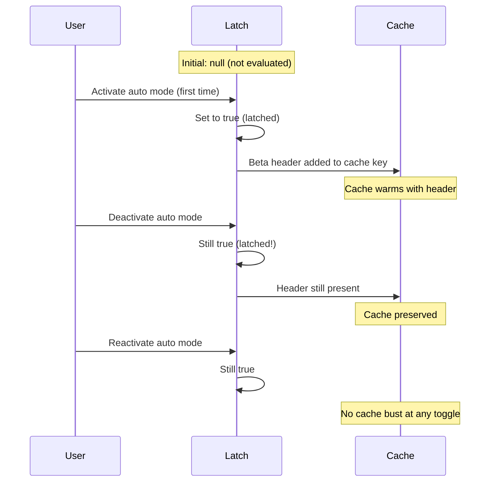
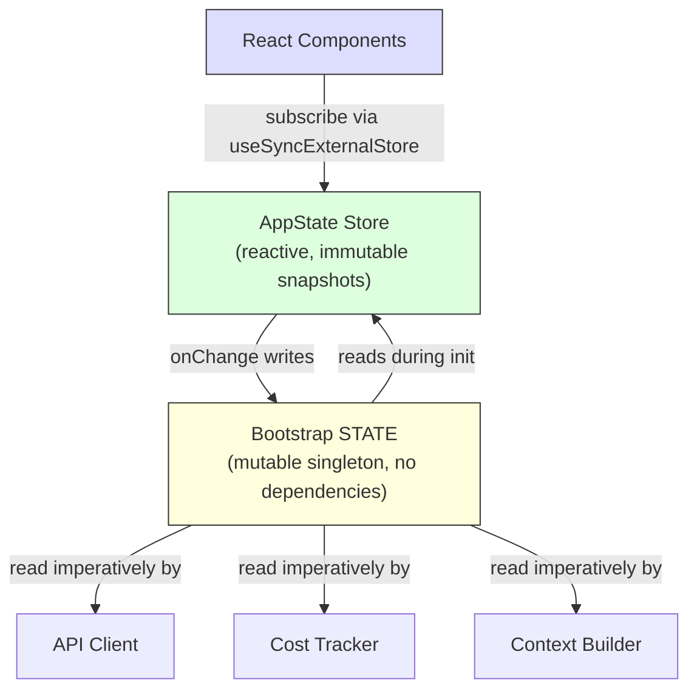

# Chương 3: State -- The Two-Tier Architecture

Chương 2 đã lần theo bootstrap pipeline từ lúc process khởi động đến lần render đầu tiên. Đến cuối chặng đó, hệ thống đã có một môi trường được cấu hình đầy đủ. Nhưng được cấu hình bằng *gì*? `session ID` nằm ở đâu? Model hiện tại? `message history`? `cost tracker`? `permission mode`? State nằm ở đâu, và vì sao nó nằm ở đó?

Mọi ứng dụng chạy dài hạn cuối cùng đều phải trả lời câu hỏi này. Với một CLI tool đơn giản, câu trả lời rất dễ -- vài biến trong `main()`. Nhưng Claude Code không phải một CLI tool đơn giản. Nó là một ứng dụng React được render qua Ink, với process lifecycle kéo dài hàng giờ, plugin system có thể load ở thời điểm bất kỳ, API layer phải dựng prompt từ cached context, `cost tracker` phải sống sót qua process restart, và hàng chục infrastructure module cần đọc/ghi dữ liệu dùng chung mà không import lẫn nhau.

Cách làm ngây thơ -- một global store duy nhất -- vỡ ngay lập tức. Nếu `cost tracker` cập nhật cùng store đang điều khiển React re-render, mỗi API call sẽ kích hoạt full component tree reconciliation. Infrastructure module (`bootstrap`, context building, `cost tracking`, telemetry) không thể import React. Chúng chạy trước khi React mount. Chúng chạy sau khi React unmount. Chúng chạy trong ngữ cảnh không hề có component tree. Nhét mọi thứ vào một React-aware store sẽ tạo circular dependency trên toàn bộ import graph.

Claude Code giải quyết bằng một `two-tier architecture`: một mutable `process singleton` cho infrastructure state, và một minimal reactive store cho UI state. Chương này giải thích cả hai tầng, side-effect system nối hai tầng, và các subsystem phụ thuộc nền tảng này. Mọi chương sau đều giả định bạn hiểu state sống ở đâu và vì sao.

---

## 3.1 Bootstrap State -- The Process Singleton

### Why a Mutable Singleton

Bootstrap state module (`bootstrap/state.ts`) là một mutable object duy nhất, được tạo một lần khi process start:

```typescript
const STATE: State = getInitialState()
```

Comment ngay phía trên dòng này ghi: `AND ESPECIALLY HERE`. Hai dòng phía trên type definition ghi: `DO NOT ADD MORE STATE HERE - BE JUDICIOUS WITH GLOBAL STATE`. Giọng điệu của các comment này cho thấy đội ngũ đã học cái giá của một global object không được kiểm soát theo cách khó quên.

Một mutable singleton là lựa chọn đúng ở đây vì ba lý do. Thứ nhất, bootstrap state phải khả dụng trước khi bất kỳ framework nào khởi tạo -- trước khi React mount, trước khi store được tạo, trước khi plugin load. Module-scope initialization là cơ chế duy nhất đảm bảo khả dụng tại import time. Thứ hai, dữ liệu này vốn dĩ là process-scoped: session ID, telemetry counter, cost accumulator, cached path. Không có "previous state" nào thực sự có ý nghĩa để diff, không có subscriber nào phải notify, không có undo history. Thứ ba, module này phải là một lá trong import dependency graph. Nếu nó import React, hoặc store, hoặc bất kỳ service module nào, nó sẽ tạo cycle và phá bootstrap sequence đã mô tả ở Chương 2. Chỉ phụ thuộc utility type và `node:crypto` giúp nó luôn importable từ mọi nơi.

### The ~80 Fields

`State` type chứa khoảng 80 field. Một vài cụm tiêu biểu cho thấy độ rộng:

**Identity and paths** -- `originalCwd`, `projectRoot`, `cwd`, `sessionId`, `parentSessionId`. `originalCwd` được resolve qua `realpathSync` và NFC-normalized ngay khi process start. Nó không bao giờ thay đổi.

**Cost and metrics** -- `totalCostUSD`, `totalAPIDuration`, `totalLinesAdded`, `totalLinesRemoved`. Các field này tích lũy đơn điệu trong suốt session và được persist xuống disk khi thoát.

**Telemetry** -- `meter`, `sessionCounter`, `costCounter`, `tokenCounter`. Đây là OpenTelemetry handle, đều nullable (`null` cho đến khi telemetry khởi tạo).

**Model configuration** -- `mainLoopModelOverride`, `initialMainLoopModel`. `override` được set khi người dùng đổi model giữa session.

**Session flags** -- `isInteractive`, `kairosActive`, `sessionTrustAccepted`, `hasExitedPlanMode`. Các boolean gate hành vi trong toàn bộ session duration.

**Cache optimization** -- `promptCache1hAllowlist`, `promptCache1hEligible`, `systemPromptSectionCache`, `cachedClaudeMdContent`. Chúng tồn tại để tránh tính toán dư thừa và tránh prompt cache busting.

### The Getter/Setter Pattern

`STATE` object không bao giờ được export trực tiếp. Mọi truy cập đi qua khoảng 100 hàm getter/setter riêng lẻ:

```typescript
// Pseudocode — illustrates the pattern
export function getProjectRoot(): string {
  return STATE.projectRoot
}

export function setProjectRoot(dir: string): void {
  STATE.projectRoot = dir.normalize('NFC')  // NFC normalization on every path setter
}
```

Pattern này cưỡng chế encapsulation, NFC normalization trên mọi path setter (tránh Unicode mismatch trên macOS), type narrowing, và bootstrap isolation. Cái giá là verbosity -- một trăm hàm cho tám mươi field. Nhưng trong codebase mà một stray mutation có thể làm bust prompt cache 50.000 token, explicitness là lựa chọn đúng.

### The Signal Pattern

Bootstrap không thể import listener (vì nó là `DAG leaf`), nên nó dùng một pub/sub primitive tối giản tên `createSignal`. `sessionSwitched` signal chỉ có đúng một consumer: `concurrentSessions.ts`, module giữ PID file đồng bộ. Signal được expose thành `onSessionSwitch = sessionSwitched.subscribe`, cho phép caller tự đăng ký mà bootstrap không cần biết họ là ai.

### The Five Sticky Latches

Nhóm field tinh vi nhất trong bootstrap state là năm boolean latch cùng theo một pattern: một khi feature được kích hoạt lần đầu trong session, một flag tương ứng sẽ giữ `true` trong phần còn lại của session. Cả năm cùng tồn tại vì một lý do: bảo toàn prompt cache.



Claude API hỗ trợ server-side prompt caching. Khi các request liên tiếp có cùng system prompt prefix, server sẽ tái sử dụng phần tính toán đã cache. Nhưng cache key bao gồm HTTP header và request body field. Nếu một beta header xuất hiện ở request N nhưng biến mất ở request N+1, cache sẽ bị bust -- kể cả khi prompt content giống hệt nhau. Với system prompt vượt 50.000 token, một cache miss là rất đắt.

Năm latch đó là:

| Latch | What It Prevents |
|-------|-----------------|
| `afkModeHeaderLatched` | Shift+Tab auto mode toggling flips the AFK beta header on/off |
| `fastModeHeaderLatched` | Fast mode cooldown enter/exit flips the fast mode header |
| `cacheEditingHeaderLatched` | Remote feature flag changes bust every active user's cache |
| `thinkingClearLatched` | Triggered on confirmed cache miss (>1h idle). Prevents re-enabling thinking blocks from busting freshly warmed cache |
| `pendingPostCompaction` | Consume-once flag for telemetry: distinguishes compaction-induced cache misses from TTL-expiry misses |

Cả năm đều dùng kiểu ba trạng thái: `boolean | null`. Giá trị `null` ban đầu nghĩa là "chưa đánh giá." `true` nghĩa là "đã latch on." Một khi đã thành `true`, chúng không quay lại `null` hoặc `false`. Đây là thuộc tính định nghĩa của latch.

Pattern triển khai như sau:

```typescript
function shouldSendBetaHeader(featureCurrentlyActive: boolean): boolean {
  const latched = getAfkModeHeaderLatched()
  if (latched === true) return true       // Already latched -- always send
  if (featureCurrentlyActive) {
    setAfkModeHeaderLatched(true)          // First activation -- latch it
    return true
  }
  return false                             // Never activated -- don't send
}
```

Vì sao không gửi tất cả beta header mọi lúc? Vì header là một phần của cache key. Gửi một header không được nhận diện sẽ tạo cache namespace khác. Latch đảm bảo bạn chỉ đi vào cache namespace khi thật sự cần, rồi giữ nguyên trong namespace đó.

---

## 3.2 AppState -- The Reactive Store

### The 34-Line Implementation

UI state store nằm trong `state/store.ts`:

Store implementation dài khoảng 30 dòng: một closure quanh biến `state`, một `Object.is` equality check để ngăn update giả, synchronous listener notification, và `onChange` callback cho side effect. Skeleton như sau:

```typescript
// Pseudocode — illustrates the pattern
function makeStore(initial, onTransition) {
  let current = initial
  const subs = new Set()
  return {
    read:      () => current,
    update:    (fn) => { /* Object.is guard, then notify */ },
    subscribe: (cb) => { subs.add(cb); return () => subs.delete(cb) },
  }
}
```

Ba mươi bốn dòng. Không middleware, không devtools, không time-travel debugging, không action type. Chỉ là một closure trên biến mutable, một `Set` listener, và `Object.is` equality check. Đây là Zustand mà không dùng library.

Các quyết định thiết kế đáng chú ý:

**Updater function pattern.** Không có `setState(newValue)` -- chỉ có `setState((prev) => next)`. Mọi mutation nhận current state và phải tạo next state, loại bỏ lỗi stale-state từ concurrent mutation.

**`Object.is` equality check.** Nếu updater trả về cùng reference, mutation là no-op. Listener không chạy. Side effect không chạy. Điểm này cực kỳ quan trọng cho performance -- component kiểu spread-and-set nhưng không đổi giá trị sẽ không tạo re-render.

**`onChange` fires before listeners.** `onChange` callback tùy chọn nhận cả old và new state, và chạy đồng bộ trước khi bất kỳ subscriber nào được notify. Điều này dùng cho side effect (Mục 3.4) cần hoàn tất trước khi UI re-render.

**No middleware, no devtools.** Đây không phải thiếu sót. Khi store của bạn chỉ cần đúng ba operation (get, set, subscribe), một `Object.is` equality check, và synchronous `onChange` hook, thì 34 dòng code tự sở hữu tốt hơn một dependency. Bạn kiểm soát chính xác semantics. Bạn đọc hết implementation trong 30 giây.

### The AppState Type

`AppState` type (~452 dòng) là shape của mọi thứ UI cần để render. Nó được bọc trong `DeepImmutable<>` cho phần lớn field, với ngoại lệ tường minh cho field chứa function type:

```typescript
export type AppState = DeepImmutable<{
  settings: SettingsJson
  verbose: boolean
  // ... ~150 more fields
}> & {
  tasks: { [taskId: string]: TaskState }  // Contains abort controllers
  agentNameRegistry: Map<string, AgentId>
}
```

Intersection type cho phép phần lớn field deep immutable, đồng thời miễn trừ các field chứa function, Map, và mutable ref. Full immutability là mặc định, với escape hatch có chủ đích ở nơi type system sẽ mâu thuẫn với runtime semantics.

### React Integration

Store tích hợp với React qua `useSyncExternalStore`:

```typescript
// Standard React pattern — useSyncExternalStore with a selector
export function useAppState<T>(selector: (state: AppState) => T): T {
  const store = useContext(AppStoreContext)
  return useSyncExternalStore(
    store.subscribe,
    () => selector(store.getState()),
  )
}
```

Selector phải trả về reference của sub-object sẵn có (không phải object mới tạo) để phép so sánh `Object.is` tránh re-render không cần thiết. Nếu bạn viết `useAppState(s => ({ a: s.a, b: s.b }))`, mỗi render sẽ tạo object reference mới, và component sẽ re-render trên mọi state change. Đây là ràng buộc giống hệt người dùng Zustand gặp phải -- comparison rẻ hơn, nhưng tác giả selector phải hiểu reference identity.

---

## 3.3 How the Two Tiers Relate

Hai tầng giao tiếp qua interface tường minh và hẹp.



Bootstrap state chảy vào AppState trong initialization: `getDefaultAppState()` đọc setting từ disk (bootstrap hỗ trợ định vị), kiểm tra feature flag (bootstrap đã đánh giá), và set model ban đầu (bootstrap đã resolve từ CLI arg và setting).

AppState chảy ngược về bootstrap state qua side effect: khi người dùng đổi model, `onChangeAppState` gọi `setMainLoopModelOverride()` trong bootstrap. Khi setting thay đổi, credential cache trong bootstrap bị clear.

Nhưng hai tầng không bao giờ chia sẻ cùng một reference. Module import bootstrap state không cần biết React. Component đọc AppState không cần biết process singleton.

Một ví dụ cụ thể giúp làm rõ data flow. Khi người dùng gõ `/model claude-sonnet-4`:

1. Command handler gọi `store.setState(prev => ({ ...prev, mainLoopModel: 'claude-sonnet-4' }))`
2. `Object.is` check của store phát hiện có thay đổi
3. `onChangeAppState` chạy, phát hiện model đã đổi, gọi `setMainLoopModelOverride()` (cập nhật bootstrap) và `updateSettingsForSource()` (persist xuống disk)
4. Toàn bộ store subscriber chạy -- React component re-render để hiển thị model name mới
5. API call tiếp theo đọc model từ `getMainLoopModelOverride()` trong bootstrap state

Bước 1-4 là synchronous. API client ở bước 5 có thể chạy vài giây sau đó. Nhưng nó đọc từ bootstrap state (đã cập nhật ở bước 3), không đọc từ AppState. Đây là two-tier handoff: UI store là source of truth cho thứ người dùng chọn, nhưng bootstrap state là source of truth cho thứ API client dùng.

Thuộc tính DAG -- bootstrap không phụ thuộc gì, AppState phụ thuộc bootstrap để init, React phụ thuộc AppState -- được cưỡng chế bằng một ESLint rule ngăn `bootstrap/state.ts` import module ngoài tập cho phép.

---

## 3.4 Side Effects: onChangeAppState

`onChange` callback là nơi hai tầng đồng bộ. Mỗi lần gọi `setState` sẽ kích hoạt `onChangeAppState`, nhận cả previous và new state rồi quyết định external effect nào cần bắn.

**Permission mode sync** là use case quan trọng nhất. Trước khi có handler tập trung này, `permission mode` chỉ được sync sang remote session (CCR) ở 2 trong hơn 8 mutation path. Sáu path còn lại -- Shift+Tab cycling, dialog options, slash commands, rewind, bridge callbacks -- đều mutation AppState mà không báo CCR. External metadata trôi khỏi trạng thái đồng bộ.

Cách sửa: ngừng rải notification tại mutation site và thay vào đó hook phần diff ở một điểm duy nhất. Comment trong source code liệt kê mọi mutation path từng bị lỗi và ghi rõ rằng "the scattered callsites above need zero changes." Đây là lợi ích kiến trúc của side effect tập trung -- coverage mang tính cấu trúc, không phụ thuộc thao tác thủ công.

**Model changes** giữ bootstrap state đồng bộ với thứ UI đang render. **Settings changes** clear credential cache và apply lại environment variable. **Verbose toggle** và **expanded view** được persist vào global config.

Pattern này -- side effect tập trung dựa trên diffable state transition -- về bản chất là Observer pattern, áp dụng ở mức state diff thay vì event riêng lẻ. Nó scale tốt hơn event emission rải rác vì số side effect tăng chậm hơn nhiều so với số mutation site.

---

## 3.5 Context Building

Ba memoized async function trong `context.ts` xây system prompt context, được prepend vào mọi cuộc hội thoại. Mỗi function chỉ được compute một lần mỗi session, không phải mỗi turn.

`getGitStatus` chạy song song năm lệnh git (`Promise.all`), tạo block gồm branch hiện tại, default branch, recent commits, và working tree status. Cờ `--no-optional-locks` ngăn git lấy write lock có thể cản trở thao tác git đồng thời ở terminal khác.

`getUserContext` load nội dung CLAUDE.md và cache trong bootstrap state qua `setCachedClaudeMdContent`. Cache này phá một circular dependency: auto-mode classifier cần nội dung CLAUDE.md, nhưng load CLAUDE.md đi qua filesystem, filesystem đi qua permissions, permissions lại gọi classifier. Cache trong bootstrap state (một DAG leaf) giúp cắt vòng lặp đó.

Cả ba context function dùng Lodash `memoize` (compute once, cache forever), không dùng TTL-based caching. Lý do: nếu git status bị compute lại mỗi 5 phút, thay đổi đó sẽ làm bust server-side prompt cache. System prompt thậm chí nói thẳng với model: "This is the git status at the start of the conversation. Note that this status is a snapshot in time."

---

## 3.6 Cost Tracking

Mọi API response đều đi qua `addToTotalSessionCost`, nơi cộng dồn usage theo model, cập nhật bootstrap state, báo cáo lên OpenTelemetry, và xử lý đệ quy advisor tool usage (nested model call bên trong một response).

Cost state sống sót qua process restart bằng cơ chế save-and-restore vào project config file. Session ID đóng vai trò guard -- chi phí chỉ được restore nếu persisted session ID khớp session đang được resume.

Histogram dùng reservoir sampling (`Algorithm R`) để giữ memory bounded nhưng vẫn đại diện chính xác cho distribution. Reservoir 1.024 phần tử tạo percentile p50, p95, và p99. Vì sao không dùng running average đơn giản? Vì average che khuất shape của distribution. Một session có 95% API call mất 200ms và 5% mất 10 giây có cùng average với session mà mọi call đều mất 690ms, nhưng user experience khác nhau hoàn toàn.

---

## 3.7 What We Learned

Codebase đã lớn từ một CLI đơn giản thành hệ thống có ~450 dòng type definition cho state, ~80 field process state, một side-effect system, nhiều persistence boundary, và cache optimization latch. Không thứ nào trong số này được thiết kế trọn vẹn ngay từ đầu. Sticky latch được thêm khi cache busting trở thành bài toán chi phí có thể đo được. `onChange` handler được tập trung hóa khi phát hiện 6 trên 8 path sync quyền bị lỗi. CLAUDE.md cache được thêm khi circular dependency xuất hiện.

Đây là mô hình tăng trưởng tự nhiên của state trong ứng dụng phức tạp. `two-tier architecture` cung cấp đủ cấu trúc để kiểm soát đà tăng trưởng -- field bootstrap mới không ảnh hưởng React rendering, field AppState mới không tạo import cycle -- đồng thời đủ linh hoạt để hấp thụ những pattern chưa được dự liệu trong thiết kế ban đầu.

---

## 3.8 State Architecture Summary

| Property | Bootstrap State | AppState |
|---|---|---|
| **Location** | Module-scope singleton | React context |
| **Mutability** | Mutable through setters | Immutable snapshots via updater |
| **Subscribers** | Signal (pub/sub) for specific events | `useSyncExternalStore` for React |
| **Availability** | Import time (before React) | After provider mounts |
| **Persistence** | Process exit handlers | Via onChange to disk |
| **Equality** | N/A (imperative reads) | `Object.is` reference check |
| **Dependencies** | DAG leaf (imports nothing) | Imports types from across codebase |
| **Test reset** | `resetStateForTests()` | Create new store instance |
| **Primary consumers** | API client, cost tracker, context builder | React components, side effects |

---

## Apply This

**Tách state theo access pattern, không theo domain.** Session ID thuộc singleton không phải vì nó "là infrastructure" theo nghĩa trừu tượng, mà vì nó phải đọc được trước khi React mount và ghi được mà không notify subscriber. `Permission mode` thuộc reactive store vì thay đổi của nó phải kích hoạt re-render và side effect. Để access pattern quyết định tier, và kiến trúc sẽ theo sau.

**The sticky latch pattern.** Mọi hệ thống tương tác với cache (`prompt cache`, CDN, query cache) đều gặp cùng bài toán: feature toggle làm đổi cache key giữa session sẽ gây invalidation. Một khi feature được kích hoạt, phần đóng góp vào cache key của nó sẽ giữ active suốt session. Kiểu ba trạng thái (`boolean | null`, nghĩa là "not evaluated / on / never off") làm intent tự mô tả. Đặc biệt hữu ích khi cache không nằm dưới quyền kiểm soát của bạn.

**Centralize side effects on state diffs.** Khi nhiều code path có thể đổi cùng một state, đừng rải notification ở từng mutation site. Hãy hook `onChange` callback của store và phát hiện field nào đổi. Coverage trở thành cấu trúc (mutation nào cũng kích hoạt effect) thay vì thủ công (mỗi mutation site phải nhớ notify).

**Prefer 34 lines you own over a library you do not.** Khi yêu cầu của bạn chính xác chỉ gồm get, set, subscribe, và một change callback, implementation tối giản cho bạn toàn quyền kiểm soát semantics. Trong hệ thống mà bug quản lý state có thể tốn tiền thật, độ minh bạch đó có giá trị. Insight cốt lõi là nhận ra khi nào bạn *không* cần library.

**Use process exit as a persistence boundary with intention.** Nhiều subsystem persist state khi process exit. Trade-off là rõ ràng: non-graceful termination (`SIGKILL`, OOM) sẽ làm mất dữ liệu tích lũy. Điều này chấp nhận được vì dữ liệu mang tính chẩn đoán, không phải giao dịch, và ghi xuống disk ở mọi state change sẽ quá đắt với những counter tăng hàng trăm lần mỗi session.

---

`two-tier architecture` được thiết lập trong chương này -- bootstrap singleton cho infrastructure, reactive store cho UI, side effect nối chúng lại -- là nền mà mọi chương sau dựa vào. Conversation loop (Chapter 4) đọc context từ các memoized builder. Tool system (Chapter 5) kiểm tra quyền từ AppState. Agent system (Chapter 8) tạo task entry trong AppState trong khi theo dõi chi phí ở bootstrap state. Hiểu state nằm ở đâu, và vì sao, là điều kiện tiên quyết để hiểu bất kỳ hệ nào trong số đó hoạt động thế nào.

Một số field nằm vắt qua ranh giới. Main loop model tồn tại ở cả hai tier: `mainLoopModel` trong AppState (để UI render) và `mainLoopModelOverride` trong bootstrap state (để API client dùng). `onChangeAppState` handler giữ hai bản này đồng bộ. Sự lặp này là cái giá của two-tier split. Nhưng phương án thay thế -- để API client import React store, hoặc để React component đọc từ process singleton -- sẽ phá hướng phụ thuộc đang giữ kiến trúc ổn định. Một lượng duplication có kiểm soát, được nối bằng một điểm synchronization tập trung, tốt hơn nhiều so với một dependency graph rối.