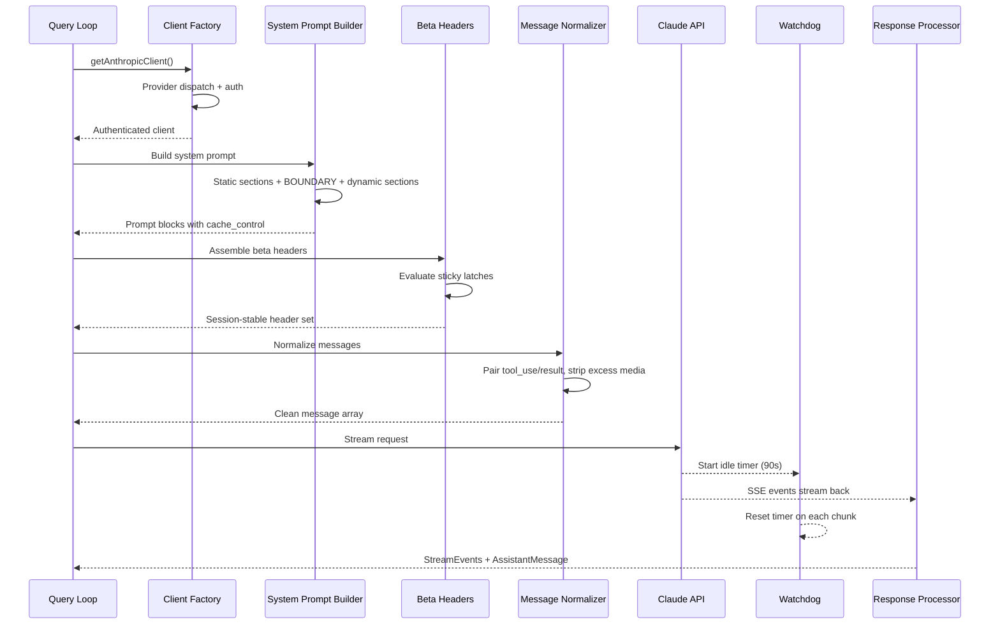
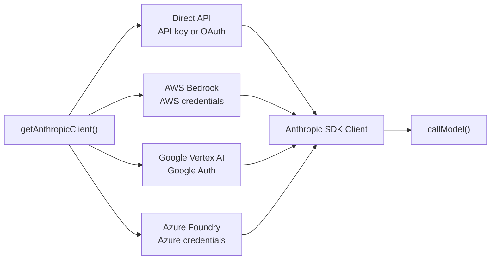
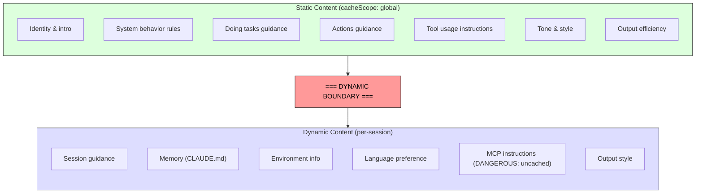

# Chương 4: Trao đổi với Claude -- API layer

Chương 3 đã xác lập trạng thái nằm ở đâu và hai tầng giao tiếp với nhau như thế nào. Bây giờ, ta theo dõi điều xảy ra khi trạng thái đó được đưa vào sử dụng: hệ thống cần trao đổi với một mô hình ngôn ngữ. Mọi thứ trong Claude Code -- chuỗi bootstrap, hệ thống trạng thái, framework phân quyền -- đều tồn tại để phục vụ khoảnh khắc này.

Lớp này xử lý nhiều failure mode hơn bất kỳ phần nào khác của hệ thống. Nó phải định tuyến qua bốn cloud provider bằng một giao diện thống nhất và trong suốt. Nó phải xây dựng system prompt với độ chính xác cấp byte theo cách prompt cache phía server hoạt động, vì chỉ một section đặt sai vị trí có thể làm vỡ một cache trị giá hơn 50.000 token. Nó phải stream phản hồi kèm phát hiện lỗi chủ động, vì kết nối TCP có thể chết lặng lẽ. Và nó phải giữ các bất biến ổn định theo phiên để thay đổi feature flag giữa chừng không tạo ra những vách hiệu năng vô hình.

Hãy đi theo một API call từ đầu đến cuối.

---

## Multi-Provider Client Factory

Hàm `getAnthropicClient()` là factory duy nhất cho mọi giao tiếp với model. Nó trả về một Anthropic SDK client được cấu hình cho provider mà môi trường triển khai đang nhắm tới:

Cơ chế dispatch được điều khiển hoàn toàn bằng biến môi trường, theo thứ tự ưu tiên cố định. Cả bốn lớp SDK theo từng provider đều được ép kiểu về `Anthropic` qua `as unknown as Anthropic`. Bình luận trong mã nguồn nói rất thẳng: "we have always been lying about the return type." Việc type erasure có chủ đích này khiến mọi nơi sử dụng đều nhìn thấy cùng một giao diện. Phần còn lại của codebase không cần rẽ nhánh theo provider.

Mỗi SDK theo provider được dynamic import -- `AnthropicBedrock`, `AnthropicFoundry`, `AnthropicVertex` là các module nặng với cây phụ thuộc riêng. Dynamic import đảm bảo provider không dùng sẽ không bị nạp.

Provider được chọn ngay lúc startup và lưu trong bootstrap `STATE`. Query loop không cần kiểm tra provider nào đang hoạt động. Chuyển từ Direct API sang Bedrock là thay đổi cấu hình, không phải thay đổi mã.

### The buildFetch Wrapper

Mọi outbound fetch đều được bọc để chèn header `x-client-request-id` -- một UUID tạo mới cho từng request. Khi request bị timeout, server không bao giờ gán request ID vào phản hồi. Nếu không có ID phía client, đội API không thể đối chiếu timeout đó với log phía server. Header này lấp đúng khoảng trống đó. Nó chỉ được gửi tới endpoint first-party của Anthropic -- provider bên thứ ba có thể từ chối header lạ.

---

## Xây dựng System Prompt

System prompt là artifact nhạy với cache nhất trong toàn hệ thống. API của Claude hỗ trợ server-side prompt caching: các tiền tố prompt giống hệt nhau giữa các request có thể được cache, giúp giảm cả độ trễ lẫn chi phí. Một cuộc hội thoại 200K token có thể có 50-70K token giống với lượt trước. Làm vỡ cache đó buộc server xử lý lại toàn bộ.

### The Dynamic Boundary Marker

Prompt được xây thành một mảng các section chuỗi, với một đường ranh giới tối quan trọng:

Mọi thứ trước boundary là giống nhau giữa các session, người dùng và tổ chức -- chúng nhận tầng cache cao nhất phía server. Mọi thứ sau boundary chứa nội dung đặc thù theo người dùng và hạ xuống cache theo từng session.

Quy ước đặt tên section được làm "ồn" có chủ ý. Khi thêm section mới, bạn buộc phải chọn giữa `systemPromptSection` (an toàn, có cache) và `DANGEROUS_uncachedSystemPromptSection` (làm vỡ cache, bắt buộc có lý do). Tham số `_reason` không dùng ở runtime nhưng đóng vai trò tài liệu bắt buộc -- mỗi section phá cache đều mang theo phần biện minh ngay trong mã nguồn.

### The 2^N Problem

Một bình luận trong `prompts.ts` giải thích vì sao section có điều kiện phải nằm sau boundary:

> Each conditional here is a runtime bit that would otherwise multiply the Blake2b prefix hash variants (2^N).

Mỗi điều kiện boolean trước boundary sẽ nhân đôi số biến thể cache toàn cục. Ba điều kiện thành 8 biến thể; năm điều kiện thành 32. Các section tĩnh vì thế được giữ cố định, không điều kiện. Compile-time feature flag (được bundler resolve) có thể đặt trước boundary. Runtime check (có phải Haiku không? người dùng có auto mode không?) phải đặt sau.

Đây là kiểu ràng buộc vô hình cho tới khi bị vi phạm. Một kỹ sư có ý tốt thêm section phụ thuộc setting người dùng trước boundary có thể âm thầm phân mảnh global cache và làm chi phí xử lý prompt của cả fleet tăng gấp đôi.

---

## Streaming

### Raw SSE Over SDK Abstractions

Phần streaming dùng `Stream<BetaRawMessageStreamEvent>` thô thay vì `BetaMessageStream` cấp cao của SDK. Lý do: `BetaMessageStream` gọi `partialParse()` ở mọi event `input_json_delta`. Với tool call có JSON input lớn (ví dụ chỉnh file hàng trăm dòng), nó parse lại chuỗi JSON đang lớn dần từ đầu ở từng chunk -- hành vi O(n^2). Claude Code tự tích lũy input của tool, nên parse từng phần ở đây là lãng phí thuần túy.

### The Idle Watchdog

Kết nối TCP có thể chết mà không phát tín hiệu. Server có thể crash, load balancer có thể im lặng cắt kết nối, hoặc proxy doanh nghiệp có thể timeout. Request timeout của SDK chỉ bao phủ fetch ban đầu -- khi HTTP 200 trả về thì timeout coi như đã thỏa. Nếu body streaming ngừng lại, không có gì bắt được.

Watchdog là một `setTimeout` được reset ở mỗi chunk nhận được. Nếu không có chunk nào tới trong 90 giây, stream sẽ bị abort và hệ thống rơi về retry non-streaming. Một cảnh báo được phát ở mốc 45 giây. Khi watchdog kích hoạt, hệ thống ghi log kèm client request ID để đối chiếu.

### Non-Streaming Fallback

Khi streaming lỗi giữa chừng (lỗi mạng, treo, cắt cụt), hệ thống fallback về lệnh gọi đồng bộ `messages.create()`. Cách này xử lý các lỗi proxy kiểu trả HTTP 200 nhưng body không phải SSE, hoặc cắt cụt luồng SSE giữa đường.

Fallback có thể bị tắt khi streaming tool execution đang bật, vì fallback sẽ chạy lại toàn bộ request và có thể khiến tool chạy hai lần.

---

## Prompt Cache System

### Three Tiers

Prompt caching vận hành trên ba tầng:

**Ephemeral cache** (mặc định): cache theo session với TTL do server quy định (~5 phút). Mọi người dùng đều có.

**1-hour TTL**: người dùng đủ điều kiện sẽ có cache kéo dài. Điều kiện được quyết định bởi trạng thái gói thuê bao và được chốt trong bootstrap state -- sticky latch `promptCache1hEligible` từ Chương 3 đảm bảo việc đổi trạng thái giữa phiên không làm đổi TTL.

**Global scope**: cache của system prompt được chia sẻ xuyên session, xuyên tổ chức. Phần tĩnh của prompt giống nhau cho mọi người dùng Claude Code, nên một bản cache có thể phục vụ tất cả. Global scope bị tắt khi có MCP tool, vì định nghĩa MCP tool là đặc thù theo người dùng và sẽ phân mảnh cache thành hàng triệu tiền tố khác nhau.

### The Sticky Latches in Action

Năm sticky latch từ Chương 3 được đánh giá ngay tại đây, trong lúc dựng request. Mỗi latch bắt đầu bằng `null` và khi đã thành `true` thì giữ `true` suốt phiên. Bình luận phía trên khối latch rất chính xác: "Sticky-on latches for dynamic beta headers. Each header, once first sent, keeps being sent for the rest of the session so mid-session toggles don't change the server-side cache key and bust ~50-70K tokens."

Xem Chương 3, Mục 3.1 để có giải thích đầy đủ về latch pattern, năm latch cụ thể, và vì sao phương án gửi mọi header mọi lúc không phải lời giải đúng.

---

## The `queryModel()` Generator

Hàm `queryModel()` là một async generator (~700 dòng) điều phối toàn bộ lifecycle của API call. Nó yield các đối tượng `StreamEvent`, `AssistantMessage`, và `SystemAPIErrorMessage`.

Phần lắp ráp request đi theo một trình tự được sắp rất kỹ:

1. **Kill switch check** -- van an toàn cho tầng model đắt nhất
2. **Beta header assembly** -- theo model cụ thể, có sticky latches
3. **Tool schema building** -- chạy song song bằng `Promise.all()`, loại deferred tool cho tới khi được phát hiện
4. **Message normalization** -- sửa lệch cặp tool_use/tool_result mồ côi, bỏ media dư thừa, loại block cũ
5. **System prompt block construction** -- tách tại dynamic boundary, gán cache scope
6. **Retry-wrapped streaming** -- xử lý 529 (overloaded), model fallback, thinking downgrade, OAuth refresh

### Output Token Cap

Mức trần output mặc định là 8.000 token, không phải 32K hay 64K thường thấy. Dữ liệu production cho thấy p99 output là 4.911 token -- giới hạn chuẩn đang dự trữ dư 8-16 lần. Khi phản hồi chạm trần (<1% request), hệ thống cho một lần retry sạch ở 64K. Ở quy mô fleet, khoản tiết kiệm rất đáng kể.

### Error Handling and Retry

Hàm `withRetry()` cũng là một async generator, yield các event `SystemAPIErrorMessage` để UI hiển thị trạng thái retry. Các chiến lược retry gồm:

- **529 (overloaded)**: chờ rồi retry, có thể hạ fast mode
- **Model fallback**: model chính thất bại thì thử model dự phòng (ví dụ Opus sang Sonnet)
- **Thinking downgrade**: tràn context window sẽ giảm ngân sách thinking
- **OAuth 401**: làm mới token và retry một lần

Mẫu generator khiến tiến trình retry ("Server overloaded, retrying in 5s...") xuất hiện như một phần tự nhiên của event stream, thay vì thông báo side-channel.

---

## Apply This

**Hãy coi prompt caching là ràng buộc kiến trúc, không phải một công tắc tính năng.** Nhiều ứng dụng LLM chỉ "bật" cache. Claude Code coi cache là ràng buộc thiết kế, định hình thứ tự prompt, section memoization, header latching, và quản lý cấu hình. Khác biệt giữa prompt tổ chức tốt (cache hit trên 50K token) và prompt tổ chức kém (xử lý lại toàn bộ mỗi lượt) là đòn bẩy chi phí lớn nhất của hệ thống.

**Dùng quy ước đặt tên DANGEROUS cho các lối thoát đắt đỏ.** Khi codebase có một bất biến dễ bị phá vỡ do vô tình, đặt tên lối thoát bằng tiền tố thật "ồn" làm được ba việc: giúp vi phạm nổi bật trong code review, buộc phải có tài liệu (tham số lý do bắt buộc), và tạo ma sát tâm lý để nghiêng về mặc định an toàn. Mẫu này áp dụng vượt ra ngoài cache, cho mọi thao tác có chi phí vô hình.

**Xây streaming với watchdog, không chỉ với timeout.** Request timeout của SDK coi như xong khi nhận HTTP 200, nhưng body phản hồi có thể ngừng ở bất kỳ lúc nào. Một `setTimeout` reset theo từng chunk sẽ bắt lỗi này. Fallback non-streaming xử lý các failure mode của proxy (HTTP 200 với body không phải SSE, cắt cụt giữa luồng) vốn phổ biến hơn bạn tưởng trong môi trường doanh nghiệp.

**Hãy thiết kế retry theo kiểu yield, không theo exception.** Khi wrapper retry là async generator có thể yield event trạng thái, phía gọi sẽ hiển thị tiến trình retry như phần tự nhiên của event stream. Mẫu model fallback (Opus lỗi, thử Sonnet) đặc biệt hữu ích cho độ bền production.

**Tách fast path khỏi full pipeline.** Không phải API call nào cũng cần tool search, tích hợp advisor, thinking budget, và hạ tầng streaming. Hàm `queryHaiku()` của Claude Code cung cấp đường đi rút gọn cho tác vụ nội bộ (compaction, classification), bỏ qua các mối quan tâm agentic. Một hàm riêng với giao diện đơn giản giúp ngăn rò rỉ độ phức tạp ngoài ý muốn.

---

## Looking Ahead

API layer là nền tảng cho mọi thứ theo sau. Chương 5 sẽ cho thấy query loop dùng phản hồi streaming để điều khiển tool execution -- bao gồm việc tool có thể bắt đầu chạy trước khi model hoàn tất phản hồi. Chương 6 sẽ giải thích hệ thống compaction giữ hiệu quả cache như thế nào khi hội thoại tiến gần giới hạn ngữ cảnh. Chương 7 sẽ cho thấy vì sao mỗi agent thread có mảng message và chuỗi request riêng.

Tất cả các hệ thống đó đều kế thừa các ràng buộc được thiết lập ở đây: ổn định cache như một bất biến kiến trúc, trong suốt provider thông qua client factory, và cấu hình ổn định theo phiên thông qua hệ latch. API layer không chỉ gửi request -- nó định nghĩa luật vận hành cho mọi hệ thống còn lại.
