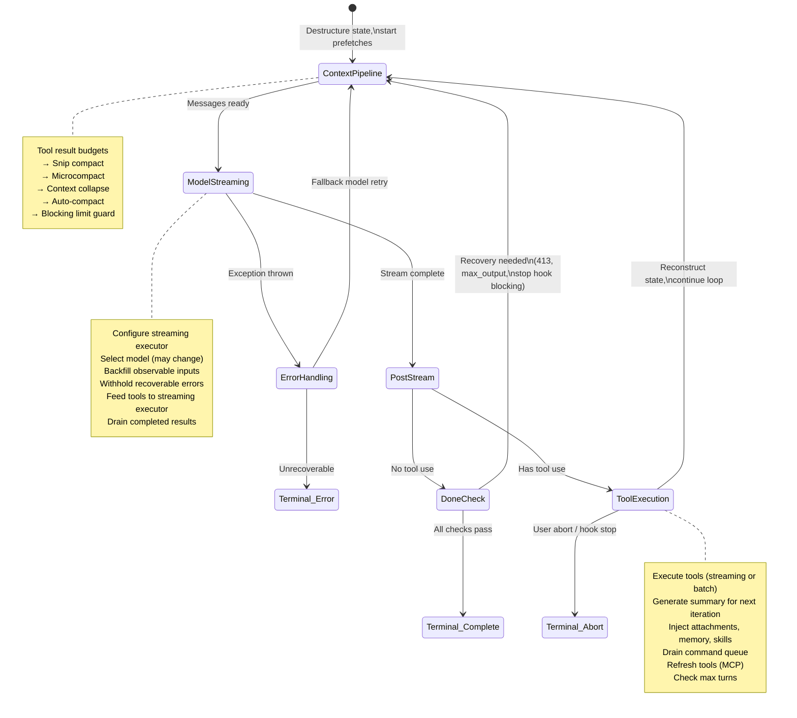
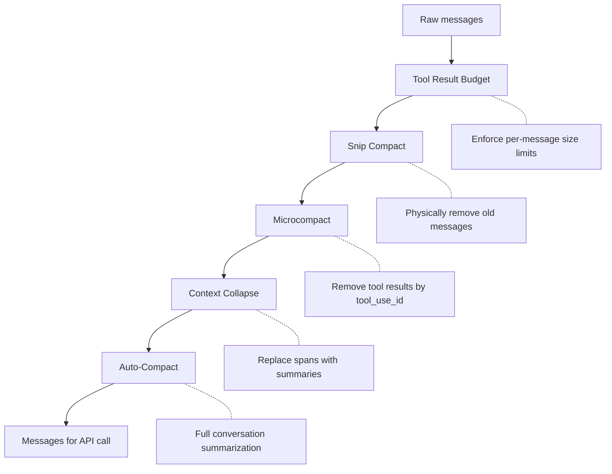
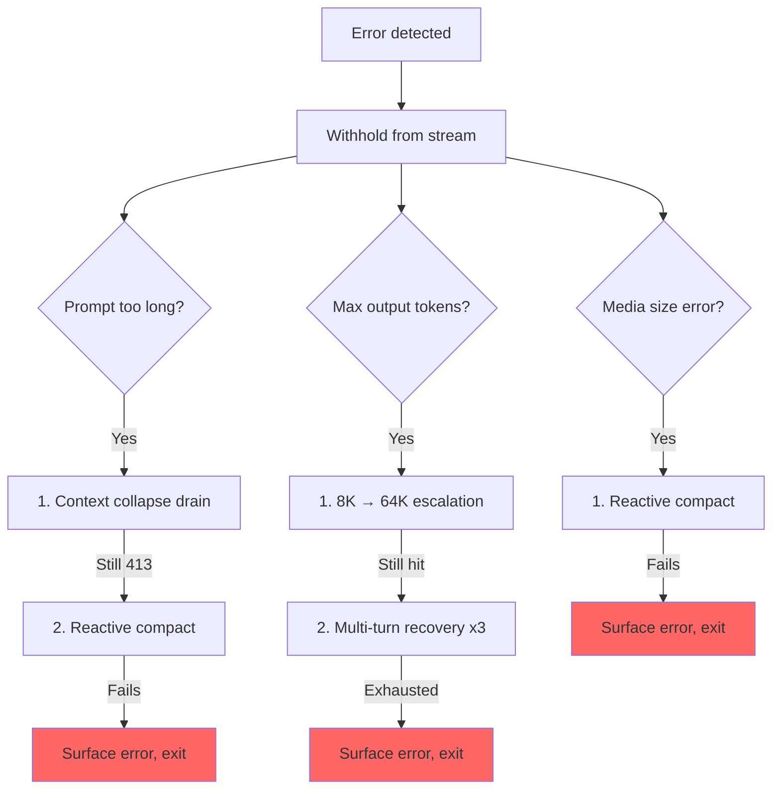

# Chương 5: Agent Loop

## Trái Tim Đập

Chương 4 đã chỉ ra cách lớp API biến cấu hình thành các HTTP request dạng streaming -- client được dựng ra sao, system prompt được lắp ráp thế nào, và phản hồi đi vào dưới dạng server-sent events. Lớp đó xử lý *cơ chế* giao tiếp với model. Nhưng một API call đơn lẻ không phải agent. Agent là một vòng lặp: gọi model, thực thi tools, trả kết quả ngược lại, gọi model lần nữa, cho đến khi công việc hoàn tất.

Mọi hệ thống đều có một tâm điểm. Với database, đó là storage engine. Với compiler, đó là intermediate representation. Trong Claude Code, đó là `query.ts` -- một file dài 1.730 dòng chứa async generator chạy mọi tương tác, từ phím bấm đầu tiên trong REPL đến tool call cuối cùng của một lượt chạy headless `--print`.

Đây không phải cường điệu. Chỉ có đúng một code path trao đổi với model, thực thi tools, quản lý context, phục hồi lỗi, và quyết định khi nào dừng. Code path đó là hàm `query()`. REPL gọi nó. SDK gọi nó. Sub-agents gọi nó. Headless runner gọi nó. Nếu bạn đang dùng Claude Code, bạn đang ở bên trong `query()`.

File này dày đặc, nhưng không phức tạp theo kiểu các cây kế thừa rối rắm. Nó phức tạp theo kiểu một tàu ngầm phức tạp: một thân tàu duy nhất với nhiều hệ dự phòng, mỗi hệ được thêm vào vì đại dương đã tìm được đường tràn vào. Mỗi nhánh `if` đều có một câu chuyện. Mỗi thông báo lỗi bị giữ lại đại diện cho một bug thật nơi SDK consumer ngắt kết nối giữa chừng lúc hệ thống đang phục hồi. Mỗi ngưỡng circuit breaker đều được tinh chỉnh dựa trên các session thật từng đốt hàng nghìn API call trong vòng lặp vô hạn.

Chương này lần theo toàn bộ vòng lặp, từ đầu đến cuối. Đến cuối chương, bạn sẽ hiểu không chỉ điều gì xảy ra, mà còn vì sao từng cơ chế tồn tại và điều gì sẽ hỏng nếu thiếu nó.

---

## Vì sao dùng Async Generator

Câu hỏi kiến trúc đầu tiên: vì sao agent loop là generator thay vì event emitter dựa trên callback?

```typescript
// Simplified — shows the concept, not the exact types
async function* agentLoop(params: LoopParams): AsyncGenerator<Message | Event, TerminalReason>
```

Chữ ký thật sự yield nhiều kiểu message và event, đồng thời trả về một discriminated union mã hóa lý do vòng lặp dừng.

Ba lý do, theo thứ tự quan trọng.

**Backpressure.** Event emitter bắn sự kiện dù consumer đã sẵn sàng hay chưa. Generator chỉ yield khi consumer gọi `.next()`. Khi React renderer của REPL đang bận vẽ frame trước đó, generator tự nhiên dừng lại. Khi một SDK consumer đang xử lý kết quả tool, generator chờ. Không tràn buffer, không rơi message, không có bài toán "nhà sản xuất nhanh / nhà tiêu thụ chậm".

**Ngữ nghĩa giá trị trả về.** Kiểu trả về của generator là `Terminal` -- một discriminated union mã hóa chính xác vì sao vòng lặp dừng. Hoàn tất bình thường? Người dùng abort? Cạn token budget? Stop hook can thiệp? Chạm giới hạn max-turns? Lỗi model không thể phục hồi? Có 10 terminal state riêng biệt. Caller không cần subscribe vào một sự kiện "end" rồi cầu may payload có chứa lý do. Họ nhận nó như một giá trị trả về có kiểu từ `for await...of` hoặc `yield*`.

**Khả năng tổ hợp qua `yield*`.** Hàm `query()` bên ngoài ủy quyền cho `queryLoop()` bằng `yield*`, nhờ đó chuyển tiếp trong suốt mọi giá trị được yield và cả giá trị trả về cuối cùng. Các sub-generator như `handleStopHooks()` dùng cùng mẫu này. Kết quả là một chain of responsibility sạch sẽ, không callback, không promise bọc promise, không boilerplate chuyển tiếp event.

Lựa chọn này có chi phí -- async generator trong JavaScript không thể "quay lại" hay fork. Nhưng agent loop không cần cả hai. Nó là một state machine chỉ đi tiến.

Một điểm tinh tế nữa: cú pháp `function*` làm hàm trở thành *lazy*. Phần thân không chạy cho đến lần gọi `.next()` đầu tiên. Nghĩa là `query()` trả về ngay lập tức -- mọi khởi tạo nặng (config snapshot, memory prefetch, budget tracker) chỉ diễn ra khi consumer bắt đầu kéo giá trị. Trong REPL, điều này có nghĩa pipeline render React đã sẵn sàng trước khi dòng đầu tiên của vòng lặp chạy.

---

## Những gì Caller cung cấp

Trước khi lần theo vòng lặp, nên biết đầu vào gồm những gì:

```typescript
// Simplified — illustrates the key fields
type LoopParams = {
  messages: Message[]
  prompt: SystemPrompt
  permissionCheck: CanUseToolFn
  context: ToolUseContext
  source: QuerySource         // 'repl', 'sdk', 'agent:xyz', 'compact', etc.
  maxTurns?: number
  budget?: { total: number }  // API-level task budget
  deps?: LoopDeps             // Injected for testing
}
```

Các trường đáng chú ý:

- **`querySource`**: Một chuỗi discriminant như `'repl_main_thread'`, `'sdk'`, `'agent:xyz'`, `'compact'`, hoặc `'session_memory'`. Nhiều nhánh điều kiện rẽ theo trường này. Compact agent dùng `querySource: 'compact'` để guard giới hạn chặn không gây deadlock (compact agent cần chạy để *giảm* số token).

- **`taskBudget`**: API-level task budget (`output_config.task_budget`). Tách biệt với tính năng token budget auto-continue `+500k`. `total` là ngân sách cho toàn bộ lượt agentic turn; `remaining` được tính theo từng iteration từ mức dùng API tích lũy và được điều chỉnh xuyên qua các ranh giới compaction.

- **`deps`**: Dependency injection tùy chọn. Mặc định là `productionDeps()`. Đây là đường seam nơi test hoán đổi vào các model call giả, compaction giả, và UUID mang tính quyết định.

- **`canUseTool`**: Một hàm trả về liệu tool được phép dùng hay không. Đây là tầng permission -- nó kiểm tra trust settings, quyết định từ hooks, và permission mode hiện tại.

---

## Điểm vào hai lớp

API công khai là một lớp bọc mỏng quanh vòng lặp thực:

Hàm bên ngoài bọc vòng lặp bên trong, theo dõi những command đã xếp hàng nào được tiêu thụ trong lượt chạy. Sau khi vòng lặp bên trong hoàn tất, các command đã tiêu thụ được đánh dấu `'completed'`. Nếu vòng lặp ném lỗi hoặc generator bị đóng qua `.return()`, thông báo hoàn tất sẽ không bao giờ phát ra -- một lượt chạy thất bại không nên đánh dấu command là đã xử lý thành công. Các command được xếp hàng trong khi đang chạy (qua slash commands `/` hoặc task notifications) được đánh dấu `'started'` ở bên trong vòng lặp và `'completed'` ở lớp bọc. Nếu vòng lặp ném lỗi hoặc generator bị đóng qua `.return()`, thông báo hoàn tất sẽ không bao giờ phát ra. Đây là chủ ý -- một lượt chạy thất bại không nên đánh dấu command là đã xử lý thành công.

---

## Đối tượng trạng thái

Vòng lặp mang trạng thái của nó trong một đối tượng có kiểu duy nhất:

```typescript
// Simplified — illustrates the key fields
type LoopState = {
  messages: Message[]
  context: ToolUseContext
  turnCount: number
  transition: Continue | undefined
  // ... plus recovery counters, compaction tracking, pending summaries, etc.
}
```

Mười trường. Mỗi trường đều có lý do tồn tại:

| Field | Why It Exists |
|-------|---------------|
| `messages` | Lịch sử hội thoại, được mở rộng sau mỗi iteration |
| `toolUseContext` | Context có thể thay đổi: tools, abort controller, agent state, options |
| `autoCompactTracking` | Theo dõi trạng thái compaction: bộ đếm lượt, turn ID, số lần thất bại liên tiếp, cờ compacted |
| `maxOutputTokensRecoveryCount` | Số lần thử phục hồi multi-turn cho giới hạn output token (tối đa 3) |
| `hasAttemptedReactiveCompact` | Cờ one-shot để chặn vòng lặp compaction phản ứng vô hạn |
| `maxOutputTokensOverride` | Đặt thành 64K khi escalation, rồi xóa sau đó |
| `pendingToolUseSummary` | Một promise từ Haiku summary của iteration trước, được resolve trong lúc streaming hiện tại |
| `stopHookActive` | Ngăn chạy lại stop hooks sau một lượt retry bị chặn |
| `turnCount` | Bộ đếm tăng đơn điệu, được kiểm tra với `maxTurns` |
| `transition` | Lý do iteration trước tiếp tục -- `undefined` ở iteration đầu |

### Immutable Transitions in a Mutable Loop (chuyển tiếp bất biến trong vòng lặp khả biến)

Đây là mẫu xuất hiện ở mọi lệnh `continue` trong vòng lặp:

```typescript
const next: State = {
  messages: [...messagesForQuery, ...assistantMessages, ...toolResults],
  toolUseContext: toolUseContextWithQueryTracking,
  autoCompactTracking: tracking,
  turnCount: nextTurnCount,
  maxOutputTokensRecoveryCount: 0,
  hasAttemptedReactiveCompact: false,
  pendingToolUseSummary: nextPendingToolUseSummary,
  maxOutputTokensOverride: undefined,
  stopHookActive,
  transition: { reason: 'next_turn' },
}
state = next
```

Mọi vị trí `continue` đều dựng một đối tượng `State` mới hoàn chỉnh. Không phải `state.messages = newMessages`. Không phải `state.turnCount++`. Mà là tái tạo đầy đủ. Lợi ích là mỗi transition tự mô tả chính nó. Bạn có thể đọc bất kỳ vị trí `continue` nào và thấy chính xác trường nào đổi, trường nào giữ nguyên. Trường `transition` trong trạng thái mới ghi lại *vì sao* vòng lặp đang tiếp tục -- test dùng assert trên trường này để xác minh đúng nhánh phục hồi đã kích hoạt.

---

## Thân vòng lặp

Đây là luồng thực thi đầy đủ của một iteration, nén thành khung xương:



Đó là toàn bộ vòng lặp. Mọi tính năng trong Claude Code -- từ memory đến sub-agents đến phục hồi lỗi -- đều đổ vào hoặc lấy ra từ cấu trúc iteration duy nhất này.

---

## Quản lý context: bốn lớp nén

Trước mỗi API call, lịch sử message đi qua tối đa bốn giai đoạn quản lý context. Chúng chạy theo thứ tự cụ thể, và thứ tự đó rất quan trọng.



### Layer 0: Tool Result Budget

Trước mọi bước nén, `applyToolResultBudget()` áp đặt giới hạn kích thước theo từng message cho kết quả tool. Các tool không có `maxResultSizeChars` hữu hạn sẽ được miễn.

### Layer 1: Snip Compact

Thao tác nhẹ nhất. Snip loại bỏ vật lý các message cũ khỏi mảng, đồng thời yield một boundary message để báo cho UI rằng đã có phần bị cắt bỏ. Nó báo số token đã được giải phóng, và con số này được đưa vào kiểm tra ngưỡng auto-compact.

### Layer 2: Microcompact

Microcompact loại bỏ các tool result không còn cần nữa, xác định bằng `tool_use_id`. Với cached microcompact (chỉnh sửa API cache), boundary message bị hoãn cho đến sau API response. Lý do: ước lượng token phía client không đáng tin. `cache_deleted_input_tokens` thực tế từ API response mới cho biết chính xác đã giải phóng được bao nhiêu.

### Layer 3: Context Collapse

Context collapse thay thế các đoạn hội thoại bằng bản tóm tắt. Nó chạy trước auto-compact, và thứ tự này là có chủ đích: nếu collapse giảm context xuống dưới ngưỡng auto-compact, auto-compact sẽ trở thành no-op. Cách này giữ lại context dạng hạt thay vì thay tất cả bằng một bản tóm tắt nguyên khối.

### Layer 4: Auto-Compact

Thao tác nặng nhất: nó fork cả một cuộc hội thoại Claude để tóm tắt lịch sử. Cách cài đặt có circuit breaker -- sau 3 lần thất bại liên tiếp, nó dừng thử. Điều này ngăn kịch bản ác mộng từng thấy trong production: các session kẹt quá giới hạn context, đốt 250K API call mỗi ngày trong vòng lặp compact-fail-retry vô hạn.

### Auto-Compact Thresholds

Các ngưỡng được suy ra từ context window của model:

```
effectiveContextWindow = contextWindow - min(modelMaxOutput, 20000)

Thresholds (relative to effectiveContextWindow):
  Auto-compact fires:      effectiveWindow - 13,000
  Blocking limit (hard):   effectiveWindow - 3,000
```

| Constant | Value | Purpose |
|----------|-------|---------|
| `AUTOCOMPACT_BUFFER_TOKENS` | 13,000 | Khoảng đệm dưới effective window để kích hoạt auto-compact |
| `MANUAL_COMPACT_BUFFER_TOKENS` | 3,000 | Chừa chỗ để `/compact` vẫn hoạt động |
| `MAX_CONSECUTIVE_AUTOCOMPACT_FAILURES` | 3 | Ngưỡng circuit breaker |

Khoảng đệm 13.000 token khiến auto-compact kích hoạt sớm hơn nhiều so với hard limit. Khoảng cách giữa ngưỡng auto-compact và blocking limit là nơi reactive compact hoạt động -- nếu auto-compact chủ động thất bại hoặc bị tắt, reactive compact bắt lỗi 413 và compact theo nhu cầu.

### Token Counting

Hàm chuẩn `tokenCountWithEstimation` kết hợp số token chuẩn do API báo cáo (từ phản hồi gần nhất) với một ước lượng thô cho các message thêm vào sau phản hồi đó. Xấp xỉ này mang tính bảo thủ -- nó thiên về đếm cao hơn, nghĩa là auto-compact kích hoạt hơi sớm thay vì hơi muộn.

---

## Model Streaming

### The callModel() Loop (vòng lặp gọi model)

API call diễn ra bên trong một vòng `while(attemptWithFallback)` để hỗ trợ model fallback:

```typescript
let attemptWithFallback = true
while (attemptWithFallback) {
  attemptWithFallback = false
  try {
    for await (const message of deps.callModel({ messages, systemPrompt, tools, signal })) {
      // Process each streamed message
    }
  } catch (innerError) {
    if (innerError instanceof FallbackTriggeredError && fallbackModel) {
      currentModel = fallbackModel
      attemptWithFallback = true
      continue
    }
    throw innerError
  }
}
```

Khi bật, một `StreamingToolExecutor` bắt đầu thực thi tools ngay khi các khối `tool_use` xuất hiện trong luồng -- không chờ phản hồi đầy đủ kết thúc. Cách tools được điều phối thành các batch đồng thời là chủ đề của Chương 7.

### The Withholding Pattern (mẫu giữ lại lỗi)

Đây là một trong những mẫu quan trọng nhất trong file. Các lỗi có thể phục hồi bị chặn không cho đi ra luồng yield:

```typescript
let withheld = false
if (contextCollapse?.isWithheldPromptTooLong(message)) withheld = true
if (reactiveCompact?.isWithheldPromptTooLong(message)) withheld = true
if (isWithheldMaxOutputTokens(message)) withheld = true
if (!withheld) yield yieldMessage
```

Vì sao phải giữ lại? Vì các SDK consumer -- Cowork, ứng dụng desktop -- sẽ kết thúc session nếu gặp bất kỳ message nào có trường `error`. Nếu bạn yield lỗi prompt-too-long rồi sau đó phục hồi thành công bằng reactive compaction, consumer đã ngắt kết nối trước đó. Vòng phục hồi vẫn chạy, nhưng không còn ai lắng nghe. Vì vậy lỗi bị giữ lại, đẩy vào `assistantMessages` để các bước kiểm tra phục hồi phía sau có thể tìm thấy. Nếu mọi nhánh phục hồi đều thất bại, message bị giữ lại mới được đưa ra.

### Model Fallback

Khi bắt được `FallbackTriggeredError` (model chính đang quá tải), vòng lặp chuyển model và thử lại. Nhưng thinking signatures gắn với model -- phát lại một khối protected-thinking từ model này sang fallback model khác sẽ gây lỗi 400. Mã nguồn loại bỏ các khối signature trước khi thử lại. Mọi assistant message mồ côi từ lần thử thất bại bị tombstone để UI gỡ chúng đi.

---

## Error Recovery: The Escalation Ladder (thang leo thang phục hồi lỗi)

Phục hồi lỗi trong query.ts không phải một chiến lược đơn lẻ. Nó là một chiếc thang gồm các can thiệp ngày càng mạnh, mỗi can thiệp được kích hoạt khi cái trước đó thất bại.



### The Death Spiral Guard (lá chắn vòng xoáy chết)

Failure mode nguy hiểm nhất là vòng lặp vô hạn. Mã nguồn có nhiều lớp guard:

1. **`hasAttemptedReactiveCompact`**: Cờ one-shot. Reactive compact chỉ kích hoạt một lần cho mỗi loại lỗi.
2. **`MAX_OUTPUT_TOKENS_RECOVERY_LIMIT = 3`**: Giới hạn cứng cho số lần thử phục hồi multi-turn.
3. **Circuit breaker trên auto-compact**: Sau 3 lần thất bại liên tiếp, auto-compact dừng thử hoàn toàn.
4. **Không chạy stop hooks trên phản hồi lỗi**: Mã nguồn trả về rõ ràng trước khi chạm đến stop hooks khi message cuối là lỗi API. Comment giải thích: "error -> hook blocking -> retry -> error -> ... (the hook injects more tokens each cycle)."
5. **Giữ nguyên `hasAttemptedReactiveCompact` qua các lần retry do stop hook**: Khi stop hook trả lỗi blocking và ép retry, reactive compact guard được giữ nguyên. Comment ghi lại bug: "Resetting to false here caused an infinite loop burning thousands of API calls."

Mỗi guard này đều được thêm vào vì từng có người đụng đúng failure mode đó trong production.

---

## Ví dụ chạy thực tế: "Fix the Bug in auth.ts"

Để vòng lặp trở nên cụ thể, ta lần theo một tương tác thật qua ba iteration.

**Người dùng gõ:** `Fix the null pointer bug in src/auth/validate.ts`

**Iteration 1: Model đọc file.**

Vòng lặp bắt đầu. Quản lý context chạy (không cần nén -- hội thoại còn ngắn). Model stream phản hồi: "Let me look at the file." Nó phát ra một khối `tool_use` duy nhất: `Read({ file_path: "src/auth/validate.ts" })`. Streaming executor thấy đây là tool an toàn cho thực thi đồng thời và chạy ngay lập tức. Đến khi model kết thúc phần text phản hồi, nội dung file đã nằm sẵn trong memory.

Xử lý sau stream: model có dùng tool, nên ta đi vào nhánh tool-use. Kết quả Read (nội dung file kèm số dòng) được đẩy vào `toolResults`. Một promise tóm tắt Haiku được khởi chạy nền. Trạng thái được dựng lại với các message mới, `transition: { reason: 'next_turn' }`, và vòng lặp tiếp tục.

**Iteration 2: Model sửa file.**

Quản lý context chạy lại (vẫn dưới ngưỡng). Model stream: "I see the bug on line 42 -- `userId` can be null." Nó phát `Edit({ file_path: "src/auth/validate.ts", old_string: "const user = getUser(userId)", new_string: "if (!userId) return { error: 'unauthorized' }\nconst user = getUser(userId)" })`.

Edit không concurrency-safe, nên streaming executor xếp hàng cho đến khi phản hồi hoàn tất. Sau đó pipeline thực thi 14 bước chạy: Zod validation qua, input backfill mở rộng đường dẫn, hook PreToolUse kiểm tra permission (người dùng chấp thuận), rồi chỉnh sửa được áp dụng. Promise Haiku summary chờ từ iteration 1 resolve trong lúc streaming -- kết quả của nó được yield dưới dạng `ToolUseSummaryMessage`. Trạng thái được dựng lại, vòng lặp tiếp tục.

**Iteration 3: Model tuyên bố hoàn tất.**

Model stream: "I've fixed the null pointer bug by adding a guard clause." Không có khối `tool_use`. Ta vào nhánh "done". Phục hồi prompt-too-long? Không cần. Max output tokens? Không. Stop hooks chạy -- không có lỗi blocking. Kiểm tra token budget qua. Vòng lặp trả về `{ reason: 'completed' }`.

Tổng cộng: ba API call, hai lần thực thi tool, một lần nhắc người dùng cấp quyền. Vòng lặp xử lý thực thi tool dạng streaming, tóm tắt Haiku chồng chéo với API call, và toàn bộ pipeline permission -- tất cả qua cùng một cấu trúc `while(true)`.

---

## Token Budgets

Người dùng có thể yêu cầu token budget cho một lượt chạy (ví dụ `+500k`). Hệ thống budget quyết định nên tiếp tục hay dừng sau khi model hoàn tất phản hồi.

`checkTokenBudget` đưa ra quyết định tiếp tục/dừng dạng nhị phân với ba quy tắc:

1. **Subagents luôn dừng.** Budget chỉ là khái niệm ở mức top-level.
2. **Ngưỡng hoàn tất ở 90%.** Nếu `turnTokens < budget * 0.9`, tiếp tục.
3. **Phát hiện diminishing returns.** Sau 3+ lần continuation, nếu cả delta hiện tại lẫn delta trước đó đều dưới 500 token, dừng sớm. Model đang tạo ra ngày càng ít output cho mỗi lần continuation.

Khi quyết định là "continue," một nudge message được chèn vào để báo model còn bao nhiêu budget.

---

## Stop Hooks: ép model tiếp tục làm việc

Stop hooks chạy khi model kết thúc mà không yêu cầu tool use nào -- nó nghĩ rằng đã xong. Hooks đánh giá liệu nó *thực sự* đã xong hay chưa.

Pipeline chạy phân loại template job, kích hoạt các background task (prompt suggestion, memory extraction), rồi mới thực thi stop hooks chính. Khi stop hook trả về lỗi blocking -- "you said you were done, but the linter found 3 errors" -- các lỗi được nối vào lịch sử message và vòng lặp tiếp tục với `stopHookActive: true`. Cờ này ngăn chạy lại cùng hooks ở lần retry.

Khi stop hook phát tín hiệu `preventContinuation`, vòng lặp thoát ngay với `{ reason: 'stop_hook_prevented' }`.

---

## State Transitions: danh mục đầy đủ

Mọi lối ra khỏi vòng lặp thuộc một trong hai loại: `Terminal` (vòng lặp return) hoặc `Continue` (vòng lặp lặp tiếp).

### Terminal States (10 reasons)

| Reason | Trigger |
|--------|---------|
| `blocking_limit` | Số token chạm hard limit, auto-compact OFF |
| `image_error` | ImageSizeError, ImageResizeError, hoặc lỗi media không thể phục hồi |
| `model_error` | Ngoại lệ API/model không thể phục hồi |
| `aborted_streaming` | Người dùng abort trong lúc model streaming |
| `prompt_too_long` | Lỗi 413 bị giữ lại sau khi mọi phục hồi đã cạn |
| `completed` | Hoàn tất bình thường (không tool use, hoặc cạn budget, hoặc lỗi API) |
| `stop_hook_prevented` | Stop hook chặn continuation một cách tường minh |
| `aborted_tools` | Người dùng abort trong lúc tool execution |
| `hook_stopped` | Hook PreToolUse dừng continuation |
| `max_turns` | Chạm giới hạn `maxTurns` |

### Continue States (7 reasons)

| Reason | Trigger |
|--------|---------|
| `collapse_drain_retry` | Context collapse đã xả các collapse xếp hàng khi gặp 413 |
| `reactive_compact_retry` | Reactive compact thành công sau 413 hoặc lỗi media |
| `max_output_tokens_escalate` | Chạm trần 8K, đang nâng lên 64K |
| `max_output_tokens_recovery` | Vẫn chạm trần 64K, phục hồi multi-turn (tối đa 3 lần) |
| `stop_hook_blocking` | Stop hook trả lỗi blocking, phải retry |
| `token_budget_continuation` | Token budget chưa cạn, đã chèn nudge message |
| `next_turn` | Continuation bình thường sau tool-use |

---

## Orphaned Tool Results: lưới an toàn giao thức

Giao thức API yêu cầu mọi khối `tool_use` phải được theo sau bởi một `tool_result`. Hàm `yieldMissingToolResultBlocks` tạo các message `tool_result` dạng lỗi cho mọi khối `tool_use` mà model đã phát ra nhưng không bao giờ có kết quả tương ứng. Nếu thiếu lưới an toàn này, một lần crash trong lúc streaming sẽ để lại các khối `tool_use` mồ côi, gây lỗi giao thức ở API call kế tiếp.

Nó kích hoạt ở ba nơi: outer error handler (model crash), fallback handler (chuyển model giữa stream), và abort handler (người dùng ngắt). Mỗi nhánh có message lỗi khác nhau, nhưng cơ chế giống hệt.

---

## Xử lý Abort: hai đường đi

Abort có thể xảy ra ở hai điểm: trong lúc streaming và trong lúc tool execution. Mỗi điểm có hành vi riêng.

**Abort trong lúc streaming**: Streaming executor (nếu đang hoạt động) xả mọi kết quả còn lại, tạo `tool_results` tổng hợp cho các tool đang xếp hàng. Nếu không có executor, `yieldMissingToolResultBlocks` lấp chỗ trống. Kiểm tra `signal.reason` phân biệt hard abort (Ctrl+C) và submit-interrupt (người dùng gõ một message mới) -- submit-interrupt bỏ qua interruption message vì message người dùng đã xếp hàng sẵn đã cung cấp đủ ngữ cảnh.

**Abort trong lúc tool execution**: Logic tương tự, với tham số `toolUse: true` trên interruption message để báo cho UI rằng tools đang chạy dang dở.

---

## The Thinking Rules

Các khối thinking/redacted_thinking của Claude có ba quy tắc bất khả xâm phạm:

1. Một message chứa thinking block phải thuộc một query có `max_thinking_length > 0`
2. Thinking block không được là block cuối cùng trong một message
3. Thinking blocks phải được bảo toàn trong suốt assistant trajectory

Vi phạm bất kỳ quy tắc nào cũng tạo ra lỗi API khó hiểu. Mã nguồn xử lý chúng ở nhiều nơi: fallback handler loại bỏ signature blocks (vì gắn theo model), pipeline compaction bảo toàn protected tail, và tầng microcompact không bao giờ đụng vào thinking blocks.

---

## Dependency Injection

Kiểu `QueryDeps` được cố ý giữ hẹp -- bốn dependency, không phải bốn mươi:

Bốn dependency được tiêm: model caller, compactor, microcompactor, và UUID generator. Tests truyền `deps` vào loop params để tiêm fakes trực tiếp. Dùng `typeof fn` cho định nghĩa kiểu giúp chữ ký luôn đồng bộ tự động. Song song với `State` khả biến và `QueryDeps` có thể tiêm, một `QueryConfig` bất biến được snapshot một lần tại điểm vào `query()` -- feature flags, session state, và environment variables được chụp một lần và không đọc lại. Cách tách ba ngả (trạng thái khả biến, cấu hình bất biến, dependency có thể tiêm) khiến vòng lặp dễ test và giúp việc refactor sau này sang reducer thuần `step(state, event, config)` trở nên thẳng đường.

---

## Apply This: xây Agent Loop của riêng bạn

**Hãy dùng generator, đừng dùng callbacks.** Backpressure là miễn phí. Ngữ nghĩa giá trị trả về là miễn phí. Khả năng tổ hợp qua `yield*` là miễn phí. Agent loop chỉ đi tiến -- bạn không bao giờ cần rewind hay fork.

**Làm transition trạng thái thật tường minh.** Hãy dựng lại toàn bộ đối tượng trạng thái ở mọi vị trí `continue`. Sự dài dòng chính là tính năng -- nó ngăn lỗi cập nhật cục bộ và làm mỗi transition tự mô tả chính nó.

**Giữ lại các lỗi có thể phục hồi.** Nếu consumer của bạn ngắt kết nối khi gặp lỗi, đừng yield lỗi cho đến khi biết chắc phục hồi đã thất bại. Đẩy chúng vào buffer nội bộ, thử phục hồi, và chỉ đưa ra khi đã cạn mọi đường.

**Xếp lớp quản lý context của bạn.** Thao tác nhẹ trước (loại bỏ), thao tác nặng sau (tóm tắt). Cách này giữ được context hạt mịn khi có thể, và chỉ rơi về tóm tắt nguyên khối khi thật sự cần.

**Thêm circuit breaker cho mọi cơ chế retry.** Mọi cơ chế phục hồi trong `query.ts` đều có giới hạn tường minh: 3 lần auto-compact thất bại, 3 lần thử max-output recovery, 1 lần thử reactive compact. Không có các giới hạn này, session production đầu tiên kích hoạt vòng retry-on-failure sẽ đốt sạch API budget của bạn qua đêm.

Khung agent loop tối thiểu nếu bạn bắt đầu từ con số không:

```
async function* agentLoop(params) {
  let state = initState(params)
  while (true) {
    const context = compressIfNeeded(state.messages)
    const response = await callModel(context)
    if (response.error) {
      if (canRecover(response.error, state)) { state = recoverState(state); continue }
      return { reason: 'error' }
    }
    if (!response.toolCalls.length) return { reason: 'completed' }
    const results = await executeTools(response.toolCalls)
    state = { ...state, messages: [...context, response.message, ...results] }
  }
}
```

Mọi tính năng trong vòng lặp của Claude Code đều là phần mở rộng của một trong các bước này. Bốn lớp nén context mở rộng bước 3 (compress). The Withholding Pattern mở rộng model call. The Escalation Ladder mở rộng phục hồi lỗi. Stop hooks mở rộng lối thoát "không có tool use". Hãy bắt đầu từ khung này. Chỉ thêm từng phần mở rộng khi bạn gặp đúng bài toán mà nó giải quyết.

---

## Tóm tắt

Agent loop là 1.730 dòng của một `while(true)` duy nhất làm mọi thứ. Nó stream phản hồi model, thực thi tools đồng thời, nén context qua bốn lớp, phục hồi từ năm nhóm lỗi, theo dõi token budgets với phát hiện diminishing returns, chạy stop hooks có thể ép model quay lại làm việc, quản lý pipeline prefetch cho memory và skills, và tạo ra một discriminated union có kiểu để chỉ rõ chính xác vì sao nó dừng.

Đây là file quan trọng nhất của hệ thống vì nó là file duy nhất chạm đến mọi subsystem khác. Context pipeline đi vào nó. Tool system đi ra từ nó. Error recovery bọc quanh nó. Hooks chặn nó. Tầng trạng thái đi xuyên qua nó. UI render từ nó.

Nếu bạn hiểu `query()`, bạn hiểu Claude Code. Mọi thứ khác chỉ là ngoại vi.
