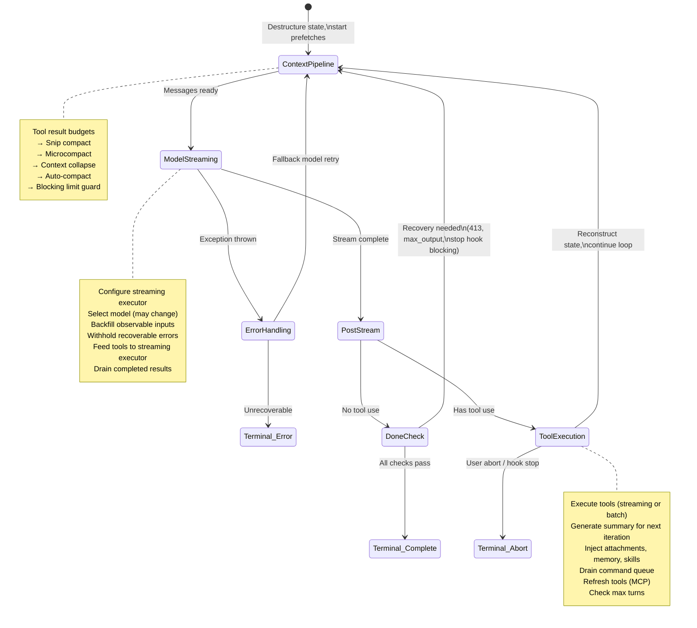
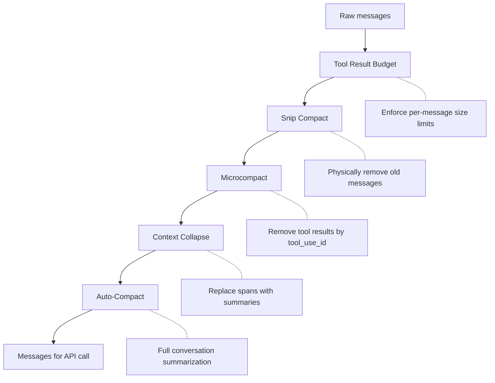
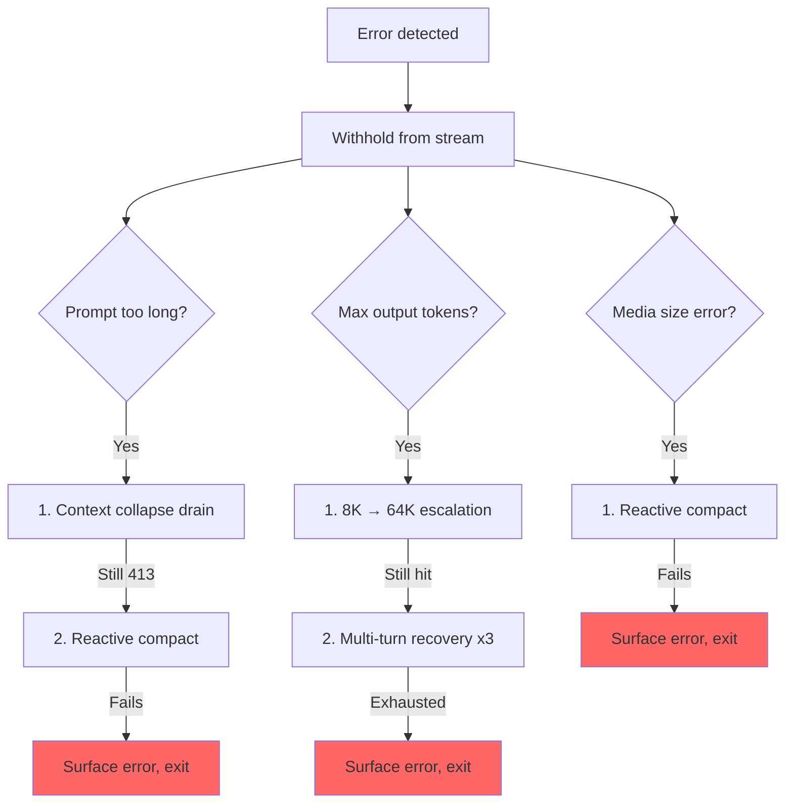

# Chương 5: Agent Loop

## Trái Tim Đập

Chương 4 đã cho thấy cách tầng API biến cấu hình thành các HTTP request dạng streaming -- client được dựng như thế nào, system prompt được lắp ra sao, và phản hồi đến dưới dạng server-sent events. Tầng đó xử lý *cơ chế* giao tiếp với model. Nhưng một API call đơn lẻ không phải là agent. Agent là một vòng lặp: gọi model, thực thi tools, đưa kết quả ngược trở lại, gọi model lần nữa, cho đến khi công việc hoàn tất.

Mọi hệ thống đều có một trọng tâm. Trong database, đó là storage engine. Trong compiler, đó là intermediate representation. Trong Claude Code, đó là `query.ts` -- một file 1.730 dòng chứa async generator điều khiển mọi tương tác, từ lần gõ phím đầu tiên trong REPL đến tool call cuối cùng của một lượt chạy headless `--print`.

Đây không phải cường điệu. Chỉ có đúng một code path nói chuyện với model, thực thi tools, quản lý context, phục hồi lỗi, và quyết định khi nào dừng. Code path đó là hàm `query()`. REPL gọi nó. SDK gọi nó. Sub-agents gọi nó. Headless runner gọi nó. Nếu bạn đang dùng Claude Code, bạn đang ở bên trong `query()`.

File này dày đặc, nhưng không phức tạp theo kiểu các cây kế thừa rối rắm. Nó phức tạp theo kiểu một tàu ngầm: một thân tàu duy nhất với nhiều hệ thống dự phòng, mỗi hệ được thêm vào vì đại dương đã tìm ra một đường tràn vào. Mỗi nhánh `if` đều có một câu chuyện. Mỗi thông báo lỗi bị giữ lại đại diện cho một bug thật nơi SDK consumer ngắt kết nối giữa lúc hệ thống đang phục hồi. Mỗi ngưỡng circuit breaker đều được tinh chỉnh từ các session thật từng đốt hàng nghìn API call trong vòng lặp vô hạn.

Chương này sẽ đi qua toàn bộ vòng lặp, từ đầu đến cuối. Đến hết chương, bạn sẽ hiểu không chỉ chuyện gì xảy ra, mà còn vì sao từng cơ chế tồn tại và điều gì sẽ hỏng nếu thiếu nó.

---

## Vì Sao Dùng Async Generator

Câu hỏi kiến trúc đầu tiên: vì sao agent loop là generator thay vì event emitter dựa trên callback?

```typescript
// Simplified — shows the concept, not the exact types
async function* agentLoop(params: LoopParams): AsyncGenerator<Message | Event, TerminalReason>
```

Chữ ký thực tế yield nhiều kiểu message và event, đồng thời trả về một discriminated union mã hóa lý do vòng lặp dừng.

Ba lý do, theo thứ tự quan trọng.

**Backpressure.** Event emitter phát sự kiện dù consumer đã sẵn sàng hay chưa. Generator chỉ yield khi consumer gọi `.next()`. Khi React renderer của REPL đang bận render frame trước đó, generator tự nhiên dừng lại. Khi một SDK consumer đang xử lý tool result, generator chờ. Không tràn buffer, không rơi message, không có bài toán "fast producer / slow consumer".

**Ngữ nghĩa giá trị trả về.** Kiểu trả về của generator là `Terminal` -- một discriminated union mã hóa chính xác vì sao vòng lặp dừng. Hoàn tất bình thường? Người dùng abort? Cạn token budget? Stop hook can thiệp? Chạm giới hạn max-turns? Lỗi model không thể phục hồi? Có 10 terminal states khác nhau. Callers không cần subscribe vào một sự kiện "end" rồi hy vọng payload có lý do. Họ nhận trực tiếp lý do đó như một giá trị trả về có kiểu từ `for await...of` hoặc `yield*`.

**Khả năng tổ hợp qua `yield*`.** Hàm `query()` bên ngoài ủy quyền cho `queryLoop()` bằng `yield*`, chuyển tiếp trong suốt mọi giá trị được yield và cả giá trị return cuối cùng. Các sub-generator như `handleStopHooks()` dùng đúng mẫu đó. Kết quả là một chain of responsibility gọn gàng, không callbacks, không promises bọc promises, không boilerplate chuyển tiếp event.

Lựa chọn này có chi phí -- async generators trong JavaScript không thể "rewind" hay fork. Nhưng agent loop không cần cả hai. Nó là một state machine chỉ tiến về phía trước.

Một điểm tinh tế nữa: cú pháp `function*` làm hàm *lazy*. Thân hàm không chạy cho đến lần gọi `.next()` đầu tiên. Nghĩa là `query()` trả về tức thì -- mọi khởi tạo nặng (config snapshot, memory prefetch, budget tracker) chỉ diễn ra khi consumer bắt đầu kéo giá trị. Trong REPL, điều này có nghĩa pipeline render React đã sẵn sàng trước khi dòng đầu tiên của vòng lặp chạy.

---

## What Callers Provide

Trước khi đi qua vòng lặp, nên biết đầu vào gồm những gì:

```typescript
// Simplified — illustrates the key fields
type LoopParams = {
  messages: Message[]
  prompt: SystemPrompt
  permissionCheck: CanUseToolFn
  context: ToolUseContext
  source: QuerySource         // 'repl', 'sdk', 'agent:xyz', 'compact', etc.
  maxTurns?: number
  budget?: { total: number }  // API-level task budget
  deps?: LoopDeps             // Injected for testing
}
```

Các trường đáng chú ý:

- **`querySource`**: Một string discriminant như `'repl_main_thread'`, `'sdk'`, `'agent:xyz'`, `'compact'`, hoặc `'session_memory'`. Nhiều nhánh điều kiện rẽ theo trường này. Compact agent dùng `querySource: 'compact'` để blocking limit guard không gây deadlock (compact agent cần chạy để *giảm* số token).

- **`taskBudget`**: API-level task budget (`output_config.task_budget`). Tách biệt với tính năng `+500k` auto-continue token budget. `total` là budget cho toàn bộ agentic turn; `remaining` được tính theo từng iteration từ mức dùng API tích lũy và điều chỉnh qua các ranh giới compaction.

- **`deps`**: Dependency injection tùy chọn. Mặc định là `productionDeps()`. Đây là seam nơi tests thay bằng fake model calls, fake compaction, và UUIDs mang tính xác định.

- **`canUseTool`**: Hàm trả về liệu một tool có được phép dùng hay không. Đây là permission layer -- kiểm tra trust settings, hook decisions, và permission mode hiện tại.

---

## The Two-Layer Entry Point

Public API là một wrapper mỏng quanh vòng lặp thực:

Hàm ngoài bọc hàm loop bên trong, theo dõi command nào trong queue đã được tiêu thụ trong turn. Sau khi loop bên trong hoàn tất, các command đã tiêu thụ được đánh dấu `'completed'`. Nếu loop throw hoặc generator bị đóng qua `.return()`, các completion notifications sẽ không bao giờ phát ra -- một turn thất bại không nên đánh dấu command là đã xử lý thành công. Các command được xếp hàng trong lúc turn đang chạy (qua `/` slash commands hoặc task notifications) được đánh dấu `'started'` bên trong loop và `'completed'` trong wrapper. Nếu loop throw hoặc generator bị đóng qua `.return()`, các completion notifications sẽ không bao giờ phát ra. Đây là chủ đích -- một turn thất bại không nên đánh dấu command là đã xử lý thành công.

---

## The State Object

Vòng lặp giữ state trong một typed object duy nhất:

```typescript
// Simplified — illustrates the key fields
type LoopState = {
  messages: Message[]
  context: ToolUseContext
  turnCount: number
  transition: Continue | undefined
  // ... plus recovery counters, compaction tracking, pending summaries, etc.
}
```

Mười trường. Mỗi trường đều có lý do tồn tại:

| Field | Why It Exists |
|-------|---------------|
| `messages` | Lịch sử hội thoại, được mở rộng sau mỗi iteration |
| `toolUseContext` | Mutable context: tools, abort controller, agent state, options |
| `autoCompactTracking` | Theo dõi trạng thái compaction: turn counter, turn ID, consecutive failures, compacted flag |
| `maxOutputTokensRecoveryCount` | Đã thử multi-turn recovery bao nhiêu lần cho output token limits (tối đa 3) |
| `hasAttemptedReactiveCompact` | One-shot guard chống vòng lặp reactive compaction vô hạn |
| `maxOutputTokensOverride` | Đặt thành 64K khi escalation, sau đó xóa |
| `pendingToolUseSummary` | Promise từ Haiku summary của iteration trước, resolve trong lúc streaming iteration hiện tại |
| `stopHookActive` | Ngăn chạy lại stop hooks sau một lần blocking retry |
| `turnCount` | Bộ đếm tăng đơn điệu, được kiểm tra với `maxTurns` |
| `transition` | Vì sao iteration trước tiếp tục -- `undefined` ở iteration đầu |

### Immutable Transitions in a Mutable Loop

Đây là pattern xuất hiện ở mọi câu lệnh `continue` trong loop:

```typescript
const next: State = {
  messages: [...messagesForQuery, ...assistantMessages, ...toolResults],
  toolUseContext: toolUseContextWithQueryTracking,
  autoCompactTracking: tracking,
  turnCount: nextTurnCount,
  maxOutputTokensRecoveryCount: 0,
  hasAttemptedReactiveCompact: false,
  pendingToolUseSummary: nextPendingToolUseSummary,
  maxOutputTokensOverride: undefined,
  stopHookActive,
  transition: { reason: 'next_turn' },
}
state = next
```

Mọi vị trí continue đều dựng một `State` object mới đầy đủ. Không phải `state.messages = newMessages`. Không phải `state.turnCount++`. Mà là tái dựng toàn phần. Lợi ích là mọi transition đều tự mô tả. Bạn có thể đọc bất kỳ vị trí `continue` nào và thấy rõ trường nào thay đổi, trường nào được giữ nguyên. Trường `transition` trong state mới ghi lại *vì sao* loop tiếp tục -- tests assert vào đó để xác minh đúng nhánh recovery đã chạy.

---

## The Loop Body

Đây là execution flow đầy đủ của một iteration, rút gọn còn skeleton:



Đó là toàn bộ loop. Mọi tính năng trong Claude Code -- từ memory tới sub-agents tới error recovery -- đều đổ vào hoặc lấy ra từ một cấu trúc iteration duy nhất này.

---

## Context Management: Four Compression Layers

Trước mỗi API call, lịch sử message đi qua tối đa bốn tầng context management. Chúng chạy theo thứ tự cố định, và thứ tự đó rất quan trọng.



### Layer 0: Tool Result Budget

Trước mọi bước nén, `applyToolResultBudget()` áp giới hạn kích thước theo từng message cho tool results. Những tools không có `maxResultSizeChars` hữu hạn được miễn.

### Layer 1: Snip Compact

Thao tác nhẹ nhất. Snip xóa vật lý các message cũ khỏi mảng, đồng thời yield một boundary message để báo cho UI biết đã có phần bị loại bỏ. Nó báo số token đã giải phóng, và con số đó được nối vào kiểm tra ngưỡng của auto-compact.

### Layer 2: Microcompact

Microcompact xóa các tool results không còn cần thiết, nhận diện bằng `tool_use_id`. Với cached microcompact (chỉnh API cache), boundary message được hoãn đến sau API response. Lý do: ước lượng token phía client không đáng tin. `cache_deleted_input_tokens` thực tế từ API response mới cho biết chính xác đã giải phóng được bao nhiêu.

### Layer 3: Context Collapse

Context collapse thay các đoạn hội thoại bằng summary. Nó chạy trước auto-compact, và thứ tự này là có chủ đích: nếu collapse hạ context xuống dưới ngưỡng auto-compact, auto-compact trở thành no-op. Cách này giữ được context dạng hạt thay vì thay mọi thứ bằng một summary nguyên khối.

### Layer 4: Auto-Compact

Thao tác nặng nhất: nó fork nguyên một cuộc hội thoại Claude để tóm tắt lịch sử. Implementation có circuit breaker -- sau 3 lần thất bại liên tiếp, nó ngừng thử. Điều này ngăn kịch bản ác mộng đã quan sát trong production: các session kẹt quá context limit, đốt 250K API calls mỗi ngày trong vòng compact-fail-retry vô hạn.

### Auto-Compact Thresholds

Các ngưỡng được suy ra từ context window của model:

```
effectiveContextWindow = contextWindow - min(modelMaxOutput, 20000)

Thresholds (relative to effectiveContextWindow):
  Auto-compact fires:      effectiveWindow - 13,000
  Blocking limit (hard):   effectiveWindow - 3,000
```

| Constant | Value | Purpose |
|----------|-------|---------|
| `AUTOCOMPACT_BUFFER_TOKENS` | 13,000 | Headroom dưới effective window để kích hoạt auto-compact |
| `MANUAL_COMPACT_BUFFER_TOKENS` | 3,000 | Chừa không gian để `/compact` vẫn chạy được |
| `MAX_CONSECUTIVE_AUTOCOMPACT_FAILURES` | 3 | Ngưỡng circuit breaker |

Khoảng đệm 13.000 token khiến auto-compact kích hoạt sớm trước hard limit khá nhiều. Khoảng giữa ngưỡng auto-compact và blocking limit là nơi reactive compact hoạt động -- nếu proactive auto-compact thất bại hoặc bị tắt, reactive compact sẽ bắt lỗi 413 và compact theo nhu cầu.

### Token Counting

Hàm canonical `tokenCountWithEstimation` kết hợp số token authoritative do API báo (từ response gần nhất) với ước lượng thô cho các message được thêm sau response đó. Phép xấp xỉ này mang tính bảo thủ -- nghiêng về đếm cao hơn, nghĩa là auto-compact nổ sớm một chút thay vì muộn một chút.

---

## Model Streaming

### The callModel() Loop

API call chạy trong vòng `while(attemptWithFallback)` để hỗ trợ model fallback:

```typescript
let attemptWithFallback = true
while (attemptWithFallback) {
  attemptWithFallback = false
  try {
    for await (const message of deps.callModel({ messages, systemPrompt, tools, signal })) {
      // Process each streamed message
    }
  } catch (innerError) {
    if (innerError instanceof FallbackTriggeredError && fallbackModel) {
      currentModel = fallbackModel
      attemptWithFallback = true
      continue
    }
    throw innerError
  }
}
```

Khi được bật, `StreamingToolExecutor` bắt đầu thực thi tools ngay khi các khối `tool_use` xuất hiện trong stream -- không chờ toàn bộ response hoàn tất. Cách tools được điều phối thành concurrent batches là chủ đề của Chương 7.

### The Withholding Pattern

Đây là một trong những pattern quan trọng nhất trong file. Recoverable errors bị chặn không cho đi ra yield stream:

```typescript
let withheld = false
if (contextCollapse?.isWithheldPromptTooLong(message)) withheld = true
if (reactiveCompact?.isWithheldPromptTooLong(message)) withheld = true
if (isWithheldMaxOutputTokens(message)) withheld = true
if (!withheld) yield yieldMessage
```

Vì sao phải withhold? Vì SDK consumers -- Cowork, desktop app -- kết thúc session ngay khi thấy message có trường `error`. Nếu bạn yield lỗi prompt-too-long rồi sau đó recovery thành công bằng reactive compaction, consumer đã ngắt kết nối trước đó. Recovery loop vẫn chạy, nhưng không còn ai lắng nghe. Vì vậy lỗi được withhold, đẩy vào `assistantMessages` để các bước recovery downstream còn nhìn thấy. Nếu mọi đường recovery đều thất bại, message bị withhold mới được đưa ra.

### Model Fallback

Khi bắt được `FallbackTriggeredError` (model chính đang quá tải), loop chuyển model và retry. Nhưng thinking signatures bị ràng theo model -- phát lại protected-thinking block từ model này sang fallback model khác sẽ gây lỗi 400. Code sẽ strip signature blocks trước khi retry. Mọi orphaned assistant messages từ lần thử thất bại bị tombstone để UI gỡ chúng đi.

---

## Error Recovery: The Escalation Ladder

Error recovery trong query.ts không phải một chiến lược đơn lẻ. Nó là một chiếc thang gồm các can thiệp ngày càng mạnh, mỗi bước được kích hoạt khi bước trước thất bại.



### The Death Spiral Guard

Failure mode nguy hiểm nhất là vòng lặp vô hạn. Code có nhiều guard:

1. **`hasAttemptedReactiveCompact`**: Cờ one-shot. Reactive compact chạy một lần cho mỗi loại lỗi.
2. **`MAX_OUTPUT_TOKENS_RECOVERY_LIMIT = 3`**: Trần cứng cho số lần multi-turn recovery.
3. **Circuit breaker trên auto-compact**: Sau 3 lần thất bại liên tiếp, auto-compact dừng hẳn.
4. **Không chạy stop hooks trên error responses**: Code trả về sớm trước stop hooks nếu message cuối là API error. Comment giải thích: "error -> hook blocking -> retry -> error -> ... (the hook injects more tokens each cycle)."
5. **Giữ nguyên `hasAttemptedReactiveCompact` qua stop hook retries**: Khi stop hook trả blocking errors và ép retry, reactive compact guard được giữ nguyên. Comment ghi lại bug: "Resetting to false here caused an infinite loop burning thousands of API calls."

Mỗi guard này được thêm vào vì đã có người chạm đúng failure mode đó trong production.

---

## Worked Example: "Fix the Bug in auth.ts"

Để loop trở nên cụ thể, ta đi qua một tương tác thật trong ba iterations.

**The user types:** `Fix the null pointer bug in src/auth/validate.ts`

**Iteration 1: The model reads the file.**

Loop bắt đầu. Context management chạy (không cần compression -- hội thoại còn ngắn). Model stream một phản hồi: "Let me look at the file." Nó phát ra một khối `tool_use`: `Read({ file_path: "src/auth/validate.ts" })`. Streaming executor thấy tool này concurrency-safe nên chạy ngay. Đến lúc model kết thúc phần text, nội dung file đã có sẵn trong memory.

Post-stream processing: model có dùng tool, nên đi vào nhánh tool-use. Read result (nội dung file có line numbers) được đẩy vào `toolResults`. Một Haiku summary promise được khởi chạy nền. State được dựng lại với messages mới, `transition: { reason: 'next_turn' }`, và loop tiếp tục.

**Iteration 2: The model edits the file.**

Context management chạy lại (vẫn dưới ngưỡng). Model stream: "I see the bug on line 42 -- `userId` can be null." Nó phát `Edit({ file_path: "src/auth/validate.ts", old_string: "const user = getUser(userId)", new_string: "if (!userId) return { error: 'unauthorized' }\nconst user = getUser(userId)" })`.

Edit không concurrency-safe, nên streaming executor xếp hàng cho đến khi response hoàn tất. Sau đó 14-step execution pipeline chạy: Zod validation qua, input backfill mở rộng path, PreToolUse hook kiểm tra permissions (người dùng approve), rồi edit được áp dụng. Pending Haiku summary từ iteration 1 resolve trong lúc streaming -- kết quả được yield dưới dạng `ToolUseSummaryMessage`. State được dựng lại, loop tiếp tục.

**Iteration 3: The model declares completion.**

Model stream: "I've fixed the null pointer bug by adding a guard clause." Không có `tool_use` blocks. Ta đi vào nhánh "done". Prompt-too-long recovery? Không cần. Max output tokens? Không. Stop hooks chạy -- không có blocking errors. Token budget check qua. Loop return `{ reason: 'completed' }`.

Tổng cộng: ba API calls, hai lần tool execution, một lần permission prompt cho người dùng. Loop xử lý streaming tool execution, Haiku summarization chồng lấp với API call, và full permission pipeline -- tất cả qua cùng một cấu trúc `while(true)`.

---

## Token Budgets

Người dùng có thể yêu cầu token budget cho một turn (ví dụ `+500k`). Hệ budget quyết định nên tiếp tục hay dừng sau khi model hoàn thành phản hồi.

`checkTokenBudget` đưa ra quyết định continue/stop nhị phân theo ba quy tắc:

1. **Subagents luôn dừng.** Budget chỉ là khái niệm ở top-level.
2. **Ngưỡng hoàn tất ở 90%.** Nếu `turnTokens < budget * 0.9`, tiếp tục.
3. **Phát hiện diminishing returns.** Sau 3+ lần continuation, nếu cả delta hiện tại và delta trước đó đều dưới 500 tokens, dừng sớm. Model đang tạo ra ngày càng ít output cho mỗi continuation.

Khi quyết định là "continue", một nudge message được chèn vào để báo model còn bao nhiêu budget.

---

## Stop Hooks: Forcing the Model to Keep Working

Stop hooks chạy khi model kết thúc mà không yêu cầu tool use nào -- nó nghĩ là đã xong. Hooks sẽ đánh giá liệu nó thực sự *đã* xong chưa.

Pipeline chạy template job classification, kích hoạt background tasks (prompt suggestion, memory extraction), rồi thực thi stop hooks chính. Khi stop hook trả về blocking errors -- "you said you were done, but the linter found 3 errors" -- các lỗi được nối vào message history và loop tiếp tục với `stopHookActive: true`. Cờ này ngăn chạy lại cùng stop hooks ở lần retry.

Khi stop hook phát tín hiệu `preventContinuation`, loop thoát ngay với `{ reason: 'stop_hook_prevented' }`.

---

## State Transitions: The Complete Catalog

Mọi lối ra của loop thuộc một trong hai loại: `Terminal` (loop return) hoặc `Continue` (loop lặp tiếp).

### Terminal States (10 reasons)

| Reason | Trigger |
|--------|---------|
| `blocking_limit` | Token count chạm hard limit, auto-compact OFF |
| `image_error` | ImageSizeError, ImageResizeError, hoặc lỗi media không thể phục hồi |
| `model_error` | API/model exception không thể phục hồi |
| `aborted_streaming` | Người dùng abort trong lúc model streaming |
| `prompt_too_long` | Lỗi 413 bị withhold sau khi mọi recovery đã cạn |
| `completed` | Hoàn tất bình thường (không tool use, hoặc budget cạn, hoặc API error) |
| `stop_hook_prevented` | Stop hook chặn continuation một cách tường minh |
| `aborted_tools` | Người dùng abort trong lúc tool execution |
| `hook_stopped` | PreToolUse hook dừng continuation |
| `max_turns` | Chạm giới hạn `maxTurns` |

### Continue States (7 reasons)

| Reason | Trigger |
|--------|---------|
| `collapse_drain_retry` | Context collapse đã drain các staged collapses khi gặp 413 |
| `reactive_compact_retry` | Reactive compact thành công sau 413 hoặc media error |
| `max_output_tokens_escalate` | Chạm trần 8K, đang nâng lên 64K |
| `max_output_tokens_recovery` | Vẫn chạm trần 64K, multi-turn recovery (tối đa 3 lần) |
| `stop_hook_blocking` | Stop hook trả blocking errors, phải retry |
| `token_budget_continuation` | Token budget chưa cạn, đã chèn nudge message |
| `next_turn` | Continuation bình thường sau tool-use |

---

## Orphaned Tool Results: The Protocol Safety Net

API protocol yêu cầu mọi `tool_use` block phải được theo sau bởi một `tool_result`. Hàm `yieldMissingToolResultBlocks` tạo các `tool_result` lỗi cho mọi `tool_use` block mà model đã phát ra nhưng không có result tương ứng. Không có lưới an toàn này, một crash trong lúc streaming sẽ để lại orphaned `tool_use` blocks và gây protocol error ở API call kế tiếp.

Nó chạy ở ba nơi: outer error handler (model crash), fallback handler (switch model giữa stream), và abort handler (người dùng ngắt). Mỗi nhánh có thông báo lỗi khác nhau, nhưng cơ chế giống hệt nhau.

---

## Abort Handling: Two Paths

Abort có thể xảy ra ở hai điểm: trong lúc streaming và trong lúc tool execution. Mỗi điểm có hành vi riêng.

**Abort during streaming**: Streaming executor (nếu có) drain các kết quả còn lại, tạo synthetic `tool_results` cho tools đang xếp hàng. Nếu không có executor, `yieldMissingToolResultBlocks` sẽ lấp chỗ trống. Kiểm tra `signal.reason` phân biệt hard abort (Ctrl+C) với submit-interrupt (người dùng gửi message mới) -- submit-interrupt bỏ qua interruption message vì queued user message đã đủ ngữ cảnh.

**Abort during tool execution**: Tương tự, với tham số `toolUse: true` trên interruption message để báo cho UI rằng tools đang chạy dang dở.

---

## The Thinking Rules

Thinking/redacted_thinking blocks của Claude có ba quy tắc bất khả xâm phạm:

1. Message chứa thinking block phải thuộc một query có `max_thinking_length > 0`
2. Thinking block không được là block cuối cùng trong message
3. Thinking blocks phải được bảo toàn xuyên suốt một assistant trajectory

Vi phạm bất kỳ quy tắc nào đều sinh ra API errors khó hiểu. Code xử lý các tình huống đó ở nhiều nơi: fallback handler strip signature blocks (vì gắn với model), compaction pipeline giữ protected tail, và microcompact layer không bao giờ chạm vào thinking blocks.

---

## Dependency Injection

Kiểu `QueryDeps` được cố ý giữ hẹp -- bốn dependencies, không phải bốn mươi:

Bốn dependencies được inject: model caller, compactor, microcompactor, và UUID generator. Tests truyền `deps` vào loop params để inject fakes trực tiếp. Dùng `typeof fn` cho type definitions giúp signatures luôn đồng bộ tự động. Song song với `State` mutable và `QueryDeps` injectable, một `QueryConfig` immutable được chụp một lần tại điểm vào `query()` -- feature flags, session state, và environment variables được chụp một lần rồi không đọc lại. Cách tách ba phần (mutable state, immutable config, injectable deps) khiến loop dễ test hơn và giúp việc refactor tương lai sang reducer thuần `step(state, event, config)` trở nên thẳng thắn.

---

## Apply This: Building Your Own Agent Loop

**Dùng generator, đừng dùng callbacks.** Backpressure là miễn phí. Ngữ nghĩa giá trị trả về là miễn phí. Khả năng tổ hợp qua `yield*` là miễn phí. Agent loops chỉ đi tiến -- bạn không bao giờ cần rewind hay fork.

**Làm state transitions thật tường minh.** Hãy tái dựng full state object ở mọi vị trí `continue`. Sự dài dòng chính là tính năng -- nó ngăn bugs cập nhật cục bộ và làm mỗi transition tự mô tả.

**Withhold recoverable errors.** Nếu consumers của bạn ngắt kết nối khi gặp errors, đừng yield lỗi cho tới khi chắc chắn recovery thất bại. Đẩy chúng vào buffer nội bộ, thử recovery, chỉ surface khi đã cạn mọi đường.

**Xếp lớp context management.** Thao tác nhẹ trước (removal), thao tác nặng sau (summarization). Cách này giữ granular context khi có thể và chỉ rơi về monolithic summary khi cần.

**Thêm circuit breakers cho mọi retry.** Mọi recovery mechanism trong `query.ts` đều có giới hạn tường minh: 3 lần auto-compact thất bại, 3 lần max-output recovery attempts, 1 lần reactive compact attempt. Không có các giới hạn này, session production đầu tiên kích hoạt vòng retry-on-failure sẽ đốt API budget của bạn qua đêm.

The minimal agent loop skeleton, if you are starting from scratch:

```
async function* agentLoop(params) {
  let state = initState(params)
  while (true) {
    const context = compressIfNeeded(state.messages)
    const response = await callModel(context)
    if (response.error) {
      if (canRecover(response.error, state)) { state = recoverState(state); continue }
      return { reason: 'error' }
    }
    if (!response.toolCalls.length) return { reason: 'completed' }
    const results = await executeTools(response.toolCalls)
    state = { ...state, messages: [...context, response.message, ...results] }
  }
}
```

Mọi tính năng trong loop của Claude Code đều là phần mở rộng của một trong các bước này. Four compression layers mở rộng bước 3 (compress). The withholding pattern mở rộng model call. The escalation ladder mở rộng error recovery. Stop hooks mở rộng lối thoát "no tool use". Hãy bắt đầu từ skeleton này. Chỉ thêm mỗi phần mở rộng khi bạn thực sự gặp vấn đề mà nó giải quyết.

---

## Tóm Tắt

Agent loop là 1.730 dòng của một `while(true)` duy nhất làm mọi thứ. Nó stream model responses, thực thi tools đồng thời, nén context qua bốn lớp, phục hồi từ năm nhóm lỗi, theo dõi token budgets với diminishing returns detection, chạy stop hooks có thể ép model quay lại làm việc, quản lý prefetch pipelines cho memory và skills, và tạo ra một typed discriminated union mô tả chính xác vì sao nó dừng.

Đây là file quan trọng nhất hệ thống vì nó là file duy nhất chạm vào mọi subsystem khác. Context pipeline đổ vào nó. Tool system đi ra từ nó. Error recovery bọc quanh nó. Hooks chặn nó. State layer đi xuyên qua nó. UI render từ nó.

Nếu bạn hiểu `query()`, bạn hiểu Claude Code. Mọi thứ khác chỉ là ngoại vi.
