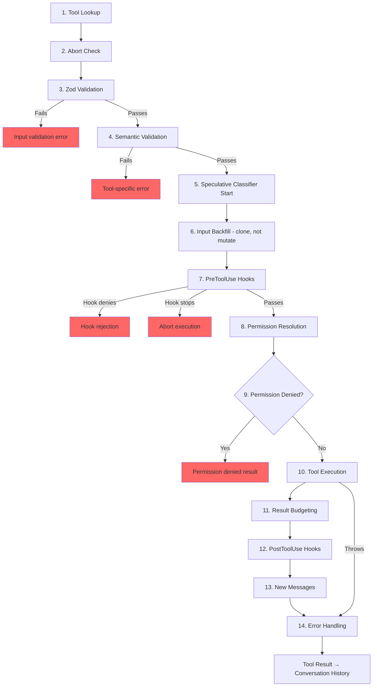

# Chương 6: Tools -- Từ định nghĩa đến thực thi

## Hệ thần kinh

Chương 5 đã cho bạn thấy agent loop -- `while(true)` liên tục stream phản hồi từ model, thu thập tool calls, rồi đưa kết quả quay lại. Vòng lặp là nhịp tim. Nhưng nhịp tim sẽ vô nghĩa nếu không có hệ thần kinh chuyển câu "model muốn chạy `git status`" thành một shell command thực sự, kèm kiểm tra quyền, result budgeting, và xử lý lỗi.

Tool system chính là hệ thần kinh đó. Nó trải rộng qua hơn 40 triển khai tool, một registry tập trung có feature-flag gating, một execution pipeline 14 bước, một permission resolver với bảy mode, và một streaming executor có thể khởi chạy tool trước khi model kết thúc phản hồi.

Mọi tool call trong Claude Code -- mọi lần đọc file, mọi shell command, mọi grep, mọi lần dispatch sub-agent -- đều đi qua cùng một pipeline. Tính đồng nhất là điểm mấu chốt: dù tool là Bash executor built-in hay MCP server bên thứ ba, nó đều nhận cùng validation, cùng permission checks, cùng result budgeting, cùng error classification.

`Tool` interface có khoảng 45 thành viên. Nghe có vẻ áp đảo, nhưng để hiểu hệ thống hoạt động, chỉ có năm thành phần quan trọng:

1. **`call()`** -- thực thi tool
2. **`inputSchema`** -- validate và parse input
3. **`isConcurrencySafe()`** -- có thể chạy song song không?
4. **`checkPermissions()`** -- có được phép không?
5. **`validateInput()`** -- input này có hợp lý về mặt ngữ nghĩa không?

Phần còn lại -- 12 rendering methods, analytics hooks, search hints -- tồn tại để phục vụ lớp UI và telemetry. Nắm năm phần này trước, phần còn lại sẽ tự khớp vào đúng chỗ.

---

## Tool Interface

### Ba Type Parameters

Mỗi tool được tham số hóa bởi ba type:

```typescript
Tool<Input extends AnyObject, Output, P extends ToolProgressData>
```

`Input` là một Zod object schema đóng hai vai trò: nó tạo JSON Schema gửi lên API (để model biết cần cung cấp tham số nào), và validate phản hồi của model ở runtime qua `safeParse`. `Output` là TypeScript type của kết quả tool. `P` là type của progress event mà tool phát ra khi chạy -- BashTool phát stdout chunks, GrepTool phát số lượng match, AgentTool phát sub-agent transcripts.

### buildTool() và Fail-Closed Defaults

Không tool nào tự dựng trực tiếp một `Tool` object. Mọi tool đều đi qua `buildTool()`, một factory trải một defaults object trước rồi ghi đè bằng định nghĩa riêng của tool:

```typescript
// Pseudocode — illustrates the fail-closed defaults pattern
const SAFE_DEFAULTS = {
  isEnabled:         () => true,
  isParallelSafe:    () => false,   // Fail-closed: new tools run serially
  isReadOnly:        () => false,   // Fail-closed: treated as writes
  isDestructive:     () => false,
  checkPermissions:  (input) => ({ behavior: 'allow', updatedInput: input }),
}

function buildTool(definition) {
  return { ...SAFE_DEFAULTS, ...definition }  // Definition overrides defaults
}
```

Các defaults được cố ý thiết kế theo hướng fail-closed ở những điểm ảnh hưởng an toàn. Một tool mới quên triển khai `isConcurrencySafe` sẽ mặc định thành `false` -- chạy tuần tự, không bao giờ song song. Một tool quên `isReadOnly` sẽ mặc định thành `false` -- hệ thống coi như thao tác ghi. Một tool quên `toAutoClassifierInput` sẽ trả chuỗi rỗng -- auto-mode security classifier sẽ bỏ qua nó, nghĩa là permission system tổng quát xử lý thay vì cho phép đi qua theo đường tự động.

Mặc định duy nhất *không* fail-closed là `checkPermissions`, vốn trả `allow`. Trông có vẻ ngược cho tới khi bạn nhìn vào mô hình permission nhiều lớp: `checkPermissions` là logic riêng theo tool, chạy *sau khi* permission system tổng quát đã đánh giá rules, hooks, và mode-based policies. Khi tool trả `allow` từ `checkPermissions`, ý nghĩa là "tôi không có phản đối riêng ở cấp tool" -- không phải cấp quyền toàn cục. Việc gom vào các sub-object (`options`, các field đặt tên như `readFileState`) mang lại cấu trúc gần như interface tách lớp, nhưng không cần khai báo/triển khai/luồn năm interface riêng qua hơn 40 call sites.

### Concurrency phụ thuộc Input

Chữ ký `isConcurrencySafe(input: z.infer<Input>): boolean` nhận parsed input vì cùng một tool có thể an toàn với input này nhưng không an toàn với input khác. BashTool là ví dụ điển hình: `ls -la` là read-only và concurrency-safe, nhưng `rm -rf /tmp/build` thì không. Tool parse command, phân loại từng subcommand theo các tập known-safe, và chỉ trả `true` khi mọi phần không trung tính đều là thao tác search hoặc read.

### The ToolResult Return Type

Mọi `call()` trả về `ToolResult<T>`:

```typescript
type ToolResult<T> = {
  data: T
  newMessages?: (UserMessage | AssistantMessage | AttachmentMessage | SystemMessage)[]
  contextModifier?: (context: ToolUseContext) => ToolUseContext
}
```

`data` là output có kiểu, được serialize vào content block `tool_result` của API. `newMessages` cho phép tool chèn thêm messages vào hội thoại -- AgentTool dùng để thêm sub-agent transcripts. `contextModifier` là hàm biến đổi `ToolUseContext` cho các tool chạy sau -- đây là cách `EnterPlanMode` chuyển permission mode. Context modifiers chỉ được áp dụng cho tools không concurrency-safe; nếu tool chạy song song, modifier của nó sẽ được xếp hàng tới khi batch hoàn tất.

---

## ToolUseContext: The God Object

`ToolUseContext` là túi context khổng lồ được truyền qua mọi tool call. Nó có khoảng 40 fields. Theo hầu hết định nghĩa thực tế, đây là một god object. Nó tồn tại vì phương án thay thế còn tệ hơn.

Một tool như BashTool cần abort controller, file state cache, app state, message history, tool set, MCP connections, và nửa tá UI callbacks. Nếu truyền từng thứ thành tham số rời, chữ ký hàm sẽ có hơn 15 đối số. Giải pháp thực dụng là một context object duy nhất, nhóm theo từng concern:

**Configuration** (`options` sub-object): Tool set, model name, MCP connections, debug flags. Thiết lập một lần lúc query bắt đầu, phần lớn bất biến.

**Execution state**: `abortController` cho hủy tác vụ, `readFileState` cho LRU file cache, `messages` cho toàn bộ message history. Các phần này thay đổi trong lúc thực thi.

**UI callbacks**: `setToolJSX`, `addNotification`, `requestPrompt`. Chỉ được nối trong ngữ cảnh interactive (REPL). SDK và headless modes để chúng undefined.

**Agent context**: `agentId`, `renderedSystemPrompt` (parent prompt đã đóng băng cho fork sub-agents -- render lại có thể lệch do feature flag warm-up và làm vỡ cache).

Biến thể sub-agent của `ToolUseContext` đặc biệt đáng chú ý. Khi `createSubagentContext()` dựng context cho child agent, nó chủ động quyết định field nào chia sẻ và field nào cô lập: `setAppState` thành no-op cho async agents, `localDenialTracking` dùng object mới, `contentReplacementState` clone từ parent. Mỗi quyết định đó phản ánh một bài học rút ra từ bug production.

---

## The Registry

### getAllBaseTools(): The Single Source of Truth

Hàm `getAllBaseTools()` trả về danh sách đầy đủ của mọi tool có thể tồn tại trong process hiện tại. Nhóm tools luôn có mặt đứng trước, rồi đến tools được thêm có điều kiện bởi feature flags:

```typescript
const SleepTool = feature('PROACTIVE') || feature('KAIROS')
  ? require('./tools/SleepTool/SleepTool.js').SleepTool
  : null
```

Import `feature()` từ `bun:bundle` được resolve ngay lúc bundle. Khi `feature('AGENT_TRIGGERS')` tĩnh là false, bundler loại bỏ toàn bộ lệnh `require()` -- dead code elimination giúp binary gọn hơn.

### assembleToolPool(): Merging Built-in and MCP Tools

Bộ tool cuối cùng gửi đến model đến từ `assembleToolPool()`:

1. Lấy built-in tools (kèm deny-rule filtering, REPL mode hiding, và `isEnabled()` checks)
2. Lọc MCP tools theo deny rules
3. Sort từng partition theo alphabet theo tên
4. Nối built-ins (prefix) + MCP tools (suffix)

Sort-then-concatenate approach không phải sở thích thẩm mỹ. API server đặt một prompt-cache breakpoint sau built-in tool cuối cùng. Nếu sort phẳng toàn bộ tools, MCP tools sẽ xen vào danh sách built-in, và chỉ cần thêm/bớt một MCP tool là vị trí built-in tools bị xê dịch, khiến cache mất hiệu lực.

---

## The 14-Step Execution Pipeline

Hàm `checkPermissionsAndCallTool()` là nơi ý định trở thành hành động. Mọi tool call đều đi qua cùng 14 bước này.



### Steps 1-4: Validation

**Tool Lookup** fallback sang `getAllBaseTools()` để match alias, xử lý transcripts từ session cũ nơi tool đã đổi tên. **Abort Check** ngăn lãng phí tính toán cho những tool calls đã vào hàng đợi trước khi Ctrl+C lan tới. **Zod Validation** bắt lỗi lệch kiểu; với deferred tools, thông báo lỗi được bổ sung hint gọi ToolSearch trước. **Semantic Validation** đi xa hơn schema conformance -- FileEditTool từ chối no-op edits, BashTool chặn `sleep` đứng một mình khi MonitorTool khả dụng.

### Steps 5-6: Preparation

**Speculative Classifier Start** khởi động song song auto-mode security classifier cho Bash commands, tiết kiệm hàng trăm mili-giây trên đường đi phổ biến. **Input Backfill** clone parsed input rồi thêm các field suy diễn (mở rộng `~/foo.txt` thành absolute paths) cho hooks và permissions, đồng thời giữ nguyên bản gốc để transcript ổn định.

### Steps 7-9: Permission

**PreToolUse Hooks** là cơ chế mở rộng -- chúng có thể quyết định quyền, chỉnh input, chèn context, hoặc dừng hẳn thực thi. **Permission Resolution** nối hooks với permission system tổng quát: nếu hook đã quyết định thì đó là kết luận cuối; nếu chưa, `canUseTool()` sẽ chạy rule matching, tool-specific checks, mode-based defaults, và interactive prompts. **Permission Denied Handling** tạo thông báo lỗi và chạy hooks `PermissionDenied`.

### Steps 10-14: Execution and Cleanup

**Tool Execution** chạy `call()` thật với input gốc. **Result Budgeting** ghi output quá lớn vào `~/.claude/tool-results/{hash}.txt` rồi thay bằng preview. **PostToolUse Hooks** có thể chỉnh MCP output hoặc chặn tiếp tục. **New Messages** được nối thêm (sub-agent transcripts, system reminders). **Error Handling** phân loại lỗi cho telemetry, trích chuỗi an toàn từ tên có thể bị làm rối, và phát OTel events.

---

## The Permission System

### Seven Modes

| Mode | Behavior |
|------|----------|
| `default` | Tool-specific checks; hỏi người dùng cho thao tác không nhận diện |
| `acceptEdits` | Tự động cho phép file edits; hỏi với thao tác khác |
| `plan` | Read-only -- từ chối mọi thao tác ghi |
| `dontAsk` | Tự động từ chối mọi thứ bình thường sẽ phải hỏi (background agents) |
| `bypassPermissions` | Cho phép mọi thứ không cần hỏi |
| `auto` | Dùng transcript classifier để quyết định (feature-flagged) |
| `bubble` | Mode nội bộ cho sub-agents escalates lên parent |

### The Resolution Chain

Khi một tool call đi tới permission resolution:

1. **Hook decision**: Nếu một PreToolUse hook đã trả `allow` hoặc `deny`, đó là quyết định cuối.
2. **Rule matching**: Ba tập rules -- `alwaysAllowRules`, `alwaysDenyRules`, `alwaysAskRules` -- match theo tên tool và optional content patterns. `Bash(git *)` match mọi Bash command bắt đầu bằng `git`.
3. **Tool-specific check**: Phương thức `checkPermissions()` của tool. Phần lớn trả `passthrough`.
4. **Mode-based default**: `bypassPermissions` cho phép mọi thứ. `plan` từ chối writes. `dontAsk` từ chối prompts.
5. **Interactive prompt**: Trong mode `default` và `acceptEdits`, quyết định chưa ngã ngũ sẽ hiện prompt.
6. **Auto-mode classifier**: Classifier hai tầng (model nhanh, rồi extended thinking cho ca mơ hồ).

Biến thể `safetyCheck` có boolean `classifierApprovable`: edits vào `.claude/` và `.git/` có `classifierApprovable: true` (ít gặp nhưng đôi khi hợp lệ), còn các nỗ lực bypass đường dẫn kiểu Windows có `classifierApprovable: false` (gần như luôn adversarial).

### Permission Rules and Matching

Permission rules được lưu dưới dạng `PermissionRule` objects với ba phần: `source` truy vết provenance (userSettings, projectSettings, localSettings, cliArg, policySettings, session, v.v.), `ruleBehavior` (allow, deny, ask), và `ruleValue` gồm tên tool cùng optional content pattern.

Field `ruleContent` cho phép match tinh-granular. `Bash(git *)` cho phép mọi Bash command bắt đầu bằng `git`. `Edit(/src/**)` chỉ cho phép edits trong `/src`. `Fetch(domain:example.com)` cho phép fetch từ một domain cụ thể. Rules không có `ruleContent` sẽ match mọi invocation của tool đó.

Permission matcher của BashTool parse command qua `parseForSecurity()` (một bash AST parser) rồi tách compound commands thành subcommands. Nếu AST parsing fail (cú pháp phức tạp với heredocs hoặc nested subshells), matcher trả `() => true` -- fail-safe, nghĩa là hook luôn chạy. Giả định là: nếu command quá phức tạp để parse đáng tin, thì cũng quá phức tạp để tự tin loại khỏi safety checks.

### Bubble Mode for Sub-Agents

Sub-agents trong coordinator-worker patterns không thể hiện permission prompts -- chúng không có terminal. `bubble` mode khiến permission requests nổi ngược lên parent context. Coordinator agent, chạy ở main thread có terminal access, xử lý prompt rồi gửi quyết định xuống lại.

---

## Tool Deferred Loading

Tools có `shouldDefer: true` được gửi lên API với `defer_loading: true` -- có tên và mô tả nhưng không có full parameter schemas. Việc này giảm kích thước prompt ban đầu. Để dùng deferred tool, model phải gọi `ToolSearchTool` trước để nạp schema của nó. Failure mode rất đáng học: gọi deferred tool khi chưa nạp sẽ khiến Zod validation fail (mọi typed parameters đều đến dưới dạng strings), và hệ thống gắn thêm recovery hint đúng trọng tâm.

Deferred loading còn cải thiện cache hit rates: tools gửi với `defer_loading: true` chỉ đóng góp tên vào prompt, nên thêm hoặc bớt một deferred MCP tool chỉ làm prompt thay đổi vài tokens thay vì hàng trăm.

---

## Result Budgeting

### Per-Tool Size Limits

Mỗi tool khai báo `maxResultSizeChars`:

| Tool | maxResultSizeChars | Rationale |
|------|-------------------|-----------|
| BashTool | 30,000 | Đủ cho phần lớn output hữu ích |
| FileEditTool | 100,000 | Diffs có thể lớn nhưng model cần chúng |
| GrepTool | 100,000 | Search results kèm context lines tăng rất nhanh |
| FileReadTool | Infinity | Tự giới hạn bằng token limits riêng; persist sẽ tạo vòng lặp Read tự tham chiếu |

Khi kết quả vượt ngưỡng, toàn bộ nội dung được lưu ra disk và thay bằng wrapper `<persisted-output>` chứa preview cùng file path. Model sau đó có thể dùng `Read` để truy cập full output nếu cần.

### Per-Conversation Aggregate Budget

Ngoài các giới hạn theo từng tool, `ContentReplacementState` còn theo dõi aggregate budget của toàn bộ conversation, ngăn kiểu chết vì tích lũy -- nhiều tools mỗi tool trả 90% giới hạn riêng vẫn có thể làm nghẽn context window.

---

## Individual Tool Highlights

### BashTool: The Most Complex Tool

BashTool là tool phức tạp nhất hệ thống, vượt xa phần còn lại. Nó parse compound commands, phân loại subcommands là read-only hay write, quản lý background tasks, phát hiện image output qua magic bytes, và triển khai sed simulation để preview edit an toàn.

Phần parse compound commands đặc biệt thú vị. `splitCommandWithOperators()` tách command như `cd /tmp && mkdir build && ls build` thành từng subcommand. Mỗi subcommand được phân loại theo known-safe command sets (`BASH_SEARCH_COMMANDS`, `BASH_READ_COMMANDS`, `BASH_LIST_COMMANDS`). Một compound command chỉ được xem là read-only nếu TẤT CẢ phần không trung tính đều an toàn. Neutral set (echo, printf) bị bỏ qua -- chúng không làm command read-only hơn, nhưng cũng không làm nó write-only.

Sed simulation (`_simulatedSedEdit`) đáng chú ý riêng. Khi người dùng duyệt một sed command trong permission dialog, hệ thống pre-compute kết quả bằng cách chạy sed command trong sandbox và capture output. Kết quả pre-compute được inject vào input dưới dạng `_simulatedSedEdit`. Khi `call()` chạy, nó áp dụng edit trực tiếp, bỏ qua shell execution. Điều này đảm bảo thứ người dùng đã preview chính là thứ sẽ được ghi -- không phải chạy lại lệnh, vốn có thể cho kết quả khác nếu file thay đổi giữa preview và execution.

### FileEditTool: Staleness Detection

FileEditTool tích hợp với `readFileState`, LRU cache của file contents và timestamps được duy trì xuyên suốt conversation. Trước khi áp dụng edit, nó kiểm tra file có bị sửa kể từ lần model đọc gần nhất không. Nếu file stale -- bị sửa bởi background process, tool khác, hoặc người dùng -- edit sẽ bị từ chối với thông báo yêu cầu model re-read file trước.

Fuzzy matching trong `findActualString()` xử lý trường hợp phổ biến khi model sai nhẹ về whitespace. Nó chuẩn hóa whitespace và quote styles trước khi match, nên edit nhắm vào `old_string` có trailing spaces vẫn có thể khớp nội dung thật của file. Cờ `replace_all` cho phép thay thế hàng loạt; không có cờ này, các match không duy nhất sẽ bị từ chối, buộc model cung cấp đủ context để xác định đúng một vị trí.

### FileReadTool: The Versatile Reader

FileReadTool là built-in tool duy nhất có `maxResultSizeChars: Infinity`. Nếu Read output bị persist ra disk, model sẽ cần Read file đã persist đó; file này lại có thể vượt giới hạn, tạo vòng lặp vô hạn. Vì vậy tool tự giới hạn bằng ước lượng token và cắt ngay từ nguồn.

Tool này cực kỳ linh hoạt: đọc text files với line numbers, images (trả về base64 multimodal content blocks), PDFs (qua `extractPDFPages()`), Jupyter notebooks (qua `readNotebook()`), và directories (fallback sang `ls`). Nó chặn các device paths nguy hiểm (`/dev/zero`, `/dev/random`, `/dev/stdin`) và xử lý sự khác biệt tên file screenshot trên macOS (U+202F narrow no-break space so với dấu cách thường trong tên "Screen Shot").

### GrepTool: Pagination via head_limit

GrepTool bọc `ripGrep()` và thêm cơ chế pagination qua `head_limit`. Mặc định là 250 entries -- đủ hữu ích nhưng vẫn nhỏ để tránh phình context. Khi bị truncation, phản hồi gồm `appliedLimit: 250`, báo cho model dùng `offset` ở lần gọi sau để phân trang. Thiết lập tường minh `head_limit: 0` sẽ tắt giới hạn hoàn toàn.

GrepTool tự động loại trừ sáu VCS directories (`.git`, `.svn`, `.hg`, `.bzr`, `.jj`, `.sl`). Tìm trong `.git/objects` gần như không bao giờ là điều model muốn, và việc vô tình kéo theo binary pack files sẽ đốt sạch token budgets.

### AgentTool and Context Modifiers

AgentTool spawn sub-agents chạy query loops riêng. `call()` của nó trả `newMessages` chứa transcript của sub-agent, và có thể kèm `contextModifier` để đẩy thay đổi state về parent. Vì AgentTool mặc định không concurrency-safe, nhiều Agent tool calls trong cùng một phản hồi sẽ chạy tuần tự -- context modifier của mỗi sub-agent được áp dụng trước khi sub-agent kế tiếp bắt đầu. Trong coordinator mode, pattern đảo lại: coordinator dispatch sub-agents cho các tác vụ độc lập, và kiểm tra `isAgentSwarmsEnabled()` mở khóa parallel agent execution.

---

## How Tools Interact with the Message History

Tool results không chỉ trả dữ liệu về model. Chúng tham gia vào conversation như các structured messages.

API kỳ vọng tool results ở dạng `ToolResultBlockParam` objects tham chiếu `tool_use` block gốc bằng ID. Hầu hết tools serialize thành text. FileReadTool có thể serialize thành image content blocks (base64-encoded) cho phản hồi multimodal. BashTool phát hiện image output bằng cách kiểm tra magic bytes trong stdout và chuyển sang image blocks tương ứng.

`ToolResult.newMessages` là cách tools mở rộng conversation vượt khỏi pattern call-and-response đơn giản. **Agent transcripts**: AgentTool inject message history của sub-agent dưới dạng attachment messages. **System reminders**: Memory tools inject system messages xuất hiện sau tool result -- model thấy ở lượt kế tiếp nhưng bị strip ở biên `normalizeMessagesForAPI`. **Attachment messages**: Hook results, context bổ sung, và chi tiết lỗi mang structured metadata để model tham chiếu ở các lượt sau.

Hàm `contextModifier` là cơ chế dành cho tools thay đổi môi trường thực thi. Khi `EnterPlanMode` chạy, nó trả một modifier đặt permission mode thành `'plan'`. Khi `ExitWorktree` chạy, nó thay đổi working directory. Đây là cách duy nhất để tool ảnh hưởng các tool chạy sau -- không thể mutate trực tiếp `ToolUseContext` vì context được spread-copy trước mỗi tool call. Ràng buộc serial-only được tầng orchestration cưỡng chế: nếu hai tools chạy song song cùng đổi working directory, kết quả nào sẽ thắng?

---

## Apply This: Thiết kế một Tool System

**Fail-closed defaults.** Tool mới nên bảo thủ cho tới khi được đánh dấu rõ ràng theo hướng khác. Developer quên đặt cờ sẽ nhận hành vi an toàn, không phải hành vi nguy hiểm.

**Input-dependent safety.** `isConcurrencySafe(input)` và `isReadOnly(input)` nhận parsed input vì cùng một tool với input khác nhau sẽ có hồ sơ an toàn khác nhau. Một tool registry đánh dấu BashTool là "luôn tuần tự" thì đúng nhưng lãng phí.

**Layer your permissions.** Tool-specific checks, rule-based matching, mode-based defaults, interactive prompts, và automated classifiers mỗi thành phần xử lý một lớp tình huống khác nhau. Không một cơ chế đơn lẻ nào đủ.

**Budget results, not just inputs.** Token limits cho input là chuẩn. Nhưng tool results có thể lớn tùy ý và tích lũy theo lượt. Per-tool limits chặn bùng nổ đơn lẻ. Aggregate conversation limits chặn tràn tích lũy.

**Make error classification telemetry-safe.** Trong bản build bị minify, `error.constructor.name` có thể bị làm rối. Hàm `classifyToolError()` trích chuỗi an toàn giàu thông tin nhất có thể -- telemetry-safe messages, errno codes, stable error names -- mà không bao giờ ghi raw error message vào analytics.

---

## Tiếp theo

Chương này đã lần theo một tool call từ định nghĩa qua validation, permission, execution, và result budgeting. Nhưng model hiếm khi chỉ yêu cầu một tool tại một thời điểm. Cách tools được điều phối thành concurrent batches là chủ đề của Chương 7.
