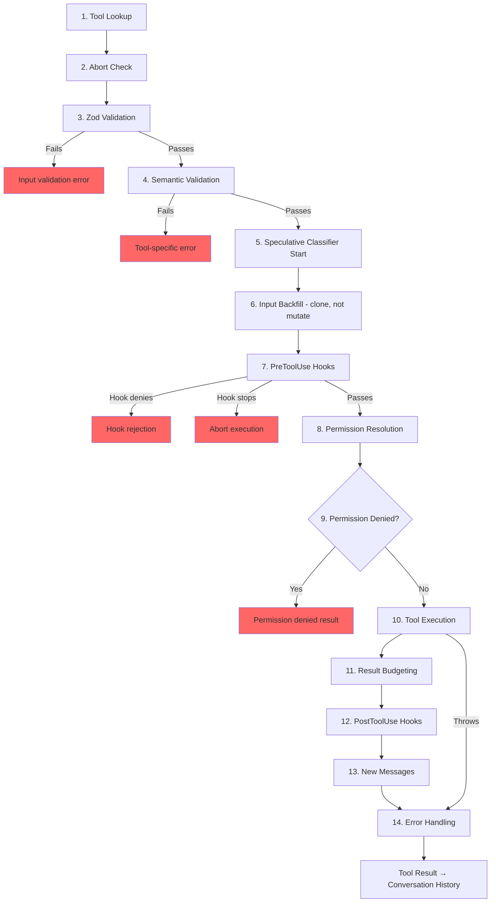

# Chương 6: Tools -- Từ định nghĩa đến thực thi

## Hệ Thần Kinh

Chương 5 đã cho bạn thấy agent loop -- `while(true)` stream phản hồi model, thu thập tool calls, và đưa kết quả ngược lại. Vòng lặp là nhịp tim. Nhưng nhịp tim không có ý nghĩa nếu thiếu hệ thần kinh dịch "model muốn chạy `git status`" thành một shell command thực sự, với kiểm tra quyền, budgeting kết quả, và xử lý lỗi.

Tool system chính là hệ thần kinh đó. Nó trải rộng qua hơn 40 implementation tool, một registry tập trung có feature-flag gating, một execution pipeline 14 bước, một permission resolver với bảy mode, và một streaming executor khởi chạy tool trước khi model hoàn tất phản hồi.

Mọi tool call trong Claude Code -- mọi lần đọc file, mọi shell command, mọi grep, mọi lần dispatch sub-agent -- đều đi qua cùng một pipeline. Tính đồng nhất mới là điểm mấu chốt: dù tool là Bash executor built-in hay MCP server bên thứ ba, nó nhận cùng validation, cùng permission checks, cùng result budgeting, cùng error classification.

`Tool` interface có khoảng 45 thành viên. Nghe có vẻ choáng, nhưng chỉ năm cái quan trọng để hiểu hệ thống vận hành ra sao:

1. **`call()`** -- thực thi tool
2. **`inputSchema`** -- validate và parse input
3. **`isConcurrencySafe()`** -- có thể chạy song song không?
4. **`checkPermissions()`** -- có được phép không?
5. **`validateInput()`** -- input này có hợp lý về mặt ngữ nghĩa không?

Mọi thứ còn lại -- 12 phương thức render, analytics hooks, search hints -- tồn tại để hỗ trợ các lớp UI và telemetry. Bắt đầu với năm cái này, phần còn lại sẽ vào đúng chỗ.

---

## Tool Interface

### Ba Type Parameters

Mỗi tool được tham số hóa theo ba type:

```typescript
Tool<Input extends AnyObject, Output, P extends ToolProgressData>
```

`Input` là một Zod object schema kiêm hai vai trò: nó tạo JSON Schema gửi lên API (để model biết cần cung cấp tham số nào), và validate phản hồi của model tại runtime qua `safeParse`. `Output` là TypeScript type của kết quả tool. `P` là type của progress event mà tool phát ra trong lúc chạy -- BashTool phát các chunk stdout, GrepTool phát số lượng match, AgentTool phát transcript của sub-agent.

### buildTool() và Fail-Closed Defaults (mặc định đóng-an-toàn)

Không có định nghĩa tool nào trực tiếp dựng một `Tool` object. Mọi tool đều đi qua `buildTool()`, một factory trải một object mặc định bên dưới định nghĩa riêng của tool:

```typescript
// Pseudocode — illustrates the fail-closed defaults pattern
const SAFE_DEFAULTS = {
  isEnabled:         () => true,
  isParallelSafe:    () => false,   // Fail-closed: new tools run serially
  isReadOnly:        () => false,   // Fail-closed: treated as writes
  isDestructive:     () => false,
  checkPermissions:  (input) => ({ behavior: 'allow', updatedInput: input }),
}

function buildTool(definition) {
  return { ...SAFE_DEFAULTS, ...definition }  // Definition overrides defaults
}
```

Các giá trị mặc định được chủ đích thiết kế theo hướng fail-closed ở những chỗ quan trọng với an toàn. Một tool mới quên triển khai `isConcurrencySafe` sẽ mặc định `false` -- chạy tuần tự, không bao giờ song song. Một tool quên `isReadOnly` sẽ mặc định `false` -- hệ thống coi nó là thao tác ghi. Một tool quên `toAutoClassifierInput` sẽ trả chuỗi rỗng -- auto-mode security classifier bỏ qua nó, nghĩa là hệ thống permission tổng quát sẽ xử lý thay vì được tự động bỏ qua.

Giá trị mặc định duy nhất *không* fail-closed là `checkPermissions`, vốn trả `allow`. Điều này nhìn có vẻ ngược cho đến khi bạn hiểu mô hình phân tầng quyền hạn: `checkPermissions` là logic riêng theo tool chạy *sau khi* hệ thống permission tổng quát đã đánh giá rules, hooks, và mode-based policies. Một tool trả `allow` từ `checkPermissions` nghĩa là "tôi không có phản đối riêng ở cấp tool" -- không phải cấp quyền toàn cục. Việc gom thành các sub-object (`options`, các field được đặt tên như `readFileState`) cung cấp cấu trúc tương đương các interface tập trung, nhưng không cần nghi thức khai báo, triển khai, và luồn năm interface tách biệt qua hơn 40 call site.

### Concurrency phụ thuộc vào Input

Chữ ký `isConcurrencySafe(input: z.infer<Input>): boolean` nhận parsed input vì cùng một tool có thể an toàn với input này nhưng không an toàn với input khác. BashTool là ví dụ kinh điển: `ls -la` là read-only và concurrency-safe, nhưng `rm -rf /tmp/build` thì không. Tool parse command, phân loại từng subcommand theo các tập known-safe, và chỉ trả `true` khi mọi phần không trung tính đều là thao tác search hoặc read.

### ToolResult Return Type

Mọi `call()` trả về `ToolResult<T>`:

```typescript
type ToolResult<T> = {
  data: T
  newMessages?: (UserMessage | AssistantMessage | AttachmentMessage | SystemMessage)[]
  contextModifier?: (context: ToolUseContext) => ToolUseContext
}
```

`data` là output có kiểu được serialize thành content block `tool_result` của API. `newMessages` cho phép tool chèn thêm message vào hội thoại -- AgentTool dùng nó để thêm transcript của sub-agent. `contextModifier` là hàm biến đổi `ToolUseContext` cho các tool tiếp theo -- đây là cách `EnterPlanMode` chuyển permission mode. Context modifiers chỉ được tôn trọng cho các tool không concurrency-safe; nếu tool chạy song song, modifier của nó được xếp hàng đến khi batch hoàn tất.

---

## ToolUseContext: The God Object (đối tượng ôm đồm)

`ToolUseContext` là túi context khổng lồ được luồn qua mọi tool call. Nó có khoảng 40 field. Theo hầu như mọi định nghĩa hợp lý, đây là một god object. Nó tồn tại vì phương án thay thế còn tệ hơn.

Một tool như BashTool cần abort controller, file state cache, app state, message history, tool set, MCP connections, và nửa tá callback UI. Nếu luồn thành tham số rời, chữ ký hàm sẽ có hơn 15 đối số. Lời giải thực dụng là một context object duy nhất, được nhóm theo mối quan tâm:

**Configuration** (sub-object `options`): Tool set, model name, MCP connections, debug flags. Đặt một lần khi query bắt đầu, gần như bất biến.

**Execution state**: `abortController` để hủy, `readFileState` cho LRU file cache, `messages` cho toàn bộ lịch sử hội thoại. Các phần này thay đổi trong khi thực thi.

**UI callbacks**: `setToolJSX`, `addNotification`, `requestPrompt`. Chỉ được nối trong ngữ cảnh interactive (REPL). SDK và headless mode để chúng là undefined.

**Agent context**: `agentId`, `renderedSystemPrompt` (parent prompt đã đóng băng cho fork sub-agents -- render lại có thể lệch do feature flag warm-up và làm vỡ cache).

Biến thể sub-agent của `ToolUseContext` đặc biệt hé lộ nhiều điều. Khi `createSubagentContext()` dựng context cho child agent, nó đưa ra các lựa chọn có chủ đích về field nào dùng chung và field nào cô lập: `setAppState` thành no-op cho async agents, `localDenialTracking` nhận object mới, `contentReplacementState` được clone từ parent. Mỗi lựa chọn mã hóa một bài học rút ra từ bug production.

---

## Registry

### getAllBaseTools(): The Single Source of Truth (nguồn sự thật duy nhất)

Hàm `getAllBaseTools()` trả về danh sách đầy đủ của mọi tool có thể tồn tại trong process hiện tại. Các tool luôn có mặt đứng trước, sau đó là các tool đưa vào có điều kiện theo feature flags:

```typescript
const SleepTool = feature('PROACTIVE') || feature('KAIROS')
  ? require('./tools/SleepTool/SleepTool.js').SleepTool
  : null
```

Import `feature()` từ `bun:bundle` được resolve tại bundle time. Khi `feature('AGENT_TRIGGERS')` tĩnh là false, bundler loại bỏ toàn bộ lệnh `require()` -- dead code elimination giúp binary gọn.

### assembleToolPool(): Hợp nhất Built-in và MCP Tools

Bộ tool cuối cùng đến model được tạo từ `assembleToolPool()`:

1. Lấy built-in tools (với deny-rule filtering, REPL mode hiding, và `isEnabled()` checks)
2. Lọc MCP tools theo deny rules
3. Sort từng partition theo alphabet theo tên
4. Nối built-ins (prefix) + MCP tools (suffix)

Sort-then-concatenate approach (cách tiếp cận sắp xếp-rồi-nối) không phải sở thích thẩm mỹ. API server đặt một prompt-cache breakpoint sau built-in tool cuối cùng. Một lần sort phẳng qua toàn bộ tools sẽ trộn MCP tools vào danh sách built-in, và việc thêm hoặc bớt một MCP tool sẽ làm xê dịch vị trí built-in tools, khiến cache mất hiệu lực.

---

## Execution Pipeline 14 Bước

Hàm `checkPermissionsAndCallTool()` là nơi ý định biến thành hành động. Mọi tool call đi qua 14 bước này.



### Bước 1-4: Validation

**Tool Lookup** fallback sang `getAllBaseTools()` để match alias, xử lý transcript từ session cũ nơi tool đã đổi tên. **Abort Check** ngăn lãng phí tính toán với tool calls đã xếp hàng trước khi Ctrl+C lan truyền. **Zod Validation** bắt lỗi lệch kiểu; với deferred tools, thông báo lỗi thêm gợi ý gọi ToolSearch trước. **Semantic Validation** đi xa hơn schema conformance -- FileEditTool từ chối edit no-op, BashTool chặn `sleep` đơn lẻ khi MonitorTool có sẵn.

### Bước 5-6: Preparation

**Speculative Classifier Start** khởi động song song auto-mode security classifier cho Bash commands, tiết kiệm hàng trăm mili-giây trên đường đi phổ biến. **Input Backfill** clone parsed input và thêm các field suy diễn (mở rộng `~/foo.txt` thành đường dẫn tuyệt đối) cho hooks và permissions, đồng thời giữ nguyên bản gốc để transcript ổn định.

### Bước 7-9: Permission

**PreToolUse Hooks** là cơ chế mở rộng -- chúng có thể ra quyết định quyền, sửa input, chèn context, hoặc dừng hẳn thực thi. **Permission Resolution** nối hooks với hệ permission tổng quát: nếu hook đã quyết định thì đó là kết luận cuối; nếu chưa, `canUseTool()` kích hoạt rule matching, checks riêng theo tool, mode-based defaults, và prompt tương tác. **Permission Denied Handling** dựng thông báo lỗi và chạy hooks `PermissionDenied`.

### Bước 10-14: Execution và Cleanup

**Tool Execution** chạy `call()` thực sự với input gốc. **Result Budgeting** lưu output quá lớn vào `~/.claude/tool-results/{hash}.txt` và thay bằng preview. **PostToolUse Hooks** có thể sửa MCP output hoặc chặn tiếp tục. **New Messages** được nối thêm (sub-agent transcripts, system reminders). **Error Handling** phân loại lỗi cho telemetry, trích chuỗi an toàn từ các tên có thể bị làm rối, và phát OTel events.

---

## Permission System

### Bảy Modes

| Mode | Behavior |
|------|----------|
| `default` | Checks theo tool; hỏi người dùng với thao tác không nhận diện |
| `acceptEdits` | Tự động cho phép chỉnh sửa file; hỏi cho thao tác khác |
| `plan` | Read-only -- từ chối mọi thao tác ghi |
| `dontAsk` | Tự động từ chối mọi thứ bình thường sẽ cần hỏi (background agents) |
| `bypassPermissions` | Cho phép mọi thứ không cần hỏi |
| `auto` | Dùng transcript classifier để quyết định (feature-flagged) |
| `bubble` | Mode nội bộ cho sub-agents để escalates lên parent |

### Resolution Chain

Khi một tool call đi đến permission resolution:

1. **Hook decision**: Nếu một PreToolUse hook đã trả `allow` hoặc `deny`, đó là kết quả cuối.
2. **Rule matching**: Ba tập rules -- `alwaysAllowRules`, `alwaysDenyRules`, `alwaysAskRules` -- match theo tên tool và mẫu nội dung tùy chọn. `Bash(git *)` match mọi Bash command bắt đầu bằng `git`.
3. **Tool-specific check**: Phương thức `checkPermissions()` của tool. Phần lớn trả `passthrough`.
4. **Mode-based default**: `bypassPermissions` cho phép mọi thứ. `plan` từ chối ghi. `dontAsk` từ chối prompt.
5. **Interactive prompt**: Trong mode `default` và `acceptEdits`, các quyết định chưa ngã ngũ sẽ hiện prompt.
6. **Auto-mode classifier**: Classifier hai tầng (model nhanh, sau đó extended thinking cho các trường hợp mơ hồ).

Biến thể `safetyCheck` có boolean `classifierApprovable`: chỉnh sửa `.claude/` và `.git/` có `classifierApprovable: true` (bất thường nhưng đôi lúc hợp lệ), trong khi các nỗ lực bypass đường dẫn Windows có `classifierApprovable: false` (hầu như luôn mang tính đối kháng).

### Permission Rules và Matching

Permission rules được lưu dưới dạng các object `PermissionRule` với ba phần: một `source` theo dõi provenance (userSettings, projectSettings, localSettings, cliArg, policySettings, session, v.v.), một `ruleBehavior` (allow, deny, ask), và một `ruleValue` với tên tool cùng mẫu nội dung tùy chọn.

Field `ruleContent` cho phép matching tinh-granular. `Bash(git *)` cho phép mọi Bash command bắt đầu bằng `git`. `Edit(/src/**)` cho phép edit chỉ trong `/src`. `Fetch(domain:example.com)` cho phép fetch từ một domain cụ thể. Rules không có `ruleContent` sẽ match mọi lần gọi tool đó.

Permission matcher của BashTool parse command qua `parseForSecurity()` (một bash AST parser) và tách command tổ hợp thành các subcommands. Nếu AST parsing thất bại (cú pháp phức tạp với heredocs hoặc nested subshells), matcher trả `() => true` -- fail-safe, nghĩa là hook luôn chạy. Giả định ở đây: nếu command quá phức tạp để parse đáng tin, thì cũng quá phức tạp để tự tin loại khỏi safety checks.

### Bubble Mode cho Sub-Agents

Sub-agents trong các mô hình coordinator-worker không thể hiện permission prompts -- chúng không có terminal. `bubble` mode khiến permission requests lan ngược lên parent context. Coordinator agent, chạy ở main thread với quyền truy cập terminal, xử lý prompt và gửi quyết định ngược xuống.

---

## Tool Deferred Loading

Các tools với `shouldDefer: true` được gửi lên API với `defer_loading: true` -- có tên và mô tả nhưng không có đầy đủ parameter schemas. Điều này giảm kích thước prompt ban đầu. Để dùng một deferred tool, model phải gọi `ToolSearchTool` trước để nạp schema của nó. Failure mode rất giàu thông tin: gọi deferred tool khi chưa nạp sẽ làm Zod validation thất bại (mọi tham số có kiểu đều đến dưới dạng string), và hệ thống thêm một recovery hint đúng trọng tâm.

Deferred loading cũng cải thiện cache hit rate: tools gửi với `defer_loading: true` chỉ đóng góp tên vào prompt, nên thêm hoặc bớt một deferred MCP tool chỉ làm prompt đổi vài token thay vì hàng trăm.

---

## Result Budgeting

### Giới hạn kích thước theo Tool

Mỗi tool khai báo `maxResultSizeChars`:

| Tool | maxResultSizeChars | Rationale |
|------|-------------------|-----------|
| BashTool | 30,000 | Đủ cho phần lớn output hữu ích |
| FileEditTool | 100,000 | Diffs có thể lớn nhưng model cần chúng |
| GrepTool | 100,000 | Kết quả tìm kiếm với context lines tăng rất nhanh |
| FileReadTool | Infinity | Tự giới hạn bằng token limits riêng; persist sẽ tạo vòng lặp Read tuần hoàn |

Khi kết quả vượt ngưỡng, toàn bộ nội dung được lưu xuống đĩa và thay bằng wrapper `<persisted-output>` chứa preview cùng đường dẫn file. Khi cần, model có thể dùng `Read` để truy cập output đầy đủ.

### Ngân sách tổng hợp theo hội thoại

Ngoài giới hạn theo từng tool, `ContentReplacementState` theo dõi ngân sách tổng hợp trên toàn hội thoại, ngăn kiểu "chết vì nghìn vết cắt" -- nhiều tool mỗi cái trả 90% giới hạn riêng vẫn có thể làm tràn context window.

---

## Điểm nhấn của từng Tool

### BashTool: Tool phức tạp nhất

BashTool là tool phức tạp nhất hệ thống, vượt xa phần còn lại. Nó parse compound commands, phân loại subcommands là read-only hay write, quản lý background tasks, phát hiện image output qua magic bytes, và triển khai sed simulation cho preview edit an toàn.

Phần parse compound command đặc biệt thú vị. `splitCommandWithOperators()` tách một command như `cd /tmp && mkdir build && ls build` thành các subcommand riêng. Mỗi phần được phân loại theo các tập lệnh known-safe (`BASH_SEARCH_COMMANDS`, `BASH_READ_COMMANDS`, `BASH_LIST_COMMANDS`). Một compound command chỉ là read-only nếu TẤT CẢ phần không trung tính đều an toàn. Tập trung tính (echo, printf) bị bỏ qua -- chúng không làm command trở thành read-only, nhưng cũng không biến nó thành write-only.

Sed simulation (`_simulatedSedEdit`) đáng được chú ý riêng. Khi người dùng phê duyệt một sed command trong permission dialog, hệ thống tính trước kết quả bằng cách chạy sed command trong sandbox và chụp output. Kết quả tính trước được chèn vào input dưới dạng `_simulatedSedEdit`. Khi `call()` thực thi, nó áp dụng edit trực tiếp, bỏ qua shell execution. Điều này đảm bảo thứ người dùng đã preview chính xác là thứ được ghi ra -- không phải chạy lại có thể cho kết quả khác nếu file đã đổi giữa lúc preview và lúc thực thi.

### FileEditTool: Staleness Detection (phát hiện dữ liệu cũ)

FileEditTool tích hợp với `readFileState`, LRU cache của nội dung file và timestamp được duy trì xuyên suốt hội thoại. Trước khi áp dụng edit, nó kiểm tra liệu file có bị sửa kể từ lần model đọc gần nhất hay không. Nếu file đã stale -- bị sửa bởi background process, tool khác, hoặc người dùng -- edit bị từ chối kèm thông báo yêu cầu model đọc lại file trước.

Fuzzy matching trong `findActualString()` xử lý trường hợp thường gặp khi model sai nhẹ khoảng trắng. Nó chuẩn hóa whitespace và kiểu dấu nháy trước khi match, nên một edit nhắm vào `old_string` với trailing spaces vẫn match được nội dung thật của file. Cờ `replace_all` cho phép thay thế hàng loạt; nếu không có cờ này, match không duy nhất sẽ bị từ chối, buộc model cung cấp đủ ngữ cảnh để xác định đúng một vị trí.

### FileReadTool: Bộ đọc đa năng

FileReadTool là built-in tool duy nhất có `maxResultSizeChars: Infinity`. Nếu output của Read bị persist xuống đĩa, model sẽ cần Read file đã persist đó, mà bản thân file này có thể lại vượt giới hạn, tạo vòng lặp vô hạn. Thay vào đó, tool tự giới hạn bằng ước lượng token và cắt ngay tại nguồn.

Tool này cực kỳ linh hoạt: đọc text files kèm line numbers, images (trả về base64 multimodal content blocks), PDFs (qua `extractPDFPages()`), Jupyter notebooks (qua `readNotebook()`), và directories (fallback sang `ls`). Nó chặn các device path nguy hiểm (`/dev/zero`, `/dev/random`, `/dev/stdin`) và xử lý các khác biệt tên file screenshot trên macOS (U+202F narrow no-break space so với dấu cách thường trong tên "Screen Shot").

### GrepTool: Phân trang qua head_limit

GrepTool bọc `ripGrep()` và thêm cơ chế phân trang qua `head_limit`. Mặc định là 250 mục -- đủ hữu ích nhưng vẫn nhỏ để tránh phình context. Khi có cắt bớt, phản hồi gồm `appliedLimit: 250`, báo cho model dùng `offset` ở lần gọi sau để phân trang. Thiết lập tường minh `head_limit: 0` sẽ tắt hoàn toàn giới hạn.

GrepTool tự động loại trừ sáu thư mục VCS (`.git`, `.svn`, `.hg`, `.bzr`, `.jj`, `.sl`). Tìm trong `.git/objects` gần như không bao giờ là điều model thực sự muốn, và vô tình kéo theo binary pack files sẽ làm nổ token budget.

### AgentTool và Context Modifiers

AgentTool spawn sub-agents chạy query loop riêng. `call()` của nó trả `newMessages` chứa transcript của sub-agent, và tùy chọn một `contextModifier` để truyền thay đổi trạng thái về parent. Vì AgentTool mặc định không concurrency-safe, nhiều Agent tool calls trong một phản hồi sẽ chạy tuần tự -- context modifier của mỗi sub-agent được áp dụng trước khi sub-agent tiếp theo bắt đầu. Ở coordinator mode, mô hình này đảo chiều: coordinator dispatch sub-agents cho các tác vụ độc lập, và kiểm tra `isAgentSwarmsEnabled()` mở khóa thực thi agent song song.

---

## Cách Tools tương tác với Message History

Kết quả tool không chỉ đơn giản trả dữ liệu cho model. Chúng tham gia vào hội thoại dưới dạng các message có cấu trúc.

API mong đợi kết quả tool ở dạng các object `ToolResultBlockParam` tham chiếu tới block `tool_use` gốc bằng ID. Đa số tools serialize thành text. FileReadTool có thể serialize thành image content blocks (base64-encoded) cho phản hồi multimodal. BashTool phát hiện image output bằng cách kiểm tra magic bytes trong stdout và chuyển sang image blocks tương ứng.

`ToolResult.newMessages` là cách tools mở rộng hội thoại vượt khỏi mẫu call-and-response đơn giản. **Agent transcripts**: AgentTool chèn message history của sub-agent dưới dạng attachment messages. **System reminders**: Memory tools chèn system messages xuất hiện sau kết quả tool -- model nhìn thấy ở lượt kế tiếp nhưng bị strip ở ranh giới `normalizeMessagesForAPI`. **Attachment messages**: Kết quả hook, ngữ cảnh bổ sung, và chi tiết lỗi mang metadata có cấu trúc để model tham chiếu ở các lượt sau.

Hàm `contextModifier` là cơ chế cho các tools thay đổi môi trường thực thi. Khi `EnterPlanMode` chạy, nó trả một modifier đặt permission mode thành `'plan'`. Khi `ExitWorktree` chạy, nó sửa working directory. Các modifier này là con đường duy nhất để một tool tác động đến các tool sau đó -- đột biến trực tiếp `ToolUseContext` là không thể vì context được spread-copy trước mỗi tool call. Ràng buộc serial-only được tầng orchestration cưỡng chế: nếu hai tool chạy đồng thời đều sửa working directory, ai thắng?

---

## Apply This: Thiết kế một Tool System

**Fail-closed defaults (mặc định đóng-an-toàn).** Tool mới nên bảo thủ cho đến khi được đánh dấu rõ ràng theo hướng khác. Một developer quên đặt cờ sẽ nhận hành vi an toàn, không phải hành vi nguy hiểm.

**Input-dependent safety (an toàn phụ thuộc input).** `isConcurrencySafe(input)` và `isReadOnly(input)` nhận parsed input vì cùng một tool với input khác nhau sẽ có hồ sơ an toàn khác nhau. Một tool registry đánh dấu BashTool là "luôn tuần tự" thì đúng nhưng lãng phí.

**Layer your permissions (phân lớp quyền hạn).** Checks riêng theo tool, rule-based matching, mode-based defaults, interactive prompts, và automated classifiers mỗi cái xử lý một lớp trường hợp khác nhau. Không cơ chế đơn lẻ nào đủ.

**Budget results, not just inputs (budget cho kết quả, không chỉ đầu vào).** Giới hạn token cho input là chuẩn. Nhưng kết quả tool có thể lớn tùy ý và tích lũy qua nhiều lượt. Giới hạn theo tool chặn các vụ nổ đơn lẻ. Giới hạn tổng hợp theo hội thoại chặn tràn tích lũy.

**Make error classification telemetry-safe (làm phân loại lỗi an toàn cho telemetry).** Trong bản build đã minify, `error.constructor.name` bị làm rối. Hàm `classifyToolError()` trích chuỗi an toàn nhiều thông tin nhất có thể -- telemetry-safe messages, errno codes, stable error names -- mà không bao giờ ghi log raw error message vào analytics.

---

## Tiếp theo là gì

Chương này đã lần theo cách một tool call đi từ định nghĩa qua validation, permission, execution, rồi result budgeting. Nhưng model hiếm khi chỉ yêu cầu một tool mỗi lần. Cách các tool được điều phối thành các batch đồng thời là chủ đề của Chương 7.
