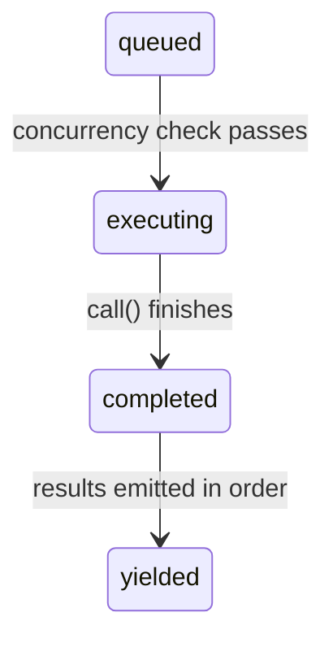

# Chương 7: Thực thi Công cụ Đồng thời

## Cái Giá Của Việc Chờ

Chương 6 đã lần theo vòng đời của một lệnh gọi công cụ đơn lẻ -- từ khối `tool_use` thô trong phản hồi API, qua xác thực đầu vào, kiểm tra quyền, thực thi, và định dạng kết quả. Pipeline đó xử lý một công cụ. Nhưng mô hình hiếm khi chỉ yêu cầu một.

Một tương tác Claude Code điển hình bao gồm ba đến năm lệnh gọi công cụ mỗi lượt. "Đọc hai file này, grep mẫu này, rồi sửa hàm này." Mô hình phát toàn bộ các yêu cầu đó trong một phản hồi duy nhất. Nếu mỗi công cụ mất 200 mili giây, chạy tuần tự sẽ tốn trọn một giây. Nếu các lệnh gọi Read và Grep độc lập -- và đúng là như vậy -- chạy song song cắt xuống còn 200 mili giây. Cải thiện năm-trên-một, miễn phí.

Nhưng không phải mọi công cụ đều độc lập. Một lệnh Edit sửa `config.ts` không thể chạy đồng thời với một lệnh Edit khác cũng sửa `config.ts`. Một lệnh Bash tạo thư mục phải hoàn tất trước lệnh Bash ghi file vào thư mục đó. Đồng thời hóa không phải thuộc tính toàn cục của một công cụ. Nó là thuộc tính của một lần gọi công cụ cụ thể với đầu vào cụ thể.

Đây là insight dẫn dắt toàn bộ hệ thống đồng thời: **safety là theo từng lệnh gọi, không theo loại công cụ**. `Bash("ls -la")` an toàn để song song hóa. `Bash("rm -rf build/")` thì không. Cùng một công cụ, đầu vào khác nhau, phân loại đồng thời khác nhau. Hệ thống phải kiểm tra đầu vào trước khi quyết định.

Claude Code triển khai hai lớp tối ưu đồng thời. Lớp thứ nhất là **batch orchestration** (điều phối theo lô): sau khi phản hồi của mô hình được nhận đầy đủ, phân hoạch các lệnh gọi công cụ thành nhóm đồng thời và nhóm tuần tự, rồi thực thi từng nhóm theo cách phù hợp. Lớp thứ hai là **speculative execution** (thực thi suy đoán): bắt đầu chạy công cụ *khi mô hình vẫn đang stream phản hồi*, thu hoạch kết quả trước cả khi phản hồi hoàn tất. Kết hợp lại, hai cơ chế này loại bỏ phần lớn thời gian treo tường vốn bị mất vì chờ đợi.

---

## Thuật Toán Phân Hoạch

Điểm vào là `partitionToolCalls()` trong `toolOrchestration.ts`. Hàm này nhận một mảng có thứ tự các message `ToolUseBlock` và tạo ra một mảng các batch, trong đó mỗi batch либо là "toàn bộ an toàn-đồng thời" hoặc "một công cụ tuần tự duy nhất".

```typescript
// Pseudocode — illustrates the partition algorithm
type Group = { parallel: boolean; calls: ToolCall[] }

function groupBySafety(calls: ToolCall[], registry: ToolRegistry): Group[] {
  return calls.reduce((groups, call) => {
    const def = registry.lookup(call.name)
    const input = def?.schema.safeParse(call.input)
    // Fail-closed: parse failure or exception → serial
    const safe = input?.success
      ? tryCatch(() => def.isParallelSafe(input.data), false)
      : false
    // Merge consecutive safe calls into one group
    if (safe && groups.at(-1)?.parallel) {
      groups.at(-1)!.calls.push(call)
    } else {
      groups.push({ parallel: safe, calls: [call] })
    }
    return groups
  }, [] as Group[])
}
```

Thuật toán đi qua mảng từ trái sang phải. Với mỗi lệnh gọi công cụ:

1. **Tra cứu định nghĩa công cụ** theo tên.
2. **Parse đầu vào** bằng schema Zod của công cụ qua `safeParse()`. Nếu parse thất bại, công cụ sẽ được phân loại bảo thủ là không an toàn cho đồng thời.
3. **Gọi `isConcurrencySafe(parsedInput)`** trên định nghĩa công cụ. Đây là nơi diễn ra phân loại theo từng đầu vào. Công cụ Bash parse chuỗi lệnh, kiểm tra liệu mọi subcommand có chỉ đọc (`ls`, `grep`, `cat`, `git status`) hay không, và chỉ trả về `true` nếu toàn bộ lệnh ghép là đọc thuần. Công cụ Read luôn trả về `true`. Công cụ Edit luôn trả về `false`. Lệnh gọi này được bọc trong try-catch -- nếu `isConcurrencySafe` ném lỗi (ví dụ chuỗi lệnh Bash không parse được bởi thư viện shell-quote), công cụ mặc định chạy tuần tự.
4. **Gộp hoặc tạo batch.** Nếu công cụ hiện tại an toàn-đồng thời VÀ batch gần nhất cũng an toàn-đồng thời, thêm vào batch đó. Nếu không, bắt đầu batch mới.

Kết quả là một chuỗi batch xen kẽ giữa nhóm đồng thời và các mục tuần tự đơn lẻ. Xem qua ví dụ cụ thể:

```
Model requests: [Read, Read, Grep, Edit, Read]

Step 1: Read  → concurrent-safe → new batch {safe, [Read]}
Step 2: Read  → concurrent-safe → append   {safe, [Read, Read]}
Step 3: Grep  → concurrent-safe → append   {safe, [Read, Read, Grep]}
Step 4: Edit  → NOT safe        → new batch {serial, [Edit]}
Step 5: Read  → concurrent-safe → new batch {safe, [Read]}

Result: 3 batches
  Batch 1: [Read, Read, Grep]  — run concurrently
  Batch 2: [Edit]              — run alone
  Batch 3: [Read]              — run concurrently (just one tool)
```

Phân hoạch là tham lam và giữ nguyên thứ tự. Các công cụ an toàn liên tiếp sẽ tích lũy vào một batch duy nhất. Bất kỳ công cụ không an toàn nào cũng cắt chuỗi và mở batch mới. Điều này có nghĩa thứ tự mô hình phát ra lệnh gọi công cụ là quan trọng -- nếu nó chen một Write vào giữa hai Read, bạn sẽ có ba batch thay vì hai. Trên thực tế, mô hình thường gom các lệnh đọc lại với nhau, là trường hợp phổ biến mà thuật toán được tối ưu cho.

---

## Thực Thi Theo Lô

Generator `runTools()` lặp qua các batch đã phân hoạch và điều phối từng batch sang executor phù hợp.

### Concurrent Batches

Với một batch đồng thời, `runToolsConcurrently()` kích hoạt toàn bộ công cụ song song bằng tiện ích `all()` có giới hạn số generator đang hoạt động theo ngưỡng đồng thời:

```typescript
// Pseudocode — illustrates the concurrent dispatch pattern
async function* dispatchParallel(calls, context) {
  yield* boundedAll(
    calls.map(async function* (call) {
      context.markInProgress(call.id)
      yield* executeSingle(call, context)
      context.markComplete(call.id)
    }),
    MAX_CONCURRENCY,  // Default: 10
  )
}
```

Giới hạn đồng thời mặc định là 10, cấu hình qua `CLAUDE_CODE_MAX_TOOL_USE_CONCURRENCY`. Mười là khá rộng -- hiếm khi thấy hơn năm hoặc sáu lệnh gọi công cụ trong một phản hồi mô hình. Giới hạn này tồn tại như van an toàn cho các trường hợp bệnh lý, không phải ràng buộc thường gặp.

Tiện ích `all()` là một biến thể nhận biết generator của `Promise.all` với đồng thời bị chặn. Nó khởi chạy tối đa N generator cùng lúc, yield kết quả từ cái nào hoàn tất trước, và khởi động generator xếp hàng kế tiếp mỗi khi một cái kết thúc. Cơ chế tương tự pool tác vụ có semaphore, nhưng được điều chỉnh cho async generator có thể yield kết quả trung gian.

**Context modifier queuing** là phần tinh tế. Một số công cụ tạo ra *context modifiers* -- các hàm biến đổi `ToolUseContext` cho các công cụ tiếp theo. Khi công cụ chạy đồng thời, bạn không thể áp dụng các modifier này ngay vì các công cụ khác trong cùng batch đang đọc cùng context. Thay vào đó, modifiers được gom vào một map khóa theo tool use ID:

```typescript
const queuedContextModifiers: Record<
  string,
  ((context: ToolUseContext) => ToolUseContext)[]
> = {}
```

Sau khi toàn bộ batch đồng thời kết thúc, modifiers được áp dụng theo thứ tự công cụ (không theo thứ tự hoàn tất), giữ cho sự tiến hóa context có tính quyết định:

```typescript
for (const block of blocks) {
  const modifiers = queuedContextModifiers[block.id]
  if (!modifiers) continue
  for (const modifier of modifiers) {
    currentContext = modifier(currentContext)
  }
}
```

Trên thực tế, không có công cụ an toàn-đồng thời hiện tại nào tạo context modifiers -- comment trong codebase nói rõ điều này. Nhưng hạ tầng đã có sẵn vì công cụ có thể được thêm bởi MCP servers, và một công cụ MCP chỉ-đọc tùy biến hoàn toàn có thể muốn sửa context (ví dụ cập nhật tập "files seen").

### Serial Batches

Thực thi tuần tự thì đơn giản. Mỗi công cụ chạy, context modifiers của nó được áp dụng ngay, và công cụ kế tiếp thấy context đã cập nhật:

```typescript
for (const toolUse of toolUseMessages) {
  for await (const update of runToolUse(toolUse, /* ... */)) {
    if (update.contextModifier) {
      currentContext = update.contextModifier.modifyContext(currentContext)
    }
    yield { message: update.message, newContext: currentContext }
  }
}
```

Đây là khác biệt then chốt. Công cụ tuần tự có thể thay đổi thế giới cho các công cụ sau. Một Edit sửa file; Read tiếp theo thấy phiên bản đã sửa. Một lệnh Bash tạo thư mục; lệnh Bash tiếp theo ghi vào đó. Context modifiers là hình thức hóa của phụ thuộc này: chúng cho phép công cụ nói "môi trường thực thi đã thay đổi, đây là cách thay đổi đó.".

---

## Streaming Tool Executor

Điều phối theo lô loại bỏ tuần tự hóa không cần thiết *sau khi* phản hồi mô hình đến nơi. Nhưng còn một cơ hội lớn hơn: phản hồi của mô hình cần thời gian để stream. Một phản hồi đa-công-cụ điển hình có thể mất 2-3 giây để đến đầy đủ. Lệnh gọi công cụ đầu tiên có thể parse sau 500 mili giây. Tại sao phải chờ thêm 2 giây còn lại?

Lớp `StreamingToolExecutor` triển khai thực thi suy đoán. Khi mô hình stream phản hồi, mỗi khối `tool_use` được chuyển cho executor ngay khi parse xong đầy đủ. Executor lập tức chạy nó -- trong khi mô hình vẫn đang tạo lệnh gọi công cụ kế tiếp. Đến lúc phản hồi stream xong, có thể vài công cụ đã hoàn tất.

```mermaid
gantt
    title Sequential vs Streaming Tool Execution
    dateFormat X
    axisFormat %Ls

    section Sequential
    Model streams response     :a1, 0, 2500
    Tool 1 (0.2s)              :a2, after a1, 200
    Tool 2 (0.3s)              :a3, after a2, 300
    Tool 3 (0.1s)              :a4, after a3, 100

    section Streaming Executor
    Model streams response     :b1, 0, 2500
    Tool 1 starts at 0.5s      :b2, 500, 700
    Tool 2 starts at 1.2s      :b3, 1200, 1500
    Tool 3 drain after stream  :b4, 2500, 2600
```



Tổng tuần tự: 3.1s. Tổng streaming: 2.6s -- công cụ 1 và 2 hoàn tất trong lúc stream, tiết kiệm 16% thời gian treo tường.

Mức tiết kiệm còn cộng dồn. Khi mô hình yêu cầu năm công cụ chỉ-đọc và phản hồi mất 3 giây để stream, cả năm công cụ có thể bắt đầu và hoàn tất trong 3 giây đó. Giai đoạn drain sau stream không còn gì để làm. Người dùng thấy kết quả gần như ngay sau ký tự cuối cùng của phản hồi mô hình.

### Tool Lifecycle

Mỗi công cụ được executor theo dõi sẽ đi qua bốn trạng thái:



- **queued**: Khối `tool_use` đã được parse và đăng ký. Đang chờ điều kiện đồng thời cho phép thực thi.
- **executing**: Hàm `call()` của công cụ đang chạy. Kết quả được tích lũy vào buffer.
- **completed**: Thực thi đã xong. Kết quả sẵn sàng để yield vào hội thoại.
- **yielded**: Kết quả đã được phát ra. Trạng thái kết thúc.

### addTool(): Queuing During the Stream

```typescript
addTool(block: ToolUseBlock, assistantMessage: AssistantMessage): void
```

Được parser phản hồi streaming gọi mỗi lần một khối `tool_use` hoàn chỉnh đi tới. Phương thức này:

1. Tra cứu định nghĩa công cụ. Nếu không tìm thấy, lập tức tạo một entry `completed` với thông báo lỗi -- không có lý do để xếp hàng một công cụ không tồn tại.
2. Parse đầu vào và xác định `isConcurrencySafe` bằng cùng logic với `partitionToolCalls()`.
3. Đẩy một `TrackedTool` với trạng thái `'queued'`.
4. Gọi `processQueue()` -- có thể khởi chạy công cụ ngay.

Lệnh gọi `processQueue()` là fire-and-forget (`void this.processQueue()`). Executor không await nó. Đây là chủ ý: `addTool()` được gọi từ event handler của parser streaming, và chặn tại đó sẽ làm khựng việc parse phản hồi. Công cụ bắt đầu chạy ở nền trong khi parser tiếp tục tiêu thụ stream.

### processQueue(): The Admission Check

Kiểm tra admission chỉ là một predicate:

```typescript
// Pseudocode — illustrates the mutual exclusion rule
canRun = noToolsRunning || (newToolIsSafe && allRunningAreSafe)
```

Một công cụ có thể bắt đầu chạy khi và chỉ khi:
- **Không có công cụ nào đang chạy** (queue rỗng), HOẶC
- **Cả công cụ mới lẫn mọi công cụ đang chạy đều concurrency-safe.**

Đây là một hợp đồng loại trừ lẫn nhau. Công cụ không-đồng-thời cần quyền truy cập độc quyền -- không thứ gì khác được phép chạy cùng lúc. Công cụ đồng thời có thể chia sẻ runway với các công cụ đồng thời khác, nhưng chỉ một công cụ không-đồng-thời trong tập đang chạy là sẽ chặn tất cả.

Phương thức `processQueue()` duyệt toàn bộ công cụ theo thứ tự. Với mỗi công cụ đang queue, nó kiểm tra `canExecuteTool()`. Nếu công cụ có thể chạy, nó sẽ bắt đầu. Nếu một công cụ không-đồng-thời chưa thể chạy, vòng lặp sẽ *break* -- dừng kiểm tra toàn bộ công cụ phía sau, vì công cụ không-đồng-thời phải giữ thứ tự. Nếu một công cụ đồng thời không thể chạy (bị chặn bởi một công cụ không-đồng-thời đang chạy), vòng lặp sẽ *continue* -- nhưng thực tế điều này hiếm giúp ích, vì các công cụ đồng thời sau một điểm chặn không-đồng-thời thường phụ thuộc kết quả của điểm chặn đó.

### executeTool(): The Core Execution Loop

Đây là nơi chứa độ phức tạp thực sự. Nó quản lý abort controller, error cascade, báo tiến độ, và context modifiers.

**Child abort controllers.** Mỗi công cụ có `AbortController` riêng là con của một sibling-level controller dùng chung.

Cây phân cấp sâu ba lớp: query-level controller (do REPL sở hữu, kích hoạt khi người dùng Ctrl+C) làm cha của sibling controller (do streaming executor sở hữu, kích hoạt khi Bash lỗi), và sibling controller làm cha của controller riêng từng công cụ. Hủy sibling controller sẽ giết mọi công cụ đang chạy. Hủy controller riêng của một công cụ chỉ giết công cụ đó -- nhưng cũng bubble up tới query controller nếu lý do hủy không phải lỗi sibling. Bubble-up này ngăn hệ thống âm thầm bỏ qua executor khi, ví dụ, một lần từ chối quyền nên kết thúc cả lượt.

Bubble-up này là thiết yếu cho từ chối quyền. Khi người dùng từ chối một công cụ trong hộp thoại quyền, abort controller của công cụ sẽ kích hoạt. Tín hiệu đó phải đến query loop để nó kết thúc lượt. Nếu không, query loop sẽ tiếp tục như chưa có gì xảy ra, gửi một thông điệp từ chối cũ cho mô hình.

**The sibling error cascade.** Khi một công cụ trả về kết quả lỗi, executor kiểm tra liệu có nên hủy các công cụ sibling không. Quy tắc: **chỉ lỗi Bash mới cascade.** Khi một lệnh shell lỗi, executor ghi nhận lỗi, chụp mô tả công cụ bị lỗi, và hủy sibling controller -- khiến mọi công cụ đang chạy khác trong batch bị hủy.

Lý do là thực dụng. Lệnh Bash thường tạo chuỗi phụ thuộc ngầm: `mkdir build && cp src/* build/ && tar -czf dist.tar.gz build/`. Nếu `mkdir` lỗi, chạy `cp` và `tar` là vô nghĩa. Hủy sibling ngay lập tức tiết kiệm thời gian và tránh thông báo lỗi gây nhiễu.

Ngược lại, lỗi Read và Grep là độc lập. Nếu một lần đọc file lỗi vì file bị xóa, điều đó không liên quan gì đến một grep đồng thời đang tìm ở thư mục khác. Hủy grep sẽ phí công vô ích.

Error cascade tạo thông báo lỗi tổng hợp cho các công cụ sibling:

```
Cancelled: parallel tool call Bash(mkdir build) errored
```

Mô tả gồm 40 ký tự đầu của lệnh hoặc đường dẫn file ở công cụ bị lỗi, cho mô hình đủ ngữ cảnh để hiểu điều gì đã sai.

**Progress messages** được xử lý tách khỏi kết quả. Trong khi kết quả được đệm và yield theo thứ tự, thông báo tiến độ (cập nhật trạng thái như "Reading file..." hoặc "Searching...") đi vào mảng `pendingProgress` và được yield ngay qua `getCompletedResults()`. Một resolve callback đánh thức vòng `getRemainingResults()` khi có tiến độ mới, ngăn UI trông như bị treo khi công cụ chạy lâu.

**Queue re-processing.** Sau mỗi khi công cụ hoàn tất, `processQueue()` được gọi lại:

```typescript
void promise.finally(() => {
  void this.processQueue()
})
```

Đây là cách các công cụ tuần tự bị chặn bởi một batch đồng thời được khởi động. Khi công cụ đồng thời cuối cùng hoàn tất, kiểm tra `canExecuteTool()` của công cụ không-đồng-thời kế tiếp sẽ pass, và nó bắt đầu chạy.

### Result Harvesting

Streaming executor cung cấp hai phương thức harvest, thiết kế cho hai pha khác nhau của vòng đời phản hồi.

**`getCompletedResults()` -- thu hoạch giữa luồng.** Đây là synchronous generator được gọi giữa các chunk của phản hồi streaming API. Nó duyệt mảng công cụ theo thứ tự và yield kết quả cho các công cụ đã hoàn tất:

`getCompletedResults()` là synchronous generator duyệt mảng công cụ theo thứ tự gửi lên. Với mỗi công cụ, trước hết nó xả mọi thông báo tiến độ đang chờ. Nếu công cụ đã completed, nó yield kết quả và đánh dấu là yielded. Quy tắc then chốt: nếu một công cụ không-đồng-thời vẫn đang executing, vòng duyệt sẽ **break** -- không gì phía sau được yield, kể cả khi các công cụ sau đã hoàn tất. Kết quả sau một công cụ tuần tự có thể phụ thuộc vào các sửa đổi context của nó, nên phải chờ. Với công cụ đồng thời, ràng buộc này không áp dụng; vòng lặp bỏ qua các công cụ đồng thời đang chạy và tiếp tục kiểm tra các entry sau.

Break này là cơ chế bảo toàn thứ tự. Nếu một công cụ không-đồng-thời còn đang chạy, không gì phía sau được yield -- ngay cả khi các công cụ sau đã hoàn tất. Kết quả sau một công cụ tuần tự có thể phụ thuộc vào các sửa đổi context của nó, nên phải chờ. Với công cụ đồng thời, ràng buộc này không áp dụng; vòng lặp bỏ qua các công cụ đồng thời đang chạy và tiếp tục kiểm tra các entry sau.

**`getRemainingResults()` -- drain sau luồng.** Được gọi sau khi phản hồi mô hình nhận đầy đủ. Async generator này lặp cho đến khi mọi công cụ đều được yielded:

`getRemainingResults()` là pha drain sau stream. Nó lặp cho đến khi mọi công cụ đều được yielded. Mỗi vòng lặp, nó xử lý queue (khởi chạy các công cụ mới được mở chặn), yield mọi kết quả đã hoàn tất qua `getCompletedResults()`, rồi -- nếu vẫn có công cụ đang chạy nhưng chưa có gì mới hoàn tất -- dùng `Promise.race` để idle-wait cho thứ hoàn tất trước: promise của bất kỳ công cụ đang chạy nào, hoặc tín hiệu có progress mới. Cách này tránh busy-polling nhưng vẫn thức dậy đúng lúc có biến động. Khi không có công cụ nào hoàn tất và cũng không có gì mới có thể khởi chạy, executor chờ một công cụ đang chạy hoàn tất (hoặc progress xuất hiện). Cách này tránh busy-polling nhưng vẫn thức dậy ngay khi có sự kiện.

### Order Preservation

Kết quả được yield theo thứ tự công cụ *được nhận vào*, không phải theo thứ tự *hoàn tất*. Đây là một lựa chọn thiết kế có chủ đích.

Xét một phản hồi mô hình yêu cầu `[Read("a.ts"), Read("b.ts"), Read("c.ts")]`. Cả ba khởi chạy đồng thời. `c.ts` hoàn tất trước (vì nhỏ hơn), rồi `a.ts`, rồi `b.ts`. Nếu kết quả được yield theo thứ tự hoàn tất, lịch sử hội thoại sẽ là:

```
Tool result: c.ts contents
Tool result: a.ts contents
Tool result: b.ts contents
```

Nhưng mô hình đã phát ra theo thứ tự a-b-c. Lịch sử hội thoại phải khớp kỳ vọng của mô hình, nếu không lượt tiếp theo sẽ rối về việc kết quả nào tương ứng yêu cầu nào. Bằng cách yield theo thứ tự đến, hội thoại giữ được tính nhất quán:

```
Tool result: a.ts contents  (completed second, yielded first)
Tool result: b.ts contents  (completed third, yielded second)
Tool result: c.ts contents  (completed first, yielded third)
```

Cái giá là nhỏ: nếu công cụ 1 chậm và công cụ 2-5 nhanh, các kết quả nhanh sẽ nằm trong buffer cho tới khi công cụ 1 xong. Nhưng lựa chọn ngược lại -- hội thoại mất nhất quán -- tệ hơn nhiều.

### discard(): The Streaming Fallback Escape Hatch

Khi luồng phản hồi API lỗi giữa chừng (lỗi mạng, server ngắt kết nối), hệ thống thử lại bằng lệnh gọi API mới. Nhưng streaming executor có thể đã bắt đầu chạy công cụ từ lần thử thất bại. Các kết quả đó giờ thành orphan -- chúng tương ứng với một phản hồi chưa bao giờ nhận đầy đủ.

```typescript
discard(): void {
  this.discarded = true
}
```

Đặt `discarded = true` gây ra:
- `getCompletedResults()` trả về ngay không có kết quả.
- `getRemainingResults()` trả về ngay không có kết quả.
- Bất kỳ công cụ nào bắt đầu chạy sẽ kiểm tra `getAbortReason()`, thấy `streaming_fallback`, và nhận lỗi tổng hợp thay vì thực sự chạy.

Executor đã bị discard sẽ bị bỏ. Một executor mới tinh được tạo cho lần thử lại.

---

## Thuộc Tính Đồng Thời Của Công Cụ

Mỗi công cụ built-in khai báo đặc tính đồng thời thông qua phương thức `isConcurrencySafe()`. Phân loại này không tùy tiện -- nó phản ánh tác động thực của công cụ lên trạng thái dùng chung.

| Tool | Concurrency Safe | Condition | Rationale |
|------|-----------------|-----------|-----------|
| **Read** | Always | -- | Pure read. No side effects. |
| **Grep** | Always | -- | Pure read. Wraps ripgrep. |
| **Glob** | Always | -- | Pure read. File listing. |
| **Fetch** | Always | -- | HTTP GET. No local side effects. |
| **WebSearch** | Always | -- | API call to search provider. |
| **Bash** | Sometimes | Read-only commands only | `isReadOnly()` parses the command and classifies subcommands. `ls`, `git status`, `cat`, `grep` are safe. `rm`, `mkdir`, `mv` are not. |
| **Edit** | Never | -- | Modifies files. Two concurrent edits to the same file corrupt it. |
| **Write** | Never | -- | Creates or overwrites files. Same corruption risk. |
| **NotebookEdit** | Never | -- | Modifies `.ipynb` files. |

Phân loại của công cụ Bash cần làm rõ thêm. Nó dùng `splitCommandWithOperators()` để tách lệnh ghép (`&&`, `||`, `;`, `|`), rồi phân loại từng subcommand theo các tập an toàn đã biết:

- **Search commands**: `grep`, `rg`, `find`, `fd`, `ag`, `ack`
- **Read commands**: `cat`, `head`, `tail`, `wc`, `jq`, `less`, `file`, `stat`
- **List commands**: `ls`, `tree`, `du`, `df`
- **Neutral commands**: `echo`, `printf` (không có side effects nhưng không phải "reads")

Một lệnh ghép chỉ-đọc khi và chỉ khi mọi subcommand không-trung-tính đều nằm trong tập search, read, hoặc list. `ls -la && cat README.md` là an toàn. `ls -la && rm -rf build/` thì không -- `rm` làm nhiễm bẩn toàn bộ lệnh.

---

## Hợp Đồng Hành Vi Ngắt

Trong khi công cụ đang chạy, người dùng có thể nhập một tin nhắn mới. Điều gì nên xảy ra? Câu trả lời phụ thuộc vào công cụ.

Mỗi công cụ khai báo phương thức `interruptBehavior()` trả về `'cancel'` hoặc `'block'`:

- **`'cancel'`**: Dừng công cụ ngay, bỏ kết quả dở dang, rồi xử lý tin nhắn mới của người dùng. Dùng cho công cụ mà thực thi dở dang là vô hại (đọc, tìm kiếm).
- **`'block'`**: Giữ công cụ chạy đến hết. Tin nhắn mới của người dùng phải chờ. Dùng cho công cụ mà ngắt giữa chừng sẽ để hệ thống ở trạng thái không nhất quán (ghi giữa chừng, lệnh bash chạy dài). Đây là mặc định.

Streaming executor theo dõi trạng thái có thể ngắt của tập công cụ hiện tại:

Trạng thái có thể ngắt được cập nhật bằng cách kiểm tra mọi công cụ đang chạy: tập này chỉ có thể ngắt khi mọi công cụ đang chạy đều hỗ trợ hủy. Chỉ cần một công cụ có interrupt behavior là `'block'`, toàn bộ tập sẽ được xem là không thể ngắt.

UI chỉ hiển thị chỉ báo "interruptible" khi TẤT CẢ công cụ đang chạy đều hỗ trợ hủy. Chỉ cần một công cụ là `'block'`, cả tập sẽ được coi là không thể ngắt. Cách này bảo thủ nhưng đúng: bạn không thể ngắt có ý nghĩa một batch mà trong đó một công cụ vẫn sẽ tiếp tục chạy.

Khi người dùng thực sự ngắt và mọi công cụ đều hủy được, abort controller sẽ kích hoạt với lý do `'interrupt'`. Phương thức `getAbortReason()` của executor kiểm tra interrupt behavior từng công cụ -- công cụ `'cancel'` nhận lỗi tổng hợp `user_interrupted`, còn công cụ `'block'` (trường hợp này sẽ không xuất hiện trong một tập hoàn toàn interruptible, nhưng code vẫn xử lý edge case) tiếp tục chạy.

---

## Context Modifiers: Hợp Đồng Chỉ-Tuần-Tự

Context modifiers là các hàm kiểu `(context: ToolUseContext) => ToolUseContext`. Chúng cho phép một công cụ nói "tôi đã thay đổi điều gì đó trong môi trường thực thi mà các công cụ sau cần biết.".

Hợp đồng rất đơn giản: **context modifiers chỉ được áp dụng cho công cụ tuần tự (không concurrency-safe).** Điều này được nêu rõ trong mã nguồn:

```typescript
// NOTE: we currently don't support context modifiers for concurrent
//       tools. None are actively being used, but if we want to use
//       them in concurrent tools, we need to support that here.
if (!tool.isConcurrencySafe && contextModifiers.length > 0) {
  for (const modifier of contextModifiers) {
    this.toolUseContext = modifier(this.toolUseContext)
  }
}
```

Trong nhánh batch orchestration (`toolOrchestration.ts`), modifier của batch đồng thời được gom lại và áp dụng sau khi batch kết thúc, theo thứ tự công cụ được gửi. Điều này nghĩa là các công cụ đồng thời trong cùng batch không thể thấy thay đổi context của nhau, nhưng batch đứng sau chúng thì có thể.

Tính bất đối xứng này là có chủ đích. Nếu Tool A sửa context và Tool B đọc context đó, chúng có phụ thuộc dữ liệu. Có phụ thuộc dữ liệu nghĩa là chúng không thể chạy đồng thời. Theo định nghĩa, nếu hai công cụ là concurrency-safe, không công cụ nào nên phụ thuộc vào sửa đổi context của công cụ kia. Hệ thống cưỡng chế điều này bằng cách hoãn áp dụng.

---

## Apply This

Các mẫu đồng thời trong Claude Code tổng quát hóa tốt cho bất kỳ hệ thống nào điều phối nhiều thao tác độc lập. Có ba nguyên tắc đáng rút ra.

**Partition by safety, not by type** (Phân tách theo độ an toàn, không theo loại). Phương thức `isConcurrencySafe(input)` nhận đầu vào đã parse, không chỉ tên công cụ. Phân loại theo từng lần gọi này chính xác hơn tuyên bố tĩnh kiểu "loại công cụ này luôn an toàn". Trong hệ thống của bạn, hãy kiểm tra đối số của thao tác trước khi quyết định có song song hóa hay không. Một database read an toàn để song song hóa; một database write vào cùng một hàng thì không. Chỉ nhìn loại thao tác là chưa đủ.

**Speculative execution during I/O waits** (Thực thi suy đoán trong lúc chờ I/O). Streaming executor khởi chạy công cụ khi phản hồi API vẫn đang đến. Mẫu tương tự áp dụng ở bất cứ nơi nào bạn có producer chậm và consumer nhanh: bắt đầu xử lý các mục đầu trong khi các mục sau vẫn đang được tạo. HTTP/2 server push, compiler pipeline parallelism, và speculative CPU execution đều cùng cấu trúc này. Yêu cầu cốt lõi là bạn phải nhận diện được công việc độc lập trước khi toàn bộ tập chỉ dẫn có mặt.

**Preserve submission order in results** (Giữ thứ tự gửi trong kết quả). Yield kết quả theo thứ tự hoàn tất rất hấp dẫn -- nó giảm độ trễ tới kết quả đầu tiên. Nhưng nếu bên tiêu thụ (trong trường hợp này là mô hình ngôn ngữ) kỳ vọng kết quả theo một thứ tự cụ thể, việc đảo thứ tự tạo ra nhầm lẫn tốn nhiều thời gian gỡ hơn phần độ trễ tiết kiệm được. Hãy đệm kết quả đã hoàn tất và phát chúng theo thứ tự được yêu cầu. Chi phí triển khai chỉ là một lần duyệt mảng đơn giản; lợi ích về tính đúng đắn là tuyệt đối.

Mẫu streaming executor đặc biệt mạnh cho các hệ thống agent. Bất cứ khi nào vòng lặp agent của bạn gồm chu kỳ "nghĩ, rồi hành động" mà pha nghĩ tạo ra nhiều hành động độc lập, bạn có thể chồng đuôi pha nghĩ với đầu pha hành động. Mức tiết kiệm tỷ lệ thuận với tỉ lệ thời gian nghĩ so với thời gian hành động. Với agent mô hình ngôn ngữ, nơi thời gian nghĩ (tạo phản hồi API) chiếm ưu thế, mức tiết kiệm là đáng kể.

---

## Tóm Tắt

Hệ thống đồng thời của Claude Code vận hành ở hai mức. Thuật toán phân hoạch (`partitionToolCalls`) gom các công cụ liên tiếp an toàn-đồng-thời thành batch chạy song song, đồng thời tách các công cụ không an toàn vào batch tuần tự nơi mỗi công cụ thấy được hiệu ứng của công cụ trước nó. Streaming tool executor (`StreamingToolExecutor`) đi xa hơn bằng cách khởi chạy công cụ theo kiểu suy đoán ngay khi chúng đến trong quá trình stream phản hồi mô hình, chồng thực thi công cụ với quá trình tạo phản hồi.

Mô hình an toàn được thiết kế bảo thủ. Độ an toàn đồng thời được xác định theo từng lần gọi bằng cách kiểm tra đầu vào đã parse. Công cụ không rõ mặc định chạy tuần tự. Parse thất bại mặc định tuần tự. Exception trong kiểm tra an toàn mặc định tuần tự. Hệ thống không bao giờ đoán thứ gì an toàn để song song hóa -- công cụ phải tự khai báo dứt khoát.

Xử lý lỗi đi theo cấu trúc phụ thuộc của công cụ. Lỗi Bash cascade sang sibling vì lệnh shell thường tạo pipeline ngầm. Lỗi read và search được cô lập vì là thao tác độc lập. Cây abort controller -- query controller, sibling controller, per-tool controller -- cho mỗi tầng khả năng hủy đúng phạm vi của nó mà không phá tầng phía trên.

Kết quả là một hệ thống trích xuất mức song song tối đa từ các yêu cầu công cụ của mô hình, đồng thời giữ bất biến rằng lịch sử hội thoại phản ánh một chuỗi hành động nhất quán, có thứ tự. Mô hình thấy kết quả theo đúng thứ tự nó yêu cầu. Người dùng thấy công cụ hoàn tất nhanh đúng bằng khả năng của tác vụ nền. Khoảng cách giữa hai điều đó -- tốc độ thực thi so với thứ tự trình bày -- được nối bằng bộ đệm, và bộ đệm ấy lại là phần đơn giản nhất của toàn hệ thống.
