# Chương 8: Spawning Sub-Agents

## The Multiplication of Intelligence (Sự nhân bội trí tuệ)

Một agent đơn lẻ rất mạnh. Nó có thể đọc file, sửa code, chạy test, tìm kiếm web, và suy luận từ kết quả. Nhưng có một trần cứng cho những gì một agent có thể làm trong một cuộc hội thoại: context window đầy lên, tác vụ rẽ nhánh theo các hướng đòi hỏi năng lực khác nhau, và bản chất tuần tự của tool execution trở thành nút thắt. Lời giải không phải model lớn hơn. Lời giải là nhiều agent hơn.

Hệ thống sub-agent của Claude Code cho phép model yêu cầu trợ giúp. Khi parent agent gặp một tác vụ nên được ủy quyền -- một lượt tìm kiếm codebase không nên làm bẩn cuộc hội thoại chính, một lượt kiểm chứng đòi hỏi tư duy đối kháng, một tập chỉnh sửa độc lập có thể chạy song song -- nó gọi tool `Agent`. Lời gọi đó sinh ra một child: một agent độc lập hoàn toàn với conversation loop riêng, bộ tool riêng, permission boundary riêng, và abort controller riêng. Child làm việc rồi trả kết quả. Parent không thấy suy luận nội bộ của child, chỉ thấy output cuối cùng.

Đây không phải tính năng tiện ích. Đây là nền tảng kiến trúc cho mọi thứ từ khám phá file song song đến mô hình coordinator-worker hierarchies rồi multi-agent swarm teams. Và toàn bộ chảy qua hai file: `AgentTool.tsx`, nơi định nghĩa interface đối diện model, và `runAgent.ts`, nơi triển khai lifecycle.

Bài toán thiết kế ở đây đáng kể. Một sub-agent cần đủ ngữ cảnh để làm việc, nhưng không quá nhiều để lãng phí token vào thông tin không liên quan. Nó cần permission boundary đủ chặt để an toàn nhưng đủ linh hoạt để hữu ích. Nó cần lifecycle management dọn sạch mọi resource đã đụng vào mà không buộc caller phải nhớ dọn cái gì. Và tất cả phải chạy cho cả một phổ agent type -- từ một Haiku searcher rẻ, nhanh, read-only đến một verification agent dùng Opus đắt, kỹ, chạy adversarial test ở background.

Chương này đi theo đường từ câu "I need help" của model đến một child agent vận hành đầy đủ. Chúng ta sẽ xem định nghĩa tool mà model nhìn thấy, lifecycle 15 bước dựng môi trường thực thi, sáu built-in agent type và tối ưu của từng loại, hệ frontmatter cho phép user định nghĩa custom agent, và các nguyên lý thiết kế rút ra từ toàn bộ đó.

Ghi chú thuật ngữ: trong toàn chương này, "parent" chỉ agent gọi tool `Agent`, còn "child" chỉ agent được spawn. Parent thường (nhưng không phải luôn luôn) là top-level REPL agent. Trong coordinator mode, coordinator spawn worker, và các worker là child. Trong kịch bản lồng nhau, child có thể tiếp tục spawn grandchild -- cùng một lifecycle áp dụng đệ quy.

Lớp orchestration trải rộng khoảng 40 file qua `tools/AgentTool/`, `tasks/`, `coordinator/`, `tools/SendMessageTool/`, và `utils/swarm/`. Chương này tập trung vào cơ chế spawning -- định nghĩa AgentTool và lifecycle runAgent. Chương sau bao phủ runtime: progress tracking, result retrieval, và các mẫu phối hợp multi-agent.

---

## The AgentTool Definition

`AgentTool` được đăng ký dưới tên `"Agent"` với legacy alias `"Task"` để backward compatibility với transcript, permission rule, và hook configuration cũ. Nó được dựng bằng factory chuẩn `buildTool()`, nhưng schema của nó động hơn mọi tool khác trong hệ thống.

### The Input Schema

Input schema được dựng lười bằng `lazySchema()` -- một pattern ta đã thấy ở Chương 6, hoãn biên dịch zod tới lần dùng đầu tiên. Có hai lớp: base schema và full schema thêm tham số multi-agent cùng isolation.

Các field cơ sở luôn hiện diện:

| Field | Type | Required | Purpose |
|-------|------|----------|---------|
| `description` | `string` | Yes | Tóm tắt ngắn 3-5 từ của tác vụ |
| `prompt` | `string` | Yes | Mô tả tác vụ đầy đủ cho agent |
| `subagent_type` | `string` | No | Chọn specialized agent để dùng |
| `model` | `enum('sonnet','opus','haiku')` | No | Model override cho agent này |
| `run_in_background` | `boolean` | No | Khởi chạy bất đồng bộ |

Full schema thêm tham số multi-agent (khi swarm feature hoạt động) và control cho isolation:

| Field | Type | Purpose |
|-------|------|---------|
| `name` | `string` | Giúp agent có thể được gọi qua `SendMessage({to: name})` |
| `team_name` | `string` | Team context khi spawn |
| `mode` | `PermissionMode` | Permission mode cho teammate được spawn |
| `isolation` | `enum('worktree','remote')` | Chiến lược cô lập filesystem |
| `cwd` | `string` | Override đường dẫn làm việc tuyệt đối |

Các field multi-agent kích hoạt swarm pattern (mẫu bầy đàn) được nói ở Chương 9: named agent có thể nhắn nhau qua `SendMessage({to: name})` trong lúc chạy đồng thời. Các field isolation kích hoạt an toàn filesystem: worktree isolation tạo git worktree tạm thời để agent thao tác trên bản sao repository, ngăn chỉnh sửa xung đột khi nhiều agent cùng làm trên một codebase.

Điều làm schema này khác thường là nó được **định hình động bởi feature flag**:

```typescript
// Pseudocode — illustrates the feature-gated schema pattern
inputSchema = lazySchema(() => {
  let schema = baseSchema()
  if (!featureEnabled('ASSISTANT_MODE')) schema = schema.omit({ cwd: true })
  if (backgroundDisabled || forkMode)    schema = schema.omit({ run_in_background: true })
  return schema
})
```

Khi fork experiment bật, `run_in_background` biến mất hoàn toàn khỏi schema vì tất cả spawn trên nhánh đó bị ép async. Khi background task bị tắt (qua `CLAUDE_CODE_DISABLE_BACKGROUND_TASKS`), field này cũng bị lược bỏ. Khi feature flag KAIROS tắt, `cwd` bị omit. Model không bao giờ thấy field mà nó không dùng được.

Đây là lựa chọn thiết kế tinh tế nhưng quan trọng. Schema không chỉ để validation -- nó là sổ tay hướng dẫn cho model. Mọi field trong schema đều được mô tả trong định nghĩa tool mà model đọc. Loại bỏ field model không nên dùng hiệu quả hơn thêm câu "đừng dùng field này" vào prompt. Model không thể lạm dụng thứ nó không nhìn thấy.

### The Output Schema

Output là một discriminated union với hai biến thể public:

- `{ status: 'completed', prompt, ...AgentToolResult }` -- hoàn thành đồng bộ với output cuối của agent
- `{ status: 'async_launched', agentId, description, prompt, outputFile }` -- xác nhận đã launch ở background

Hai biến thể nội bộ bổ sung (`TeammateSpawnedOutput` và `RemoteLaunchedOutput`) có tồn tại nhưng bị loại khỏi exported schema để hỗ trợ dead code elimination ở external build. Bundler sẽ strip các biến thể này và code path liên quan khi feature flag tương ứng tắt, giúp binary phân phối nhỏ hơn.

Biến thể `async_launched` đáng chú ý ở phần nó chứa: đường dẫn `outputFile` nơi kết quả agent sẽ được ghi khi hoàn tất. Việc này cho phép parent (hoặc consumer khác) poll hoặc watch file để nhận kết quả, tạo một filesystem-based communication channel sống sót qua process restart.

### The Dynamic Prompt

Prompt của `AgentTool` được tạo bởi `getPrompt()` và có context-sensitive behavior. Nó thích nghi theo agent khả dụng (liệt kê inline hoặc dưới dạng attachment để tránh làm vỡ prompt cache), theo việc fork có bật không (thêm hướng dẫn "When to fork"), theo session có ở coordinator mode không (prompt gọn vì system prompt của coordinator đã bao phủ cách dùng), và theo subscription tier. Người dùng non-pro nhận ghi chú về việc launch nhiều agent đồng thời.

Danh sách agent dạng attachment rất đáng nhấn mạnh. Comment trong codebase nhắc tới "approximately 10.2% of fleet cache_creation tokens" do mô tả tool động gây ra. Chuyển danh sách agent từ mô tả tool sang attachment message giữ mô tả tool tĩnh, để việc kết nối MCP server hoặc nạp plugin không làm vỡ prompt cache cho mọi API call tiếp theo.

Đây là pattern đáng ghi nhớ cho mọi hệ thống dùng định nghĩa tool có nội dung động. Anthropic API cache prompt prefix -- system prompt, tool definitions, và conversation history -- rồi tái sử dụng tính toán đã cache cho request sau có cùng prefix. Nếu định nghĩa tool đổi giữa các API call (vì thêm agent hoặc kết nối MCP server), toàn bộ cache bị invalid. Chuyển nội dung volatile từ định nghĩa tool (nằm trong cached prefix) sang attachment message (được nối sau phần đã cache) sẽ giữ được cache mà vẫn đưa thông tin cho model.

Khi đã hiểu định nghĩa tool, ta có thể lần theo chuyện gì xảy ra khi model thật sự gọi nó.

### Feature Gating

Hệ sub-agent có feature gating phức tạp nhất codebase. Tối thiểu mười hai feature flag và GrowthBook experiment điều khiển agent nào khả dụng, tham số nào hiện trong schema, và code path nào được đi:

| Feature Gate | Controls |
|-------------|----------|
| `FORK_SUBAGENT` | Nhánh fork agent |
| `BUILTIN_EXPLORE_PLAN_AGENTS` | Agent Explore và Plan |
| `VERIFICATION_AGENT` | Agent Verification |
| `KAIROS` | Override `cwd`, assistant force-async |
| `TRANSCRIPT_CLASSIFIER` | Handoff classification, override `auto` mode |
| `PROACTIVE` | Tích hợp proactive module |

Mỗi gate dùng `feature()` từ hệ dead code elimination của Bun (compile-time) hoặc `getFeatureValue_CACHED_MAY_BE_STALE()` từ GrowthBook (runtime A/B testing). Compile-time gate được thay chuỗi khi build -- khi `FORK_SUBAGENT` là `'ant'`, toàn bộ fork code path được include; khi là `'external'`, có thể bị loại hoàn toàn. GrowthBook gate cho phép thử nghiệm trực tiếp: experiment `tengu_amber_stoat` có thể A/B test việc bỏ Explore và Plan có đổi hành vi người dùng không, mà không cần phát hành binary mới.

### The call() Decision Tree

Trước khi `runAgent()` được gọi, method `call()` trong `AgentTool.tsx` định tuyến request qua decision tree quyết định *spawn kiểu agent nào* và *spawn bằng cách nào*:

```
1. Is this a teammate spawn? (team_name + name both set)
   YES -> spawnTeammate() -> return teammate_spawned
   NO  -> continue

2. Resolve effective agent type
   - subagent_type provided -> use it
   - subagent_type omitted, fork enabled -> undefined (fork path)
   - subagent_type omitted, fork disabled -> "general-purpose" (default)

3. Is this the fork path? (effectiveType === undefined)
   YES -> Recursive fork guard check -> Use FORK_AGENT definition

4. Resolve agent definition from activeAgents list
   - Filter by permission deny rules
   - Filter by allowedAgentTypes
   - Throw if not found or denied

5. Check required MCP servers (wait up to 30s for pending)

6. Resolve isolation mode (param overrides agent def)
   - "remote" -> teleportToRemote() -> return remote_launched
   - "worktree" -> createAgentWorktree()
   - null -> normal execution

7. Determine sync vs async
   shouldRunAsync = run_in_background || selectedAgent.background ||
                    isCoordinator || forceAsync || isProactiveActive

8. Assemble worker tool pool

9. Build system prompt and prompt messages

10. Execute (async -> registerAsyncAgent + void lifecycle; sync -> iterate runAgent)
```

Bước 1 đến 6 là định tuyến thuần -- chưa agent nào được tạo. Lifecycle thực sự bắt đầu tại `runAgent()`, nơi nhánh sync lặp trực tiếp và nhánh async bọc trong `runAsyncAgentLifecycle()`.

Định tuyến được làm ở `call()` thay vì `runAgent()` vì một lý do rõ ràng: `runAgent()` là lifecycle function thuần, không biết gì về teammate, remote agent, hay fork experiment. Nó nhận agent definition đã resolve rồi thực thi. Quyết định *resolve definition nào*, *cô lập agent ra sao*, và *chạy sync hay async* thuộc lớp phía trên. Sự tách lớp này giữ `runAgent()` dễ test, dễ tái dùng -- nó được gọi cả từ luồng AgentTool bình thường lẫn async lifecycle wrapper khi resume một backgrounded agent.

Fork guard ở bước 3 đáng để ý. Fork child giữ tool `Agent` trong pool (để tool definition cache-identical với parent), nhưng recursive forking sẽ rất bệnh lý. Hai guard ngăn điều đó: `querySource === 'agent:builtin:fork'` (set trên context options của child, sống qua autocompact) và `isInForkChild(messages)` (quét conversation history tìm tag `<fork-boilerplate>` làm fallback). Belt and suspenders (đeo đai và thêm dây an toàn) -- guard chính nhanh và tin cậy; fallback bắt các ca biên khi querySource không được luồn qua.

---

## The runAgent Lifecycle

`runAgent()` trong `runAgent.ts` là async generator điều khiển toàn bộ lifecycle của sub-agent. Nó yield `Message` object khi agent làm việc. Mọi sub-agent -- fork, built-in, custom, coordinator worker -- đều đi qua một hàm này. Hàm dài khoảng 400 dòng, và mỗi dòng đều có lý do tồn tại.

Chữ ký hàm lộ ra độ phức tạp của bài toán:

```typescript
export async function* runAgent({
  agentDefinition,       // What kind of agent
  promptMessages,        // What to tell it
  toolUseContext,        // Parent's execution context
  canUseTool,           // Permission callback
  isAsync,              // Background or blocking?
  canShowPermissionPrompts,
  forkContextMessages,  // Parent's history (fork only)
  querySource,          // Origin tracking
  override,             // System prompt, abort controller, agent ID overrides
  model,                // Model override from caller
  maxTurns,             // Turn limit
  availableTools,       // Pre-assembled tool pool
  allowedTools,         // Permission scoping
  onCacheSafeParams,    // Callback for background summarization
  useExactTools,        // Fork path: use parent's exact tools
  worktreePath,         // Isolation directory
  description,          // Human-readable task description
  // ...
}: { ... }): AsyncGenerator<Message, void>
```

Mười bảy tham số. Mỗi tham số đại diện cho một chiều biến thiên mà lifecycle phải xử lý. Đây không phải over-engineering -- đây là hệ quả tự nhiên của việc một hàm phục vụ fork agent, built-in agent, custom agent, sync agent, async agent, worktree-isolated agent, và coordinator worker. Phương án khác là bảy lifecycle function khác nhau với logic trùng lặp, và điều đó còn tệ hơn.

Object `override` đặc biệt quan trọng -- đó là escape hatch cho fork agent và resumed agent cần inject giá trị đã tính sẵn (system prompt, abort controller, agent ID) vào lifecycle mà không phải suy lại.

Đây là mười lăm bước.

### Step 1: Model Resolution

```typescript
const resolvedAgentModel = getAgentModel(
  agentDefinition.model,                    // Agent's declared preference
  toolUseContext.options.mainLoopModel,      // Parent's model
  model,                                    // Caller's override (from input)
  permissionMode,                           // Current permission mode
)
```

Resolution chain là: **caller override > agent definition > parent model > default**. Hàm `getAgentModel()` xử lý giá trị đặc biệt như `'inherit'` (dùng đúng model parent đang dùng) và các override có gate bởi GrowthBook cho agent type cụ thể. Ví dụ, Explore agent mặc định dùng Haiku cho external user -- model rẻ và nhanh nhất, hợp với một read-only search specialist chạy 34 triệu lần mỗi tuần.

Vì sao thứ tự này quan trọng: caller (tức parent model) có thể override model ưu tiên của agent definition bằng tham số `model` trong tool call. Việc này cho parent nâng một agent thường rẻ lên model mạnh hơn cho một lượt tìm kiếm khó, hoặc hạ một agent đắt khi tác vụ đơn giản. Nhưng model trong agent definition là mặc định, không phải model của parent -- một Explore agent chạy Haiku không nên vô tình kế thừa Opus của parent chỉ vì không ai chỉ định khác.

Hiểu model resolution chain quan trọng vì nó chốt một nguyên lý thiết kế lặp lại suốt lifecycle: **explicit overrides beat declarations, declarations beat inheritance, inheritance beats defaults.** Cùng nguyên lý này chi phối permission mode, abort controller, và system prompt. Tính nhất quán khiến hệ thống dễ dự đoán -- hiểu một chain thì hiểu luôn các chain còn lại.

### Step 2: Agent ID Creation

```typescript
const agentId = override?.agentId ? override.agentId : createAgentId()
```

Agent ID theo mẫu `agent-<hex>`, phần hex lấy từ `crypto.randomUUID()`. Branded type `AgentId` ngăn nhầm lẫn chuỗi ở tầng type. Nhánh override tồn tại cho resumed agent cần giữ ID cũ để continuity của transcript.

### Step 3: Context Preparation

Fork agent và fresh agent tách nhau ở đây:

```typescript
const contextMessages: Message[] = forkContextMessages
  ? filterIncompleteToolCalls(forkContextMessages)
  : []
const initialMessages: Message[] = [...contextMessages, ...promptMessages]

const agentReadFileState = forkContextMessages !== undefined
  ? cloneFileStateCache(toolUseContext.readFileState)
  : createFileStateCacheWithSizeLimit(READ_FILE_STATE_CACHE_SIZE)
```

Với fork agent, toàn bộ conversation history của parent được clone vào `contextMessages`. Nhưng có một filter tối quan trọng: `filterIncompleteToolCalls()` loại mọi block `tool_use` chưa có block `tool_result` khớp. Không có filter này, API sẽ từ chối cuộc hội thoại lỗi cấu trúc. Tình huống đó xảy ra khi parent đang giữa lúc chạy tool tại thời điểm fork -- tool_use đã phát ra nhưng kết quả chưa về.

File state cache đi theo đúng mẫu fork-or-fresh. Fork child nhận bản clone cache của parent (chúng đã "biết" file nào đã đọc). Fresh agent bắt đầu rỗng. Bản clone là shallow copy -- chuỗi nội dung file được chia sẻ theo reference, không nhân đôi. Điều này quan trọng với memory: một fork child với cache 50 file không nhân đôi 50 nội dung file, nó nhân đôi 50 con trỏ. Hành vi LRU eviction vẫn độc lập -- mỗi cache tự evict theo access pattern của chính nó.

### Step 4: CLAUDE.md Stripping

Read-only agent như Explore và Plan có `omitClaudeMd: true` trong definition:

```typescript
const shouldOmitClaudeMd =
  agentDefinition.omitClaudeMd &&
  !override?.userContext &&
  getFeatureValue_CACHED_MAY_BE_STALE('tengu_slim_subagent_claudemd', true)
const { claudeMd: _omittedClaudeMd, ...userContextNoClaudeMd } = baseUserContext
const resolvedUserContext = shouldOmitClaudeMd
  ? userContextNoClaudeMd
  : baseUserContext
```

File CLAUDE.md chứa chỉ dẫn theo dự án về commit message, quy ước PR, rule lint, và coding standards. Một read-only search agent không cần các thứ này -- nó không thể commit, không thể tạo PR, không thể sửa file. Parent agent có đủ ngữ cảnh và sẽ diễn giải kết quả tìm kiếm. Bỏ CLAUDE.md ở đây tiết kiệm hàng tỷ token mỗi tuần trên toàn fleet -- mức giảm chi phí tổng hợp đủ lớn để biện minh độ phức tạp tăng thêm của việc inject ngữ cảnh có điều kiện.

Tương tự, Explore và Plan bị strip `gitStatus` khỏi system context. Snapshot git status chụp lúc bắt đầu session có thể tới 40KB và được ghi rõ là stale. Nếu các agent này cần thông tin git, chúng có thể tự chạy `git status` để lấy dữ liệu mới.

Đây không phải tối ưu sớm. Với 34 triệu lượt spawn Explore mỗi tuần, mọi token thừa đều cộng dồn thành chi phí đo được. Kill-switch (`tengu_slim_subagent_claudemd`) mặc định true nhưng có thể lật qua GrowthBook nếu strip gây hồi quy.

### Step 5: Permission Isolation

Đây là bước tinh vi nhất. Mỗi agent nhận wrapper `getAppState()` tùy biến để overlay cấu hình permission của nó lên state của parent:

```typescript
const agentGetAppState = () => {
  const state = toolUseContext.getAppState()
  let toolPermissionContext = state.toolPermissionContext

  // Override mode unless parent is in bypassPermissions, acceptEdits, or auto
  if (agentPermissionMode && canOverride) {
    toolPermissionContext = {
      ...toolPermissionContext,
      mode: agentPermissionMode,
    }
  }

  // Auto-deny prompts for agents that can't show UI
  const shouldAvoidPrompts =
    canShowPermissionPrompts !== undefined
      ? !canShowPermissionPrompts
      : agentPermissionMode === 'bubble'
        ? false
        : isAsync
  if (shouldAvoidPrompts) {
    toolPermissionContext = {
      ...toolPermissionContext,
      shouldAvoidPermissionPrompts: true,
    }
  }

  // Scope tool allow rules
  if (allowedTools !== undefined) {
    toolPermissionContext = {
      ...toolPermissionContext,
      alwaysAllowRules: {
        cliArg: state.toolPermissionContext.alwaysAllowRules.cliArg,
        session: [...allowedTools],
      },
    }
  }

  return { ...state, toolPermissionContext, effortValue }
}
```

Có bốn mối quan tâm riêng được xếp chồng:

**Permission mode cascade.** Nếu parent đang ở `bypassPermissions`, `acceptEdits`, hoặc `auto`, mode của parent luôn thắng -- agent definition không được làm yếu nó. Nếu không, `permissionMode` từ agent definition được áp dụng. Điều này ngăn custom agent hạ cấp security khi user đã chủ động chọn mode nới lỏng cho session.

**Prompt avoidance.** Background agent không thể hiện permission dialog -- không có terminal gắn vào. Nên `shouldAvoidPermissionPrompts` được set `true`, khiến hệ permission auto-deny thay vì block. Ngoại lệ là `bubble` mode: các agent này đẩy prompt lên terminal của parent, nên luôn có thể hiện prompt bất kể sync/async.

**Automated check ordering.** Background agent *có thể* hiện prompt (bubble mode) sẽ set `awaitAutomatedChecksBeforeDialog`. Nghĩa là classifier và permission hook chạy trước; user chỉ bị ngắt nếu tự động hóa không giải quyết được. Với background work, chờ thêm một giây cho classifier là hợp lý -- không nên làm phiền user vô ích.

**Tool permission scoping.** Khi có `allowedTools`, nó thay thế toàn bộ session-level allow rule. Việc này ngăn approval của parent rò vào scoped agent. Nhưng SDK-level permission (từ cờ CLI `--allowedTools`) vẫn được giữ -- đó là security policy tường minh của ứng dụng nhúng, và phải áp dụng mọi nơi.

### Step 6: Tool Resolution

```typescript
const resolvedTools = useExactTools
  ? availableTools
  : resolveAgentTools(agentDefinition, availableTools, isAsync).resolvedTools
```

Fork agent dùng `useExactTools: true`, truyền nguyên mảng tool của parent. Đây không chỉ là tiện lợi -- nó là tối ưu cache. Các định nghĩa tool khác nhau serialize khác nhau (permission mode khác nhau sinh metadata tool khác nhau), và bất kỳ lệch nào trong khối tool đều làm vỡ prompt cache. Fork child cần prefix byte-identical.

Với agent thường, `resolveAgentTools()` áp bộ lọc nhiều lớp:
- `tools: ['*']` nghĩa là tất cả tool; `tools: ['Read', 'Bash']` nghĩa là chỉ những tool đó
- `disallowedTools: ['Agent', 'FileEdit']` sẽ gỡ chúng khỏi pool
- Built-in agent và custom agent có tập default disallowed khác nhau
- Async agent được lọc tiếp qua `ASYNC_AGENT_ALLOWED_TOOLS`

Kết quả là mỗi agent type thấy đúng tool nó nên có. Explore agent không gọi được FileEdit. Verification agent không gọi được Agent (không spawn đệ quy từ verifier). Custom agent có default deny list chặt hơn built-in.

### Step 7: System Prompt

```typescript
const agentSystemPrompt = override?.systemPrompt
  ? override.systemPrompt
  : asSystemPrompt(
      await getAgentSystemPrompt(
        agentDefinition, toolUseContext,
        resolvedAgentModel, additionalWorkingDirectories, resolvedTools
      )
    )
```

Fork agent nhận pre-rendered system prompt của parent qua `override.systemPrompt`. Giá trị này được luồn từ `toolUseContext.renderedSystemPrompt` -- đúng từng byte mà parent đã dùng trong API call gần nhất. Tính lại system prompt qua `getSystemPrompt()` có thể lệch. Feature của GrowthBook có thể đã đổi từ cold sang warm giữa call của parent và child. Chỉ lệch một byte trong system prompt cũng làm vỡ toàn bộ prompt cache prefix.

Với agent thường, `getAgentSystemPrompt()` gọi `getSystemPrompt()` của agent definition, rồi tăng cường bằng chi tiết môi trường -- absolute path, hướng dẫn emoji (Claude thường lạm dụng emoji trong vài ngữ cảnh), và chỉ dẫn riêng theo model.

### Step 8: Abort Controller Isolation

```typescript
const agentAbortController = override?.abortController
  ? override.abortController
  : isAsync
    ? new AbortController()
    : toolUseContext.abortController
```

Ba dòng, ba hành vi:

- **Override**: Dùng khi resume backgrounded agent hoặc cho quản trị lifecycle đặc biệt. Luôn ưu tiên.
- **Async agent nhận controller mới, không liên kết.** Khi user nhấn Escape, abort controller của parent nổ. Async agent phải sống qua việc này -- đó là background work user đã chọn ủy quyền. Controller độc lập giúp nó tiếp tục chạy.
- **Sync agent dùng chung controller với parent.** Escape giết cả hai. Child đang chặn parent; nếu user muốn dừng, họ muốn dừng tất cả.

Đây là kiểu quyết định nhìn lại thì hiển nhiên nhưng sai thì thảm họa. Async agent mà bị abort theo parent sẽ mất toàn bộ công việc mỗi lần user nhấn Escape để hỏi tiếp. Sync agent mà bỏ qua abort của parent sẽ khiến user nhìn terminal đứng hình.

### Step 9: Hook Registration

```typescript
if (agentDefinition.hooks && hooksAllowedForThisAgent) {
  registerFrontmatterHooks(
    rootSetAppState, agentId, agentDefinition.hooks,
    `agent '${agentDefinition.agentType}'`, true
  )
}
```

Agent definition có thể khai báo hook riêng (PreToolUse, PostToolUse, v.v.) trong frontmatter. Các hook này được scope vào lifecycle của agent qua `agentId` -- chỉ bắn cho tool call của agent này, và tự động được dọn trong khối `finally` khi agent kết thúc.

Cờ `isAgent: true` (tham số `true` cuối cùng) chuyển `Stop` hook thành `SubagentStop` hook. Sub-agent kích hoạt `SubagentStop`, không phải `Stop`, nên phép chuyển đổi này đảm bảo hook bắn đúng event.

Security rất quan trọng ở đây. Khi `strictPluginOnlyCustomization` bật cho hook, chỉ hook của plugin, built-in, và policy-settings agent mới được đăng ký. User-controlled agent (từ `.claude/agents/`) có hook sẽ bị bỏ qua im lặng. Điều này ngăn agent definition độc hại hoặc cấu hình sai chèn hook để vượt security control.

### Step 10: Skill Preloading

```typescript
const skillsToPreload = agentDefinition.skills ?? []
if (skillsToPreload.length > 0) {
  const allSkills = await getSkillToolCommands(getProjectRoot())
  // resolve names, load content, prepend to initialMessages
}
```

Agent definition có thể chỉ định `skills: ["my-skill"]` trong frontmatter. Resolution thử ba chiến lược: exact match, thêm prefix tên plugin của agent (ví dụ `"my-skill"` thành `"plugin:my-skill"`), và suffix match theo `":skillName"` cho skill namespaced theo plugin. Cơ chế ba bước này giúp tham chiếu skill chạy được dù tác giả agent dùng tên đầy đủ, tên ngắn, hay tên tương đối theo plugin.

Skill đã nạp trở thành user message được chèn lên đầu conversation của agent. Nghĩa là agent "đọc" hướng dẫn skill trước khi thấy task prompt -- cùng cơ chế dùng cho slash command ở REPL chính, nay tái dụng cho skill injection tự động. Nội dung skill được tải đồng thời bằng `Promise.all()` để giảm startup latency khi chỉ định nhiều skill.

### Step 11: MCP Initialization

```typescript
const { clients: mergedMcpClients, tools: agentMcpTools, cleanup: mcpCleanup } =
  await initializeAgentMcpServers(agentDefinition, toolUseContext.options.mcpClients)
```

Agent có thể định nghĩa MCP server riêng trong frontmatter, cộng dồn với client của parent. Hỗ trợ hai dạng:

- **Tham chiếu theo tên**: `"slack"` tra config MCP có sẵn và lấy shared, memoized client
- **Định nghĩa inline**: `{ "my-server": { command: "...", args: [...] } }` tạo client mới, được dọn khi agent xong

Chỉ client mới tạo (inline) mới bị cleanup. Shared client được memoize ở mức parent và tồn tại lâu hơn vòng đời agent. Sự phân biệt này ngăn agent vô tình tắt một MCP connection mà agent khác hoặc parent còn đang dùng.

Khởi tạo MCP diễn ra *sau* hook registration và skill preloading nhưng *trước* context creation. Thứ tự này quan trọng: MCP tool phải được merge vào tool pool trước khi `createSubagentContext()` chụp snapshot tool vào options của agent. Đảo thứ tự sẽ khiến agent hoặc không có MCP tool, hoặc có nhưng không nằm trong tool pool của nó.

### Step 12: Context Creation

```typescript
const agentToolUseContext = createSubagentContext(toolUseContext, {
  options: agentOptions,
  agentId,
  agentType: agentDefinition.agentType,
  messages: initialMessages,
  readFileState: agentReadFileState,
  abortController: agentAbortController,
  getAppState: agentGetAppState,
  shareSetAppState: !isAsync,
  shareSetResponseLength: true,
  criticalSystemReminder_EXPERIMENTAL:
    agentDefinition.criticalSystemReminder_EXPERIMENTAL,
  contentReplacementState,
})
```

`createSubagentContext()` trong `utils/forkedAgent.ts` lắp ghép `ToolUseContext` mới. Các quyết định cô lập chính:

- **Sync agent chia sẻ `setAppState`** với parent. Thay đổi state (như phê duyệt permission) hiện ngay cho cả hai. User thấy một state thống nhất.
- **Async agent có `setAppState` tách biệt**. Bản ở parent là no-op cho các lần child ghi. Nhưng `setAppStateForTasks` đi tới root store -- child vẫn cập nhật task state (tiến độ, hoàn tất) mà UI quan sát.
- **Cả hai chia sẻ `setResponseLength`** để theo dõi metric độ dài phản hồi.
- **Fork agent kế thừa `thinkingConfig`** để API request cache-identical. Agent thường nhận `{ type: 'disabled' }` -- thinking (token suy luận mở rộng) bị tắt để kiểm soát chi phí output. Parent trả tiền cho thinking; child thực thi.

`createSubagentContext()` đáng xem vì nó *cô lập* gì và *chia sẻ* gì. Ranh giới isolation không phải tất-cả-hoặc-không -- nó là tập kênh được chọn lọc cẩn thận:

| Concern | Sync Agent | Async Agent |
|---------|-----------|-------------|
| `setAppState` | Shared (parent thấy thay đổi) | Isolated (bản parent là no-op) |
| `setAppStateForTasks` | Shared | Shared (task state phải chạm root) |
| `setResponseLength` | Shared | Shared (metric cần góc nhìn toàn cục) |
| `readFileState` | Cache riêng | Cache riêng |
| `abortController` | Của parent | Độc lập |
| `thinkingConfig` | Fork: inherited / Normal: disabled | Fork: inherited / Normal: disabled |
| `messages` | Mảng riêng | Mảng riêng |

Bất đối xứng giữa `setAppState` (tách cho async) và `setAppStateForTasks` (luôn shared) là quyết định then chốt. Async agent không thể đẩy state vào reactive store của parent -- UI của parent sẽ nhảy bất ngờ. Nhưng agent vẫn phải cập nhật global task registry, vì đó là cách parent biết background agent đã hoàn thành. Kênh tách đôi giải cả hai yêu cầu.

### Step 13: Cache-Safe Params Callback

```typescript
if (onCacheSafeParams) {
  onCacheSafeParams({
    systemPrompt: agentSystemPrompt,
    userContext: resolvedUserContext,
    systemContext: resolvedSystemContext,
    toolUseContext: agentToolUseContext,
    forkContextMessages: initialMessages,
  })
}
```

Callback này được background summarization dùng. Khi async agent đang chạy, dịch vụ tóm tắt có thể fork conversation của agent -- dùng đúng bộ tham số này để dựng cache-identical prefix -- và sinh tóm tắt tiến độ định kỳ mà không làm nhiễu cuộc hội thoại chính. Các tham số này được gọi là "cache-safe" vì chúng tạo ra đúng request prefix mà agent đang dùng, tối đa cache hit.

### Step 14: The Query Loop

```typescript
try {
  for await (const message of query({
    messages: initialMessages,
    systemPrompt: agentSystemPrompt,
    userContext: resolvedUserContext,
    systemContext: resolvedSystemContext,
    canUseTool,
    toolUseContext: agentToolUseContext,
    querySource,
    maxTurns: maxTurns ?? agentDefinition.maxTurns,
  })) {
    // Forward API request starts for metrics
    // Yield attachment messages
    // Record to sidechain transcript
    // Yield recordable messages to caller
  }
}
```

Cùng hàm `query()` từ Chương 3 vận hành cuộc hội thoại của sub-agent. Message của sub-agent được yield lại cho caller -- hoặc `AgentTool.call()` với sync agent (lặp generator inline), hoặc `runAsyncAgentLifecycle()` với async agent (tiêu thụ generator trong ngữ cảnh async tách rời).

Mỗi message yield ra được ghi vào sidechain transcript qua `recordSidechainTranscript()` -- một file JSONL append-only cho từng agent. Việc này bật khả năng resume: nếu session gián đoạn, agent có thể được dựng lại từ transcript. Ghi là `O(1)` mỗi message, chỉ append message mới cùng tham chiếu UUID trước đó để giữ continuity của chain.

### Step 15: Cleanup

Khối `finally` chạy khi hoàn tất bình thường, abort, hoặc lỗi. Đây là chuỗi cleanup toàn diện nhất trong codebase:

```typescript
finally {
  await mcpCleanup()                              // Tear down agent-specific MCP servers
  clearSessionHooks(rootSetAppState, agentId)      // Remove agent-scoped hooks
  cleanupAgentTracking(agentId)                    // Prompt cache tracking state
  agentToolUseContext.readFileState.clear()         // Release file state cache memory
  initialMessages.length = 0                        // Release fork context (GC hint)
  unregisterPerfettoAgent(agentId)                 // Perfetto trace hierarchy
  clearAgentTranscriptSubdir(agentId)              // Transcript subdir mapping
  rootSetAppState(prev => {                        // Remove agent's todo entries
    const { [agentId]: _removed, ...todos } = prev.todos
    return { ...prev, todos }
  })
  killShellTasksForAgent(agentId, ...)             // Kill orphaned bash processes
}
```

Mọi subsystem mà agent chạm tới trong vòng đời đều được dọn. MCP connection, hook, cache tracking, file state, perfetto tracing, todo entry, và bash process mồ côi. Comment về "whale sessions" spawn hàng trăm agent rất đáng chú ý -- không cleanup này thì mỗi agent để lại rò rỉ nhỏ, dồn lại thành áp lực bộ nhớ đo được ở session dài.

Dòng `initialMessages.length = 0` là manual GC hint. Với fork agent, `initialMessages` chứa toàn bộ conversation history của parent. Set length về zero giải phóng tham chiếu để garbage collector thu hồi bộ nhớ. Trong session có context 200K token mà spawn năm fork child, đó là hàng MB object message trùng lặp trên mỗi child.

Bài học ở đây về quản trị resource trong hệ agent chạy dài hạn. Mỗi bước cleanup xử lý một kiểu leak khác: MCP connection (file descriptor), hook (memory trong app state store), file state cache (nội dung file trong RAM), Perfetto registration (tracing metadata), todo entry (key trong reactive state), và shell process (process cấp OS). Một agent tương tác nhiều subsystem trong vòng đời, và mỗi subsystem phải được báo khi agent xong. Khối `finally` là nơi duy nhất mọi thông báo dọn dẹp diễn ra, và generator protocol đảm bảo nó chạy. Đây là lý do kiến trúc generator-based không chỉ là tiện lợi -- nó là yêu cầu đúng đắn.

### The Generator Chain

Trước khi nhìn các built-in agent type, đáng lùi lại để thấy mẫu cấu trúc khiến toàn bộ này hoạt động. Cả hệ sub-agent được xây trên async generator. Chuỗi luồng:

```mermaid
graph TD
    subgraph Sync Path
        S1[AgentTool.call] -->|iterates inline| S2[runAgent generator]
        S2 -->|yield* query| S3[Child query loop]
        S3 -->|messages| S2
        S2 -->|final result| S1
        S1 -->|tool_result| S4[Parent query loop]
    end

    subgraph Async Path
        A1[AgentTool.call] -->|detaches| A2[runAsyncAgentLifecycle]
        A2 -->|wraps| A3[runAgent generator]
        A3 -->|yield* query| A4[Child query loop]
        A1 -->|immediate return| A5[Parent continues]
        A4 -->|completion| A6[Task notification]
        A6 -->|injected| A5
    end

    subgraph Fork Path
        F1[AgentTool.call] -->|detaches, forced async| F2[runAsyncAgentLifecycle]
        F2 -->|wraps| F3[runAgent generator]
        F3 -->|yield* query with\nbyte-identical prefix| F4[Child query loop]
        F1 -->|immediate return| F5[Parent continues]
        F4 -->|completion| F6[Task notification]
    end
```



Kiến trúc generator-based này mở bốn năng lực then chốt:

**Streaming.** Message chảy tăng dần qua hệ thống. Parent (hoặc async lifecycle wrapper) có thể quan sát từng message khi nó xuất hiện -- cập nhật progress indicator, chuyển tiếp metric, ghi transcript -- mà không cần buffer toàn bộ cuộc hội thoại.

**Cancellation.** Trả về async iterator sẽ kích hoạt khối `finally` trong `runAgent()`. Toàn bộ cleanup 15 bước chạy bất kể agent hoàn tất bình thường, bị user abort, hay ném lỗi. Async generator protocol của JavaScript đảm bảo điều này.

**Backgrounding.** Một sync agent chạy quá lâu có thể bị đẩy nền giữa chừng. Iterator được bàn giao từ foreground (nơi `AgentTool.call()` đang lặp nó) sang ngữ cảnh async (nơi `runAsyncAgentLifecycle()` tiếp quản). Agent không khởi động lại -- nó tiếp tục từ đúng điểm đang dở.

**Progress tracking.** Mỗi message yield là một điểm quan sát. Async lifecycle wrapper dùng các điểm này để cập nhật task state machine, tính phần trăm tiến độ, và tạo notification khi agent hoàn tất.

---

## Built-In Agent Types

Built-in agent được đăng ký qua `getBuiltInAgents()` trong `builtInAgents.ts`. Registry là động -- agent nào khả dụng phụ thuộc feature flag, GrowthBook experiment, và loại entrypoint của session. Có sáu built-in agent type đi kèm hệ thống, mỗi loại tối ưu cho một lớp công việc cụ thể.

### General-Purpose

Agent mặc định khi bỏ `subagent_type` và fork không hoạt động. Full tool access, không omit CLAUDE.md, model được quyết định bởi `getDefaultSubagentModel()`. System prompt đặt vai trò nó là worker thiên về hoàn thành: "Complete the task fully -- don't gold-plate, but don't leave it half-done." Nó có guideline về chiến lược tìm kiếm (rộng trước, hẹp sau) và kỷ luật tạo file (không tạo file nếu task không cần).

Đây là con ngựa thồ chủ lực. Khi model không biết cần loại agent nào, nó nhận một general-purpose agent có thể làm mọi thứ parent làm được, trừ spawn sub-agent của chính nó. Hạn chế "trừ spawn" rất quan trọng: không có nó, một general-purpose child có thể sinh child của nó, rồi lớp sau lại sinh nữa, tạo fan-out lũy thừa và đốt API budget trong vài giây. Tool `Agent` nằm trong default disallowed list là có lý do.

### Explore

Read-only search specialist. Dùng Haiku (rẻ nhất, nhanh nhất). Omit CLAUDE.md và git status. `FileEdit`, `FileWrite`, `NotebookEdit`, và `Agent` bị gỡ khỏi tool pool, được ép ở cả tầng tool lẫn prompt hệ thống có phần `=== CRITICAL: READ-ONLY MODE ===`.

Explore agent là built-in được tối ưu gắt nhất vì nó được spawn nhiều nhất -- 34 triệu lần mỗi tuần trên toàn fleet. Nó được đánh dấu one-shot agent (`ONE_SHOT_BUILTIN_AGENT_TYPES`), nghĩa là agentId, hướng dẫn SendMessage, và usage trailer bị lược khỏi prompt, tiết kiệm khoảng 135 ký tự mỗi lần gọi. Ở quy mô 34 triệu lần, 135 ký tự đó thành khoảng 4.6 tỷ ký tự mỗi tuần tiết kiệm được ở prompt token.

Tính khả dụng bị gate bởi feature flag `BUILTIN_EXPLORE_PLAN_AGENTS` VÀ GrowthBook experiment `tengu_amber_stoat`, dùng để A/B test tác động khi bỏ các specialized agent này.

### Plan

Agent kiến trúc phần mềm. Bộ tool read-only giống Explore nhưng dùng `'inherit'` cho model (cùng năng lực với parent). System prompt dẫn nó theo quy trình bốn bước có cấu trúc: Understand Requirements, Explore Thoroughly, Design Solution, Detail the Plan. Nó phải kết thúc bằng danh sách "Critical Files for Implementation".

Plan agent kế thừa model của parent vì thiết kế kiến trúc cần năng lực suy luận ngang mức thực thi. Bạn không muốn model cỡ Haiku đưa quyết định thiết kế mà model cỡ Opus phải thi hành. Sai khác năng lực model sẽ tạo ra kế hoạch mà agent thực thi không theo nổi -- hoặc tệ hơn, kế hoạch nghe có vẻ hợp lý nhưng sai tinh vi theo cách chỉ model mạnh hơn mới bắt được.

Gate khả dụng giống Explore (`BUILTIN_EXPLORE_PLAN_AGENTS` + `tengu_amber_stoat`).

### Verification

Adversarial tester. Tool read-only, model `'inherit'`, luôn chạy nền (`background: true`), hiển thị đỏ trong terminal. System prompt của nó phức tạp nhất mọi built-in, khoảng 130 dòng.

Điều làm Verification agent thú vị là anti-avoidance programming (lập trình chống né tránh). Prompt liệt kê rõ các kiểu ngụy biện model có thể vin vào và yêu cầu nó "recognize them and do the opposite." Mỗi lượt check phải có block "Command run" với output terminal thực -- không nói suông, không "this should work." Agent phải có ít nhất một adversarial probe (concurrency, boundary, idempotency, orphan cleanup). Và trước khi báo lỗi, nó phải kiểm tra xem hành vi đó có chủ đích hay đã được xử lý ở nơi khác chưa.

Field `criticalSystemReminder_EXPERIMENTAL` inject nhắc nhở sau mỗi tool result, củng cố rằng đây chỉ là xác minh. Đây là guardrail chống model trôi từ "verify" sang "fix" -- xu hướng sẽ phá hỏng mục đích của một lượt kiểm chứng độc lập. Language model có xu hướng rất mạnh là muốn hữu ích, và "hữu ích" trong đa số ngữ cảnh nghĩa là "sửa vấn đề." Giá trị cốt lõi của Verification agent phụ thuộc vào việc cưỡng lại xu hướng đó.

Cờ `background: true` nghĩa là Verification agent luôn chạy bất đồng bộ. Parent không chờ kết quả verify -- nó tiếp tục làm việc trong khi verifier dò ở nền. Khi verifier xong, một notification hiện kết quả. Cách này phản chiếu code review của con người: developer không ngừng coding trong lúc reviewer đọc PR.

Khả dụng bị gate bởi feature flag `VERIFICATION_AGENT` VÀ GrowthBook experiment `tengu_hive_evidence`.

### Claude Code Guide

Agent lấy tài liệu cho câu hỏi về chính Claude Code, Claude Agent SDK, và Claude API. Dùng Haiku, chạy với permission mode `dontAsk` (không cần prompt user -- nó chỉ đọc tài liệu), và có hai URL tài liệu hardcode.

`getSystemPrompt()` của nó là độc nhất vì nhận `toolUseContext` và đưa động thông tin về custom skill, custom agent, MCP server đã cấu hình, plugin command, và user setting của dự án. Điều này giúp nó trả lời "how do I configure X?" dựa trên thứ đã được cấu hình.

Bị loại khi entrypoint là SDK (TypeScript, Python, hoặc CLI), vì user SDK không hỏi Claude Code cách dùng Claude Code. Họ đang xây công cụ của riêng họ trên đó.

Guide agent là một case study thú vị trong thiết kế agent vì nó là built-in duy nhất có system prompt động theo dự án người dùng. Nó cần biết đã cấu hình gì để trả lời tốt câu "how do I configure X?". Điều này làm `getSystemPrompt()` của nó phức tạp hơn phần còn lại, nhưng đánh đổi đáng giá -- một agent tài liệu không biết user đã setup gì sẽ trả lời kém hơn agent biết rõ bối cảnh.

### Statusline Setup

Agent chuyên dụng cấu hình status line cho terminal. Dùng Sonnet, hiển thị cam, giới hạn chỉ `Read` và `Edit`. Nó biết cách chuyển PS1 escape sequence của shell thành shell command, ghi vào `~/.claude/settings.json`, và xử lý format input JSON của lệnh `statusLine`.

Đây là built-in hẹp phạm vi nhất -- nó tồn tại vì cấu hình status line là một miền tự chứa với quy tắc định dạng đặc thù, sẽ làm rối context của general-purpose agent. Luôn khả dụng, không gate bằng feature.

Statusline Setup agent minh họa một nguyên lý quan trọng: **đôi khi một specialized agent tốt hơn một general-purpose agent với nhiều context hơn.** Một general-purpose agent được cấp tài liệu status line có thể cũng cấu hình đúng. Nhưng nó sẽ đắt hơn (model lớn hơn), chậm hơn (nhiều context hơn để xử lý), và dễ rối hơn bởi tương tác giữa cú pháp status line và task hiện tại. Một Sonnet agent chuyên dụng với tool Read và Edit và system prompt tập trung làm việc nhanh hơn, rẻ hơn, và ổn định hơn.

### The Worker Agent (Coordinator Mode)

Không nằm trong thư mục `built-in/` nhưng được nạp động khi coordinator mode bật:

```typescript
if (isEnvTruthy(process.env.CLAUDE_CODE_COORDINATOR_MODE)) {
  const { getCoordinatorAgents } = require('../../coordinator/workerAgent.js')
  return getCoordinatorAgents()
}
```

Worker agent thay thế toàn bộ built-in agent chuẩn trong coordinator mode. Nó chỉ có một type `"worker"` với full tool access. Sự đơn giản này có chủ đích -- khi coordinator điều phối worker, coordinator quyết định mỗi worker làm gì. Worker không cần chuyên biệt kiểu Explore hay Plan; nó cần linh hoạt để làm bất kỳ việc coordinator giao.

---

## Fork Agents

Fork agent -- nơi child kế thừa toàn bộ conversation history, system prompt, và tool array của parent để khai thác prompt cache -- là chủ đề của Chương 9. Nhánh fork kích hoạt khi model bỏ `subagent_type` trong Agent tool call và fork experiment đang bật. Mọi quyết định thiết kế trong hệ fork đều truy về một mục tiêu duy nhất: API request prefix byte-identical giữa các child chạy song song, để hưởng mức giảm giá cache 90% trên ngữ cảnh dùng chung.

---

## Agent Definitions from Frontmatter

User và plugin có thể định nghĩa custom agent bằng cách đặt file markdown trong `.claude/agents/`. Frontmatter schema hỗ trợ đầy đủ dải cấu hình agent:

```yaml
---
description: "When to use this agent"
tools:
  - Read
  - Bash
  - Grep
disallowedTools:
  - FileWrite
model: haiku
permissionMode: dontAsk
maxTurns: 50
skills:
  - my-custom-skill
mcpServers:
  - slack
  - my-inline-server:
      command: node
      args: ["./server.js"]
hooks:
  PreToolUse:
    - command: "echo validating"
      event: PreToolUse
color: blue
background: false
isolation: worktree
effort: high
---

# My Custom Agent

You are a specialized agent for...
```

Phần thân markdown trở thành system prompt của agent. Các field frontmatter map trực tiếp vào interface `AgentDefinition` mà `runAgent()` tiêu thụ. Pipeline nạp trong `loadAgentsDir.ts` validate frontmatter theo `AgentJsonSchema`, resolve nguồn (user, plugin, hoặc policy), và đăng ký agent vào danh sách agent khả dụng.

Có bốn nguồn definition của agent, theo thứ tự ưu tiên:

1. **Built-in agents** -- hardcode bằng TypeScript, luôn khả dụng (tùy feature gate)
2. **User agents** -- file markdown trong `.claude/agents/`
3. **Plugin agents** -- nạp qua `loadPluginAgents()`
4. **Policy agents** -- nạp qua organizational policy settings

Khi model gọi `Agent` với `subagent_type`, hệ thống resolve tên trên danh sách hợp nhất này, lọc theo permission rule (deny rule cho `Agent(AgentName)`) và theo `allowedAgentTypes` từ tool spec. Nếu agent type yêu cầu không tồn tại hoặc bị deny, tool call thất bại với lỗi.

Thiết kế này cho phép tổ chức phát hành custom agent qua plugin (agent review code, agent audit bảo mật, agent triển khai) và để chúng xuất hiện liền mạch cạnh built-in agent. Model thấy cùng một danh sách, cùng một interface, và ủy quyền cho chúng theo cùng cách.

Sức mạnh của frontmatter-defined agent là không cần TypeScript. Một team lead muốn agent "PR review" chỉ việc viết file markdown với frontmatter phù hợp, thả vào `.claude/agents/`, và nó xuất hiện trong danh sách agent của mọi thành viên team ở session tiếp theo. System prompt là thân markdown. Tool restriction, model preference, và permission mode được khai báo trong YAML. Lifecycle `runAgent()` xử lý phần còn lại -- cùng 15 bước, cùng cleanup, cùng bảo đảm isolation.

Điều này cũng có nghĩa definition của agent được version-control cùng codebase. Repository có thể phát hành agent được may đo theo kiến trúc, quy ước, và tooling của nó. Agent tiến hóa cùng code. Khi team nhận framework test mới, prompt của verification agent được cập nhật trong cùng commit thêm dependency framework.

Có một lưu ý security quan trọng: trust boundary. User agent (từ `.claude/agents/`) là user-controlled -- hook, MCP server, và cấu hình tool của chúng chịu ràng buộc `strictPluginOnlyCustomization` khi policy đó bật. Plugin agent và policy agent là admin-trusted nên vượt các ràng buộc này. Built-in agent là một phần của binary Claude Code. Hệ thống theo dõi chính xác `source` của mỗi definition để security policy phân biệt được "user tự viết" và "tổ chức đã phê duyệt".

Field `source` không chỉ là metadata -- nó gate hành vi thật. Khi policy plugin-only bật cho MCP, frontmatter của user agent khai báo MCP server sẽ bị bỏ qua im lặng (MCP connection không được thiết lập). Khi policy plugin-only bật cho hook, hook trong frontmatter của user agent không được đăng ký. Agent vẫn chạy -- chỉ là chạy mà không có extension không đáng tin. Đây là nguyên tắc graceful degradation: agent vẫn hữu ích ngay cả khi đầy đủ năng lực của nó bị policy giới hạn.

---

## Apply This: Designing Agent Types

Các built-in agent cho thấy một pattern language (ngôn ngữ mẫu) cho thiết kế agent. Nếu bạn xây hệ thống spawn sub-agent -- dù dùng trực tiếp AgentTool của Claude Code hay tự thiết kế kiến trúc multi-agent -- không gian thiết kế tách thành năm chiều.

### Dimension 1: What Can It See?

Tổ hợp của `omitClaudeMd`, việc strip git status, và skill preloading điều khiển mức nhận biết của agent. Agent read-only nhìn thấy ít hơn (không cần quy ước dự án). Agent chuyên biệt nhìn thấy nhiều hơn (skill preload tiêm tri thức miền).

Insight then chốt là context không miễn phí. Mỗi token trong system prompt, user context, hoặc conversation history đều tốn tiền và chiếm working memory. Claude Code strip CLAUDE.md khỏi Explore agent không phải vì chỉ dẫn đó có hại, mà vì nó không liên quan -- và thứ không liên quan ở quy mô 34 triệu lượt spawn mỗi tuần sẽ thành một dòng chi phí hạ tầng. Khi thiết kế agent type của bạn, hãy hỏi: "Agent này cần biết gì để làm việc?" rồi strip mọi thứ còn lại.

### Dimension 2: What Can It Do?

Field `tools` và `disallowedTools` dựng biên cứng. Verification agent không sửa file. Explore agent không ghi gì cả. General-Purpose agent làm mọi thứ trừ spawn sub-agent riêng.

Tool restriction có hai mục tiêu: **safety** (Verification agent không thể vô tình "fix" thứ nó phát hiện, giữ tính độc lập) và **focus** (agent ít tool hơn mất ít thời gian quyết định chọn tool nào). Mẫu kết hợp giới hạn ở tầng tool với chỉ dẫn trong system prompt (Explore có `=== CRITICAL: READ-ONLY MODE ===`) là defense in depth (phòng thủ nhiều lớp) -- tool cưỡng chế biên giới bằng cơ chế, còn prompt giải thích *vì sao* có biên giới đó để model không phí lượt cố lách qua.

### Dimension 3: How Does It Interact with the User?

Thiết lập `permissionMode` và `canShowPermissionPrompts` quyết định agent sẽ xin quyền, auto-deny, hay bubble prompt lên terminal của parent. Background agent không thể ngắt user thì phải hoặc làm trong biên đã phê duyệt, hoặc bubble.

Thiết lập `awaitAutomatedChecksBeforeDialog` là một sắc thái đáng hiểu. Background agent *có thể* hiện prompt (bubble mode) sẽ chờ classifier và permission hook chạy trước khi làm phiền user. Nghĩa là user chỉ bị ngắt cho các quyền thực sự mơ hồ -- không phải thứ hệ tự động giải quyết được. Trong hệ multi-agent có năm background agent chạy cùng lúc, đây là khác biệt giữa giao diện dùng được và cơn mưa permission prompt.

### Dimension 4: How Does It Relate to the Parent?

Sync agent chặn parent và chia sẻ state của parent. Async agent chạy độc lập với abort controller riêng. Fork agent kế thừa đầy đủ conversation context. Lựa chọn này định hình cả trải nghiệm user (parent có phải chờ không?) lẫn hành vi hệ thống (Escape có giết child không?).

Quyết định abort controller ở Bước 8 kết tinh điều này: sync agent chia sẻ controller của parent (Escape giết cả hai), async agent có controller riêng (Escape để chúng tiếp tục). Fork agent đi xa hơn -- kế thừa system prompt, tool array, và message history của parent để tối đa chia sẻ prompt cache. Mỗi kiểu quan hệ có use case rõ: sync cho ủy quyền tuần tự ("làm cái này rồi tôi tiếp"), async cho công việc song song ("làm cái này trong khi tôi làm việc khác"), và fork cho ủy quyền nặng context ("bạn biết mọi thứ tôi biết, giờ xử lý phần này").

### Dimension 5: How Expensive Is It?

Lựa chọn model, thinking config, và kích thước context cùng đóng góp vào chi phí. Haiku cho việc read-only rẻ. Sonnet cho tác vụ mức trung. Inherit-from-parent cho việc cần năng lực suy luận của parent. Thinking bị tắt cho non-fork agent để kiểm soát chi phí output token -- parent trả tiền cho suy luận; child thực thi.

Chiều kinh tế thường là chuyện nghĩ sau trong thiết kế multi-agent, nhưng là trung tâm của kiến trúc Claude Code. Explore agent dùng Opus thay Haiku vẫn hoạt động tốt cho từng lần gọi lẻ. Nhưng ở 34 triệu lượt gọi mỗi tuần, chọn model là hệ số nhân chi phí. One-shot optimization tiết kiệm 135 ký tự mỗi lượt Explore tương đương 4.6 tỷ ký tự mỗi tuần tiết kiệm ở prompt token. Đây không phải micro-optimization -- đây là ranh giới giữa sản phẩm khả thi và sản phẩm không thể chi trả.

### The Unified Lifecycle

Lifecycle `runAgent()` hiện thực cả năm chiều qua 15 bước, lắp thành môi trường thực thi riêng cho từng agent type từ cùng một bộ khối xây dựng. Kết quả là spawn sub-agent không phải "chạy thêm một bản sao của parent." Nó là tạo một execution context được định phạm vi chính xác, kiểm soát tài nguyên, cách ly -- phù hợp với công việc trước mắt, và được dọn sạch hoàn toàn khi xong việc.

Sự thanh lịch kiến trúc nằm ở tính đồng nhất. Dù agent là read-only searcher chạy Haiku hay fork child chạy Opus với full tool access và bubble permission, nó đều đi cùng 15 bước. Các bước không rẽ nhánh theo agent type -- chúng tham số hóa. Model resolution chọn đúng model. Context preparation chọn đúng file state. Permission isolation chọn đúng mode. Agent type không mã hóa trong control flow; nó mã hóa trong configuration. Và đó là thứ làm hệ thống mở rộng được: thêm agent type mới nghĩa là viết definition, không phải sửa lifecycle.

### The Design Space Summarized

Sáu built-in agent phủ một phổ:

| Agent | Model | Tools | Context | Sync/Async | Purpose |
|-------|-------|-------|---------|------------|---------|
| General-Purpose | Default | All | Full | Either | Ủy quyền công việc chủ lực |
| Explore | Haiku | Read-only | Stripped | Sync | Tìm kiếm nhanh, rẻ |
| Plan | Inherit | Read-only | Stripped | Sync | Thiết kế kiến trúc |
| Verification | Inherit | Read-only | Full | Always async | Kiểm thử đối kháng |
| Guide | Haiku | Read + Web | Dynamic | Sync | Tra cứu tài liệu |
| Statusline | Sonnet | Read + Edit | Minimal | Sync | Tác vụ cấu hình |

Không có hai agent nào chọn giống nhau trên cả năm chiều. Mỗi agent được tối ưu cho use case riêng. Và lifecycle `runAgent()` xử lý tất cả qua cùng 15 bước, tham số hóa theo agent definition. Đây là sức mạnh của kiến trúc: lifecycle là máy phổ dụng, còn agent definition là chương trình chạy trên máy đó.

Chương tiếp theo đi sâu vào fork agent -- cơ chế khai thác prompt cache khiến ủy quyền song song khả thi về kinh tế. Chương 10 theo sau với lớp orchestration: async agent báo tiến độ qua task state machine như thế nào, parent lấy kết quả ra sao, và coordinator pattern điều phối hàng chục agent làm việc về cùng một mục tiêu. Nếu chương này nói về *tạo* agent, Chương 9 nói về làm cho chúng rẻ, và Chương 10 nói về *quản trị* chúng.
