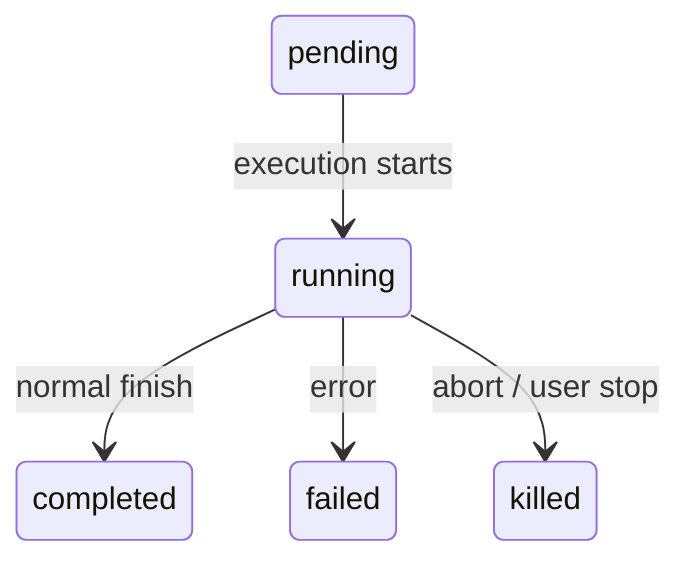
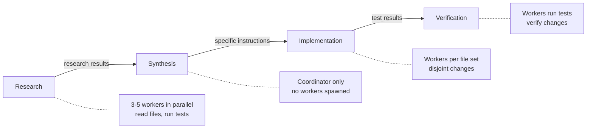
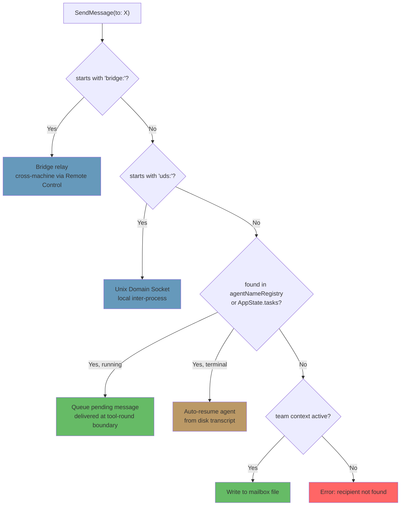

# Chương 10: Tasks, Coordination, and Swarms

## Giới hạn của một luồng đơn

Chương 8 đã chỉ ra cách tạo sub-agent -- vòng đời mười lăm bước xây một ngữ cảnh thực thi cô lập từ một agent definition. Chương 9 đã chỉ ra cách biến việc spawn song song thành bài toán kinh tế nhờ prompt cache exploitation mechanism. Nhưng tạo agent và quản lý agent là hai bài toán khác nhau. Chương này xử lý bài toán thứ hai.

Một agent loop đơn -- một model, một hội thoại, một tool tại một thời điểm -- có thể hoàn thành lượng công việc đáng kinh ngạc. Nó có thể đọc file, sửa code, chạy test, tìm kiếm web, và suy luận về các vấn đề phức tạp. Nhưng nó có trần.

Cái trần đó không phải trí thông minh. Đó là parallelism và scope. Một developer đang làm refactor lớn cần cập nhật 40 file, chạy test sau mỗi batch, và xác minh không có gì bị vỡ. Một đợt migration codebase chạm đồng thời vào frontend, backend, và database layer. Một lần code review kỹ lưỡng phải đọc hàng chục file trong khi chạy test suite ở background. Đây không phải các bài toán khó hơn -- mà là các bài toán rộng hơn. Chúng đòi hỏi khả năng làm nhiều việc cùng lúc, ủy quyền công việc cho chuyên gia, và điều phối kết quả.

Câu trả lời của Claude Code cho bài toán này không phải một cơ chế duy nhất, mà là một ngăn xếp phân lớp của các orchestration pattern (mẫu điều phối), mỗi mẫu phù hợp với một dạng công việc khác nhau. Background tasks cho lệnh fire-and-forget. Coordinator mode cho mô hình manager-worker theo thứ bậc. Swarm teams cho cộng tác peer-to-peer. Và một giao thức giao tiếp thống nhất để buộc tất cả lại với nhau.

Lớp orchestration trải trên khoảng 40 file trong `tools/AgentTool/`, `tasks/`, `coordinator/`, `tools/SendMessageTool/`, và `utils/swarm/`. Dù phạm vi rộng như vậy, thiết kế được neo bởi một state machine duy nhất mà mọi mẫu đều dùng chung. Hiểu state machine đó -- abstraction `Task` trong `Task.ts` -- là điều kiện tiên quyết để hiểu mọi thứ còn lại.

Chương này đi theo toàn bộ ngăn xếp, từ task state machine nền tảng cho đến các topology đa agent tinh vi nhất.

---

## The Task State Machine (Máy trạng thái task)

Mọi thao tác nền trong Claude Code -- một shell command, một sub-agent, một remote session, một workflow script -- đều được theo dõi dưới dạng *task*. Task abstraction nằm trong `Task.ts` và cung cấp mô hình trạng thái thống nhất để toàn bộ lớp orchestration xây lên trên đó.

### Seven Types (Bảy loại)

Hệ thống định nghĩa bảy task type, mỗi loại đại diện cho một mô hình thực thi khác nhau:

Bảy task type gồm: `local_bash` (background shell commands), `local_agent` (background sub-agents), `remote_agent` (remote sessions), `in_process_teammate` (swarm teammates), `local_workflow` (workflow script executions), `monitor_mcp` (MCP server monitors), và `dream` (speculative background thinking).

`local_bash` và `local_agent` là hai lực lượng chủ lực -- lần lượt là background shell command và background sub-agent. `in_process_teammate` là primitive của swarm. `remote_agent` nối sang môi trường Claude Code Runtime từ xa. `local_workflow` chạy script nhiều bước. `monitor_mcp` theo dõi sức khỏe MCP server. `dream` là loại khác thường nhất -- background task cho phép agent suy nghĩ suy đoán trong lúc chờ input từ user.

Mỗi loại có tiền tố ID một ký tự để nhận diện trực quan tức thì:

| Type | Prefix | Example ID |
|------|--------|------------|
| `local_bash` | `b` | `b4k2m8x1` |
| `local_agent` | `a` | `a7j3n9p2` |
| `remote_agent` | `r` | `r1h5q6w4` |
| `in_process_teammate` | `t` | `t3f8s2v5` |
| `local_workflow` | `w` | `w6c9d4y7` |
| `monitor_mcp` | `m` | `m2g7k1z8` |
| `dream` | `d` | `d5b4n3r6` |

Task ID dùng tiền tố một ký tự (a cho agent, b cho bash, t cho teammate, v.v.) rồi đến 8 ký tự ngẫu nhiên dạng chữ-số lấy từ bảng chữ cái an toàn với phân biệt hoa-thường (chữ số cộng chữ thường). Cách này cho ra khoảng 2,8 nghìn tỷ tổ hợp -- đủ để chống brute-force symlink attack vào các file output task trên đĩa.

Khi bạn thấy `a7j3n9p2` trong một dòng log, bạn biết ngay đó là background agent. Khi thấy `b4k2m8x1`, đó là shell command. Tiền tố là một micro-optimization cho người đọc, nhưng trong hệ thống có thể có hàng chục task đồng thời, nó quan trọng.

### Five Statuses (Năm trạng thái)

Vòng đời là một đồ thị có hướng đơn giản, không có chu trình:



`pending` là trạng thái ngắn giữa lúc đăng ký và lúc bắt đầu thực thi đầu tiên. `running` nghĩa là task đang làm việc. Ba terminal state là `completed` (thành công), `failed` (lỗi), và `killed` (bị dừng tường minh bởi user, coordinator, hoặc abort signal). Một helper function chặn việc tương tác với task đã chết:

```typescript
export function isTerminalTaskStatus(status: TaskStatus): boolean {
  return status === 'completed' || status === 'failed' || status === 'killed'
}
```

Hàm này xuất hiện khắp nơi -- trong guard khi inject message, logic eviction, dọn orphan, và routing của SendMessage để quyết định queue message hay resume một agent đã chết.

### The Base State (Trạng thái nền)

Mọi task state đều mở rộng `TaskStateBase`, nơi chứa các trường mà cả bảy loại dùng chung:

```typescript
export type TaskStateBase = {
  id: string              // Prefixed random ID
  type: TaskType          // Discriminator
  status: TaskStatus      // Current lifecycle position
  description: string     // Human-readable summary
  toolUseId?: string      // The tool_use block that spawned this task
  startTime: number       // Creation timestamp
  endTime?: number        // Terminal-state timestamp
  totalPausedMs?: number  // Accumulated pause time
  outputFile: string      // Disk path for streaming output
  outputOffset: number    // Read cursor for incremental output
  notified: boolean       // Whether completion was reported to parent
}
```

Hai trường đáng chú ý. `outputFile` là cây cầu giữa thực thi async và hội thoại của parent -- mọi task ghi output vào một file trên đĩa, và parent có thể đọc tăng dần qua `outputOffset`. `notified` ngăn thông báo hoàn tất bị lặp; khi parent đã được báo task xong, cờ chuyển sang `true` và thông báo sẽ không bao giờ gửi lại. Không có guard này, một task hoàn tất giữa hai lần poll liên tiếp của notification queue sẽ tạo thông báo trùng, khiến model hiểu nhầm rằng có hai task hoàn tất trong khi thực ra chỉ một.

### The Agent Task State (Trạng thái task của agent)

`LocalAgentTaskState` là biến thể phức tạp nhất, mang mọi thứ cần để quản lý toàn bộ vòng đời của một background sub-agent:

```typescript
export type LocalAgentTaskState = TaskStateBase & {
  type: 'local_agent'
  agentId: string
  prompt: string
  selectedAgent?: AgentDefinition
  agentType: string
  model?: string
  abortController?: AbortController
  pendingMessages: string[]       // Queued via SendMessage
  isBackgrounded: boolean         // Was this originally a foreground agent?
  retain: boolean                 // UI is holding this task
  diskLoaded: boolean             // Sidechain transcript loaded
  evictAfter?: number             // GC deadline
  progress?: AgentProgress
  lastReportedToolCount: number
  lastReportedTokenCount: number
  // ... additional lifecycle fields
}
```

Ba trường này hé lộ các quyết định thiết kế quan trọng. `pendingMessages` là inbox -- khi `SendMessage` nhắm tới agent đang chạy, message được queue ở đây thay vì inject ngay lập tức. Message được rút ở ranh giới các vòng tool, nhờ đó giữ nguyên cấu trúc lượt của agent. `isBackgrounded` phân biệt agent sinh ra đã là async với agent bắt đầu ở foreground sync rồi mới được user đẩy xuống background. `evictAfter` là cơ chế garbage collection: task đã xong mà không được giữ lại sẽ có thời gian ân hạn trước khi trạng thái bị loại khỏi bộ nhớ.

Toàn bộ task state được lưu trong `AppState.tasks` dưới dạng `Record<string, TaskState>`, key theo ID có tiền tố. Đây là flat map, không phải cây -- hệ thống không mô hình hóa quan hệ parent-child trong kho trạng thái. Quan hệ parent-child là ngầm định trong luồng hội thoại: parent giữ `toolUseId` đã spawn child.

### The Task Registry (Sổ đăng ký task)

Mỗi task type được chống lưng bởi một đối tượng `Task` với giao diện tối thiểu:

```typescript
export type Task = {
  name: string
  type: TaskType
  kill(taskId: string, setAppState: SetAppState): Promise<void>
}
```

Registry gom tất cả implementation của task:

```typescript
export function getAllTasks(): Task[] {
  return [
    LocalShellTask,
    LocalAgentTask,
    RemoteAgentTask,
    DreamTask,
    ...(LocalWorkflowTask ? [LocalWorkflowTask] : []),
    ...(MonitorMcpTask ? [MonitorMcpTask] : []),
  ]
}
```

Lưu ý phần đưa vào có điều kiện -- `LocalWorkflowTask` và `MonitorMcpTask` bị feature-gated nên có thể không tồn tại lúc runtime. Giao diện `Task` được giữ cố ý ở mức tối giản. Các bản lặp trước từng có `spawn()` và `render()`, nhưng bị gỡ khi nhận ra việc spawn và render chưa bao giờ được gọi theo kiểu đa hình. Mỗi task type có logic spawn riêng, quản lý state riêng, và render riêng. Thao tác duy nhất thật sự cần dispatch theo type là `kill()`, nên giao diện chỉ cần như vậy.

Đây là ví dụ về tiến hóa giao diện bằng phép trừ. Thiết kế ban đầu tưởng rằng mọi task type sẽ chia sẻ một giao diện vòng đời chung. Trên thực tế, các type phân kỳ đủ xa khiến giao diện chung trở thành hư cấu -- `spawn()` cho shell command và `spawn()` cho in-process teammate gần như chẳng có điểm chung. Thay vì duy trì abstraction rò rỉ, đội ngũ bỏ hết trừ đúng một method thật sự hưởng lợi từ đa hình.

---

## Communication Patterns (Các mẫu giao tiếp)

Một task chạy nền chỉ hữu ích khi parent quan sát được tiến trình và nhận được kết quả. Claude Code hỗ trợ ba kênh giao tiếp, mỗi kênh tối ưu cho một kiểu truy cập khác nhau.

### Foreground: The Generator Chain (Foreground: chuỗi generator)

Khi agent chạy đồng bộ, parent lặp trực tiếp trên async generator `runAgent()`, trả từng message ngược lên call stack. Cơ chế đáng chú ý ở đây là lối thoát sang background -- vòng lặp sync chạy race giữa "message kế tiếp từ agent" và "background signal":

```typescript
const agentIterator = runAgent({ ...params })[Symbol.asyncIterator]()

while (true) {
  const nextMessagePromise = agentIterator.next()
  const raceResult = backgroundPromise
    ? await Promise.race([nextMessagePromise.then(...), backgroundPromise])
    : { type: 'message', result: await nextMessagePromise }

  if (raceResult.type === 'background') {
    // User triggered backgrounding -- transition to async
    await agentIterator.return(undefined)
    void runAgent({ ...params, isAsync: true })
    return { data: { status: 'async_launched' } }
  }

  agentMessages.push(message)
}
```

Nếu user quyết định giữa chừng rằng agent sync nên thành background task, foreground iterator được `return` sạch sẽ (kích hoạt `finally` để dọn tài nguyên), rồi agent được spawn lại như task async với cùng ID. Quá trình chuyển là liền mạch -- không mất công việc, và agent tiếp tục từ đúng nơi dừng với async abort controller đã tách khỏi phím ESC của parent.

Đây là chuyển trạng thái rất khó làm đúng. Foreground agent chia sẻ abort controller của parent (ESC giết cả hai). Background agent cần controller riêng (ESC không được giết nó). Message của agent phải chuyển từ luồng generator foreground sang hệ notification background. Task state phải bật `isBackgrounded` để UI biết hiển thị ở bảng nền. Và mọi thứ phải xảy ra atomically -- không mất message lúc chuyển, không để lại iterator zombie đang chạy. `Promise.race` giữa message kế tiếp và background signal là cơ chế khiến điều này khả thi.

### Background: Three Channels (Background: ba kênh)

Background agent giao tiếp qua đĩa, notifications, và queued messages.

**Disk output files.** Mọi task ghi vào đường dẫn `outputFile` -- một symlink tới transcript của agent ở định dạng JSONL. Parent (hoặc bất kỳ observer nào) có thể đọc file này theo kiểu tăng dần bằng `outputOffset`, theo dõi đã tiêu thụ tới đâu. `TaskOutputTool` phơi bày điều này cho model:

```typescript
inputSchema = z.strictObject({
  task_id: z.string(),
  block: z.boolean().default(true),
  timeout: z.number().default(30000),
})
```

Khi `block: true`, tool poll cho đến khi task vào terminal state hoặc hết timeout. Đây là cơ chế chính cho coordinator spawn worker rồi chờ kết quả.

**Task notifications.** Khi background agent hoàn tất, hệ thống tạo XML notification và đưa vào hàng chờ để inject vào hội thoại của parent:

```xml
<task-notification>
  <task-id>a7j3n9p2</task-id>
  <tool-use-id>toolu_abc123</tool-use-id>
  <output-file>/path/to/output</output-file>
  <status>completed</status>
  <summary>Agent "Investigate auth bug" completed</summary>
  <result>Found null pointer in src/auth/validate.ts:42...</result>
  <usage>
    <total_tokens>15000</total_tokens>
    <tool_uses>8</tool_uses>
    <duration_ms>12000</duration_ms>
  </usage>
</task-notification>
```

Notification được inject dưới vai trò user message trong hội thoại của parent, nghĩa là model nhìn thấy nó trong luồng message bình thường. Nó không cần tool đặc biệt để kiểm tra việc hoàn tất -- kết quả tự đi vào ngữ cảnh. Cờ `notified` trên task state ngăn gửi trùng.

**Command queue.** Mảng `pendingMessages` trên `LocalAgentTaskState` là kênh thứ ba. Khi `SendMessage` nhắm tới agent đang chạy, message được queue:

```typescript
if (isLocalAgentTask(task) && task.status === 'running') {
  queuePendingMessage(agentId, input.message, setAppState)
  return { data: { success: true, message: 'Message queued...' } }
}
```

Các message này được rút ở ranh giới vòng tool bởi `drainPendingMessages()` và inject thành user message vào hội thoại của agent. Đây là lựa chọn thiết kế then chốt -- message đến giữa các vòng tool, không đến giữa lúc đang thực thi. Agent hoàn tất ý hiện tại, rồi mới nhận thông tin mới. Không race condition, không trạng thái hỏng.

### Progress Tracking (Theo dõi tiến độ)

`ProgressTracker` cung cấp khả năng quan sát hoạt động agent theo thời gian thực:

```typescript
export type ProgressTracker = {
  toolUseCount: number
  latestInputTokens: number        // Cumulative (latest value, not sum)
  cumulativeOutputTokens: number   // Summed across turns
  recentActivities: ToolActivity[] // Last 5 tool uses
}
```

Sự khác biệt giữa cách theo dõi input token và output token là có chủ đích và phản ánh một tinh tế trong mô hình tính phí API. Input tokens là tích lũy theo từng API call vì toàn bộ hội thoại được gửi lại mỗi lần -- lượt thứ 15 đã chứa cả 14 lượt trước, nên số input token API trả về đã phản ánh tổng. Giữ giá trị mới nhất là cách tổng hợp đúng. Output tokens là theo từng lượt -- model sinh token mới mỗi lần -- nên cộng dồn mới đúng. Làm sai ở đây sẽ hoặc đếm thừa nghiêm trọng (cộng input token tích lũy), hoặc đếm thiếu nghiêm trọng (chỉ giữ output token mới nhất).

Mảng `recentActivities` (giới hạn 5 mục) cung cấp luồng dễ đọc về việc agent đang làm: "Read src/auth/validate.ts", "Bash: npm test", "Edit src/auth/validate.ts". Nó xuất hiện ở bảng subagent của VS Code và chỉ báo background task của terminal, giúp user thấy agent đang làm gì mà không cần đọc toàn bộ transcript.

Với background agent, tiến độ được ghi vào `AppState` qua `updateAsyncAgentProgress()` và phát ra thành SDK event qua `emitTaskProgress()`. Bảng subagent của VS Code tiêu thụ các event này để vẽ thanh tiến độ trực tiếp, số lượng tool, và luồng hoạt động. Theo dõi tiến độ không chỉ là phần trang trí -- đó là cơ chế phản hồi chính cho user biết background agent đang tiến triển hay mắc vòng lặp.

---

## Coordinator Mode

Coordinator mode biến Claude Code từ một agent đơn có trợ lý nền thành kiến trúc manager-worker thực thụ. Đây là orchestration pattern thiên kiến mạnh nhất trong hệ thống, và thiết kế của nó cho thấy tư duy sâu về việc LLM nên và không nên ủy quyền như thế nào.

### The Problem Coordinator Mode Solves (Bài toán mà Coordinator Mode giải quyết)

Agent loop tiêu chuẩn có một hội thoại và một context window. Khi nó spawn background agent, background agent chạy độc lập và báo kết quả qua task notifications. Cách này hoạt động tốt cho ủy quyền đơn giản -- "chạy test trong khi tôi tiếp tục sửa" -- nhưng vỡ khi gặp workflow nhiều bước phức tạp.

Hãy xét một migration codebase. Agent cần: (1) hiểu các pattern hiện có trên 200 file, (2) thiết kế chiến lược migration, (3) áp thay đổi cho từng file, và (4) xác minh không có gì bị vỡ. Bước 1 và 3 hưởng lợi từ parallelism. Bước 2 cần tổng hợp kết quả từ bước 1. Bước 4 phụ thuộc bước 3. Một agent đơn làm tuần tự sẽ tiêu phần lớn token budget vào việc đọc lại file. Nhiều background agent làm việc này mà không có điều phối sẽ tạo thay đổi thiếu nhất quán.

Coordinator mode giải bài toán bằng cách tách agent "nghĩ" ra khỏi agent "làm". Coordinator xử lý bước 1 và 2 (dispatch research worker, rồi tổng hợp). Worker xử lý bước 3 và 4 (áp thay đổi, chạy test). Coordinator thấy bức tranh toàn cảnh; worker chỉ thấy task cụ thể của mình.

### Activation (Kích hoạt)

Một biến môi trường duy nhất bật công tắc:

```typescript
export function isCoordinatorMode(): boolean {
  if (feature('COORDINATOR_MODE')) {
    return isEnvTruthy(process.env.CLAUDE_CODE_COORDINATOR_MODE)
  }
  return false
}
```

Khi resume session, `matchSessionMode()` kiểm tra mode được lưu của session resume có khớp môi trường hiện tại hay không. Nếu lệch, biến môi trường sẽ được lật để khớp. Việc này ngăn kịch bản gây bối rối: session coordinator resume thành agent thường (mất nhận thức về worker), hoặc session thường resume thành coordinator (mất quyền truy cập tool). Mode của session là source of truth; biến môi trường là runtime signal.

### Tool Restrictions (Giới hạn tool)

Sức mạnh của coordinator không đến từ nhiều tool hơn, mà từ ít tool hơn. Trong coordinator mode, coordinator agent có đúng ba tool:

- **Agent** -- spawn worker
- **SendMessage** -- giao tiếp với worker hiện có
- **TaskStop** -- kết thúc worker đang chạy

Chỉ vậy. Không đọc file. Không sửa code. Không shell command. Coordinator không thể chạm trực tiếp vào codebase. Ràng buộc này không phải hạn chế -- nó là nguyên tắc thiết kế cốt lõi. Việc của coordinator là suy nghĩ, lập kế hoạch, phân rã, và tổng hợp. Worker làm việc thực thi.

Ngược lại, worker có full tool set trừ các tool điều phối nội bộ:

```typescript
const INTERNAL_WORKER_TOOLS = new Set([
  TEAM_CREATE_TOOL_NAME,
  TEAM_DELETE_TOOL_NAME,
  SEND_MESSAGE_TOOL_NAME,
  SYNTHETIC_OUTPUT_TOOL_NAME,
])
```

Worker không thể spawn sub-team của riêng mình hoặc gửi message cho peer. Họ báo kết quả qua cơ chế hoàn tất task thông thường, và coordinator tổng hợp trên toàn bộ.

### The 370-Line System Prompt (System Prompt 370 dòng)

Coordinator system prompt là, theo từng dòng, tài liệu giàu tính chỉ dẫn nhất trong codebase về cách dùng LLM cho orchestration. Nó dài khoảng 370 dòng và mã hóa những bài học đắt giá về pattern ủy quyền. Các điểm dạy cốt lõi:

**"Never delegate understanding."** Đây là luận điểm trung tâm. Coordinator phải tổng hợp kết quả nghiên cứu thành prompt cụ thể kèm file path, line number, và thay đổi chính xác. Prompt nêu thẳng anti-pattern như "dựa trên kết quả của bạn, hãy sửa bug" -- kiểu prompt ủy quyền *sự thấu hiểu* cho worker, buộc worker phải tự dựng lại ngữ cảnh mà coordinator đã có. Mẫu đúng là: "Trong `src/auth/validate.ts` dòng 42, tham số `userId` có thể null khi gọi từ luồng OAuth. Thêm null check trả về phản hồi 401."

**"Parallelism is your superpower."** Prompt thiết lập mô hình concurrency rõ ràng. Task chỉ-đọc chạy song song tự do -- nghiên cứu, khám phá, đọc file. Task ghi nhiều cần tuần tự theo từng tập file. Coordinator được kỳ vọng suy luận task nào chồng lấp được và task nào phải xếp chuỗi. Coordinator tốt sẽ spawn năm research worker cùng lúc, chờ tất cả, tổng hợp, rồi spawn ba implementation worker chạm các tập file rời nhau. Coordinator tệ sẽ spawn một worker, chờ, rồi spawn worker tiếp theo, lại chờ -- biến công việc có thể song song thành tuần tự.

**Task workflow phases.** Prompt định nghĩa bốn pha:



1. **Research** -- worker khám phá codebase song song, đọc file, chạy test, thu thập thông tin
2. **Synthesis** -- coordinator (không phải worker) đọc mọi kết quả nghiên cứu và xây hiểu biết thống nhất
3. **Implementation** -- worker nhận chỉ thị chính xác được suy ra từ phần tổng hợp
4. **Verification** -- worker chạy test và xác minh thay đổi

Coordinator không nên bỏ qua pha nào. Failure mode phổ biến nhất là nhảy từ research thẳng sang implementation mà không synthesis. Khi điều này xảy ra, coordinator ủy quyền sự thấu hiểu cho implementation worker -- mỗi worker phải tự dựng lại ngữ cảnh từ đầu, dẫn tới thay đổi thiếu nhất quán và lãng phí token.

**The continue-vs-spawn decision.** Khi worker hoàn tất và coordinator có việc tiếp theo, nên gửi message cho worker cũ (qua SendMessage) hay spawn worker mới (qua Agent)? Quyết định là hàm của mức chồng lấp ngữ cảnh:

- **High overlap, same files**: Continue. Worker đã có nội dung file trong ngữ cảnh, hiểu pattern, và có thể xây tiếp trên công việc trước. Spawn mới sẽ buộc đọc lại cùng file và dựng lại cùng hiểu biết.
- **Low overlap, different domain**: Spawn fresh. Worker vừa điều tra hệ auth mang theo 20.000 token ngữ cảnh đặc thù auth, là tải chết cho task refactor CSS. Bắt đầu sạch rẻ hơn.
- **High overlap but the worker failed**: Spawn fresh kèm hướng dẫn tường minh về chỗ sai. Tiếp tục một worker đã thất bại thường là vật lộn với ngữ cảnh rối. Khởi động mới với "lần trước thất bại vì X, tránh Y" đáng tin cậy hơn.
- **Follow-up requires the worker's output**: Continue, kèm output trong SendMessage. Worker không cần tự dựng lại kết quả của chính nó.

**Worker prompt writing and anti-patterns.** Prompt dạy coordinator cách viết worker prompt hiệu quả và chỉ rõ các mẫu xấu:

Anti-pattern: *"Based on your research findings, implement the fix."* Cách này ủy quyền sự thấu hiểu. Worker không phải bên đã làm nghiên cứu -- coordinator mới là bên đọc kết quả nghiên cứu.

Anti-pattern: *"Fix the bug in the auth module."* Không file path, không line number, không mô tả bug. Worker phải tìm lại toàn codebase từ đầu.

Anti-pattern: *"Make the same change to all the other files."* File nào? Thay đổi nào? Coordinator biết; coordinator phải liệt kê ra.

Good pattern: *"In `src/auth/validate.ts` at line 42, the `userId` parameter can be null when called from `src/oauth/callback.ts:89`. Add a null check: if `userId` is null, return `{ error: 'unauthorized', status: 401 }`. Then update the test in `src/auth/__tests__/validate.test.ts` to cover the null case."*

Chi phí viết prompt cụ thể do coordinator trả một lần. Lợi ích -- worker thực thi đúng ngay lượt đầu -- là cực lớn. Prompt mơ hồ tạo ảo giác tiết kiệm: coordinator tiết kiệm 30 giây viết prompt, worker mất 5 phút để khám phá lại.

### Worker Context (Ngữ cảnh worker)

Coordinator inject thông tin về tool khả dụng vào ngữ cảnh của chính nó, để model biết worker có thể làm gì:

```typescript
export function getCoordinatorUserContext(mcpClients, scratchpadDir?) {
  return {
    workerToolsContext: `Workers spawned via Agent have access to: ${workerTools}`
      + (mcpClients.length > 0
        ? `\nWorkers also have MCP tools from: ${serverNames}` : '')
      + (scratchpadDir ? `\nScratchpad: ${scratchpadDir}` : '')
  }
}
```

Scratchpad directory (bị gate bởi feature flag `tengu_scratch`) là vị trí filesystem dùng chung nơi worker có thể đọc và ghi mà không cần permission prompt. Nó cho phép chia sẻ tri thức bền vững xuyên worker -- ghi chú nghiên cứu của worker này trở thành input cho worker khác, được trung gian qua filesystem thay vì đi qua token window của coordinator.

Điểm này quan trọng vì nó giải một giới hạn nền tảng của coordinator pattern. Không có scratchpad, mọi thông tin đều chảy qua coordinator: Worker A tạo findings, coordinator đọc qua TaskOutput, tổng hợp vào prompt của Worker B. Context window của coordinator trở thành nút thắt -- nó phải giữ đủ lâu mọi kết quả trung gian để tổng hợp. Có scratchpad, Worker A ghi findings vào `/tmp/scratchpad/auth-analysis.md`, coordinator bảo Worker B: "Đọc phân tích auth tại `/tmp/scratchpad/auth-analysis.md` rồi áp pattern cho module OAuth." Coordinator chuyển thông tin theo tham chiếu, không chuyển theo giá trị.

### Mutual Exclusion with Fork (Loại trừ lẫn nhau với Fork)

Coordinator mode và fork-based subagent loại trừ lẫn nhau:

```typescript
export function isForkSubagentEnabled(): boolean {
  if (feature('FORK_SUBAGENT')) {
    if (isCoordinatorMode()) return false
    // ...
  }
}
```

Xung đột này là nền tảng. Fork agent kế thừa toàn bộ ngữ cảnh hội thoại của parent -- chúng là bản sao giá rẻ dùng chung prompt cache. Coordinator worker là agent độc lập với ngữ cảnh mới và chỉ thị cụ thể. Đây là hai triết lý ủy quyền đối nghịch, và hệ thống cưỡng chế lựa chọn ở cấp feature flag.

---

## The Swarm System (Hệ thống swarm)

Coordinator mode có tính thứ bậc: một manager, nhiều worker, điều khiển từ trên xuống. Hệ swarm là phương án peer-to-peer -- nhiều instance Claude Code làm việc như một đội, với leader điều phối nhiều teammate qua message passing.

### Team Context (Ngữ cảnh nhóm)

Team được nhận diện bằng `teamName` và theo dõi trong `AppState.teamContext`:

```typescript
teamContext?: {
  teamName: string
  teammates: {
    [id: string]: { name: string; color?: string; ... }
  }
}
```

Mỗi teammate có một tên (để định địa chỉ) và một màu (để phân biệt trực quan trong UI). Team file được lưu bền trên đĩa để thành viên nhóm sống qua lần restart process.

### Agent Name Registry (Sổ đăng ký tên agent)

Background agent có thể được đặt tên lúc spawn, giúp có thể định địa chỉ bằng định danh dễ đọc thay vì task ID ngẫu nhiên:

```typescript
if (name) {
  rootSetAppState(prev => {
    const next = new Map(prev.agentNameRegistry)
    next.set(name, asAgentId(asyncAgentId))
    return { ...prev, agentNameRegistry: next }
  })
}
```

`agentNameRegistry` là một `Map<string, AgentId>`. Khi `SendMessage` resolve trường `to`, registry được kiểm tra trước:

```typescript
const registered = appState.agentNameRegistry.get(input.to)
const agentId = registered ?? toAgentId(input.to)
```

Nghĩa là bạn có thể gửi message tới `"researcher"` thay vì `a7j3n9p2`. Lớp gián tiếp này đơn giản nhưng cho phép coordinator suy nghĩ theo vai trò thay vì ID -- cải thiện đáng kể khả năng model suy luận về workflow đa agent.

### In-Process Teammates (Teammate trong cùng process)

Teammate in-process chạy trong cùng Node.js process với leader, cách ly bằng `AsyncLocalStorage`. Trạng thái của chúng mở rộng base với các trường chuyên cho team:

```typescript
export type InProcessTeammateTaskState = TaskStateBase & {
  type: 'in_process_teammate'
  identity: TeammateIdentity
  prompt: string
  messages?: Message[]                  // Capped at 50
  pendingUserMessages: string[]
  isIdle: boolean
  shutdownRequested: boolean
  awaitingPlanApproval: boolean
  permissionMode: PermissionMode
  onIdleCallbacks?: Array<() => void>
  currentWorkAbortController?: AbortController
}
```

Giới hạn `messages` ở 50 mục cần giải thích. Trong quá trình phát triển, phân tích cho thấy mỗi in-process agent tích lũy khoảng 20MB RSS ở 500+ lượt. Các whale session -- power user chạy workflow dài -- từng được ghi nhận launch 292 agent trong 2 phút, đẩy RSS lên 36,8GB. Giới hạn 50 message cho phần biểu diễn UI là van an toàn bộ nhớ. Hội thoại thực của agent vẫn tiếp tục với lịch sử đầy đủ; chỉ snapshot hướng UI bị cắt.

Cờ `isIdle` cho phép work-stealing pattern. Một teammate idle không tiêu token hay API call -- nó chỉ chờ message tiếp theo. Mảng `onIdleCallbacks` cho phép hệ thống gắn hook vào chuyển đổi từ active sang idle, enabling các mẫu điều phối như "chờ mọi teammate xong rồi mới đi tiếp".

`currentWorkAbortController` tách biệt với abort controller chính của teammate. Abort controller công việc hiện tại sẽ hủy lượt đang chạy của teammate nhưng không giết teammate. Điều này tạo mẫu "redirect": leader gửi message ưu tiên cao hơn, công việc hiện tại của teammate bị hủy, rồi teammate nhặt message mới. Abort controller chính, khi bị abort, sẽ giết toàn bộ teammate. Hai mức ngắt cho hai mức ý định.

Cờ `shutdownRequested` triển khai kết thúc hợp tác. Khi leader gửi yêu cầu shutdown, cờ này được bật. Teammate có thể kiểm tra ở các điểm dừng tự nhiên và hạ cánh êm -- hoàn tất ghi file hiện tại, commit thay đổi, hoặc gửi cập nhật trạng thái cuối. Cách này nhẹ nhàng hơn hard kill, vốn có thể để file ở trạng thái thiếu nhất quán.

### The Mailbox (Hộp thư)

Teammate giao tiếp qua hệ mailbox dựa trên file. Khi `SendMessage` nhắm tới một teammate, message được ghi vào file mailbox của người nhận trên đĩa:

```typescript
await writeToMailbox(recipientName, {
  from: senderName,
  text: content,
  summary,
  timestamp: new Date().toISOString(),
  color: senderColor,
}, teamName)
```

Message có thể là plain text, message giao thức có cấu trúc (shutdown request, plan approval), hoặc broadcast (`to: "*"` gửi cho mọi thành viên team trừ người gửi). Một poller hook xử lý message đến và route chúng vào hội thoại của teammate.

Cách tiếp cận dựa trên file được cố tình giữ đơn giản. Không có message broker, không event bus, không kênh shared memory. File là durable (sống qua process crash), inspectable (bạn có thể `cat` một mailbox), và rẻ (không phụ thuộc hạ tầng). Với hệ thống có lưu lượng message tính theo hàng chục mỗi session, không phải hàng nghìn mỗi giây, đây là đánh đổi đúng. Message queue chạy Redis sẽ thêm độ phức tạp vận hành, một phụ thuộc, và các failure mode mới -- tất cả chỉ để phục vụ mức thông lượng mà một lệnh gọi filesystem đã xử lý gọn.

Cơ chế broadcast đáng chú ý thêm. Khi message gửi đến `"*"`, người gửi lặp qua mọi thành viên team từ team file, bỏ qua chính mình (so sánh không phân biệt hoa-thường), rồi ghi vào mailbox từng thành viên một:

```typescript
for (const member of teamFile.members) {
  if (member.name.toLowerCase() === senderName.toLowerCase()) continue
  recipients.push(member.name)
}
for (const recipientName of recipients) {
  await writeToMailbox(recipientName, { from: senderName, text: content, ... }, teamName)
}
```

Không có tối ưu fan-out -- mỗi người nhận là một lần ghi file riêng. Một lần nữa, ở quy mô agent team (thường 3-8 thành viên), như vậy là hoàn toàn đủ. Nếu team có 100 thành viên, chuyện này sẽ phải nghĩ lại. Nhưng giới hạn bộ nhớ 50 message dùng để ngăn kịch bản RSS 36GB cũng ngầm giới hạn kích thước team hiệu quả.

### Permission Forwarding (Chuyển tiếp quyền)

Swarm worker vận hành với quyền hạn chế nhưng có thể leo thang lên leader khi cần duyệt cho thao tác nhạy cảm:

```typescript
const request = createPermissionRequest({
  toolName, toolUseId, input, description, permissionSuggestions
})
registerPermissionCallback({ requestId, toolUseId, onAllow, onReject })
void sendPermissionRequestViaMailbox(request)
```

Luồng là: worker chạm một tool cần quyền, bash classifier thử auto-approval, nếu không qua thì request được chuyển đến leader qua hệ mailbox. Leader thấy request trong UI và có thể approve hoặc reject. Callback chạy và worker đi tiếp. Cách này cho phép worker tự hành với thao tác an toàn trong khi vẫn giữ giám sát con người cho thao tác nguy hiểm.

---

## Inter-Agent Communication: SendMessage

`SendMessageTool` là primitive giao tiếp phổ quát. Nó xử lý bốn routing mode khác nhau qua một giao diện tool duy nhất, được chọn bằng hình dạng của trường `to`.

### Input Schema (Lược đồ đầu vào)

```typescript
inputSchema = z.object({
  to: z.string(),
  // "teammate-name", "*", "uds:<socket>", "bridge:<session-id>"
  summary: z.string().optional(),
  message: z.union([
    z.string(),
    z.discriminatedUnion('type', [
      z.object({ type: z.literal('shutdown_request'), reason: z.string().optional() }),
      z.object({ type: z.literal('shutdown_response'), request_id, approve, reason }),
      z.object({ type: z.literal('plan_approval_response'), request_id, approve, feedback }),
    ]),
  ]),
})
```

Trường `message` là union của plain text và structured protocol message. Nghĩa là SendMessage đóng hai vai cùng lúc -- vừa là kênh chat không chính thức ("đây là findings của tôi"), vừa là lớp giao thức chính thức ("tôi duyệt kế hoạch" / "hãy shutdown").

### Routing Dispatch (Điều phối định tuyến)

Method `call()` đi theo chuỗi dispatch có thứ tự ưu tiên:



**1. Bridge messages** (`bridge:<session-id>`). Giao tiếp xuyên máy qua server Remote Control của Anthropic. Đây là tầm với rộng nhất -- hai instance Claude Code ở hai máy khác nhau, có thể khác cả châu lục, giao tiếp qua relay. Hệ thống yêu cầu user consent tường minh trước khi gửi bridge message -- một lớp an toàn ngăn một agent tự ý thiết lập liên lạc với instance từ xa. Không có chốt này, agent bị xâm nhập hoặc rối hành vi có thể exfiltrate thông tin sang session từ xa. Kiểm tra consent dùng `postInterClaudeMessage()`, hàm lo phần serialization và transport qua relay Remote Control.

**2. UDS messages** (`uds:<socket-path>`). Giao tiếp liên tiến trình cục bộ qua Unix Domain Sockets. Đây là cho các instance Claude Code chạy trên cùng máy nhưng ở process khác nhau -- ví dụ VS Code extension host một instance và terminal host instance khác. Giao tiếp UDS nhanh (không network round-trip), an toàn (quyền filesystem kiểm soát truy cập), và tin cậy (kernel xử lý delivery). Hàm `sendToUdsSocket()` serialize message và ghi vào socket path nêu trong trường `to`. Peer khám phá nhau qua tool `ListPeers` quét các UDS endpoint đang hoạt động.

**3. In-process subagent routing** (tên thường hoặc agent ID). Đây là đường phổ biến nhất. Logic routing:

- Tra `input.to` trong `agentNameRegistry`
- Nếu có và đang chạy: `queuePendingMessage()` -- message chờ tới ranh giới vòng tool kế tiếp
- Nếu có nhưng đang ở terminal state: `resumeAgentBackground()` -- agent được restart trong suốt
- Nếu không có trong `AppState`: thử resume từ disk transcript

**4. Team mailbox** (fallback khi team context đang active). Người nhận theo tên sẽ nhận message ghi vào mailbox file. Wildcard `"*"` kích hoạt broadcast tới toàn bộ thành viên nhóm.

### Structured Protocols (Giao thức có cấu trúc)

Ngoài plain text, SendMessage mang hai giao thức chính thức.

**Shutdown protocol.** Leader gửi `{ type: 'shutdown_request', reason: '...' }` cho teammate. Teammate phản hồi `{ type: 'shutdown_response', request_id, approve: true/false, reason }`. Nếu được duyệt, teammate in-process abort controller; teammate dựa trên tmux nhận lệnh gọi `gracefulShutdown()`. Đây là giao thức hợp tác -- teammate có thể từ chối shutdown nếu đang ở giữa công việc quan trọng, và leader phải xử lý trường hợp đó.

**Plan approval protocol.** Teammate chạy trong plan mode phải được duyệt trước khi thực thi. Họ gửi plan, leader đáp `{ type: 'plan_approval_response', request_id, approve, feedback }`. Chỉ team lead mới được quyền duyệt. Cơ chế này tạo cổng review -- leader có thể kiểm tra hướng tiếp cận dự kiến của worker trước khi chạm bất kỳ file nào, bắt sai lệch sớm.

### The Auto-Resume Pattern (Mẫu tự resume)

Tính năng tinh tế nhất của hệ routing là resume agent một cách trong suốt. Khi `SendMessage` nhắm tới agent đã `completed` hoặc `killed`, thay vì trả lỗi, nó hồi sinh agent:

```typescript
if (task.status !== 'running') {
  const result = await resumeAgentBackground({
    agentId,
    prompt: input.message,
    toolUseContext: context,
    canUseTool,
  })
  return {
    data: {
      success: true,
      message: `Agent "${input.to}" was stopped; resumed with your message`
    }
  }
}
```

Hàm `resumeAgentBackground()` tái dựng agent từ disk transcript:

1. Đọc sidechain JSONL transcript
2. Tái dựng message history, lọc orphaned thinking block và unresolved tool use
3. Xây lại trạng thái content replacement để ổn định prompt cache
4. Resolve agent definition gốc từ metadata đã lưu
5. Đăng ký lại như background task với abort controller mới
6. Gọi `runAgent()` với history đã khôi phục cộng message mới làm prompt

Từ góc nhìn coordinator, gửi message cho agent đã chết và gửi message cho agent còn sống là cùng một thao tác. Lớp routing gánh phần phức tạp. Điều này nghĩa là coordinator không cần theo dõi agent nào còn sống -- chỉ cần gửi message và hệ thống tự xử lý.

Hệ quả rất đáng kể. Không có auto-resume, coordinator phải duy trì mô hình sống-chết của agent trong đầu: "`researcher` còn chạy không? Để kiểm tra. Nó xong rồi. Mình cần spawn agent mới. Nhưng khoan, nên dùng lại tên cũ không? Nó có cùng ngữ cảnh không?" Có auto-resume, tất cả sụp về một câu: "Gửi `researcher` một message." Nếu còn sống, message được queue. Nếu đã chết, nó được hồi sinh với đầy đủ history. Độ phức tạp prompt của coordinator giảm mạnh.

Dĩ nhiên có cái giá. Resume từ disk transcript nghĩa là đọc lại có thể hàng nghìn message, tái dựng trạng thái nội bộ, và gọi API mới với full context window. Với agent sống lâu, chi phí này có thể cao cả về độ trễ lẫn token. Nhưng phương án thay thế -- buộc coordinator tự quản vòng đời agent thủ công -- còn tệ hơn. Coordinator là một LLM. Nó giỏi suy luận vấn đề và viết chỉ thị. Nó kém ở bookkeeping. Auto-resume khai thác đúng điểm mạnh của LLM bằng cách xóa hẳn một lớp bookkeeping.

---

## TaskStop: The Kill Switch (Công tắc dừng khẩn)

`TaskStopTool` là mảnh ghép bổ sung cho Agent và SendMessage -- nó kết thúc các task đang chạy:

```typescript
inputSchema = z.strictObject({
  task_id: z.string().optional(),
  shell_id: z.string().optional(),  // Deprecated backward compat
})
```

Implementation ủy quyền sang `stopTask()`, hàm dispatch theo task type:

1. Tra task trong `AppState.tasks`
2. Gọi `getTaskByType(task.type).kill(taskId, setAppState)`
3. Với agent: abort controller, đặt status thành `'killed'`, khởi động eviction timer
4. Với shell: kill process group

Tool có alias kế thừa lịch sử là `"KillShell"` -- lời nhắc rằng hệ task đã tiến hóa từ gốc đơn giản hơn, nơi thao tác nền duy nhất là shell command.

Cơ chế kill thay đổi theo task type, nhưng pattern nhất quán. Với agent, kill nghĩa là abort abort controller (làm vòng `query()` thoát tại điểm `yield` kế tiếp), đặt status `'killed'`, rồi chạy eviction timer để dọn state task sau một khoảng ân hạn. Với shell, kill nghĩa là gửi signal tới process group -- `SIGTERM` trước, rồi `SIGKILL` nếu process không thoát trong timeout. Với in-process teammate, kill còn kích hoạt thông báo shutdown cho team để các thành viên khác biết teammate đã rời.

Eviction timer đáng được nhấn mạnh. Khi agent bị kill, state không bị xóa ngay. Nó lưu lại trong `AppState.tasks` một thời gian ân hạn (điều khiển bởi `evictAfter`) để UI hiển thị trạng thái killed, output cuối có thể được đọc, và auto-resume qua SendMessage vẫn khả dụng. Hết thời gian ân hạn, state được garbage collect. Đây cũng là pattern dùng cho task completed -- hệ thống tách biệt giữa "đã xong" (kết quả còn đọc được) và "đã quên" (state đã bị dọn).

---

## Choosing Between Patterns (Chọn mẫu phù hợp)

(Một lưu ý về tên gọi: codebase còn có các tool `TaskCreate`/`TaskGet`/`TaskList`/`TaskUpdate` để quản lý structured todo list -- hệ hoàn toàn riêng với background task state machine đang nói ở đây. `TaskStop` thao tác trên `AppState.tasks`; `TaskUpdate` thao tác trên kho dữ liệu theo dõi dự án. Sự trùng tên là lịch sử để lại và thường xuyên gây nhầm cho model.)

Với ba orchestration pattern khả dụng -- background delegation, coordinator mode, và swarm teams -- câu hỏi tự nhiên là khi nào dùng từng cái.

**Simple delegation** (Agent tool với `run_in_background: true`) phù hợp khi parent có một hoặc hai task độc lập để offload. Chạy test ở background trong khi tiếp tục sửa code. Tìm toàn codebase trong khi chờ build. Parent vẫn giữ quyền điều khiển, xem kết quả khi sẵn sàng, và không cần giao thức giao tiếp phức tạp. Overhead tối thiểu -- một mục task state, một disk output file, một notification khi hoàn tất.

**Coordinator mode** phù hợp khi bài toán phân rã thành pha nghiên cứu, pha tổng hợp, và pha triển khai -- và khi coordinator cần suy luận xuyên kết quả của nhiều worker trước khi chỉ đạo bước kế tiếp. Coordinator không thể chạm file, ép tách bạch trách nhiệm rõ ràng: suy nghĩ ở một ngữ cảnh, thực thi ở ngữ cảnh khác. System prompt 370 dòng không phải nghi thức -- nó mã hóa những pattern ngăn failure mode phổ biến nhất của ủy quyền bằng LLM: ủy quyền sự thấu hiểu thay vì ủy quyền hành động.

**Swarm teams** phù hợp cho phiên cộng tác dài hơi nơi agent cần giao tiếp peer-to-peer, công việc mang tính liên tục hơn là theo lô, và agent có thể cần idle rồi resume theo message đến. Hệ mailbox hỗ trợ các mẫu bất đồng bộ mà coordinator mode (vốn sync spawn-wait-synthesize) không có. Cổng plan approval thêm một lớp review. Permission forwarding giữ an toàn mà không cần cấp toàn quyền cho mọi agent.

Bảng quyết định thực tế:

| Scenario | Pattern | Why |
|----------|---------|-----|
| Run tests while editing | Simple delegation | One background task, no coordination needed |
| Search codebase for all usages | Simple delegation | Fire-and-forget, read output when done |
| Refactor 40 files across 3 modules | Coordinator | Research phase finds patterns, synthesis plans changes, workers execute in parallel per module |
| Multi-day feature development with review gates | Swarm | Long-lived agents, plan approval protocol, peer communication |
| Fix a bug with known location | Neither -- single agent | Orchestration overhead exceeds the benefit for focused, sequential work |
| Migrate database schema + update API + update frontend | Coordinator | Three independent workstreams after a shared research/planning phase |
| Pair programming with user oversight | Swarm with plan mode | Worker proposes, leader approves, worker executes |

Các pattern này về nguyên tắc không loại trừ lẫn nhau, nhưng trên thực tế thì có. Coordinator mode tắt fork subagent. Swarm team có giao thức giao tiếp riêng không trộn với task notification của coordinator. Quyết định được chốt lúc session startup qua biến môi trường và feature flag, và nó định hình toàn bộ mô hình tương tác.

Một quan sát cuối: pattern đơn giản nhất gần như luôn là điểm bắt đầu đúng. Phần lớn task không cần coordinator mode hay swarm team. Một agent đơn với background delegation thỉnh thoảng đã xử lý được đa số công việc phát triển. Các pattern tinh vi tồn tại cho 5% trường hợp mà bài toán thật sự rộng, thật sự song song, hoặc thật sự dài hơi. Với một bug một file mà lôi coordinator mode ra dùng thì giống deploy Kubernetes cho một static website -- làm được, nhưng sai cấp độ kiến trúc.

---

## The Cost of Orchestration (Chi phí của điều phối)

Trước khi xem lớp orchestration tiết lộ gì ở tầng triết lý, cần thừa nhận cái giá thực tế của nó.

Mỗi background agent là một hội thoại API riêng. Nó có context window riêng, token budget riêng, và prompt cache slot riêng. Một coordinator spawn 5 research worker tức là tạo 6 API call đồng thời, mỗi call có system prompt riêng, tool definitions riêng, và tiêm CLAUDE.md riêng. Token overhead không hề nhỏ -- riêng system prompt đã có thể hàng nghìn token, và mỗi worker đọc lại các file mà worker khác có thể đã đọc.

Các kênh giao tiếp thêm độ trễ. Disk output file cần filesystem I/O. Task notification được chuyển ở ranh giới vòng tool, không tức thì. Command queue thêm một độ trễ vòng khép kín đầy đủ -- coordinator gửi message, message chờ worker hoàn tất tool use hiện tại, worker xử lý message, rồi kết quả được ghi ra đĩa để coordinator đọc.

Quản lý trạng thái thêm độ phức tạp. Bảy task type, năm status, và hàng chục trường cho mỗi task state. Logic eviction, timer garbage collection, giới hạn bộ nhớ -- tất cả tồn tại vì tăng trưởng state không giới hạn từng gây incident thực tế ở production (RSS 36,8GB).

Không điều nào ở trên có nghĩa orchestration là sai. Nó có nghĩa orchestration là công cụ có chi phí, và chi phí cần được cân so với lợi ích. Chạy 5 worker song song để tìm trong codebase là đáng khi tìm tuần tự sẽ mất 5 phút. Chạy coordinator để sửa một lỗi chính tả trong một file là overhead thuần túy.

---

## What the Orchestration Layer Reveals (Lớp điều phối tiết lộ điều gì)

Phần thú vị nhất của hệ thống này không nằm ở cơ chế riêng lẻ nào -- task state, mailbox, và notification XML đều là kỹ thuật tương đối thẳng. Điều đáng chú ý là *triết lý thiết kế* lộ ra từ cách chúng ghép với nhau.

Câu "never delegate understanding" trong coordinator prompt không chỉ là lời khuyên hay cho orchestration với LLM. Nó là phát biểu về giới hạn nền tảng của suy luận dựa trên context window. Worker với context window mới không thể hiểu điều coordinator đã hiểu sau khi đọc 50 file và tổng hợp ba báo cáo nghiên cứu. Cách duy nhất để bắc cầu khoảng cách đó là coordinator chưng cất hiểu biết của mình thành prompt cụ thể, có thể hành động được. Ủy quyền mơ hồ không chỉ kém hiệu quả -- nó còn thất thoát thông tin ở cấp thông tin học.

Auto-resume pattern trong SendMessage cho thấy ưu tiên *tính đơn giản biểu kiến hơn tính đơn giản thực tế*. Implementation phức tạp -- đọc disk transcript, tái dựng content replacement state, resolve lại agent definition. Nhưng giao diện thì tầm thường: gửi message, và nó chạy bất kể người nhận còn sống hay đã chết. Độ phức tạp được hạ tầng hấp thụ để model (và user) có thể suy nghĩ bằng mô hình đơn giản hơn.

Và giới hạn bộ nhớ 50 message trên in-process teammate là lời nhắc rằng hệ orchestration vận hành dưới ràng buộc vật lý thật. 292 agent trong 2 phút chạm RSS 36,8GB không phải lo xa trên giấy -- nó đã xảy ra ở production. Abstraction có thể thanh lịch, nhưng chúng chạy trên phần cứng có bộ nhớ hữu hạn, và hệ thống phải graceful degradation khi user đẩy nó tới cực hạn.

Còn có một bài học nằm ngay trong kiến trúc phân lớp. Task state machine là agnostic -- nó không biết gì về coordinator hay swarm. Kênh giao tiếp là agnostic -- SendMessage không biết nó được gọi bởi coordinator, swarm leader, hay standalone agent. Coordinator prompt nằm ở lớp trên, thêm phương pháp luận mà không đổi bộ máy nền. Mỗi lớp có thể hiểu độc lập, test độc lập, và tiến hóa độc lập. Khi team thêm hệ swarm, họ không cần sửa task state machine. Khi thêm coordinator prompt, họ không cần sửa SendMessage.

Đây là dấu hiệu của orchestration được tách lớp tốt: primitive đủ tổng quát, còn pattern được lắp từ các primitive đó. Coordinator chỉ là agent có tool bị giới hạn và system prompt chi tiết. Swarm leader chỉ là agent có team context và quyền truy cập mailbox. Background worker chỉ là agent có abort controller độc lập và disk output file. Bảy task type, năm status, và bốn routing mode kết hợp để tạo pattern orchestration lớn hơn tổng các phần.

Lớp orchestration là nơi Claude Code ngừng là một bộ thực thi tool đơn luồng và trở thành thứ gần với một đội phát triển. Task state machine cung cấp bookkeeping. Kênh giao tiếp cung cấp luồng thông tin. Coordinator prompt cung cấp phương pháp. Và hệ swarm cung cấp topology peer-to-peer cho các bài toán không vừa với thứ bậc cứng. Cùng nhau, chúng khiến language model làm được điều mà một lần gọi model đơn lẻ không thể: xử lý bài toán rộng, song song, có điều phối.

Chương tiếp theo xem xét permission system -- lớp an toàn quyết định agent nào được làm gì, và các thao tác nguy hiểm được leo thang từ worker lên con người như thế nào. Orchestration không có kiểm soát quyền sẽ là bộ khuếch đại sai sót. Permission system đảm bảo nhiều agent hơn nghĩa là nhiều năng lực hơn, không phải nhiều rủi ro hơn.
