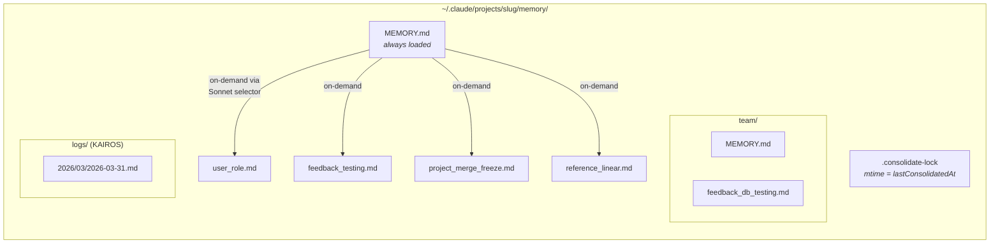
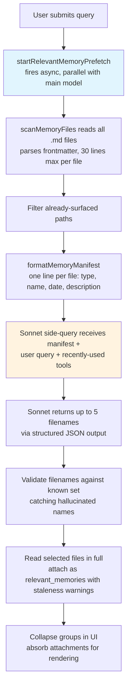
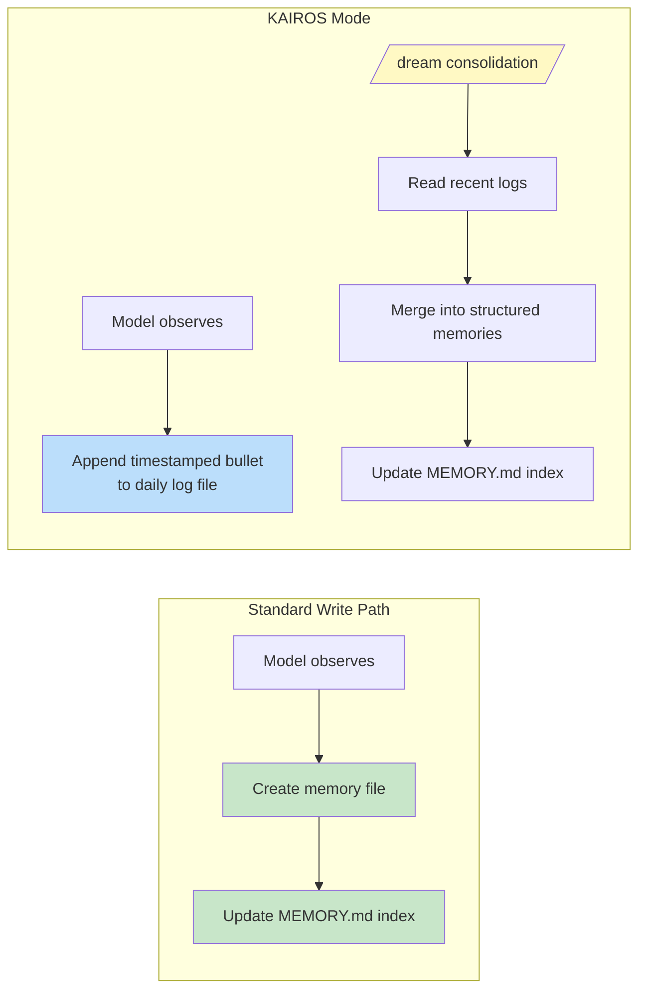

# Chương 11: Memory -- Học qua các cuộc trò chuyện

## The Stateless Problem (vấn đề phi trạng thái)

Mọi chương cho đến đây đều mô tả các cơ chế tồn tại trong một phiên duy nhất. Vòng lặp agent chạy, tools thực thi, sub-agents phối hợp, và khi tiến trình thoát, toàn bộ những thứ đó biến mất. Cuộc trò chuyện tiếp theo bắt đầu với cùng system prompt, cùng định nghĩa tools, cùng model -- và bằng không kiến thức về những gì đã xảy ra trước đó.

Đây là giới hạn nền tảng của một kiến trúc stateless. Một developer chỉnh cách model viết test vào thứ Hai, và thứ Ba model lặp lại đúng lỗi đó. Một user giải thích vai trò của họ, các ràng buộc dự án, sở thích code style, và mỗi phiên mới lại buộc họ giải thích lại từ đầu. Model không phải hay quên -- nó chưa từng biết. Mỗi cuộc trò chuyện là một vũ trụ độc lập.

Vấn đề này không chỉ là lý thuyết. Nó bộc lộ theo những cách cụ thể làm bào mòn niềm tin. User nói "remember, we use real database instances in tests, not mocks" -- và tuần sau model vẫn sinh test dùng mocks. User giải thích họ là senior engineer, không cần giải thích nhập môn -- và phiên kế tiếp lại mở bằng một walkthrough cấp tutorial. Không có memory, mọi phiên đều bắt đầu từ 0. Agent vĩnh viễn là nhân viên mới ngày đầu đi làm.

Lời giải chuẩn trong ngành là Retrieval-Augmented Generation (RAG) (tạo sinh tăng cường truy hồi): nhúng tài liệu thành vector, lưu vào vector database, rồi truy hồi các đoạn liên quan tại thời điểm query. Cách này hoạt động tốt cho knowledge base -- tài liệu, FAQ, tài liệu tham chiếu. Nhưng về mặt kiến trúc, nó lệch với thứ một agent thực sự cần nhớ xuyên phiên. Memory của agent không phải knowledge base. Nó là tập hợp quan sát: user là ai, họ đã sửa gì, các ràng buộc hiện tại của dự án là gì, nên tìm thông tin ở đâu. Những quan sát này nhỏ, đổi thường xuyên, và phải để con người sửa trực tiếp được. Vector database giải đúng một bài toán khác.

Hệ thống memory của Claude Code đặt một cược hoàn toàn khác: file trên đĩa, định dạng Markdown, recall do LLM đảm nhiệm, không cần hạ tầng. Cược ở đây là: lưu trữ đơn giản kết hợp truy hồi thông minh sẽ cho hệ tốt hơn so với việc cả hai phía đều phức tạp.

Triết lý thiết kế này tạo ra các hệ quả định hình toàn bộ hệ thống:

- **Human-readable.** User muốn biết Claude Code nhớ gì chỉ cần mở `~/.claude/projects/<slug>/memory/MEMORY.md` bằng bất kỳ text editor nào. Không cần tool đặc biệt, không cần giải mã, không cần lệnh export.
- **Human-editable.** Memory đã cũ có thể sửa bằng vim. Memory sai có thể xóa bằng `rm`. User có toàn quyền với tri thức của agent.
- **Version-controllable.** Team memories có thể commit vào git. Thay đổi memory diff rất sạch vì chúng là Markdown.
- **Zero infrastructure.** Hệ memory chạy offline, chạy không cần server, chạy trên mọi OS có filesystem. Không có đường migration vì không có schema.
- **Debuggable.** Khi memory hành xử bất ngờ, đường chẩn đoán là `ls` và `cat`, không phải query logs hay soi database.

Model vừa đọc vừa ghi memory bằng `FileWriteTool` và `FileEditTool` -- chính những tool nó dùng để sửa source code (đã giới thiệu ở Chapter 6). Không có memory API riêng. System prompt dạy model một giao thức ghi hai bước (tạo file, cập nhật index), và model thực thi bằng năng lực sẵn có dưới tập chỉ dẫn mới. Đây là tái sử dụng tool như một nguyên lý kiến trúc -- hệ memory không phải một subsystem gắn thêm vào agent, mà là hành vi nổi lên từ chính các năng lực hiện có của agent.

Có một lý do sâu hơn khiến lựa chọn file-based phù hợp ở đây. Memory, với AI agent, khác căn bản memory trong ứng dụng truyền thống. Database của ứng dụng truyền thống giữ authoritative state -- source of truth cho dữ liệu hệ thống. Memory của agent giữ *observations* -- những điều đúng ở một thời điểm và có thể còn đúng hoặc không. File truyền đạt đúng bản chất nhận thức đó một cách tự nhiên. Chúng có thời điểm sửa đổi cho biết quan sát được ghi khi nào. Chúng có thể được con người đọc, sửa, xóa khi biết quan sát đó sai. Database gợi tính vĩnh cửu và thẩm quyền; Markdown file gợi một ghi chú ai đó viết ra và có thể cần cập nhật. Môi trường lưu trữ tự nói lên bản chất dữ liệu -- đây là working notes, không phải chân lý bất biến.

### Per-Project Scoping (phạm vi theo từng dự án)

Memory được scope theo git repository root, không theo working directory. Nếu user mở terminal ở `src/components/` và một terminal khác ở `tests/`, cả hai phiên dùng chung một memory directory. Logic resolution tìm canonical git root trước, rồi mới fallback về project root:

The base path resolution finds the canonical git root first, falling back to the project root. This ensures all git worktrees of the same repository share a single memory directory.

Lời gọi `findCanonicalGitRoot` đảm bảo tất cả git worktrees của cùng repository dùng chung một memory directory. Git root được sanitize (slash đổi thành dấu gạch ngang, qua `sanitizePath()`) để tạo tên thư mục phẳng:

```
~/.claude/projects/-Users-alex-code-myapp/memory/
```

Một memory directory được điền đầy đủ sẽ bộc lộ cấu trúc hệ thống:



Quy ước đặt tên mang tính ngữ nghĩa: `<type>_<topic>.md`. Prefix `type` không bị code ép buộc, nhưng nằm trong chỉ dẫn prompt, giúp bạn quét thư mục bằng mắt và hiểu ngay landscape của memory.

---

## The Four-Type Taxonomy (phân loại bốn kiểu)

Không phải thứ gì cũng đáng để nhớ. Hệ memory giới hạn mọi memory vào đúng bốn loại:

Bốn loại đó là: **user**, **feedback**, **project**, và **reference**.

Taxonomy được thiết kế quanh một tiêu chí duy nhất: **tri thức này có thể suy ra lại từ trạng thái dự án hiện tại hay không?** Code patterns, architecture, file structure, git history -- tất cả đều có thể suy ra lại bằng cách đọc codebase. Chúng bị loại trừ. Bốn loại trên nắm lấy phần không thể suy ra lại.

**User memories** ghi thông tin về con người: vai trò, mục tiêu, trách nhiệm, mức độ chuyên môn. Một senior Go engineer mới học React cần dạng giải thích khác với người mới lập trình lần đầu.

**Feedback memories** ghi hướng dẫn về cách làm việc -- gồm cả correction lẫn confirmation. Hệ thống dặn model phải ghi cả hai: "if you only save corrections, you will drift away from approaches the user has already validated." Mỗi feedback memory có cấu trúc cụ thể: rule, rồi dòng `**Why:**` với lý do (thường là một sự cố đã từng xảy ra), rồi dòng `**How to apply:**` với các điều kiện kích hoạt.

**Project memories** ghi bối cảnh công việc đang diễn ra -- ai làm gì, vì sao, trước hạn nào. Prompt nhấn mạnh việc đổi ngày tương đối thành ngày tuyệt đối: "Thursday" thành "2026-03-05" để memory vẫn diễn giải được sau nhiều tuần.

**Reference memories** là bookmark -- con trỏ tới nơi thông tin nằm trong hệ thống bên ngoài. Một URL dự án Linear, một dashboard Grafana, một kênh Slack. Chúng nói cho model biết nên tìm ở đâu, không phải sẽ tìm thấy gì.

### The Taxonomy as Filter

Bốn loại này không chỉ là category -- chúng là một bộ lọc. Bằng việc định nghĩa chính xác thứ gì được tính là memory, hệ thống ngầm định luôn thứ gì không phải. Không có taxonomy, model háo hức sẽ lưu mọi thứ: code patterns, architecture diagrams, error messages. Tất cả đều có thể suy ra từ codebase. Lưu chúng tạo ra một bản sao song song, có thể stale, cho thông tin vốn nên lấy từ nguồn gốc.

Taxonomy cũng ngăn một thất bại tinh vi hơn: dùng memory như nạng. Nếu model lưu các quyết định kiến trúc thành memory, nó sẽ ngừng đọc codebase để hiểu kiến trúc. Bằng cách loại trừ thông tin có thể suy ra, hệ thống buộc model phải bám sát trạng thái hiện tại của code.

Danh sách loại trừ là tường minh: code patterns, git history, debugging solutions, bất cứ gì trong CLAUDE.md, và chi tiết tác vụ ngắn hạn. Các loại trừ này áp dụng cả khi user yêu cầu lưu rõ ràng. Nếu user nói "remember this PR list," model được chỉ dẫn phản biện lại -- "what was *surprising* or *non-obvious* about it?" Phần bất ngờ đó đáng lưu. Danh sách thô thì không. Chỉ dẫn này được kiểm chứng qua evals, từ 0/2 lên 3/3 khi thêm chỉ dẫn override loại trừ.

### Frontmatter as Contract

Mỗi memory file dùng YAML frontmatter với ba trường bắt buộc:

```markdown
---
name: {{memory name}}
description: {{one-line description -- used to decide relevance}}
type: {{user, feedback, project, reference}}
---
```

`description` là trường chịu tải lớn nhất. Đây là thứ relevance selector (một Sonnet side-query, sẽ bàn bên dưới) dùng để quyết định có nên đưa memory này lên hay không. Mô tả mơ hồ như "testing stuff" sẽ hoặc match quá rộng, hoặc không match gì cả. Mô tả cụ thể như "Integration tests must hit real DB, not mocks -- burned by mock divergence Q4" match chính xác đúng những cuộc trò chuyện cần nó. Description là search index của memory -- được tiêu thụ không phải bởi search engine, mà bởi language model có thể hiểu nuance, context và intent.

Frontmatter cũng là phần duy nhất của file mà hệ scanning đọc trong lúc recall. `scanMemoryFiles()` chỉ đọc mỗi file tới 30 dòng đầu để trích header. Phần body là riêng tư cho đến khi file được chọn và nạp một cách tường minh.

---

## The Write Path

Ghi một memory là quy trình hai bước, thực thi bằng các file tools chuẩn.

**Step 1: Write the memory file.** Model tạo một file `.md` trong memory directory với YAML frontmatter:

```markdown
---
name: Testing Policy
description: Integration tests must hit real DB, not mocks
type: feedback
---

Don't mock the database in integration tests.

**Why:** We got burned last quarter when mocked tests passed but production
queries hit edge cases the mocks didn't cover.

**How to apply:** Any test file under `__tests__/` that touches database
operations should use the real PGlite instance from test-utils.
```

**Step 2: Update the index.** Model thêm một dòng con trỏ vào `MEMORY.md`:

```markdown
- [Testing Policy](feedback_testing.md) -- integration tests must hit real DB
```

Mỗi entry phải giữ dưới khoảng 150 ký tự. Index là mục lục, không phải knowledge base.

Khi model học thông tin mới làm thay đổi một memory đã có, nó dùng `FileEditTool` để cập nhật file hiện hữu thay vì tạo bản trùng lặp. Hệ thống không version memory nội bộ -- file nằm trên local filesystem, và user có `git` nếu muốn versioning. Trước khi prompt được dựng, `ensureMemoryDirExists()` tạo memory directory, và prompt nói rõ thư mục đã tồn tại, tránh lãng phí lượt cho `ls` và `mkdir -p`.

---

## The Recall Path

Ghi memory là cần thiết nhưng chưa đủ. Bài toán khó hơn là retrieval: với query của user, file memory nào trong hàng trăm file tiềm năng cần được nạp vào context của model? Nạp tất cả sẽ đốt hết token budget. Không nạp file nào thì mất mục đích. Nạp sai file thì vừa tốn token cho thông tin không liên quan vừa bỏ sót tri thức đáng ra đã đổi hành vi của model.

Hệ recall chạy theo hai tầng. Index `MEMORY.md` luôn được nạp vào context khi bắt đầu phiên để định hướng. Các file memory riêng lẻ được đưa lên on-demand qua một relevance query do LLM điều khiển, chọn tối đa năm memory mỗi lượt.

### The Full Recall Pipeline



Async prefetch ở bước 2 là quyết định hiệu năng then chốt. Đến lúc model chính đi đến điểm mà ngữ cảnh recall trở nên hữu ích, side-query thường đã xong. User không cảm nhận thêm độ trễ.

### The Sonnet Side-Query

Manifest được gửi tới model Sonnet dưới dạng side-query. System prompt cho selector này rất chặt:

System prompt cho selector chỉ dẫn nó phải bảo thủ: chỉ đưa vào những memory hữu ích cho query hiện tại, bỏ qua memory nếu không chắc, và tránh chọn tài liệu API/usage cho tools đang được dùng tích cực (vì model đã nạp các tools đó rồi) -- nhưng vẫn đưa lên các warnings, gotchas, hoặc known issues về những tools đó.

Phản hồi dùng structured output -- `{ selected_memories: string[] }` -- và filenames được kiểm tra đối chiếu với tập tên đã biết.

Cách tiếp cận này đổi latency lấy precision, và phân tích tradeoff rất đáng học. **Keyword matching** nhanh nhưng không hiểu ngữ cảnh -- nó không diễn đạt được điều kiện kiểu "do not select memories for tools already in active use." **Embedding similarity** xử lý semantic matching nhưng kéo theo hạ tầng (embedding model, vector store, update pipeline) và xử lý phủ định kém -- embedding của "do NOT use database mocks" rất gần "use database mocks." **The Sonnet side-query** hiểu semantic relevance, suy luận theo ngữ cảnh, xử lý phủ định, và không cần hạ tầng. Chi phí latency có thật (vài trăm mili-giây) nhưng bị che phía sau giai đoạn xử lý ban đầu của model chính.

Hệ telemetry theo dõi selection rates ngay cả khi không memory nào được chọn. Selection rate 0/150 khác hẳn 0/3 -- trường hợp đầu cho thấy vấn đề precision, trường hợp sau cho thấy vấn đề coverage.

---

## Staleness

Hệ staleness xử lý một failure mode lộ ra từ usage thực tế. User báo rằng các memory cũ -- chứa trích dẫn file:line tới code đã đổi từ lâu -- vẫn bị model khẳng định như sự thật. Trích dẫn khiến tuyên bố stale nghe *có thẩm quyền hơn*, không phải ít đi.

Giải pháp không phải expiration. Memory cũ không bị xóa -- chúng có thể chứa institutional knowledge còn giá trị nhiều năm. Thay vào đó, hệ thống gắn age warnings:

Hàm staleness tính tuổi của memory theo ngày. Memory từ hôm nay hoặc hôm qua thì không có cảnh báo (hàm trả chuỗi rỗng). Mọi thứ cũ hơn sẽ được chèn caveat kèm nội dung memory: thông điệp nêu tuổi theo ngày và cảnh báo rằng các khẳng định về hành vi code hoặc trích dẫn file:line có thể đã lỗi thời, khuyên phải kiểm chứng với code hiện tại.

Memory từ hôm nay hoặc hôm qua không có cảnh báo. Mọi thứ cũ hơn đều được gắn caveat staleness cạnh nội dung memory. Định dạng dễ đọc cho người -- "today," "yesterday," "47 days ago" -- tồn tại vì model làm date arithmetic không tốt. ISO timestamp thô không kích hoạt suy luận về độ cũ theo cách "47 days ago" làm được. Đây là quan sát thực nghiệm về hành vi model, được xác nhận qua evals: framing dạng action-cue "Before recommending from memory" đạt 3/3 so với 0/3 cho framing trừu tượng hơn "Trusting what you recall," dù phần thân giống hệt.

Có một căng thẳng mang tính triết học đáng gọi tên. Hệ staleness xem memory là giả thuyết, không phải sự kiện. Nhưng xu hướng tự nhiên của model là trình bày thông tin một cách tự tin. Cảnh báo staleness đang chống lại chính giọng điệu của model -- dùng khả năng tuân thủ chỉ dẫn để ghi đè xu hướng tạo tự tin.

---

## MEMORY.md as the Always-Loaded Index

Mọi cuộc trò chuyện đều bắt đầu với `MEMORY.md` trong context. Nó không phải memory -- nó là index, mục lục cho các file memory thực sự.

Index có hai hard caps:

Index có hai hard caps: 200 lines và 25,000 bytes.

Mốc 200 dòng bắt tăng trưởng bình thường. Mốc 25KB theo byte bắt một failure mode từng quan sát: user nhồi các dòng rất dài khiến file vẫn dưới 200 dòng nhưng ngốn token budget khổng lồ. Ở phân vị 97, một MEMORY.md chỉ 197 dòng nặng tới 197KB. Khi một trong hai mốc kích hoạt, hệ thống đưa guidance có thể hành động: "Keep index entries to one line under ~200 chars; move detail into topic files."

Kiến trúc hai tầng này -- index luôn bật nhẹ cân cộng với nội dung nặng tải theo nhu cầu -- là thiết kế giúp memory scale. Dự án có 150 memories sẽ có index 150 dòng tiêu tốn khoảng 3,000 tokens, không phải 150 file đầy đủ tiêu tốn 100,000.

---

Chuyển từ memory cá nhân sang tri thức chia sẻ là bước đi tự nhiên. Một chính sách testing, một quy ước deployment, một gotcha đã biết trong build system -- các thứ này cần chia sẻ cho cả team.

## Team Memory

Team memory là thư mục con của auto-memory directory tại `<autoMemPath>/team/`, bị gate bởi feature flag và yêu cầu auto-memory đang bật. Cách lồng kiến trúc này có chủ ý: tắt auto-memory sẽ tắt theo kiểu bắc cầu cả team memory.

### Defense in Depth

Team memory tạo ra một bề mặt tấn công mà memory cá nhân không có. File đồng bộ theo team đến từ user khác, và một teammate độc hại có thể thử path traversal. Security model dùng ba lớp phòng thủ.

**Layer 1: Input sanitization.** Hàm `sanitizePathKey()` kiểm tra null bytes, URL-encoded traversals (`%2e%2e%2f`), tấn công Unicode normalization (ký tự fullwidth chuẩn hóa thành `../`), backslashes, và absolute paths.

**Layer 2: String-level path validation.** Sau khi sanitize, `path.resolve()` chuẩn hóa các đoạn `..` còn lại, và đường dẫn đã resolve được đối chiếu với prefix thư mục team (kèm trailing separator để ngăn `team-evil/` khớp với `team/`).

**Layer 3: Symlink resolution.** `realpathDeepestExisting()` resolve symlinks tại tổ tiên sâu nhất đang tồn tại, bắt các đòn tấn công mà kiểm tra chuỗi không phát hiện được. Nếu `team/evil` là symlink trỏ tới `/etc/`, kiểm tra chuỗi thấy prefix hợp lệ, nhưng `realpath` lộ mục tiêu thật.

Mọi lỗi validation đều sinh `PathTraversalError`. Không thành công một phần, không fallback. Fail closed.

### Scope Guidance

Prompt dạy model phân biệt memory riêng tư và memory chia sẻ. User memories luôn riêng tư. Reference memories thường là của team. Feedback memories mặc định riêng tư trừ khi chúng là quy ước toàn dự án. Chỉ dẫn cross-check -- "Before saving a private feedback memory, check that it does not contradict a team feedback memory" -- ngăn việc guidance mâu thuẫn xuất hiện khó đoán tùy file nào được recall trước.

---

## KAIROS Mode: Append-Only Daily Logs

Memory chuẩn giả định các phiên rời rạc. KAIROS mode (assistant mode của Claude Code) phá giả định này -- phiên kéo dài, có thể chạy nhiều ngày. Mẫu ghi hai bước không scale cho vận hành liên tục.

Giải pháp là tách kiến trúc giữa capture và consolidation:



Trong KAIROS mode, model append vào file log đặt tên theo ngày (`<autoMemPath>/logs/YYYY/MM/YYYY-MM-DD.md`). Mỗi entry là một bullet ngắn có timestamp. Model được chỉ dẫn: "Do not rewrite or reorganize the log" -- tái cấu trúc trong lúc capture làm mất tín hiệu thứ tự thời gian mà consolidation cần.

Đường dẫn trong prompt được mô tả như một *pattern* thay vì ngày cụ thể hôm nay. Đây là tối ưu caching: memory prompt được cache và không bị vô hiệu khi ngày đổi lúc nửa đêm. Model suy ra ngày hiện tại từ attachment `date_change` riêng.

### The /dream Consolidation

Consolidation chạy qua bốn pha: **Orient** (liệt kê thư mục, đọc index, lướt file hiện có), **Gather** (tìm trong logs, kiểm tra memory bị drift), **Consolidate** (ghi hoặc cập nhật file, merge thay vì duplicate), **Prune** (cập nhật index dưới 200 dòng, gỡ con trỏ stale). Việc nhấn mạnh merge vào file hiện có thay vì tạo file mới rất quan trọng -- nếu không, memory directory sẽ phình tuyến tính theo usage.

### The Consolidation Lock

File lock `.consolidate-lock` có hai vai trò: nội dung là PID của holder (mutual exclusion), còn mtime *chính là* `lastConsolidatedAt` (trạng thái scheduling). Auto-dream chạy khi ba gate cùng qua, theo thứ tự rẻ nhất trước: số giờ từ lần consolidation trước vượt 24, số phiên bị sửa đổi kể từ đó vượt 5, và không có tiến trình khác giữ lock. Cơ chế crash recovery phát hiện PID chết qua `process.kill(pid, 0)`, kèm timeout stale một giờ để phòng PID reuse.

---

## Background Extraction

Agent chính có đầy đủ chỉ dẫn để chủ động ghi memory. Nhưng agent không hoàn hảo -- và kiểu thiếu sót có thể dự đoán được. Khi user nói "remember to always use integration tests" rồi ngay sau đó hỏi "now fix the login bug," sự chú ý của model chuyển hẳn sang bug. Chỉ dẫn lưu memory đã được xử lý nhưng có thể không được thực thi.

Ở cuối mỗi query loop hoàn chỉnh, một forked agent -- chia sẻ prompt cache của parent -- phân tích các message gần đây và ghi các memory mà agent chính bỏ lỡ. Khi agent chính đã ghi memory trong khoảng lượt hiện tại, extraction agent bỏ qua khoảng đó. Extraction agent có tool budget bị ràng buộc: tools chỉ đọc cộng quyền ghi chỉ trong các đường dẫn memory directory. Prompt của nó dạy chiến lược hai lượt: lượt 1 đọc song song, lượt 2 ghi song song.

Tương tác này mang tính hợp tác, không cạnh tranh. Prompt của agent chính luôn chứa đầy đủ chỉ dẫn lưu. Khi agent chính đã lưu, background agent nhường. Khi chưa lưu, background agent lấp khoảng trống. Mẫu này -- đường chính cộng lưới an toàn nền -- làm việc capture memory đáng tin hơn mà không tăng tải cho tương tác chính. Chỉ một trong hai thì không đủ.

---

## Path Resolution and Security

Đường dẫn auto-memory được resolve qua một chuỗi ưu tiên:

1. **`CLAUDE_COWORK_MEMORY_PATH_OVERRIDE`** -- Full-path override cho Cowork.
2. **`autoMemoryDirectory` in settings.json** -- Chỉ các nguồn settings đáng tin. Project settings bị loại trừ có chủ ý.
3. **Default computed path** -- `~/.claude/projects/<sanitized-git-root>/memory/`.

Việc loại trừ project settings là một quyết định bảo mật. Một repository độc hại có thể commit `.claude/settings.json` với `autoMemoryDirectory: "~/.ssh"`, và permission carve-out cho file memory sẽ cấp cho model quyền ghi tự động vào SSH keys. Bằng cách giới hạn override chỉ ở policy, flag, local, và user settings -- những nơi không thể commit vào repository -- vector tấn công này bị đóng lại.

Hàm `isAutoMemPath()` chuẩn hóa đường dẫn trước khi kiểm tra prefix để chặn traversal, và quy ước trailing separator đảm bảo prefix matching phải có ranh giới thư mục.

### The Enable/Disable Chain

Việc auto-memory có hoạt động hay không được quyết định bởi `isAutoMemoryEnabled()`, với chuỗi ưu tiên riêng: environment variable, bare mode, CCR không có persistent storage, settings, mặc định bật. Khi tắt, cả phần prompt đều bị loại (nên model không nhận chỉ dẫn memory) và các tiến trình nền cũng dừng (extract-memories, auto-dream, team sync). Cả hai gate phải đồng bộ -- chỉ gỡ prompt thôi không dừng được extraction agent vì nó có prompt riêng.

---

## Apply This: Designing Agent Memory

Độ phức tạp của hệ memory nằm ở tầng hành vi -- chỉ dẫn prompt, recall do LLM điều khiển, quản lý staleness, background extraction -- chứ không nằm ở hạ tầng lưu trữ. Bản thân cách phân bổ độ phức tạp này đã là một nguyên lý thiết kế.

**Files beat databases for agent memory.** File có thể kiểm tra, chỉnh sửa, và quản lý phiên bản. Tính minh bạch xây niềm tin. Khi phương án còn lại là database user khó đọc trực tiếp, file thắng chỉ riêng ở mức độ tin cậy.

**Constrain what gets saved, not just how.** Derivability test -- tri thức này có thể suy ra lại từ trạng thái dự án hiện tại không? -- loại phần lớn memory tiềm năng, nhưng giữ lại đúng phần thực sự quan trọng.

**Use an LLM for recall, not keywords or embeddings.** Side-query bằng LLM hiểu ngữ cảnh, suy luận thứ đã có sẵn trong cuộc trò chuyện, xử lý phủ định, và không cần bảo trì index. Chi phí latency có thật nhưng hữu hạn và bị che sau quá trình xử lý của model chính.

**Warn about staleness, do not expire.** Institutional knowledge có thể còn giá trị nhiều năm. Gắn cảnh báo tuổi giúp model coi memory cũ là giả thuyết thay vì sự thật. Định dạng tuổi dễ đọc kích hoạt đúng kiểu suy luận theo cách timestamp thô không làm được.

**Build a safety net for capture.** Agent chính sẽ bỏ sót memory. Một background extraction agent rà lại cuộc trò chuyện gần đây làm hệ thống đáng tin hơn mà không tăng tải cho tương tác chính. Khi agent chính lưu, background agent nhường.

---

Giờ đây agent có thể học xuyên phiên -- tích lũy tri thức về user, sở thích của họ, trạng thái dự án, và các correction họ đã đưa ra. Hệ memory đưa ra một cam kết mang tính triết học: quan hệ giữa agent và user phải sâu dần theo thời gian, không reset ở mỗi tương tác. Cách triển khai file-based làm cam kết đó trở nên hữu hình -- nhìn thấy được trên đĩa, sửa được bởi con người, và version-controlled song song với code. Memory của agent không phải black box. Nó là tập ghi chú trong một thư mục, viết bằng ngôn ngữ mà cả model lẫn con người đều đọc được.

Chương tiếp theo sẽ xem cách Claude Code mở rộng năng lực vượt ra ngoài lõi: hệ skills dạy model hành vi mới, và hệ hooks cho phép code bên ngoài ràng buộc và sửa đổi các hành vi đó tại hơn hai chục điểm trong lifecycle.
