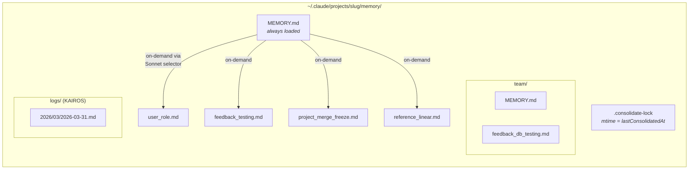
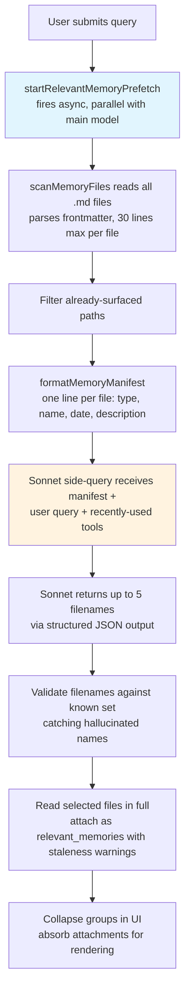
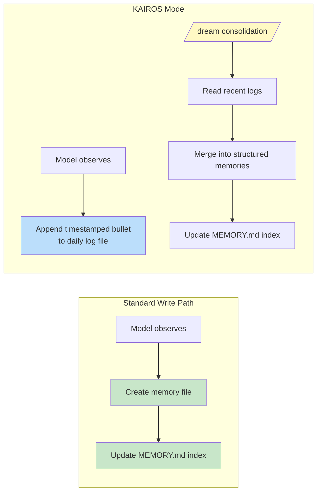

# Chương 11: Memory -- Học qua các cuộc trò chuyện

## The Stateless Problem

Mọi chương từ đầu đến giờ đều mô tả các cơ chế chỉ tồn tại trong một phiên làm việc. Vòng lặp agent chạy, tool thực thi, sub-agent phối hợp, và khi tiến trình kết thúc thì toàn bộ trạng thái đó biến mất. Cuộc trò chuyện tiếp theo lại khởi động với cùng system prompt, cùng định nghĩa tool, cùng model -- và hoàn toàn không biết điều gì đã xảy ra trước đó.

Đó là giới hạn cốt lõi của kiến trúc stateless. Thứ Hai, một developer chỉnh lại cách model viết test; thứ Ba, model lặp lại đúng lỗi cũ. User giải thích vai trò của họ, ràng buộc dự án, phong cách code họ muốn, rồi mỗi phiên mới lại phải giải thích lại từ đầu. Model không phải “hay quên” -- nó chưa từng biết. Mỗi cuộc trò chuyện là một vũ trụ độc lập.

Đây không phải vấn đề lý thuyết. Nó xuất hiện rất cụ thể và bào mòn niềm tin. User nói “remember, we use real database instances in tests, not mocks” -- tuần sau model vẫn sinh test dùng mock. User nói họ là senior engineer, không cần giải thích kiểu nhập môn -- phiên sau lại mở đầu bằng walkthrough mức tutorial. Không có memory, mọi phiên đều bắt đầu từ số 0. Agent luôn là nhân viên mới trong ngày đầu đi làm.

Lời giải phổ biến trong ngành là Retrieval-Augmented Generation (RAG): nhúng tài liệu thành vector, lưu vào vector database, rồi truy hồi các đoạn liên quan ở thời điểm query. Cách này rất hợp cho knowledge base -- tài liệu, FAQ, reference. Nhưng về kiến trúc, nó lệch với thứ agent thực sự cần nhớ xuyên phiên. Memory của agent không phải knowledge base. Đó là tập hợp quan sát: user là ai, họ đã chỉnh model thế nào, ràng buộc hiện tại của dự án là gì, nên tìm thông tin ở đâu. Những quan sát này nhỏ, đổi nhanh, và cần để con người chỉnh sửa trực tiếp. Vector database đang giải một bài toán khác.

Hệ thống memory của Claude Code đặt một cược khác hẳn: file trên đĩa, định dạng Markdown, recall do LLM điều khiển, không cần hạ tầng. Cược này nói rằng lưu trữ càng đơn giản, kết hợp truy hồi đủ thông minh, sẽ tạo ra hệ tốt hơn việc làm cả lưu trữ lẫn truy hồi đều phức tạp.

Triết lý thiết kế đó kéo theo những hệ quả định hình toàn bộ hệ thống:

- **Human-readable.** User muốn xem Claude Code nhớ gì chỉ cần mở `~/.claude/projects/<slug>/memory/MEMORY.md` bằng bất kỳ trình soạn thảo nào. Không cần tool đặc biệt, không cần giải mã, không cần lệnh export.
- **Human-editable.** Memory cũ có thể sửa bằng vim. Memory sai có thể xóa bằng `rm`. User có toàn quyền đối với tri thức mà agent đang giữ.
- **Version-controllable.** Team memory có thể commit vào git. Thay đổi memory diff rất sạch vì nó là Markdown.
- **Zero infrastructure.** Hệ memory chạy offline, không cần server, chạy trên mọi OS có filesystem. Không cần đường migration vì không có schema.
- **Debuggable.** Khi memory hoạt động bất thường, đường chẩn đoán là `ls` và `cat`, không phải query log hay soi database.

Model vừa đọc vừa ghi memory bằng `FileWriteTool` và `FileEditTool` -- chính các tool đã dùng để sửa source code (đã giới thiệu ở Chương 6). Không có memory API riêng. System prompt dạy model giao thức ghi hai bước (tạo file, cập nhật index), và model thực thi bằng đúng năng lực sẵn có dưới bộ chỉ dẫn mới. Đây là nguyên lý tái sử dụng tool ở cấp kiến trúc -- memory không phải một subsystem gắn thêm vào agent, mà là hành vi nổi lên từ chính năng lực hiện hữu của agent.

Có một lý do sâu hơn khiến lựa chọn file-based hiệu quả trong bài toán này. Memory của AI agent khác bản chất với memory trong ứng dụng truyền thống. Database của ứng dụng truyền thống giữ authoritative state -- source of truth cho dữ liệu hệ thống. Memory của agent giữ *observations* -- những điều từng đúng ở một thời điểm và có thể còn đúng hoặc không. File truyền đạt đúng trạng thái nhận thức đó một cách tự nhiên. Nó có thời gian chỉnh sửa để biết quan sát được ghi khi nào. Nó cho phép con người đọc, sửa, xóa khi biết quan sát đã sai. Database gợi cảm giác ổn định và thẩm quyền; Markdown file gợi cảm giác ghi chú làm việc có thể cần cập nhật. Phương tiện lưu trữ tự nói lên bản chất dữ liệu -- đây là working notes, không phải chân lý bất biến.

### Per-Project Scoping

Memory được scope theo git repository root, không theo working directory. Nếu user mở terminal ở `src/components/` và một terminal khác ở `tests/`, cả hai phiên dùng chung một memory directory. Logic resolution sẽ tìm canonical git root trước, rồi mới fallback về project root:

The base path resolution finds the canonical git root first, falling back to the project root. This ensures all git worktrees of the same repository share a single memory directory.

Lời gọi `findCanonicalGitRoot` đảm bảo mọi git worktree của cùng một repository dùng chung một memory directory. Git root được sanitize (dấu gạch chéo được đổi thành dấu gạch ngang, qua `sanitizePath()`) để tạo ra tên thư mục phẳng:

```
~/.claude/projects/-Users-alex-code-myapp/memory/
```

Một memory directory đã được điền đầy đủ sẽ bộc lộ cấu trúc hệ thống như sau:



Quy ước đặt tên mang tính ngữ nghĩa: `<type>_<topic>.md`. Prefix loại (`type`) không bị ép buộc bằng code, nhưng được quy định trong prompt, nhờ đó chỉ cần nhìn tên file là có thể nắm nhanh toàn cảnh memory.

---

## The Four-Type Taxonomy

Không phải thứ gì cũng đáng để nhớ. Hệ memory giới hạn mọi memory vào đúng bốn loại:

Bốn loại là: **user**, **feedback**, **project**, và **reference**.

Taxonomy này xoay quanh một tiêu chí duy nhất: **tri thức đó có thể suy ra lại từ trạng thái dự án hiện tại hay không?** Code pattern, architecture, file structure, git history -- tất cả đều có thể suy ra lại bằng cách đọc codebase. Vì vậy chúng bị loại. Bốn loại trên nắm phần không thể suy ra lại.

**User memories** lưu thông tin về con người: vai trò, mục tiêu, trách nhiệm, mức độ chuyên môn. Một senior Go engineer mới học React cần cách giải thích khác với người mới bắt đầu lập trình.

**Feedback memories** lưu hướng dẫn về cách làm việc -- gồm cả chỉnh sai và xác nhận đúng. Hệ thống chỉ dẫn rõ model phải lưu cả hai: “if you only save corrections, you will drift away from approaches the user has already validated.” Mỗi feedback memory có cấu trúc cố định: rule, rồi dòng `**Why:**` nêu lý do (thường là sự cố từng xảy ra), rồi dòng `**How to apply:**` nêu điều kiện áp dụng.

**Project memories** lưu bối cảnh công việc đang diễn ra -- ai làm gì, vì sao, đến hạn nào. Prompt nhấn mạnh việc đổi mốc thời gian tương đối sang ngày tuyệt đối: “Thursday” thành “2026-03-05” để memory vẫn đọc được sau nhiều tuần.

**Reference memories** là bookmark -- con trỏ đến nơi thông tin nằm trong hệ thống bên ngoài. Ví dụ URL dự án Linear, dashboard Grafana, kênh Slack. Nó cho model biết nên tìm ở đâu, không phải sẽ tìm thấy gì.

### The Taxonomy as Filter

Bốn loại này không chỉ là phân loại -- chúng là bộ lọc. Khi định nghĩa chính xác thứ gì được tính là memory, hệ thống đồng thời định nghĩa thứ gì không được tính. Nếu không có taxonomy, một model quá nhiệt tình sẽ lưu mọi thứ: code pattern, sơ đồ kiến trúc, thông báo lỗi. Nhưng các thông tin đó đều có thể suy ra từ codebase. Lưu chúng chỉ tạo ra một bản sao song song dễ stale của thứ nên đọc trực tiếp từ nguồn.

Taxonomy cũng ngăn một lỗi tinh vi hơn: dùng memory như nạng. Nếu model lưu quyết định kiến trúc vào memory, nó sẽ bớt đọc codebase để hiểu kiến trúc thật. Loại trừ thông tin có thể suy ra buộc model phải bám vào trạng thái hiện tại của code.

Danh sách loại trừ được nêu rõ: code pattern, git history, cách debug, mọi thứ trong CLAUDE.md, và chi tiết tác vụ ngắn hạn. Các loại trừ này vẫn có hiệu lực ngay cả khi user yêu cầu lưu trực tiếp. Nếu user nói “remember this PR list,” model được dạy phải phản biện: “what was *surprising* or *non-obvious* about it?” Phần bất ngờ đó mới đáng lưu. Danh sách thô thì không. Chỉ dẫn này đã được kiểm chứng qua eval: từ 0/2 lên 3/3 sau khi thêm rule override loại trừ.

### Frontmatter as Contract

Mọi memory file dùng YAML frontmatter với ba trường bắt buộc:

```markdown
---
name: {{memory name}}
description: {{one-line description -- used to decide relevance}}
type: {{user, feedback, project, reference}}
---
```

`description` là trường quan trọng nhất. Đây là dữ liệu mà relevance selector (một Sonnet side-query, sẽ nói bên dưới) dùng để quyết định có đưa memory này vào hay không. Mô tả mơ hồ kiểu “testing stuff” sẽ hoặc match quá rộng, hoặc không match gì. Mô tả cụ thể như “Integration tests must hit real DB, not mocks -- burned by mock divergence Q4” sẽ match đúng những cuộc hội thoại cần nó. Nói cách khác, description là search index của memory -- được đọc không phải bởi search engine, mà bởi language model có thể hiểu nuance, context và intent.

Frontmatter cũng là phần duy nhất của file mà hệ scan đọc trong lúc recall. `scanMemoryFiles()` chỉ đọc mỗi file đến 30 dòng đầu để trích header. Phần body chưa được đụng đến cho tới khi file được chọn và nạp rõ ràng.

---

## The Write Path

Ghi một memory là quy trình hai bước dùng các file tool tiêu chuẩn.

**Step 1: Write the memory file.** Model tạo file `.md` trong memory directory với YAML frontmatter:

```markdown
---
name: Testing Policy
description: Integration tests must hit real DB, not mocks
type: feedback
---

Don't mock the database in integration tests.

**Why:** We got burned last quarter when mocked tests passed but production
queries hit edge cases the mocks didn't cover.

**How to apply:** Any test file under `__tests__/` that touches database
operations should use the real PGlite instance from test-utils.
```

**Step 2: Update the index.** Model thêm một dòng con trỏ vào `MEMORY.md`:

```markdown
- [Testing Policy](feedback_testing.md) -- integration tests must hit real DB
```

Mỗi entry phải giữ dưới khoảng 150 ký tự. Index là mục lục, không phải knowledge base.

Khi model học thêm thông tin làm thay đổi một memory đã tồn tại, nó dùng `FileEditTool` để cập nhật file cũ thay vì tạo bản trùng. Hệ thống không version memory nội bộ -- file nằm trên local filesystem, và user có `git` nếu muốn versioning. Trước khi prompt được dựng, `ensureMemoryDirExists()` tạo memory directory, và prompt nói rõ thư mục đã tồn tại để tránh tốn lượt vô ích cho `ls` và `mkdir -p`.

---

## The Recall Path

Ghi memory là cần nhưng chưa đủ. Bài toán khó hơn là retrieval: từ query của user, trong hàng trăm memory file tiềm năng, file nào cần nạp vào context của model? Nạp tất cả sẽ làm cạn token budget. Không nạp gì thì mất ý nghĩa của memory. Nạp sai file thì vừa tốn token cho thông tin không liên quan, vừa bỏ lỡ tri thức đáng lẽ có thể đổi hành vi của model.

Recall vận hành theo hai tầng. Index `MEMORY.md` luôn được nạp từ đầu phiên để định hướng. Các memory file riêng lẻ chỉ được đưa vào khi cần qua relevance query do LLM điều khiển, tối đa năm memory mỗi lượt.

### The Full Recall Pipeline



Async prefetch ở bước 2 là quyết định hiệu năng quan trọng nhất. Đến lúc model chính cần ngữ cảnh recall, side-query thường đã chạy xong. User gần như không cảm nhận thêm độ trễ.

### The Sonnet Side-Query

Manifest được gửi tới model Sonnet như một side-query. System prompt của selector này rất cụ thể:

The system prompt for the selector instructs it to be conservative: include only memories that will be useful for the current query, skip memories if uncertain, and avoid selecting API/usage documentation for tools already in active use (since the model already has those tools loaded) -- but still surface warnings, gotchas, or known issues about those tools.

Phản hồi dùng structured output -- `{ selected_memories: string[] }` -- và filename được kiểm tra chéo với tập tên hợp lệ đã biết.

Cách tiếp cận này đánh đổi latency lấy precision, và phân tích tradeoff rất đáng học. **Keyword matching** nhanh nhưng không hiểu ngữ cảnh -- không thể diễn đạt điều kiện như “do not select memories for tools already in active use.” **Embedding similarity** xử lý ngữ nghĩa tốt hơn nhưng kéo theo hạ tầng (embedding model, vector store, update pipeline) và xử lý phủ định kém -- embedding của “do NOT use database mocks” rất gần “use database mocks.” **The Sonnet side-query** hiểu semantic relevance, suy luận theo ngữ cảnh, xử lý phủ định, và không cần hạ tầng. Chi phí latency có thật (vài trăm mili giây), nhưng được ẩn dưới thời gian xử lý đầu của model chính.

Hệ telemetry theo dõi selection rate kể cả khi không memory nào được chọn. 0/150 khác hoàn toàn 0/3 -- trường hợp đầu là vấn đề precision, trường hợp sau là vấn đề coverage.

---

## Staleness

Hệ staleness xử lý một failure mode xuất hiện từ sử dụng thực tế. User báo rằng memory cũ -- chứa trích dẫn file:line tới code đã đổi -- vẫn bị model khẳng định như sự thật. Trích dẫn làm nhận định stale trông *có thẩm quyền hơn*, không phải kém đi.

Giải pháp không phải expiration. Memory cũ không bị xóa -- chúng có thể chứa institutional knowledge còn đúng trong nhiều năm. Thay vào đó, hệ thống gắn age warning:

The staleness function computes the memory's age in days. Memories from today or yesterday get no warning (the function returns an empty string). Everything older gets a caveat injected alongside the memory content: a message stating the age in days and warning that code behavior claims or file:line citations may be outdated, advising verification against current code.

Memory từ hôm nay hoặc hôm qua thì không có cảnh báo. Mọi memory cũ hơn đều được gắn caveat staleness đi kèm nội dung. Định dạng dễ đọc cho người -- “today,” “yesterday,” “47 days ago” -- tồn tại vì model xử lý date arithmetic không tốt. ISO timestamp thô không kích hoạt suy luận về độ cũ bằng “47 days ago”. Đây là quan sát thực nghiệm về hành vi model, đã được xác nhận qua eval: framing theo action-cue “Before recommending from memory” đạt 3/3, còn framing trừu tượng hơn “Trusting what you recall” đạt 0/3, dù nội dung thân gần như giống nhau.

Có một căng thẳng mang tính triết học đáng nêu. Hệ staleness coi memory là giả thuyết, không phải sự kiện. Nhưng model có xu hướng trình bày thông tin rất tự tin. Cảnh báo staleness đang đi ngược chính giọng điệu tự nhiên đó -- dùng khả năng tuân thủ chỉ dẫn để ghi đè xu hướng tạo cảm giác chắc chắn.

---

## MEMORY.md as the Always-Loaded Index

Mọi cuộc trò chuyện đều bắt đầu với `MEMORY.md` trong context. Nó không phải memory -- nó là index, mục lục cho các memory file thực sự.

Index có hai hard cap:

The index has two hard caps: 200 lines and 25,000 bytes.

Giới hạn 200 dòng xử lý tăng trưởng bình thường. Giới hạn 25KB theo byte bắt một failure mode đã quan sát được: user nhét các dòng rất dài, nên file vẫn dưới 200 dòng nhưng đốt token budget khổng lồ. Ở phân vị 97, một `MEMORY.md` chỉ 197 dòng có thể nặng tới 197KB. Khi chạm một trong hai ngưỡng, hệ thống đưa hướng dẫn có thể hành động ngay: “Keep index entries to one line under ~200 chars; move detail into topic files.”

Kiến trúc hai tầng này -- index nhẹ luôn bật + nội dung nặng nạp theo nhu cầu -- chính là thiết kế giúp memory scale. Dự án có 150 memory thì chỉ cần index 150 dòng, tiêu tốn khoảng 3,000 token, thay vì nạp cả 150 file đầy đủ có thể ngốn 100,000 token.

---

Việc chuyển từ memory cá nhân sang tri thức dùng chung là bước tiến tự nhiên. Chính sách testing, quy ước deploy, hay một gotcha đã biết trong build system -- những thứ này cần chia sẻ cho cả team.

## Team Memory

Team memory là thư mục con của auto-memory directory tại `<autoMemPath>/team/`, được gate bằng feature flag và yêu cầu auto-memory đang bật. Cách lồng này có chủ đích: tắt auto-memory sẽ kéo theo tắt team memory.

### Defense in Depth

Team memory mở ra bề mặt tấn công mà memory cá nhân không có. File đồng bộ theo team đến từ user khác, và một teammate độc hại có thể thử path traversal. Security model dùng ba lớp phòng thủ.

**Layer 1: Input sanitization.** Hàm `sanitizePathKey()` kiểm tra null byte, URL-encoded traversal (`%2e%2e%2f`), tấn công Unicode normalization (ký tự fullwidth chuẩn hóa thành `../`), dấu backslash, và absolute path.

**Layer 2: String-level path validation.** Sau bước sanitize, `path.resolve()` chuẩn hóa các đoạn `..` còn lại; rồi đường dẫn đã resolve được so prefix với thư mục team (kèm trailing separator để ngăn `team-evil/` khớp nhầm `team/`).

**Layer 3: Symlink resolution.** `realpathDeepestExisting()` resolve symlink ở tổ tiên sâu nhất đang tồn tại, bắt các đòn mà kiểm tra chuỗi không phát hiện được. Nếu `team/evil` là symlink trỏ sang `/etc/`, kiểm tra chuỗi vẫn thấy prefix hợp lệ, nhưng `realpath` sẽ lộ đích thật.

Mọi lỗi validation đều trả về `PathTraversalError`. Không có thành công một phần, không fallback. Fail closed.

### Scope Guidance

Prompt dạy model phân biệt memory riêng tư và memory chia sẻ. User memory luôn riêng tư. Reference memory thường là của team. Feedback memory mặc định riêng tư trừ khi nó là quy ước toàn dự án. Chỉ dẫn kiểm tra chéo -- “Before saving a private feedback memory, check that it does not contradict a team feedback memory” -- ngăn việc hướng dẫn mâu thuẫn xuất hiện khó đoán chỉ vì file nào được recall trước.

---

## KAIROS Mode: Append-Only Daily Logs

Memory chuẩn giả định phiên làm việc rời rạc. KAIROS mode (assistant mode của Claude Code) phá giả định này -- phiên có thể kéo dài nhiều ngày. Mẫu ghi hai bước không scale cho vận hành liên tục.

Giải pháp là tách kiến trúc giữa capture và consolidation:



Trong KAIROS mode, model append vào các file log theo ngày (`<autoMemPath>/logs/YYYY/MM/YYYY-MM-DD.md`). Mỗi entry là một bullet ngắn có timestamp. Prompt dặn rõ: “Do not rewrite or reorganize the log” -- tái cấu trúc trong lúc capture sẽ làm mất tín hiệu thứ tự thời gian mà consolidation cần.

Đường dẫn trong prompt được mô tả như một *pattern* thay vì ngày cụ thể của hôm đó. Đây là tối ưu cache: memory prompt được cache và không bị invalidated khi qua nửa đêm. Model lấy ngày hiện tại từ một `date_change` attachment riêng.

### The /dream Consolidation

Consolidation chạy qua bốn pha: **Orient** (liệt kê thư mục, đọc index, lướt file hiện có), **Gather** (tìm trong log, kiểm tra memory bị drift), **Consolidate** (ghi mới hoặc cập nhật file, ưu tiên merge thay vì tạo trùng), **Prune** (cập nhật index dưới 200 dòng, bỏ con trỏ stale). Việc nhấn mạnh merge vào file đã có rất quan trọng -- nếu không, memory directory sẽ phình tuyến tính theo mức sử dụng.

### The Consolidation Lock

File `.consolidate-lock` có hai vai trò: nội dung là PID đang giữ lock (mutual exclusion), còn mtime *chính là* `lastConsolidatedAt` (trạng thái scheduling). Auto-dream chạy khi qua đủ ba gate, theo thứ tự từ rẻ đến đắt: số giờ từ lần consolidation trước > 24, số phiên bị chỉnh từ lúc đó > 5, và không có tiến trình khác giữ lock. Cơ chế crash recovery phát hiện PID đã chết qua `process.kill(pid, 0)`, kèm timeout stale một giờ để phòng tái sử dụng PID.

---

## Background Extraction

Agent chính có đầy đủ chỉ dẫn để chủ động lưu memory. Nhưng agent không hoàn hảo -- và dạng thiếu sót này có thể dự đoán được. Khi user nói “remember to always use integration tests” rồi ngay sau đó hỏi “now fix the login bug,” sự chú ý của model dồn sang bug. Chỉ dẫn lưu memory đã được xử lý, nhưng có thể không được thực thi.

Cuối mỗi query loop hoàn chỉnh, một forked agent -- chia sẻ prompt cache của parent -- sẽ phân tích message gần đây và ghi các memory mà agent chính bỏ sót. Nếu agent chính đã ghi memory trong dải turn hiện tại, extraction agent bỏ qua dải đó. Extraction agent có tool budget bị giới hạn: tool đọc là chính, và quyền ghi chỉ trong các path thuộc memory directory. Prompt của nó dạy chiến lược hai lượt: lượt 1 đọc song song, lượt 2 ghi song song.

Mối quan hệ này là hợp tác, không cạnh tranh. Prompt của agent chính luôn có đầy đủ chỉ dẫn ghi memory. Khi agent chính đã lưu, background agent nhường. Khi chưa lưu, background agent lấp khoảng trống. Mẫu này -- một đường chính cộng lưới an toàn chạy nền -- làm việc bắt memory đáng tin hơn mà không tăng gánh cho tương tác chính. Thiếu một trong hai thì đều không đủ.

---

## Path Resolution and Security

Đường dẫn auto-memory được resolve theo chuỗi ưu tiên:

1. **`CLAUDE_COWORK_MEMORY_PATH_OVERRIDE`** -- Full-path override cho Cowork.
2. **`autoMemoryDirectory` in settings.json** -- Chỉ nhận từ nguồn settings đáng tin. Project settings bị loại trừ có chủ đích.
3. **Default computed path** -- `~/.claude/projects/<sanitized-git-root>/memory/`.

Việc loại project settings là quyết định bảo mật. Một repository độc hại có thể commit `.claude/settings.json` với `autoMemoryDirectory: "~/.ssh"`; khi đó permission carve-out cho memory file có thể cho model quyền ghi tự động vào SSH key. Bằng cách chỉ cho override ở policy, flag, local, và user settings -- các nguồn không thể commit vào repository -- vector tấn công này bị chặn.

Hàm `isAutoMemPath()` chuẩn hóa path trước khi kiểm tra prefix để chặn traversal, và quy ước trailing separator đảm bảo prefix matching phải đúng ranh giới thư mục.

### The Enable/Disable Chain

Việc auto-memory có bật hay không do `isAutoMemoryEnabled()` quyết định, với chuỗi ưu tiên riêng: environment variable, bare mode, CCR không có persistent storage, settings, rồi mặc định bật. Khi bị tắt, cả phần prompt đều bị loại (nên model không nhận chỉ dẫn memory) và các tiến trình nền cũng dừng (extract-memories, auto-dream, team sync). Cả hai cổng này phải cùng khớp -- chỉ gỡ prompt không đủ để dừng extraction agent vì nó có prompt riêng.

---

## Apply This: Designing Agent Memory

Độ phức tạp của hệ memory nằm ở tầng hành vi -- chỉ dẫn prompt, recall bằng LLM, quản lý staleness, background extraction -- không nằm ở hạ tầng lưu trữ. Chính cách phân phối độ phức tạp này là một nguyên lý thiết kế.

**Files beat databases for agent memory.** File có thể kiểm tra, chỉnh sửa, và quản lý phiên bản. Tính minh bạch tạo niềm tin. Khi phương án còn lại là database mà user không dễ đọc trực tiếp, file thắng ngay ở yếu tố trust.

**Constrain what gets saved, not just how.** Derivability test -- tri thức này có suy ra lại từ trạng thái dự án hiện tại được không? -- loại phần lớn memory tiềm năng, nhưng giữ đúng phần thực sự quan trọng.

**Use an LLM for recall, not keywords or embeddings.** LLM side-query hiểu ngữ cảnh, suy luận thứ đã sẵn trong cuộc trò chuyện, xử lý phủ định, và không cần bảo trì index. Chi phí latency là có thật nhưng hữu hạn và được ẩn sau xử lý của model chính.

**Warn about staleness, do not expire.** Institutional knowledge có thể còn đúng nhiều năm. Gắn cảnh báo tuổi giúp model coi memory cũ là giả thuyết thay vì sự thật. Định dạng tuổi dễ đọc kích hoạt đúng kiểu suy luận mà timestamp thô không làm được.

**Build a safety net for capture.** Agent chính sẽ bỏ sót memory. Một background extraction agent rà lại đoạn hội thoại gần đây giúp hệ đáng tin hơn mà không tăng tải cho tương tác chính. Khi agent chính đã lưu, background agent nhường.

---

Giờ đây agent có thể học xuyên phiên -- tích lũy tri thức về user, về sở thích của họ, về trạng thái dự án, và về các correction họ đã đưa ra. Hệ memory thể hiện một cam kết mang tính triết học: mối quan hệ giữa agent và user phải sâu dần theo thời gian, không reset sau mỗi tương tác. Cách triển khai file-based biến cam kết đó thành thứ hữu hình -- thấy được trên đĩa, sửa được bởi con người, và version-controlled cùng code. Memory của agent không phải black box. Nó là một tập ghi chú trong thư mục, viết bằng ngôn ngữ mà cả model lẫn con người đều đọc được.

Chương tiếp theo sẽ đi vào cách Claude Code mở rộng năng lực vượt ra ngoài phần lõi: hệ skills để dạy model hành vi mới, và hệ hooks để cho code bên ngoài ràng buộc hoặc điều chỉnh các hành vi đó tại hơn hai chục điểm trong lifecycle.
