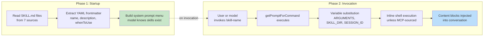
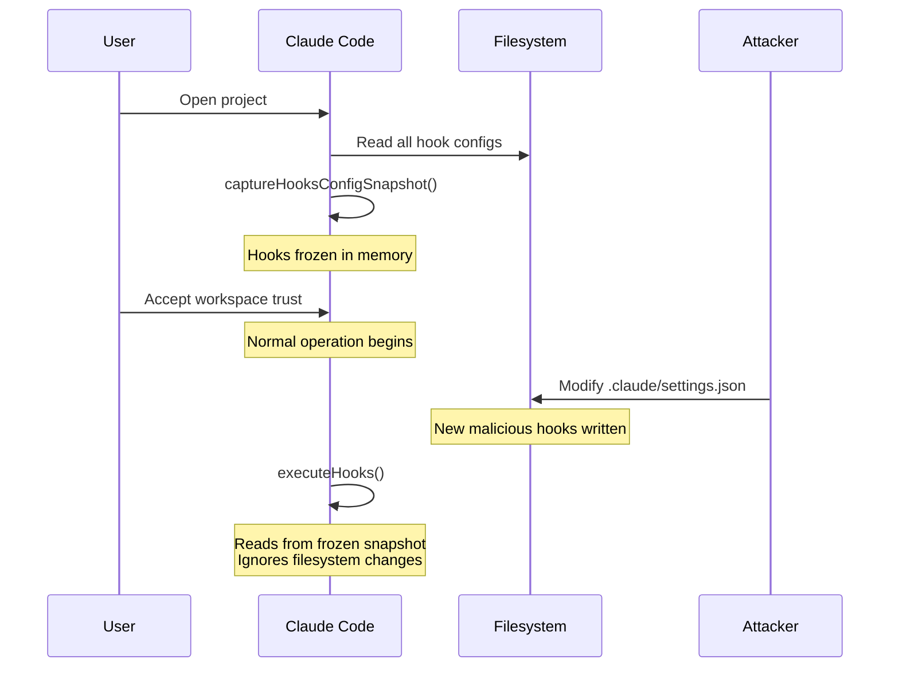
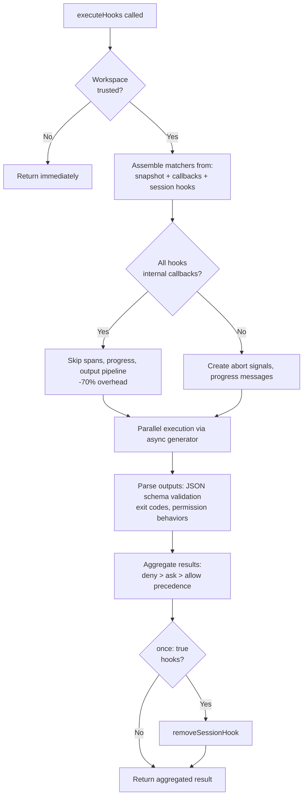

# Chương 12: Extensibility -- Skills và Hooks

## Two Dimensions of Extension (Hai chiều mở rộng)

Mọi hệ thống mở rộng đều trả lời hai câu hỏi: hệ thống có thể làm gì, và khi nào thì nó làm việc đó. Hầu hết framework trộn hai việc này vào nhau -- một plugin đăng ký cả capability lẫn lifecycle callback trong cùng một object, và ranh giới giữa "thêm tính năng" và "chặn/điều hướng tính năng" bị mờ thành một API đăng ký duy nhất.

Claude Code tách chúng ra rõ ràng. Skills mở rộng những gì model có thể làm. Chúng là các file markdown trở thành slash command, bơm thêm chỉ dẫn vào cuộc trò chuyện khi được gọi. Hooks mở rộng thời điểm và cách sự việc diễn ra. Chúng là các lifecycle interceptor kích hoạt tại hơn hai chục điểm khác nhau trong một phiên, chạy mã tùy ý có thể chặn hành động, sửa input, ép tiếp tục, hoặc quan sát ngầm.

Sự tách biệt này không phải ngẫu nhiên. Skills là content -- chúng mở rộng tri thức và năng lực của model bằng cách thêm prompt text. Hooks là control flow -- chúng sửa đường đi thực thi mà không thay đổi những gì model biết. Một skill có thể dạy model cách chạy quy trình deploy của team bạn. Một hook có thể đảm bảo không lệnh deploy nào chạy nếu test suite chưa pass. Skill thêm năng lực; hook thêm ràng buộc.

Chương này đi sâu cả hai hệ thống, rồi phân tích điểm giao nhau của chúng: skill-declared hooks được đăng ký thành session-scoped lifecycle interceptors khi skill được invoke.

---

## Skills: Teaching the Model New Tricks (Dạy model thêm chiêu mới)

### Two-Phase Loading (Tải hai pha)

Tối ưu cốt lõi của hệ skills là frontmatter được nạp ở startup, còn full content chỉ nạp khi được invoke.



**Phase 1** đọc từng file `SKILL.md`, tách YAML frontmatter khỏi phần thân markdown, và trích metadata. Các trường frontmatter trở thành một phần của system prompt để model biết skill tồn tại. Phần thân markdown được giữ trong closure nhưng chưa xử lý. Dự án có 50 skills chỉ trả chi phí token của 50 mô tả ngắn, không phải 50 tài liệu đầy đủ.

**Phase 2** chạy khi model hoặc user invoke một skill. `getPromptForCommand` thêm trước base directory, thay biến (`$ARGUMENTS`, `${CLAUDE_SKILL_DIR}`, `${CLAUDE_SESSION_ID}`), và thực thi inline shell commands (bọc backtick, tiền tố `!`). Kết quả được trả về dưới dạng content blocks chèn vào cuộc trò chuyện.

### Seven Sources with Priority (Bảy nguồn theo thứ tự ưu tiên)

Skills đến từ bảy nguồn riêng biệt, được nạp song song và gộp theo precedence:

| Priority | Source | Location | Notes |
|----------|--------|----------|-------|
| 1 | Managed (Policy) | `<MANAGED_PATH>/.claude/skills/` | Enterprise-controlled |
| 2 | User | `~/.claude/skills/` | Personal, available everywhere |
| 3 | Project | `.claude/skills/` (walked up to home) | Checked into version control |
| 4 | Additional Dirs | `<add-dir>/.claude/skills/` | Via `--add-dir` flag |
| 5 | Legacy Commands | `.claude/commands/` | Backwards-compatible |
| 6 | Bundled | Compiled into the binary | Feature-gated |
| 7 | MCP | MCP server prompts | Remote, untrusted |

Khử trùng lặp dùng `realpath` để resolve symlink và các parent directory chồng lấp. Nguồn gặp trước sẽ thắng. Hàm `getFileIdentity` resolve về canonical path qua `realpath` thay vì dựa vào inode, vì inode không đáng tin trên mount container/NFS và ExFAT.

### The Frontmatter Contract (Hợp đồng frontmatter)

Các trường frontmatter chính kiểm soát hành vi skill:

| YAML Field | Purpose |
|-----------|---------|
| `name` | User-facing display name |
| `description` | Shown in autocomplete and system prompt |
| `when_to_use` | Detailed usage scenarios for model discovery |
| `allowed-tools` | Which tools the skill can use |
| `disable-model-invocation` | Block autonomous model use |
| `context` | `'fork'` to run as sub-agent |
| `hooks` | Lifecycle hooks registered on invocation |
| `paths` | Glob patterns for conditional activation |

Tùy chọn `context: 'fork'` chạy skill dưới dạng sub-agent với context window riêng, rất cần cho skills phải làm việc lớn mà không làm bẩn token budget của cuộc trò chuyện chính. Các trường `disable-model-invocation` và `user-invocable` điều khiển hai đường truy cập khác nhau -- bật cả hai thành true sẽ làm skill trở nên vô hình, hữu ích cho hooks-only skills.

### The MCP Security Boundary (Ranh giới bảo mật MCP)

Sau bước thay biến, inline shell commands sẽ thực thi. Ranh giới bảo mật là tuyệt đối: **MCP skills không bao giờ thực thi inline shell commands.** MCP servers là hệ thống bên ngoài. Một MCP prompt chứa `` !`rm -rf /` `` sẽ chạy với toàn bộ quyền của user nếu được phép. Hệ thống coi MCP skills là content-only. Ranh giới trust này liên kết với mô hình bảo mật MCP rộng hơn được bàn ở Chapter 15.

### Dynamic Discovery (Khám phá động)

Skills không chỉ nạp lúc startup. Khi model chạm vào file, `discoverSkillDirsForPaths` sẽ đi ngược lên từ mỗi path để tìm các thư mục `.claude/skills/`. Skills có frontmatter `paths` được lưu trong map `conditionalSkills` và chỉ kích hoạt khi touched paths khớp pattern của chúng. Skill khai báo `paths: "packages/database/**"` sẽ vẫn vô hình cho tới khi model đọc hoặc sửa một file database -- mở rộng capability theo ngữ cảnh.

---

## Hooks: Controlling When Things Happen (Điều khiển thời điểm mọi thứ xảy ra)

Hooks là cơ chế của Claude Code để chặn và sửa hành vi tại các lifecycle point. Engine thực thi chính vượt quá 4.900 dòng. Hệ thống phục vụ ba nhóm: developer cá nhân (linting/validation tùy biến), team (quality gate dùng chung check vào project), và enterprise (compliance rule do policy quản trị).

### A Real-World Hook: Preventing Commits to Main

Trước khi đi vào máy móc bên trong, đây là hook trông ra sao trong thực tế. Giả sử team của bạn muốn ngăn model commit trực tiếp vào nhánh `main`.

**Step 1: Cấu hình trong settings.json:**

```json
{
  "hooks": {
    "PreToolUse": [
      {
        "matcher": "Bash",
        "hooks": [
          {
            "type": "command",
            "command": "/path/to/check-not-main.sh",
            "if": "Bash(git commit*)"
          }
        ]
      }
    ]
  }
}
```

**Step 2: Shell script:**

```bash
#!/bin/bash
BRANCH=$(git rev-parse --abbrev-ref HEAD 2>/dev/null)
if [ "$BRANCH" = "main" ]; then
  echo "Cannot commit directly to main. Create a feature branch first." >&2
  exit 2  # Exit 2 = blocking error
fi
exit 0
```

**Step 3: Trải nghiệm của model.** Khi model thử `git commit` trên nhánh `main`, hook kích hoạt trước khi lệnh chạy. Script kiểm tra nhánh, ghi ra stderr, và thoát với mã 2. Model thấy system message: "Cannot commit directly to main. Create a feature branch first." Commit không bao giờ được chạy. Model tạo nhánh rồi commit ở đó.

Điều kiện `if: "Bash(git commit*)"` nghĩa là script chỉ chạy cho lệnh git commit -- không chạy cho mọi lần gọi Bash. Exit code 2 thì chặn; exit code 0 thì cho qua; mọi exit code khác tạo cảnh báo không chặn. Đây là toàn bộ protocol.

### Four User-Configurable Types (Bốn loại người dùng cấu hình được)

Claude Code định nghĩa sáu hook types -- bốn loại user-configurable, hai loại internal.

**Command hooks** spawn một shell process. Hook input JSON được pipe vào stdin; hook phản hồi qua exit code và stdout/stderr. Đây là loại chủ lực.

**Prompt hooks** thực hiện một lần gọi LLM duy nhất, trả về `{"ok": true}` hoặc `{"ok": false, "reason": "..."}`. Validation nhẹ bằng AI mà không cần vòng lặp agent đầy đủ.

**Agent hooks** chạy một vòng lặp agentic nhiều lượt (tối đa 50 lượt, quyền `dontAsk`, tắt thinking). Mỗi hook có session scope riêng. Đây là bộ máy nặng cho các việc kiểu "xác minh test suite pass và cover tính năng mới."

**HTTP hooks** gửi POST hook input tới một URL. Mở đường cho remote policy server và audit logging mà không cần spawn process cục bộ.

Hai loại internal là **callback hooks** (đăng ký bằng code, giảm -70% overhead ở hot path qua fast path bỏ qua span tracking) và **function hooks** (TypeScript callback theo session-scope để ép structured output trong agent hooks).

### The Five Most Important Lifecycle Events (Năm sự kiện lifecycle quan trọng nhất)

Hệ hook kích hoạt ở hơn hai chục lifecycle point. Năm điểm chi phối đa số usage thực tế:

**PreToolUse** -- chạy trước mọi lần tool thực thi. Có thể chặn, sửa input, auto-approve, hoặc bơm context. Hành vi permission theo precedence chặt chẽ: deny > ask > allow. Đây là hook point phổ biến nhất cho quality gates.

**PostToolUse** -- chạy sau khi thực thi thành công. Có thể bơm context hoặc thay toàn bộ MCP tool output. Hữu ích cho phản hồi tự động trên kết quả tool.

**Stop** -- chạy trước khi Claude kết thúc phản hồi. Hook dạng blocking sẽ ép tiếp tục. Đây là cơ chế cho vòng xác minh tự động: "đã thật sự xong chưa?"

**SessionStart** -- chạy khi bắt đầu phiên. Có thể đặt environment variables, ghi đè user message đầu tiên, hoặc đăng ký file watch paths. Không thể block (hook không thể ngăn phiên bắt đầu).

**UserPromptSubmit** -- chạy khi user gửi prompt. Có thể block xử lý, bật được input validation hoặc content filtering trước khi model nhìn thấy nội dung.

**Reference table -- các sự kiện còn lại:**

| Category | Events |
|----------|--------|
| Tool lifecycle | PostToolUseFailure, PermissionDenied, PermissionRequest |
| Session | SessionEnd (1.5s timeout), Setup |
| Subagent | SubagentStart, SubagentStop |
| Compaction | PreCompact, PostCompact |
| Notification | Notification, Elicitation, ElicitationResult |
| Configuration | ConfigChange, InstructionsLoaded, CwdChanged, FileChanged, TaskCreated, TaskCompleted, TeammateIdle |

Bất đối xứng về khả năng chặn là chủ đích. Các event biểu diễn quyết định còn có thể cứu vãn (tool calls, stop conditions) thì hỗ trợ block. Các event biểu diễn sự thật không thể đảo ngược (session đã bắt đầu, API đã lỗi) thì không.

### Exit Code Semantics (Ngữ nghĩa exit code)

Với command hooks, exit code mang nghĩa cụ thể:

| Exit Code | Meaning | Blocks |
|-----------|---------|--------|
| 0 | Success, stdout parsed if JSON | No |
| 2 | Blocking error, stderr shown as system message | Yes |
| Other | Non-blocking warning, shown to user only | No |

Exit code 2 được chọn có chủ đích. Exit code 1 quá phổ biến -- mọi exception không xử lý, assertion fail, hay lỗi cú pháp đều cho exit 1. Dùng exit 2 ngăn việc enforcement bị kích hoạt ngoài ý muốn.

### Six Hook Sources (Sáu nguồn hook)

| Source | Trust Level | Notes |
|--------|-------------|-------|
| `userSettings` | User | `~/.claude/settings.json`, highest priority |
| `projectSettings` | Project | `.claude/settings.json`, version-controlled |
| `localSettings` | Local | `.claude/settings.local.json`, gitignored |
| `policySettings` | Enterprise | Cannot be overridden |
| `pluginHook` | Plugin | Priority 999 (lowest) |
| `sessionHook` | Session | In-memory only, registered by skills |

---

## The Snapshot Security Model (Mô hình bảo mật snapshot)

Hooks chạy mã tùy ý. `.claude/settings.json` của project có thể định nghĩa hook chạy trước mọi lần gọi tool. Điều gì xảy ra nếu một repository độc hại sửa hooks sau khi user chấp nhận hộp thoại workspace trust?

Không có gì xảy ra cả. Cấu hình hooks bị đóng băng ở startup.



`captureHooksConfigSnapshot()` được gọi đúng một lần trong startup. Từ thời điểm đó, `executeHooks()` đọc từ snapshot, không bao giờ tự động đọc lại settings files. Snapshot chỉ được cập nhật qua các kênh tường minh: lệnh `/hooks` hoặc phát hiện từ file watcher, cả hai đều rebuild qua `updateHooksConfigSnapshot()`.

Chuỗi ép policy hoạt động như sau: `disableAllHooks` trong policy settings sẽ xóa toàn bộ. `allowManagedHooksOnly` loại bỏ user hooks và project hooks. User có thể tắt hook của chính họ bằng `disableAllHooks`, nhưng không thể tắt enterprise-managed hooks. Lớp policy luôn thắng.

Bản thân kiểm tra trust (`shouldSkipHookDueToTrust()`) được thêm vào sau hai lỗ hổng: SessionEnd hooks chạy ngay cả khi user *từ chối* trust dialog, và SubagentStop hooks kích hoạt trước khi trust được trình bày. Cả hai có cùng nguyên nhân gốc -- hooks chạy ở lifecycle state mà user chưa consent cho việc thực thi code trong workspace. Bản vá là một cổng kiểm tra tập trung ở đầu `executeHooks()`.

---

## Execution Flow (Luồng thực thi)



Fast path cho internal callbacks là một tối ưu đáng kể. Khi toàn bộ hooks khớp đều là internal, hệ thống bỏ qua span tracking, tạo abort signal, progress messages, và full output processing pipeline. Phần lớn lượt gọi PostToolUse chỉ chạm internal callbacks.

Hook input JSON được serialize một lần qua closure `getJsonInput()` kiểu lazy rồi tái sử dụng cho toàn bộ hooks chạy song song. Environment injection đặt `CLAUDE_PROJECT_DIR`, `CLAUDE_PLUGIN_ROOT`, và với một số event nhất định, `CLAUDE_ENV_FILE` để hooks có thể ghi environment exports.

---

## Integration: Where Skills Meet Hooks (Tích hợp: nơi Skills gặp Hooks)

Khi một skill được invoke, hooks khai báo trong frontmatter của nó được đăng ký thành session-scoped hooks. `skillRoot` trở thành `CLAUDE_PLUGIN_ROOT` cho shell commands của hook:

```
my-skill/
  SKILL.md          # The skill content
  validate.sh       # Called by a PreToolUse hook declared in frontmatter
```

Frontmatter của skill khai báo:

```yaml
hooks:
  PreToolUse:
    - matcher: "Bash"
      hooks:
        - type: command
          command: "${CLAUDE_PLUGIN_ROOT}/validate.sh"
          once: true
```

Khi user invoke `/my-skill`, nội dung skill được nạp vào cuộc trò chuyện VÀ hook PreToolUse được đăng ký. Lần gọi Bash tool tiếp theo sẽ kích hoạt `validate.sh`. Vì có `once: true`, hook tự gỡ sau lần thực thi thành công đầu tiên.

Với agents, các `Stop` hooks khai báo trong frontmatter tự động được chuyển thành `SubagentStop` hooks, vì subagents kích hoạt `SubagentStop`, không phải `Stop`. Không có chuyển đổi này thì hook stop-verification của agent sẽ không bao giờ chạy.

### Permission Behavior Precedence (Thứ tự ưu tiên hành vi quyền)

`executePreToolHooks()` có thể block (qua `blockingError`), auto-approve (qua `permissionBehavior: 'allow'`), ép hỏi lại (qua `'ask'`), từ chối (qua `'deny'`), sửa input (qua `updatedInput`), hoặc thêm context (qua `additionalContext`). Khi nhiều hook trả về hành vi khác nhau, deny luôn thắng. Đây là mặc định đúng cho các quyết định liên quan bảo mật.

### Stop Hooks: Forcing Continuation (Ép tiếp tục)

Khi Stop hook trả exit code 2, stderr được hiển thị cho model như phản hồi và cuộc trò chuyện tiếp diễn. Cách này biến mô hình prompt-response một phát thành vòng lặp hướng mục tiêu. Stop hook có thể xem là điểm tích hợp mạnh nhất trong toàn bộ hệ thống.

---

## Apply This: Designing an Extensibility System

**Tách content khỏi control flow.** Skills thêm năng lực; hooks ràng buộc hành vi. Trộn hai thứ này vào nhau khiến bạn không thể lý giải plugin đang làm gì so với nó đang ngăn cái gì.

**Đóng băng cấu hình tại trust boundaries.** Cơ chế snapshot chụp hooks tại thời điểm consent và không tự đọc lại. Nếu hệ của bạn chạy mã do user cung cấp, cách này loại bỏ tấn công TOCTOU.

**Dùng exit code ít phổ biến cho tín hiệu ngữ nghĩa.** Exit code 1 là nhiễu -- mọi lỗi không xử lý đều cho mã này. Dùng exit code 2 làm tín hiệu blocking ngăn enforcement ngoài ý muốn. Hãy chọn tín hiệu đòi hỏi chủ đích rõ ràng.

**Validate ở tầng socket, không phải tầng ứng dụng.** SSRF guard chạy tại thời điểm DNS lookup, không phải như pre-flight check. Cách này loại bỏ cửa sổ DNS rebinding. Khi validate đích mạng, kiểm tra phải atomic với kết nối.

**Tối ưu cho trường hợp phổ biến.** Internal callback fast path (-70% overhead) phản ánh thực tế rằng đa số lượt gọi hook chỉ chạm internal callbacks. Two-phase skill loading phản ánh thực tế rằng đa số skills không bao giờ được invoke trong một phiên nhất định. Mỗi tối ưu đều nhắm đúng phân bố usage thực tế.

Hệ extensibility phản ánh sự trưởng thành trong việc cân bằng giữa sức mạnh và an toàn. Skills trao cho model capability mới nhưng bị chặn bởi đường bảo mật MCP (Chapter 15). Hooks trao cho mã bên ngoài ảnh hưởng lên hành động của model nhưng bị chặn bởi cơ chế snapshot, ngữ nghĩa exit code, và chuỗi policy. Hai hệ không tin lẫn nhau -- và chính sự bất tín nhiệm lẫn nhau đó khiến tổ hợp này đủ an toàn để triển khai ở quy mô lớn.

Chương tiếp theo chuyển sang lớp hiển thị: cách Claude Code render một terminal UI phản ứng ở 60fps và xử lý input qua năm giao thức terminal.