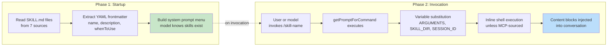
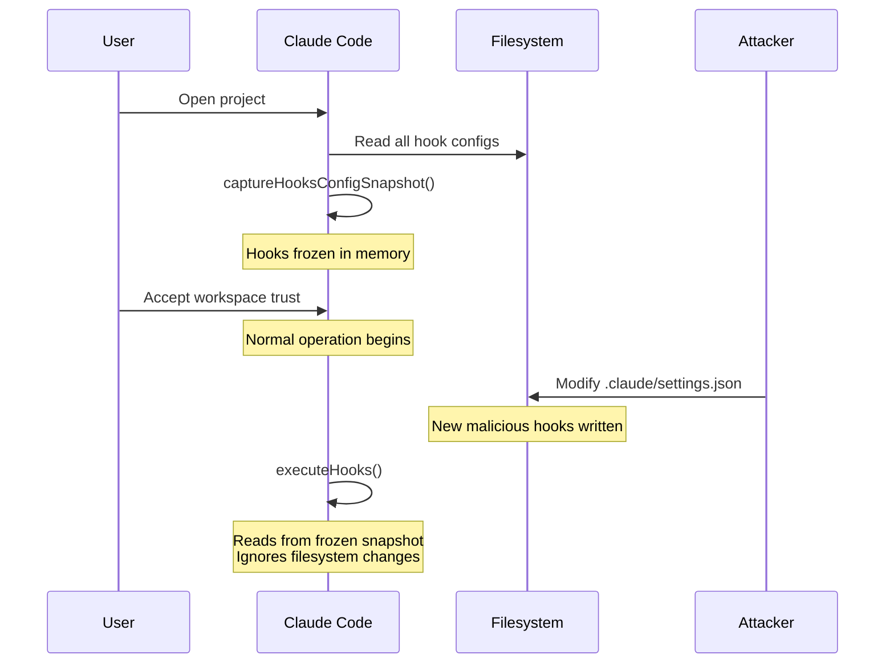
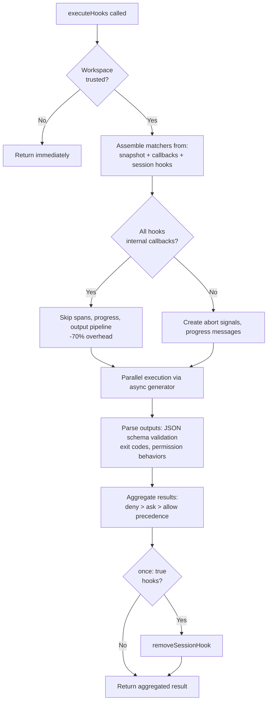

# Chương 12: Extensibility -- Skills và Hooks

## Hai chiều mở rộng

Mọi hệ thống mở rộng đều phải trả lời hai câu hỏi: hệ thống có thể làm gì, và khi nào nó làm việc đó. Phần lớn framework trộn hai thứ này vào một chỗ -- một plugin vừa đăng ký capability vừa đăng ký lifecycle callback trong cùng một object, khiến ranh giới giữa "thêm tính năng" và "chặn/chen vào tính năng" mờ thành một API đăng ký duy nhất.

Claude Code tách hai chiều đó rất rõ. Skills mở rộng những gì model có thể làm. Chúng là các file markdown trở thành slash commands, bơm thêm chỉ dẫn vào cuộc hội thoại khi được gọi. Hooks mở rộng thời điểm và cách mọi việc diễn ra. Chúng là các lifecycle interceptor kích hoạt tại hơn hai chục điểm riêng biệt trong một session, chạy mã tùy ý có thể chặn hành động, sửa input, ép tiếp tục, hoặc quan sát trong im lặng.

Sự tách biệt này không phải ngẫu nhiên. Skills là content -- chúng mở rộng kiến thức và capability của model bằng cách thêm prompt text. Hooks là control flow -- chúng thay đổi đường đi thực thi mà không đổi những gì model biết. Một skill có thể dạy model cách chạy quy trình deploy của team bạn. Một hook có thể đảm bảo không lệnh deploy nào được chạy nếu test suite chưa pass. Skill thêm capability; hook thêm constraint.

Chương này sẽ đi sâu vào cả hai hệ thống, rồi xem điểm giao nhau của chúng: skill-declared hooks được đăng ký thành session-scoped lifecycle interceptors khi skill được invoke.

---

## Skills: Dạy model thêm kỹ năng mới

### Tải theo hai pha

Tối ưu cốt lõi của hệ skills là frontmatter được nạp ở startup, còn full content chỉ nạp khi được invoke.



**Phase 1** đọc từng file `SKILL.md`, tách YAML frontmatter khỏi phần thân markdown, rồi trích metadata. Các trường frontmatter trở thành một phần của system prompt để model biết skill tồn tại. Phần thân markdown được giữ trong closure nhưng chưa xử lý. Một project có 50 skills chỉ trả chi phí token cho 50 mô tả ngắn, không phải 50 tài liệu đầy đủ.

**Phase 2** kích hoạt khi model hoặc user invoke một skill. `getPromptForCommand` prepend base directory, thay biến (`$ARGUMENTS`, `${CLAUDE_SKILL_DIR}`, `${CLAUDE_SESSION_ID}`), và thực thi inline shell commands (backtick-prefixed với `!`). Kết quả được trả về dưới dạng content blocks được inject vào hội thoại.

### Bảy nguồn theo thứ tự ưu tiên

Skills đến từ bảy nguồn riêng biệt, được nạp song song và merge theo precedence:

| Priority | Source | Location | Notes |
|----------|--------|----------|-------|
| 1 | Managed (Policy) | `<MANAGED_PATH>/.claude/skills/` | Enterprise-controlled |
| 2 | User | `~/.claude/skills/` | Personal, available everywhere |
| 3 | Project | `.claude/skills/` (walked up to home) | Checked into version control |
| 4 | Additional Dirs | `<add-dir>/.claude/skills/` | Via `--add-dir` flag |
| 5 | Legacy Commands | `.claude/commands/` | Backwards-compatible |
| 6 | Bundled | Compiled into the binary | Feature-gated |
| 7 | MCP | MCP server prompts | Remote, untrusted |

Khử trùng lặp dùng `realpath` để resolve symlink và các parent directory chồng lấn. Nguồn thấy trước sẽ thắng. Hàm `getFileIdentity` resolve về canonical path qua `realpath` thay vì dựa vào inode, vì inode không đáng tin trên container/NFS mounts và ExFAT.

### Hợp đồng frontmatter

Các trường frontmatter quan trọng điều khiển hành vi skill:

| YAML Field | Purpose |
|-----------|---------|
| `name` | User-facing display name |
| `description` | Shown in autocomplete and system prompt |
| `when_to_use` | Detailed usage scenarios for model discovery |
| `allowed-tools` | Which tools the skill can use |
| `disable-model-invocation` | Block autonomous model use |
| `context` | `'fork'` to run as sub-agent |
| `hooks` | Lifecycle hooks registered on invocation |
| `paths` | Glob patterns for conditional activation |

Tùy chọn `context: 'fork'` chạy skill như một sub-agent với context window riêng, rất cần cho các skill phải xử lý lượng việc lớn mà không làm bẩn token budget của hội thoại chính. Hai trường `disable-model-invocation` và `user-invocable` điều khiển hai đường truy cập khác nhau -- đặt cả hai là true sẽ khiến skill trở nên vô hình, hữu ích cho hooks-only skills.

### Ranh giới bảo mật MCP

Sau bước thay biến, inline shell commands sẽ được thực thi. Ranh giới bảo mật ở đây là tuyệt đối: **MCP skills never execute inline shell commands.** MCP servers là hệ thống bên ngoài. Một MCP prompt chứa `` !`rm -rf /` `` sẽ chạy với đầy đủ quyền của user nếu được phép. Hệ thống xem MCP skills là content-only. Ranh giới trust này gắn trực tiếp với mô hình bảo mật MCP rộng hơn được bàn trong Chương 15.

### Dynamic Discovery

Skills không chỉ được nạp ở startup. Khi model chạm vào file, `discoverSkillDirsForPaths` đi ngược từ mỗi path để tìm các thư mục `.claude/skills/`. Skills có frontmatter `paths` được lưu trong map `conditionalSkills` và chỉ kích hoạt khi touched paths khớp pattern. Một skill khai báo `paths: "packages/database/**"` sẽ vẫn vô hình cho đến khi model đọc hoặc sửa file database -- context-sensitive capability expansion.

---

## Hooks: Điều khiển thời điểm mọi thứ xảy ra

Hooks là cơ chế của Claude Code để chặn và sửa hành vi tại các lifecycle points. Execution engine chính dài hơn 4.900 dòng. Hệ thống này phục vụ ba nhóm: developer cá nhân (linting, validation tùy biến), team (shared quality gates được check vào project), và enterprise (policy-managed compliance rules).

### A Real-World Hook: Preventing Commits to Main

Trước khi đi vào máy móc bên trong, đây là một hook thực tế. Giả sử team bạn muốn ngăn model commit trực tiếp vào nhánh `main`.

**Step 1: The settings.json configuration:**

```json
{
  "hooks": {
    "PreToolUse": [
      {
        "matcher": "Bash",
        "hooks": [
          {
            "type": "command",
            "command": "/path/to/check-not-main.sh",
            "if": "Bash(git commit*)"
          }
        ]
      }
    ]
  }
}
```

**Step 2: The shell script:**

```bash
#!/bin/bash
BRANCH=$(git rev-parse --abbrev-ref HEAD 2>/dev/null)
if [ "$BRANCH" = "main" ]; then
  echo "Cannot commit directly to main. Create a feature branch first." >&2
  exit 2  # Exit 2 = blocking error
fi
exit 0
```

**Step 3: Mô hình trải nghiệm điều gì.** Khi model thử `git commit` trên nhánh `main`, hook kích hoạt trước khi lệnh chạy. Script kiểm tra nhánh, ghi vào stderr, rồi thoát với mã 2. Model thấy system message: "Cannot commit directly to main. Create a feature branch first." Lệnh commit không bao giờ chạy. Model sẽ tạo một branch rồi commit ở đó.

Điều kiện `if: "Bash(git commit*)"` nghĩa là script chỉ chạy cho các lệnh git commit -- không chạy cho mọi lần gọi Bash. Exit code 2 thì block; exit code 0 thì pass; mọi mã khác tạo cảnh báo không chặn. Đó là toàn bộ protocol.

### Bốn loại người dùng có thể cấu hình

Claude Code định nghĩa sáu hook types -- bốn loại user-configurable và hai loại internal.

**Command hooks** spawn một shell process. Hook input JSON được pipe vào stdin; hook phản hồi bằng exit code và stdout/stderr. Đây là loại chủ lực.

**Prompt hooks** thực hiện một lần gọi LLM duy nhất, trả về `{"ok": true}` hoặc `{"ok": false, "reason": "..."}`. Đây là validation nhẹ kiểu AI-powered mà không cần full agent loop.

**Agent hooks** chạy một agentic loop nhiều lượt (tối đa 50 lượt, quyền `dontAsk`, thinking disabled). Mỗi hook có session scope riêng. Đây là hạng nặng cho bài toán kiểu "xác minh test suite pass và cover tính năng mới."

**HTTP hooks** POST hook input đến một URL. Cách này cho phép remote policy servers và audit logging mà không cần spawn process cục bộ.

Hai loại internal là **callback hooks** (đăng ký bằng code, giảm -70% overhead trên hot path bằng fast path bỏ qua span tracking) và **function hooks** (TypeScript callbacks theo session scope để cưỡng chế structured output trong agent hooks).

### Năm lifecycle events quan trọng nhất

Hệ hooks kích hoạt tại hơn hai chục lifecycle points. Năm điểm sau chi phối đa số usage thực tế:

**PreToolUse** -- chạy trước mọi lần tool execution. Có thể block, sửa input, auto-approve, hoặc inject context. Permission behavior tuân theo precedence chặt chẽ: deny > ask > allow. Đây là hook point phổ biến nhất cho quality gates.

**PostToolUse** -- chạy sau khi execution thành công. Có thể inject context hoặc thay thế toàn bộ MCP tool output. Hữu ích cho phản hồi tự động dựa trên tool results.

**Stop** -- chạy trước khi Claude kết thúc phản hồi. Một blocking hook sẽ buộc tiếp tục. Đây là cơ chế cho verification loop tự động: "đã thực sự xong chưa?"

**SessionStart** -- chạy ở đầu session. Có thể set environment variables, override user message đầu tiên, hoặc đăng ký file watch paths. Không thể block (hook không thể ngăn session bắt đầu).

**UserPromptSubmit** -- chạy khi user gửi prompt. Có thể block xử lý, cho phép input validation hoặc content filtering trước khi model nhìn thấy nội dung.

**Reference table -- remaining events:**

| Category | Events |
|----------|--------|
| Tool lifecycle | PostToolUseFailure, PermissionDenied, PermissionRequest |
| Session | SessionEnd (1.5s timeout), Setup |
| Subagent | SubagentStart, SubagentStop |
| Compaction | PreCompact, PostCompact |
| Notification | Notification, Elicitation, ElicitationResult |
| Configuration | ConfigChange, InstructionsLoaded, CwdChanged, FileChanged, TaskCreated, TaskCompleted, TeammateIdle |

Tính bất đối xứng về khả năng block là chủ ý. Các events đại diện cho quyết định còn có thể đảo ngược (tool calls, stop conditions) thì hỗ trợ block. Các events đại diện cho sự thật đã xảy ra, không thể thu hồi (session started, API failed) thì không.

### Ngữ nghĩa exit code

Với command hooks, exit codes mang ý nghĩa cụ thể:

| Exit Code | Meaning | Blocks |
|-----------|---------|--------|
| 0 | Success, stdout parsed if JSON | No |
| 2 | Blocking error, stderr shown as system message | Yes |
| Other | Non-blocking warning, shown to user only | No |

Exit code 2 được chọn có chủ đích. Exit code 1 quá phổ biến -- mọi unhandled exception, assertion failure, hoặc syntax error đều ra exit 1. Dùng exit 2 cho blocking signal giúp tránh enforcement ngoài ý muốn.

### Sáu nguồn hooks

| Source | Trust Level | Notes |
|--------|-------------|-------|
| `userSettings` | User | `~/.claude/settings.json`, highest priority |
| `projectSettings` | Project | `.claude/settings.json`, version-controlled |
| `localSettings` | Local | `.claude/settings.local.json`, gitignored |
| `policySettings` | Enterprise | Cannot be overridden |
| `pluginHook` | Plugin | Priority 999 (lowest) |
| `sessionHook` | Session | In-memory only, registered by skills |

---

## Mô hình bảo mật snapshot

Hooks chạy mã tùy ý. File `.claude/settings.json` của một project có thể định nghĩa hooks chạy trước mọi lần gọi tool. Vậy điều gì xảy ra nếu một repository độc hại sửa hooks sau khi user chấp nhận hộp thoại workspace trust?

Không có gì cả. Cấu hình hooks bị đóng băng ngay ở startup.



`captureHooksConfigSnapshot()` được gọi một lần trong startup. Từ thời điểm đó, `executeHooks()` đọc từ snapshot, không bao giờ tự động re-read settings files. Snapshot chỉ được cập nhật qua các kênh tường minh: lệnh `/hooks` hoặc phát hiện từ file watcher, cả hai đều rebuild thông qua `updateHooksConfigSnapshot()`.

Chuỗi cưỡng chế policy như sau: `disableAllHooks` trong policy settings sẽ xóa toàn bộ. `allowManagedHooksOnly` loại user hooks và project hooks. User có thể tắt hooks của chính họ bằng `disableAllHooks`, nhưng không thể tắt enterprise-managed hooks. Lớp policy luôn thắng.

Bản thân kiểm tra trust (`shouldSkipHookDueToTrust()`) được thêm vào sau hai lỗ hổng: SessionEnd hooks chạy cả khi user *từ chối* trust dialog, và SubagentStop hooks kích hoạt trước khi trust được hiển thị. Cả hai có cùng root cause -- hooks nổ ở các lifecycle states nơi user chưa consent cho việc thực thi mã trong workspace. Bản vá là một cổng kiểm tra tập trung ở đầu `executeHooks()`.

---

## Luồng thực thi



Fast path cho internal callbacks là một tối ưu đáng kể. Khi toàn bộ hooks khớp đều là internal, hệ thống bỏ qua span tracking, tạo abort signals, progress messages, và full output processing pipeline. Phần lớn các lần gọi PostToolUse chỉ đụng internal callbacks.

Hook input JSON được serialize một lần qua closure lazy `getJsonInput()` rồi tái sử dụng cho tất cả hooks chạy song song. Environment injection thiết lập `CLAUDE_PROJECT_DIR`, `CLAUDE_PLUGIN_ROOT`, và với một số event nhất định, `CLAUDE_ENV_FILE` nơi hooks có thể ghi environment exports.

---

## Tích hợp: nơi Skills gặp Hooks

Khi một skill được invoke, các hooks khai báo trong frontmatter của skill được đăng ký thành session-scoped hooks. `skillRoot` trở thành `CLAUDE_PLUGIN_ROOT` cho shell commands của hook:

```
my-skill/
  SKILL.md          # The skill content
  validate.sh       # Called by a PreToolUse hook declared in frontmatter
```

Frontmatter của skill khai báo:

```yaml
hooks:
  PreToolUse:
    - matcher: "Bash"
      hooks:
        - type: command
          command: "${CLAUDE_PLUGIN_ROOT}/validate.sh"
          once: true
```

Khi user invoke `/my-skill`, nội dung skill được nạp vào hội thoại VÀ hook PreToolUse được đăng ký. Lần gọi Bash tool kế tiếp sẽ kích hoạt `validate.sh`. Vì `once: true` được đặt, hook sẽ tự gỡ sau lần thực thi thành công đầu tiên.

Với agents, các `Stop` hooks khai báo trong frontmatter được tự động chuyển thành `SubagentStop` hooks, vì subagents kích hoạt `SubagentStop`, không phải `Stop`. Nếu không có bước chuyển đổi này, stop-verification hook của agent sẽ không bao giờ chạy.

### Thứ tự ưu tiên của permission behavior

`executePreToolHooks()` có thể block (qua `blockingError`), auto-approve (qua `permissionBehavior: 'allow'`), buộc hỏi lại (qua `'ask'`), từ chối (qua `'deny'`), sửa input (qua `updatedInput`), hoặc thêm context (qua `additionalContext`). Khi nhiều hooks trả về các hành vi khác nhau, deny luôn thắng. Đây là mặc định đúng cho các quyết định liên quan bảo mật.

### Stop Hooks: Ép tiếp tục

Khi một Stop hook trả exit code 2, stderr được hiển thị cho model như feedback và hội thoại tiếp tục. Cách này biến single-shot prompt-response thành một goal-directed loop. Stop hook có thể là điểm tích hợp mạnh nhất trong toàn hệ thống.

---

## Apply This: Thiết kế một hệ extensibility

**Tách content khỏi control flow.** Skills thêm capabilities; hooks ràng buộc hành vi. Trộn hai thứ này khiến bạn không thể phân biệt plugin đang làm gì với nó đang ngăn gì.

**Đóng băng cấu hình tại trust boundaries.** Cơ chế snapshot chụp hooks tại thời điểm consent và không tự đọc lại. Nếu hệ thống của bạn thực thi mã do user cung cấp, cách này loại bỏ tấn công TOCTOU.

**Dùng exit codes ít phổ biến cho tín hiệu ngữ nghĩa.** Exit code 1 là nhiễu -- mọi lỗi không xử lý đều tạo mã này. Dùng exit code 2 làm blocking signal để tránh enforcement ngoài ý muốn. Hãy chọn các tín hiệu đòi hỏi chủ đích rõ ràng.

**Validate ở tầng socket, không phải tầng ứng dụng.** SSRF guard chạy ở thời điểm DNS lookup, không phải như một pre-flight check. Cách này loại bỏ cửa sổ DNS rebinding. Khi validate đích mạng, phép kiểm tra phải atomic với kết nối.

**Tối ưu cho trường hợp phổ biến nhất.** Internal callback fast path (-70% overhead) phản ánh thực tế rằng phần lớn hook invocations chỉ đụng internal callbacks. Two-phase skill loading phản ánh thực tế rằng phần lớn skills không bao giờ được invoke trong một session nhất định. Mỗi tối ưu đều bám vào phân bố usage thực tế.

Hệ extensibility này phản ánh hiểu biết chín chắn về lực căng giữa sức mạnh và an toàn. Skills trao cho model capability mới nhưng bị chặn bởi đường ranh bảo mật MCP (Chương 15). Hooks trao cho mã bên ngoài quyền ảnh hưởng lên hành động của model nhưng bị ràng bởi cơ chế snapshot, ngữ nghĩa exit code, và policy cascade. Hai hệ không tin nhau -- và chính sự không tin cậy lẫn nhau đó làm cho tổ hợp này đủ an toàn để triển khai ở quy mô lớn.

Chương tiếp theo sẽ chuyển sang lớp hiển thị: cách Claude Code render một terminal UI reactive ở 60fps và xử lý input qua năm giao thức terminal.
