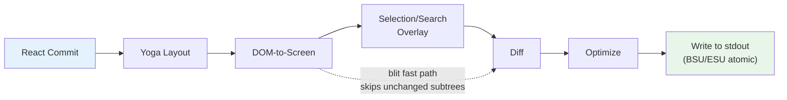
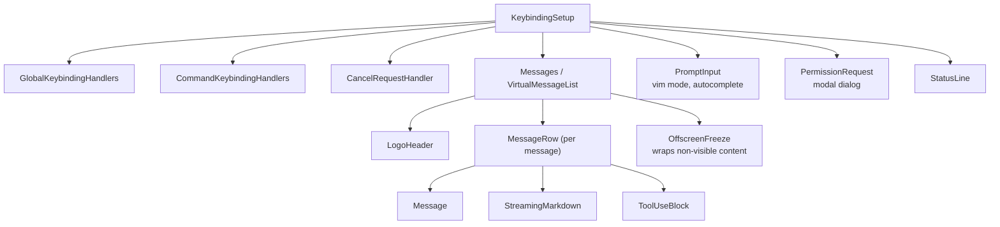

# Chương 13: The Terminal UI

## Tại sao phải xây dựng một renderer tùy chỉnh?

Terminal không phải là trình duyệt. Không có DOM, không có CSS engine, không có compositor, không có retained-mode graphics pipeline. Chỉ có một luồng byte đi tới stdout và một luồng byte đi từ stdin. Mọi thứ nằm giữa hai luồng đó -- layout, styling, diffing, hit-testing, scrolling, selection -- đều phải được phát minh lại từ đầu.

Claude Code cần một UI phản ứng (reactive UI). Nó có ô nhập prompt, đầu ra markdown streaming, hộp thoại quyền, spinner tiến trình, danh sách tin nhắn cuộn được, tô sáng tìm kiếm, và trình soạn thảo chế độ vim. React là lựa chọn hiển nhiên để khai báo kiểu cây component này. Nhưng React cần một môi trường host để render vào, và terminal thì không cung cấp điều đó.

Ink là câu trả lời tiêu chuẩn: một React renderer cho terminal, xây dựng trên Yoga cho layout flexbox. Claude Code bắt đầu với Ink, rồi fork đến mức gần như không còn nhận ra. Bản gốc cấp phát một object JavaScript cho mỗi cell ở mỗi frame -- trên terminal 200x120, tức là 24.000 object được tạo và garbage-collected mỗi 16ms. Nó diff ở mức chuỗi, so sánh toàn bộ hàng văn bản mã hóa ANSI. Nó không có khái niệm tối ưu blit, không có double buffering, không có theo dõi dirty ở mức cell. Với một dashboard CLI đơn giản refresh mỗi giây, vậy là ổn. Với một tác tử LLM stream token ở 60fps trong khi người dùng cuộn qua cuộc hội thoại có hàng trăm tin nhắn, đó là bế tắc.

Những gì còn lại trong Claude Code là một rendering engine tùy chỉnh vẫn giữ DNA khái niệm của Ink -- React reconciler, Yoga layout, ANSI output -- nhưng viết lại đường găng (critical path): packed typed arrays thay cho object-per-cell, pool-based string interning thay cho string-per-frame, render double-buffered với cell-level diffing, và một optimizer gộp các lần ghi terminal liền kề thành escape sequence tối thiểu.

Kết quả chạy ở 60fps trên terminal 200 cột khi stream token từ Claude. Để hiểu vì sao, ta cần xem xét bốn lớp: custom DOM mà React reconcile vào, rendering pipeline chuyển DOM đó thành đầu ra terminal, quản lý bộ nhớ dựa trên pool giúp hệ thống chạy hàng giờ mà không chết chìm trong garbage collection, và kiến trúc component gắn tất cả lại với nhau.

---

## Custom DOM

React reconciler cần một thứ để reconcile vào. Trong trình duyệt, đó là DOM. Trong terminal của Claude Code, đó là một cây in-memory tùy chỉnh với bảy loại phần tử và một loại text node.

Các loại phần tử ánh xạ trực tiếp sang các khái niệm render terminal:

- **`ink-root`** -- document root, một cho mỗi instance Ink
- **`ink-box`** -- một container flexbox, tương đương terminal của `<div>`
- **`ink-text`** -- một text node có hàm đo của Yoga để xuống dòng
- **`ink-virtual-text`** -- văn bản lồng nhau có style bên trong một text node khác (tự động nâng cấp từ `ink-text` khi ở trong ngữ cảnh text)
- **`ink-link`** -- hyperlink, được render qua OSC 8 escape sequences
- **`ink-progress`** -- chỉ báo tiến trình
- **`ink-raw-ansi`** -- nội dung ANSI đã render sẵn với kích thước đã biết, dùng cho code block đã syntax-highlight

Mỗi `DOMElement` mang trạng thái mà rendering pipeline cần:

```typescript
// Illustrative — actual interface extends this significantly
interface DOMElement {
  yogaNode: YogaNode;           // Flexbox layout node
  style: Styles;                // CSS-like properties mapped to Yoga
  attributes: Map<string, DOMNodeAttribute>;
  childNodes: (DOMElement | TextNode)[];
  dirty: boolean;               // Needs re-rendering
  _eventHandlers: EventHandlerMap; // Separated from attributes
  scrollTop: number;            // Imperative scroll state
  pendingScrollDelta: number;
  stickyScroll: boolean;
  debugOwnerChain?: string;     // React component stack for debug
}
```

Việc tách `_eventHandlers` khỏi `attributes` là có chủ ý. Trong React, danh tính handler thay đổi ở mỗi lần render (trừ khi memoize thủ công). Nếu handler được lưu như thuộc tính, mỗi lần render sẽ đánh dấu node dirty và kích hoạt repaint toàn phần. Bằng cách lưu tách riêng, `commitUpdate` của reconciler có thể cập nhật handler mà không làm node dirty.

Hàm `markDirty()` là cây cầu giữa đột biến DOM và rendering pipeline. Khi nội dung của bất kỳ node nào thay đổi, `markDirty()` đi ngược lên toàn bộ tổ tiên, đặt `dirty = true` trên mỗi phần tử và gọi `yogaNode.markDirty()` trên text node lá. Đây là cách một thay đổi một ký tự trong text node lồng sâu lên lịch re-render toàn bộ đường đi về root -- nhưng chỉ đường đó. Các subtree anh em vẫn sạch và có thể được blit từ frame trước.

Loại phần tử `ink-raw-ansi` đáng được nhấn mạnh riêng. Khi một code block đã được syntax-highlight (tạo ra ANSI escape sequences), phân tích lại các sequence đó để tách ký tự và style là lãng phí. Thay vào đó, nội dung đã highlight sẵn được bọc trong node `ink-raw-ansi` với thuộc tính `rawWidth` và `rawHeight` để báo cho Yoga biết kích thước chính xác. Rendering pipeline ghi thẳng nội dung ANSI thô vào output buffer mà không phân rã thành từng ký tự có style. Điều này khiến code block đã syntax-highlight gần như không tốn chi phí sau lượt highlight ban đầu -- phần tử thị giác đắt nhất trong UI lại là phần rẻ nhất để render.

Hàm đo của node `ink-text` đáng để hiểu vì nó chạy bên trong layout pass của Yoga, vốn đồng bộ và chặn luồng. Hàm nhận chiều rộng khả dụng và phải trả về kích thước văn bản. Nó thực hiện xuống dòng (tôn trọng prop style `wrap`: `wrap`, `truncate`, `truncate-start`, `truncate-middle`), tính đến ranh giới grapheme cluster (để không tách một emoji nhiều codepoint qua nhiều dòng), đo đúng ký tự CJK double-width (mỗi ký tự tính 2 cột), và loại mã escape ANSI khỏi phép tính chiều rộng (escape sequence có độ rộng hiển thị bằng 0). Tất cả việc này phải hoàn tất trong microseconds cho mỗi node, vì một cuộc hội thoại có 50 text node đang thấy nghĩa là 50 lần gọi hàm đo cho mỗi layout pass.

---

## React Fiber Container

Cầu nối reconciler dùng `react-reconciler` để tạo custom host config. Đây là cùng API mà React DOM và React Native dùng. Khác biệt chính: Claude Code chạy ở chế độ `ConcurrentRoot`.

```typescript
createContainer(rootNode, ConcurrentRoot, ...)
```

ConcurrentRoot bật các tính năng concurrent của React -- Suspense cho syntax highlighting lazy-loaded, transitions cho cập nhật trạng thái không chặn trong lúc streaming. Lựa chọn còn lại, `LegacyRoot`, sẽ ép render đồng bộ và chặn event loop khi markdown re-parse nặng.

Các phương thức host config ánh xạ thao tác React sang custom DOM:

- **`createInstance(type, props)`** tạo `DOMElement` qua `createNode()`, áp dụng style và thuộc tính ban đầu, gắn event handler, và lấy chuỗi owner component React để gán debug. Chuỗi owner được lưu thành `debugOwnerChain` và được dùng bởi chế độ `CLAUDE_CODE_DEBUG_REPAINTS` để quy nguồn reset toàn màn hình về các component cụ thể
- **`createTextInstance(text)`** tạo `TextNode` -- nhưng chỉ nếu ta đang ở trong text context. Reconciler cưỡng chế chuỗi thô phải được bọc trong `<Text>`. Cố tạo text node ngoài text context sẽ ném lỗi, bắt một lớp bug ngay tại thời điểm reconcile thay vì lúc render
- **`commitUpdate(node, type, oldProps, newProps)`** diff prop cũ và mới bằng so sánh nông, rồi chỉ áp dụng phần thay đổi. Style, thuộc tính, và event handler mỗi loại có đường cập nhật riêng. Hàm diff trả về `undefined` nếu không có gì đổi, tránh hẳn đột biến DOM không cần thiết
- **`removeChild(parent, child)`** gỡ node khỏi cây, giải phóng đệ quy Yoga node (gọi `unsetMeasureFunc()` trước `free()` để tránh truy cập bộ nhớ WASM đã giải phóng), và thông báo focus manager
- **`hideInstance(node)` / `unhideInstance(node)`** bật/tắt `isHidden` và chuyển Yoga node giữa `Display.None` và `Display.Flex`. Đây là cơ chế của React cho chuyển cảnh fallback của Suspense
- **`resetAfterCommit(container)`** là hook then chốt: nó gọi `rootNode.onComputeLayout()` để chạy Yoga, rồi `rootNode.onRender()` để lên lịch paint terminal

Reconciler theo dõi hai bộ đếm hiệu năng cho mỗi vòng commit: thời gian layout Yoga (`lastYogaMs`) và tổng thời gian commit (`lastCommitMs`). Chúng đi vào `FrameEvent` mà lớp Ink báo cáo, cho phép giám sát hiệu năng trong production.

Hệ thống event phản chiếu mô hình capture/bubble của trình duyệt. Một lớp `Dispatcher` triển khai lan truyền event đầy đủ với ba pha: capture (root đến target), at-target, và bubble (target về root). Loại event ánh xạ sang độ ưu tiên lịch của React -- discrete cho keyboard và click (ưu tiên cao nhất, xử lý ngay), continuous cho scroll và resize (có thể trì hoãn). Dispatcher bọc toàn bộ xử lý event trong `reconciler.discreteUpdates()` để batching React đúng cách.

Khi bạn bấm một phím trong terminal, `KeyboardEvent` phát sinh sẽ được dispatch qua cây custom DOM, bubble từ phần tử đang focus lên root đúng như event bàn phím bubble qua các phần tử DOM trong trình duyệt. Bất kỳ handler nào trên đường đi cũng có thể gọi `stopPropagation()` hoặc `preventDefault()`, và ngữ nghĩa giống hệt đặc tả trình duyệt.

---

## Rendering Pipeline

Mỗi frame đi qua bảy giai đoạn, mỗi giai đoạn được đo thời gian riêng:



Mỗi giai đoạn được đo riêng và báo cáo trong `FrameEvent.phases`. Instrumentation theo từng giai đoạn là thiết yếu để chẩn đoán sự cố hiệu năng: khi một frame mất 30ms, bạn cần biết nút thắt ở Yoga đo lại text (giai đoạn 2), renderer đi qua một dirty subtree lớn (giai đoạn 3), hay stdout backpressure từ terminal chậm (giai đoạn 7). Câu trả lời quyết định cách sửa.

**Giai đoạn 1: React commit và Yoga layout.** Reconciler xử lý cập nhật trạng thái và gọi `resetAfterCommit`. Việc này đặt chiều rộng root node thành `terminalColumns` và chạy `yogaNode.calculateLayout()`. Yoga tính toàn bộ cây flexbox trong một pass, theo đặc tả CSS flexbox: nó giải flex-grow, flex-shrink, padding, margin, gap, alignment, và wrapping trên toàn bộ node. Kết quả -- `getComputedWidth()`, `getComputedHeight()`, `getComputedLeft()`, `getComputedTop()` -- được cache theo node. Với node `ink-text`, Yoga gọi hàm đo tùy chỉnh (`measureTextNode`) trong lúc layout, hàm này tính kích thước văn bản bằng xuống dòng và đo grapheme. Đây là thao tác đắt nhất trên mỗi node: nó phải xử lý Unicode grapheme cluster, ký tự CJK double-width, chuỗi emoji, và mã escape ANSI nhúng trong nội dung text.

**Giai đoạn 2: DOM-to-screen.** Renderer duyệt cây DOM theo depth-first, ghi ký tự và style vào `Screen` buffer. Mỗi ký tự thành một packed cell. Đầu ra là một frame hoàn chỉnh: mọi cell trên terminal đều có ký tự, style, và width xác định.

**Giai đoạn 3: Overlay.** Chọn văn bản và tô sáng tìm kiếm sửa screen buffer tại chỗ, lật style ID trên các cell khớp. Selection áp dụng inverse video để tạo hiệu ứng "văn bản được tô sáng" quen thuộc. Tô sáng tìm kiếm áp dụng xử lý thị giác mạnh hơn: inverse + foreground vàng + bold + underline cho kết quả khớp hiện tại, chỉ inverse cho các kết quả khác. Điều này làm bẩn buffer -- được theo dõi bởi cờ `prevFrameContaminated` để frame kế biết bỏ qua blit fast-path. Sự nhiễm bẩn này là đánh đổi có chủ ý: sửa buffer tại chỗ tránh phải cấp phát overlay buffer riêng (tiết kiệm 48KB trên terminal 200x120), đổi lại phải chịu một full-damage frame sau khi overlay bị xóa.

**Giai đoạn 4: Diff.** Screen mới được so sánh cell-by-cell với screen của frame trước. Chỉ cell thay đổi mới tạo output. Phép so sánh là hai phép so sánh số nguyên mỗi cell (hai từ `Int32` đã packed), và diff đi trong damage rectangle thay vì toàn màn hình. Ở frame steady-state (chỉ có spinner chạy), có thể chỉ tạo patch cho 3 cell trên 24.000. Mỗi patch là object `{ type: 'stdout', content: string }` chứa chuỗi di chuyển con trỏ và nội dung cell mã hóa ANSI.

**Giai đoạn 5: Optimize.** Các patch liền kề cùng hàng được gộp thành một lần ghi. Di chuyển con trỏ dư thừa bị loại -- nếu patch N kết thúc ở cột 10 và patch N+1 bắt đầu ở cột 11, con trỏ đã đúng vị trí và không cần chuỗi di chuyển. Chuyển style được pre-serialize qua cache `StylePool.transition()`, nên đổi từ "bold red" sang "dim green" là một lần tra chuỗi cache thay vì diff-và-serialize. Optimizer thường giảm số byte 30-50% so với output theo từng cell kiểu ngây thơ.

**Giai đoạn 6: Write.** Patch đã tối ưu được serialize thành ANSI escape sequences và ghi ra stdout trong một lần gọi `write()`, bọc bằng synchronous update markers (BSU/ESU) trên terminal hỗ trợ. BSU (Begin Synchronized Update, `ESC [ ? 2026 h`) báo terminal đệm toàn bộ output sau đó, và ESU (`ESC [ ? 2026 l`) báo flush. Điều này loại bỏ tearing nhìn thấy được trên terminal hỗ trợ giao thức -- toàn bộ frame xuất hiện nguyên tử.

Mỗi frame báo cáo phân rã thời gian qua một object `FrameEvent`:

```typescript
interface FrameEvent {
  durationMs: number;
  phases: {
    renderer: number;    // DOM-to-screen
    diff: number;        // Screen comparison
    optimize: number;    // Patch merging
    write: number;       // stdout write
    yoga: number;        // Layout computation
  };
  yogaVisited: number;   // Nodes traversed
  yogaMeasured: number;  // Nodes that ran measure()
  yogaCacheHits: number; // Nodes with cached layout
  flickers: FlickerEvent[];  // Full-reset attributions
}
```

Khi bật `CLAUDE_CODE_DEBUG_REPAINTS`, các reset toàn màn hình được quy nguồn về component React thông qua `findOwnerChainAtRow()`. Đây là tương đương terminal của "Highlight Updates" trong React DevTools -- nó cho bạn biết component nào làm cả màn hình repaint, việc đắt đỏ nhất có thể xảy ra trong rendering pipeline.

Tối ưu blit cần được chú ý đặc biệt. Khi một node không dirty và vị trí của nó không đổi so với frame trước (kiểm tra qua node cache), renderer sao chép cell trực tiếp từ `prevScreen` sang screen hiện tại thay vì render lại subtree. Điều này làm frame steady-state rất rẻ -- ở frame điển hình chỉ có spinner chạy, blit phủ 99% màn hình và chỉ 3-4 cell của spinner được render lại từ đầu.

Blit bị tắt trong ba điều kiện:

1. **`prevFrameContaminated` là true** -- overlay selection hoặc tô sáng tìm kiếm đã sửa screen buffer của frame trước tại chỗ, nên không thể tin các cell đó là trạng thái trước "đúng"
2. **Một node absolute-positioned bị xóa** -- định vị tuyệt đối nghĩa là node có thể đã vẽ đè lên cell không cùng sibling, và các cell đó cần render lại từ phần tử thực sự sở hữu chúng
3. **Layout dịch chuyển** -- vị trí cache của bất kỳ node nào khác vị trí tính toán hiện tại, nghĩa là blit sẽ sao chép cell sang tọa độ sai

Damage rectangle (`screen.damage`) theo dõi hộp bao của toàn bộ cell đã ghi trong lúc render. Diff chỉ kiểm tra các hàng trong hình chữ nhật này, bỏ qua hoàn toàn vùng không đổi. Trên terminal 120 hàng nơi một tin nhắn đang stream chiếm hàng 80-100, diff kiểm tra 20 hàng thay vì 120 -- giảm công việc so sánh 6x.

---

## Double-Buffer Rendering và Frame Scheduling

Lớp Ink duy trì hai frame buffer:

```typescript
private frontFrame: Frame;  // Currently displayed on terminal
private backFrame: Frame;   // Being rendered into
```

Mỗi `Frame` chứa:

- `screen: Screen` -- cell buffer (packed `Int32Array`)
- `viewport: Size` -- kích thước terminal tại thời điểm render
- `cursor: { x, y, visible }` -- vị trí đặt con trỏ terminal
- `scrollHint` -- gợi ý tối ưu DECSTBM (scroll region) cho chế độ alt-screen
- `scrollDrainPending` -- liệu một ScrollBox còn scroll delta để xử lý hay không

Sau mỗi lần render, hai frame hoán đổi: `backFrame = frontFrame; frontFrame = newFrame`. Front frame cũ trở thành back frame kế tiếp, cung cấp `prevScreen` cho tối ưu blit và mốc cơ sở cho diff mức cell.

Thiết kế double-buffer này loại bỏ cấp phát. Thay vì tạo `Screen` mới mỗi frame, renderer tái sử dụng buffer của back frame. Việc hoán đổi là gán con trỏ. Mẫu này vay từ lập trình đồ họa, nơi double buffering ngăn tearing bằng cách đảm bảo màn hình đọc từ một frame hoàn chỉnh trong khi renderer ghi vào frame còn lại. Trong ngữ cảnh terminal, tearing không phải mối lo (giao thức BSU/ESU xử lý phần đó); mối lo là áp lực GC do cấp phát và bỏ `Screen` object chứa typed array 48KB+ mỗi 16ms.

Lên lịch render dùng `throttle` của lodash ở 16ms (xấp xỉ 60fps), bật cả cạnh đầu và cuối:

```typescript
const deferredRender = () => queueMicrotask(this.onRender);
this.scheduleRender = throttle(deferredRender, FRAME_INTERVAL_MS, {
  leading: true,
  trailing: true,
});
```

Việc trì hoãn bằng microtask không phải ngẫu nhiên. `resetAfterCommit` chạy trước pha layout effects của React. Nếu renderer chạy đồng bộ ở đây, nó sẽ bỏ lỡ khai báo con trỏ đặt trong `useLayoutEffect`. Microtask chạy sau layout effects nhưng vẫn trong cùng tick event-loop -- terminal nhìn thấy một frame đơn, nhất quán.

Với thao tác cuộn, một `setTimeout` riêng ở 4ms (FRAME_INTERVAL_MS >> 2) cung cấp frame cuộn nhanh hơn mà không can nhiễu throttle. Đột biến scroll đi vòng React hoàn toàn: `ScrollBox.scrollBy()` sửa trực tiếp thuộc tính DOM node, gọi `markDirty()`, và lên lịch render qua microtask. Không cập nhật state React, không overhead reconcile, không render lại toàn bộ danh sách tin nhắn chỉ vì một wheel event.

**Xử lý resize** là đồng bộ, không debounce. Khi terminal đổi kích thước, `handleResize` cập nhật kích thước ngay để giữ layout nhất quán. Với chế độ alt-screen, nó reset frame buffer và trì hoãn `ERASE_SCREEN` vào khối paint BSU/ESU nguyên tử kế tiếp thay vì ghi ngay. Ghi erase đồng bộ sẽ khiến màn hình trống trong ~80ms lúc render; trì hoãn vào khối nguyên tử nghĩa là nội dung cũ vẫn thấy được cho tới khi frame mới sẵn sàng hoàn toàn.

**Quản lý alt-screen** thêm một lớp nữa. Component `AlternateScreen` vào DEC 1049 alternate screen buffer khi mount, giới hạn chiều cao theo số hàng terminal. Nó dùng `useInsertionEffect` -- không phải `useLayoutEffect` -- để đảm bảo escape sequence `ENTER_ALT_SCREEN` đến terminal trước frame render đầu tiên. Dùng `useLayoutEffect` là quá muộn: frame đầu sẽ render vào main screen buffer, tạo chớp nhìn thấy trước khi chuyển. `useInsertionEffect` chạy trước layout effects và trước khi trình duyệt (hoặc terminal) paint, khiến chuyển đổi mượt.

---

## Pool-Based Memory: Vì sao interning quan trọng

Terminal 200 cột x 120 hàng có 24.000 cell. Nếu mỗi cell là object JavaScript với chuỗi `char`, chuỗi `style`, và chuỗi `hyperlink`, đó là 72.000 lượt cấp phát chuỗi mỗi frame -- cộng 24.000 lượt cấp phát object cho chính các cell. Ở 60fps, tức 5,76 triệu cấp phát mỗi giây. Garbage collector của V8 xử lý được, nhưng không tránh được các pause gây rớt frame. Pause GC thường 1-5ms, nhưng khó đoán: chúng có thể trúng đúng lúc token đang stream, gây giật thấy rõ ngay khi người dùng nhìn đầu ra.

Claude Code loại bỏ chuyện này hoàn toàn bằng packed typed arrays và ba interning pool. Kết quả: không có cấp phát object mỗi frame cho cell buffer. Cấp phát duy nhất nằm trong chính các pool (được khấu hao, vì phần lớn ký tự và style được intern ở frame đầu và tái dùng sau đó) và trong các chuỗi patch do diff tạo ra (không tránh được, vì stdout.write yêu cầu đối số string hoặc Buffer).

**Bố cục cell** dùng hai từ `Int32` mỗi cell, lưu trong `Int32Array` liền mạch:

```
word0: charId        (32 bits, index into CharPool)
word1: styleId[31:17] | hyperlinkId[16:2] | width[1:0]
```

Một view `BigInt64Array` song song trên cùng buffer cho phép thao tác hàng loạt -- xóa một hàng là một lần gọi `fill()` trên từ 64-bit thay vì đặt 0 từng trường.

**CharPool** intern chuỗi ký tự thành ID số nguyên. Nó có fast path cho ASCII: một `Int32Array` 128 phần tử ánh xạ trực tiếp mã ký tự tới chỉ số pool, tránh hẳn tra `Map`. Ký tự nhiều byte (emoji, chữ tượng hình CJK) rơi xuống `Map<string, number>`. Chỉ số 0 luôn là khoảng trắng, chỉ số 1 luôn là chuỗi rỗng.

```typescript
export class CharPool {
  private strings: string[] = [' ', '']
  private ascii: Int32Array = initCharAscii()

  intern(char: string): number {
    if (char.length === 1) {
      const code = char.charCodeAt(0)
      if (code < 128) {
        const cached = this.ascii[code]!
        if (cached !== -1) return cached
        const index = this.strings.length
        this.strings.push(char)
        this.ascii[code] = index
        return index
      }
    }
    // Map fallback for multi-byte characters
    ...
  }
}
```

**StylePool** intern mảng mã style ANSI thành ID số nguyên. Điểm thông minh: bit 0 của mỗi ID mã hóa style có hiệu ứng thấy được trên ký tự khoảng trắng hay không (màu nền, inverse, underline). Style chỉ có foreground nhận ID chẵn; style hiện trên khoảng trắng nhận ID lẻ. Điều này cho phép renderer bỏ qua khoảng trắng vô hình bằng một kiểm tra bitmask -- `if (!(styleId & 1) && charId === 0) continue` -- mà không cần tra định nghĩa style. Pool cũng cache trước chuỗi chuyển ANSI đã serialize giữa mọi cặp style ID, nên chuyển từ "bold red" sang "dim green" là nối chuỗi cache, không phải diff-và-serialize.

**HyperlinkPool** intern URI hyperlink OSC 8. Chỉ số 0 nghĩa là không có hyperlink.

Cả ba pool được chia sẻ giữa front frame và back frame. Đây là quyết định thiết kế then chốt. Vì pool được chia sẻ, ID đã intern hợp lệ xuyên frame: tối ưu blit có thể sao chép trực tiếp packed cell words từ `prevScreen` sang screen hiện tại mà không phải intern lại. Diff có thể so ID như số nguyên mà không tra chuỗi. Nếu mỗi frame có pool riêng, blit sẽ phải intern lại mọi cell được sao chép (tra chuỗi theo ID cũ, rồi intern vào pool mới), điều này sẽ triệt tiêu phần lớn lợi ích hiệu năng của blit.

Pool được reset định kỳ (mỗi 5 phút) để ngăn tăng trưởng vô hạn trong các phiên dài. Một pass migration sẽ intern lại các cell còn sống của front frame vào pool mới.

**CellWidth** xử lý ký tự double-wide bằng phân loại 2-bit:

| Value | Meaning |
|-------|---------|
| 0 (Narrow) | Standard single-column character |
| 1 (Wide) | CJK/emoji head cell, occupies two columns |
| 2 (SpacerTail) | Second column of a wide character |
| 3 (SpacerHead) | Soft-wrap continuation marker |

Thông tin này lưu ở 2 bit thấp của `word1`, khiến kiểm tra width trên packed cell gần như miễn phí -- không cần trích trường trong trường hợp thường gặp.

Metadata bổ sung theo mỗi cell nằm trong các mảng song song thay vì trong packed cell:

- **`noSelect: Uint8Array`** -- cờ theo cell để loại nội dung khỏi text selection. Dùng cho chrome UI (viền, chỉ báo) không nên xuất hiện trong văn bản copy
- **`softWrap: Int32Array`** -- cờ theo hàng chỉ ra tiếp diễn xuống dòng theo từ. Khi người dùng chọn văn bản qua dòng soft-wrap, logic selection biết không chèn newline tại điểm wrap
- **`damage: Rectangle`** -- hộp bao của toàn bộ cell đã ghi trong frame hiện tại. Diff chỉ xét hàng trong hình chữ nhật này, bỏ qua hoàn toàn vùng không đổi

Các mảng song song này tránh làm rộng định dạng packed cell (vốn sẽ tăng áp lực cache trong vòng lặp trong cùng của diff) trong khi vẫn cung cấp metadata mà selection, copy, và optimization cần.

`Screen` cũng cung cấp factory `createScreen()` nhận kích thước và tham chiếu pool. Tạo screen sẽ xóa `Int32Array` bằng `fill(0n)` trên view `BigInt64Array` -- một lời gọi native đơn để xóa toàn bộ buffer trong microseconds. Cách này dùng khi resize (khi cần frame buffer mới) và khi migration pool (khi cell của screen cũ được intern lại vào pool mới).

---

## Component REPL

REPL (`REPL.tsx`) dài khoảng 5.000 dòng. Đây là component đơn lẻ lớn nhất codebase, và có lý do rõ ràng: nó là bộ điều phối toàn bộ trải nghiệm tương tác. Mọi thứ đều chảy qua nó.

Component được tổ chức thành khoảng chín phần:

1. **Imports** (~100 dòng) -- kéo vào bootstrap state, commands, history, hooks, components, keybindings, cost tracking, notifications, hỗ trợ swarm/team, tích hợp voice
2. **Feature-flagged imports** -- tải có điều kiện tích hợp voice, proactive mode, brief tool, và coordinator agent qua guard `feature()` với `require()`
3. **State management** -- `useState` dày đặc bao phủ messages, input mode, pending permissions, dialogs, ngưỡng chi phí, session state, tool state, và agent state
4. **QueryGuard** -- quản lý vòng đời lời gọi API đang hoạt động, ngăn các request đồng thời đè lên nhau
5. **Message handling** -- xử lý tin nhắn vào từ query loop, chuẩn hóa thứ tự, quản lý trạng thái streaming
6. **Tool permission flow** -- điều phối yêu cầu quyền giữa các khối dùng tool và hộp thoại PermissionRequest
7. **Session management** -- resume, switch, export conversations
8. **Keybinding setup** -- nối các provider keybinding: `KeybindingSetup`, `GlobalKeybindingHandlers`, `CommandKeybindingHandlers`
9. **Render tree** -- hợp thành UI cuối cùng từ toàn bộ phần trên

Cây render của nó ghép toàn bộ giao diện ở chế độ fullscreen:



`OffscreenFreeze` là một mẫu tối ưu đặc thù cho render terminal (OffscreenFreeze, đóng băng nội dung ngoài khung nhìn). Khi một tin nhắn cuộn ra khỏi viewport, phần tử React của nó được cache và subtree của nó bị đóng băng. Điều này ngăn các cập nhật dựa trên timer (spinner, bộ đếm thời gian trôi qua) trong các tin nhắn ngoài màn hình kích hoạt reset terminal. Nếu không có nó, một chỉ báo quay ở tin nhắn 3 sẽ gây repaint toàn phần dù người dùng đang nhìn tin nhắn 47.

Component này được React Compiler biên dịch xuyên suốt. Thay vì `useMemo` và `useCallback` thủ công, compiler chèn memoization theo từng biểu thức bằng slot arrays:

```typescript
const $ = _c(14);  // 14 memoization slots
let t0;
if ($[0] !== dep1 || $[1] !== dep2) {
  t0 = expensiveComputation(dep1, dep2);
  $[0] = dep1; $[1] = dep2; $[2] = t0;
} else {
  t0 = $[2];
}
```

Mẫu này xuất hiện trong mọi component của codebase. Nó cho độ hạt mịn hơn `useMemo` (memoize ở mức hook) -- từng biểu thức trong hàm render có theo dõi phụ thuộc và cache riêng. Với component REPL 5.000 dòng, điều này loại bỏ hàng trăm phép tính lại không cần thiết mỗi lần render.

---

## Selection và Search Highlighting

Text selection và search highlighting hoạt động như overlay trên screen buffer, áp dụng sau render chính nhưng trước diff.

**Text selection** chỉ có ở alt-screen. Instance Ink giữ một `SelectionState` theo dõi điểm neo và điểm focus, chế độ kéo (character/word/line), và các hàng đã bắt mà đã cuộn khỏi màn hình. Khi người dùng click và kéo, selection handler cập nhật các tọa độ này. Trong `onRender`, `applySelectionOverlay` duyệt các hàng bị ảnh hưởng và sửa style ID của cell tại chỗ bằng `StylePool.withSelectionBg()`, trả về style ID mới với inverse video được thêm vào. Việc sửa trực tiếp screen buffer này là lý do tồn tại cờ `prevFrameContaminated` -- buffer của frame trước đã bị overlay sửa, nên frame sau không thể tin nó cho tối ưu blit và phải làm full-damage diff.

Mouse tracking dùng chế độ SGR 1003, báo click, drag, và motion kèm tọa độ cột/hàng. Component `App` triển khai nhận diện đa click: double-click chọn một từ, triple-click chọn một dòng. Cơ chế này dùng timeout 500ms và dung sai vị trí 1 cell (chuột có thể lệch một cell giữa hai lần click mà không reset bộ đếm đa click). Click hyperlink được cố ý trì hoãn bởi timeout này -- double-click một link sẽ chọn từ thay vì mở trình duyệt, khớp hành vi người dùng mong đợi từ trình soạn thảo văn bản.

Một cơ chế phục hồi mất-release xử lý trường hợp người dùng bắt đầu kéo trong terminal, đưa chuột ra ngoài cửa sổ, rồi thả. Terminal báo sự kiện nhấn và kéo, nhưng không báo thả (vì thả ngoài cửa sổ của nó). Không có phục hồi, selection sẽ kẹt ở drag mode vĩnh viễn. Cơ chế phục hồi hoạt động bằng cách phát hiện sự kiện motion khi không có nút nào được nhấn -- nếu đang ở trạng thái kéo mà nhận motion không nút, ta suy ra nút đã được thả ngoài cửa sổ và kết thúc selection.

**Search highlighting** có hai cơ chế chạy song song. Đường scan-based (`applySearchHighlight`) duyệt cell đang thấy để tìm chuỗi truy vấn và áp dụng style SGR inverse. Đường position-based dùng `MatchPosition[]` tính trước từ `scanElementSubtree()`, lưu tương đối theo tin nhắn, rồi áp dụng tại offset đã biết với highlight vàng cho "kết quả hiện tại" bằng chồng mã ANSI (inverse + foreground vàng + bold + underline). Foreground vàng kết hợp inverse trở thành nền vàng -- terminal hoán đổi fg/bg khi inverse bật. Underline là chỉ báo dự phòng cho các theme mà màu vàng xung đột với màu nền hiện có.

**Khai báo con trỏ** giải một vấn đề tinh vi. Terminal emulator render văn bản preedit của IME (Input Method Editor) tại vị trí con trỏ vật lý. Người dùng CJK đang gõ cần con trỏ ở caret của ô nhập văn bản, không phải ở đáy màn hình nơi terminal thường đặt con trỏ. Hook `useDeclaredCursor` cho phép component khai báo vị trí con trỏ sau mỗi frame. Lớp Ink đọc vị trí node đã khai báo từ `nodeCache`, đổi sang tọa độ màn hình, và phát chuỗi di chuyển con trỏ sau diff. Screen reader và kính lúp cũng theo dõi con trỏ vật lý, nên cơ chế này có lợi cho accessibility cũng như nhập CJK.

Ở chế độ main-screen, vị trí con trỏ khai báo được theo dõi tách khỏi `frame.cursor` (vốn phải ở đáy nội dung để giữ bất biến relative-move của cập nhật log). Ở alt-screen, vấn đề đơn giản hơn: mỗi frame bắt đầu bằng `CSI H` (cursor home), nên con trỏ khai báo chỉ là một vị trí tuyệt đối phát ở cuối frame.

---

## Streaming Markdown

Render đầu ra LLM là tác vụ nặng nhất mà terminal UI phải xử lý. Token đến từng cái một, 10-50 token mỗi giây, và mỗi token thay đổi nội dung của một tin nhắn có thể chứa code block, list, chữ đậm, và inline code. Cách ngây thơ -- re-parse toàn bộ tin nhắn ở mỗi token -- sẽ thảm họa ở quy mô lớn.

Claude Code dùng ba tối ưu:

**Token caching.** LRU cache cấp module (500 mục) lưu kết quả `marked.lexer()` theo content hash. Cache tồn tại qua các chu kỳ React unmount/remount trong virtual scrolling. Khi người dùng cuộn ngược tới một tin nhắn từng thấy, token markdown được trả từ cache thay vì parse lại.

**Fast-path detection.** `hasMarkdownSyntax()` kiểm tra 500 ký tự đầu để tìm marker markdown bằng một regex duy nhất. Nếu không thấy cú pháp, nó dựng trực tiếp một token một đoạn văn, bỏ qua toàn bộ GFM parser. Việc này tiết kiệm xấp xỉ 3ms mỗi lần render trên tin nhắn văn bản thuần -- rất đáng kể khi bạn render 60 frame mỗi giây.

**Lazy syntax highlighting.** Highlight code block được tải qua React `Suspense`. Component `MarkdownBody` render ngay với `highlight={null}` làm fallback, rồi resolve bất đồng bộ với instance cli-highlight. Người dùng thấy code ngay (không style), rồi một hoặc hai frame sau code bật màu.

Trường hợp streaming thêm một nếp gấp. Khi token đến từ model, nội dung markdown tăng dần. Re-parse toàn bộ nội dung mỗi token sẽ thành O(n^2) trong suốt vòng đời tin nhắn. Fast-path detection có ích -- phần lớn nội dung streaming là đoạn văn bản thuần, bỏ qua parser hoàn toàn -- nhưng với tin nhắn có code block và list, LRU cache mới là tối ưu thực sự. Khóa cache là content hash, nên khi 10 token đến và chỉ đoạn cuối thay đổi, kết quả parse đã cache của tiền tố không đổi được tái dùng. Renderer markdown chỉ parse lại phần đuôi đã thay đổi.

Component `StreamingMarkdown` tách biệt với component `Markdown` tĩnh. Nó xử lý trường hợp nội dung còn đang được sinh: code fence chưa hoàn chỉnh (một ` ``` ` chưa có fence đóng), marker chữ đậm dở dang, và mục danh sách bị cắt cụt. Biến thể streaming khoan dung hơn khi parse -- nó không báo lỗi với cú pháp chưa đóng vì cú pháp đóng chưa đến. Khi tin nhắn stream xong, component chuyển sang renderer `Markdown` tĩnh, nơi áp dụng parse GFM đầy đủ với kiểm tra cú pháp nghiêm ngặt.

Syntax highlighting cho code block là thao tác đắt nhất theo từng phần tử trong rendering pipeline. Một code block 100 dòng có thể mất 50-100ms để highlight bằng cli-highlight. Tải chính thư viện highlight còn mất 200-300ms (nó đóng gói grammar cho hàng chục ngôn ngữ). Cả hai chi phí đều được che sau React `Suspense`: code block render ngay dưới dạng văn bản thuần, thư viện highlight tải bất đồng bộ, và khi resolve, code block render lại có màu. Người dùng thấy code tức thì và thấy màu sau đó một nhịp -- trải nghiệm tốt hơn nhiều so với frame trống 300ms trong lúc thư viện tải.

---

## Apply This: Render đầu ra streaming hiệu quả

Rendering pipeline của terminal là một case study về loại bỏ công việc. Ba nguyên tắc dẫn dắt thiết kế:

**Intern everything.** Nếu bạn có một giá trị xuất hiện ở hàng nghìn cell -- style, ký tự, URL -- hãy lưu một lần và tham chiếu bằng ID số nguyên. So sánh số nguyên là một lệnh CPU. So sánh chuỗi là một vòng lặp. Khi vòng lặp trong cùng chạy 24.000 lần mỗi frame ở 60fps, khác biệt giữa `===` trên số nguyên và `===` trên chuỗi chính là khác biệt giữa cuộn mượt và trễ nhìn thấy được.

**Diff at the right level.** Diff ở mức cell nghe có vẻ đắt -- 24.000 phép so sánh mỗi frame. Nhưng đó là hai phép so sánh số nguyên mỗi cell (các word đã packed), và ở frame steady-state, diff thoát khỏi phần lớn hàng sau khi kiểm tra cell đầu tiên. Lựa chọn thay thế -- render lại toàn màn hình và ghi ra stdout -- sẽ tạo 100KB+ ANSI escape sequences mỗi frame. Diff thường tạo dưới 1KB.

**Separate the hot path from React.** Sự kiện cuộn đến với tần suất input chuột (có thể hàng trăm mỗi giây). Điều hướng từng cái qua React reconciler -- cập nhật state, reconcile, commit, layout, render -- thêm 5-10ms độ trễ mỗi sự kiện. Bằng cách sửa trực tiếp DOM node và lên lịch render qua microtask, đường cuộn giữ dưới 1ms. React chỉ tham gia ở lần paint cuối, nơi dù sao nó cũng sẽ chạy.

Các nguyên tắc này áp dụng cho mọi hệ thống đầu ra streaming, không chỉ terminal. Nếu bạn xây một ứng dụng web render dữ liệu thời gian thực -- log viewer, chat client, monitoring dashboard -- các đánh đổi tương tự vẫn đúng. Intern giá trị lặp lại. Diff với frame trước. Giữ hot path ngoài reactive framework.

Nguyên tắc thứ tư, riêng cho phiên chạy dài: **dọn dẹp định kỳ.** Pool của Claude Code tăng đơn điệu khi ký tự và style mới được intern. Trong một phiên nhiều giờ, pool có thể tích lũy hàng nghìn mục không còn được cell sống nào tham chiếu. Chu kỳ reset 5 phút chặn tăng trưởng này: cứ mỗi 5 phút, pool mới được tạo, cell của front frame được migrate (intern lại vào pool mới), và pool cũ trở thành garbage. Đây là chiến lược thu gom thế hệ, áp dụng ở tầng ứng dụng vì GC JavaScript không thấy được độ sống theo ngữ nghĩa của mục trong pool.

Quyết định dùng `Int32Array` thay vì object thuần có một lợi ích tinh tế hơn áp lực GC: memory locality. Khi diff so 24.000 cell, nó duyệt một typed array liền mạch. CPU hiện đại prefetch truy cập bộ nhớ tuần tự, nên toàn bộ so sánh màn hình chạy trong cache L1/L2. Bố cục object-per-cell sẽ rải cell khắp heap, biến mỗi phép so sánh thành cache miss. Chênh lệch hiệu năng đo được rõ: trên màn hình 200x120, typed-array diff hoàn tất dưới 0,5ms, trong khi diff dựa object tương đương mất 3-5ms -- đủ làm vỡ ngân sách frame 16ms khi cộng với các giai đoạn pipeline khác.

Nguyên tắc thứ năm áp dụng cho mọi hệ thống render vào lưới kích thước cố định: **theo dõi damage bounds.** Hình chữ nhật `damage` trên mỗi screen ghi lại hộp bao của cell đã ghi trong lúc render. Diff tham chiếu hình chữ nhật này và bỏ hẳn các hàng ngoài nó. Khi một tin nhắn đang stream chiếm 20 hàng cuối của terminal 120 hàng, diff xét 20 hàng chứ không phải 120. Kết hợp với tối ưu blit (chỉ điền damage rectangle cho vùng render lại, không phải vùng blit), điều này có nghĩa trường hợp thường gặp -- một tin nhắn stream trong khi phần còn lại của hội thoại tĩnh -- chỉ chạm vào một phần nhỏ screen buffer.

Bài học rộng hơn: hiệu năng trong một hệ thống render không nằm ở việc làm một thao tác đơn lẻ nhanh hơn. Nó nằm ở việc loại bỏ hẳn thao tác. Blit loại bỏ render lại. Damage rectangle loại bỏ diff. Chia sẻ pool loại bỏ intern lại. Packed cell loại bỏ cấp phát. Mỗi tối ưu xóa đi một hạng mục công việc trọn vẹn, và chúng cộng dồn theo cấp số nhân.

Đặt con số cụ thể: một frame xấu nhất (mọi thứ dirty, không blit, damage toàn màn hình) trên terminal 200x120 mất khoảng 12ms. Một frame tốt nhất (một node dirty, blit mọi thứ còn lại, damage rectangle 3 hàng) mất dưới 1ms. Hệ thống dành phần lớn thời gian ở trường hợp tốt nhất. Việc token streaming đến làm bẩn một text node, node đó làm bẩn tổ tiên lên tới message container, thường là 10-30 hàng màn hình. Blit xử lý 90-110 hàng còn lại. Damage rectangle giới hạn diff vào vùng bẩn. Tra pool là phép toán số nguyên. Chi phí steady-state của việc stream một token bị chi phối bởi Yoga layout (đo lại text node bẩn và tổ tiên của nó) và markdown re-parse -- không phải bởi chính rendering pipeline.


---


