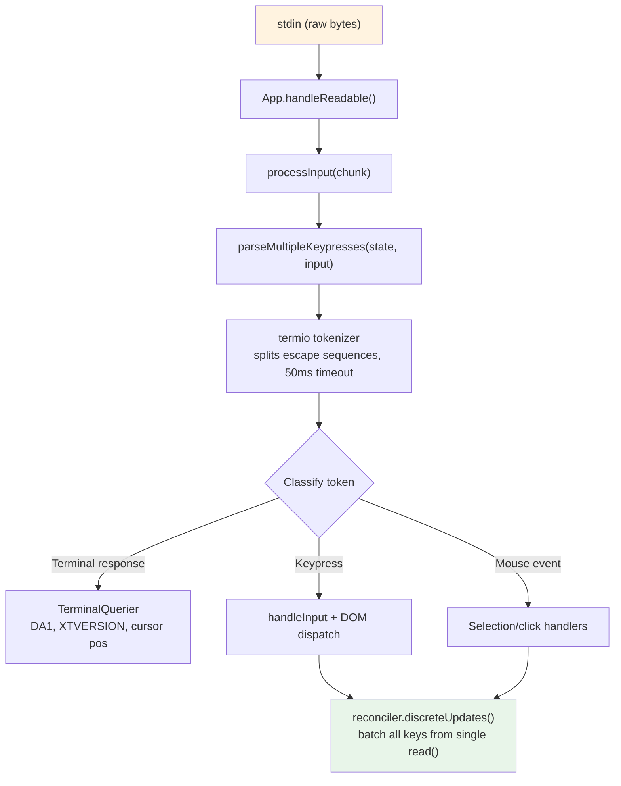
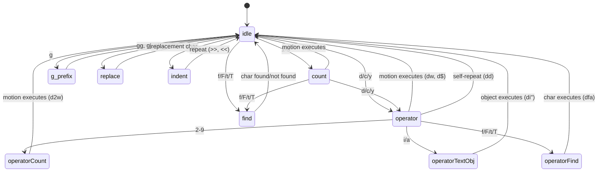

# Chương 14: Nhập liệu và tương tác

## Byte thô, hành động có ý nghĩa

Khi bạn nhấn Ctrl+X rồi Ctrl+K trong Claude Code, terminal gửi hai chuỗi byte cách nhau có thể khoảng 200 mili giây. Byte đầu là `0x18` (ASCII CAN). Byte thứ hai là `0x0B` (ASCII VT). Không byte nào trong số này tự mang ý nghĩa cố hữu nào ngoài "ký tự điều khiển". Hệ thống nhập liệu phải nhận ra rằng hai byte này, đến theo thứ tự trong một cửa sổ timeout, cấu thành hợp âm `ctrl+x ctrl+k`, ánh xạ tới hành động `chat:killAgents`, hành động này kết thúc tất cả sub-agent đang chạy.

Giữa byte thô và việc các agent bị kết thúc, có sáu hệ thống được kích hoạt: một tokenizer tách các escape sequence, một parser phân loại chúng qua năm giao thức terminal, một keybinding resolver khớp chuỗi với các binding theo ngữ cảnh, một chord state machine quản lý chuỗi nhiều phím, một handler thực thi hành động, và React gộp các cập nhật trạng thái tạo ra thành một lần render duy nhất.

Độ khó không nằm ở từng hệ thống riêng lẻ. Nó nằm ở bùng nổ tổ hợp do sự đa dạng của terminal. iTerm2 gửi chuỗi theo Kitty keyboard protocol. macOS Terminal gửi chuỗi VT220 legacy. Ghostty qua SSH gửi xterm modifyOtherKeys. tmux có thể ăn, biến đổi, hoặc passthrough bất kỳ loại nào tùy cấu hình của nó. Windows Terminal có những góc cạnh riêng với VT mode. Hệ thống nhập liệu phải tạo ra `ParsedKey` đúng từ tất cả các loại này, vì người dùng không nên phải biết terminal của mình dùng keyboard protocol nào.

Chương này đi theo đường đi từ byte thô đến hành động có ý nghĩa trên toàn bộ bối cảnh đó.

Triết lý thiết kế là progressive enhancement (nâng cấp lũy tiến) với graceful degradation (suy giảm mềm). Trên terminal hiện đại có hỗ trợ Kitty keyboard protocol, Claude Code có đầy đủ nhận diện modifier (Ctrl+Shift+A khác Ctrl+A), báo cáo super key (phím tắt Cmd), và nhận diện phím không mơ hồ. Trên terminal legacy qua SSH, nó rơi về giao thức tốt nhất khả dụng, mất một số phân biệt modifier nhưng vẫn giữ nguyên chức năng cốt lõi. Người dùng không bao giờ thấy thông báo lỗi rằng terminal của họ không được hỗ trợ. Họ có thể không dùng được `ctrl+shift+f` cho tìm kiếm toàn cục, nhưng `ctrl+r` để tìm trong lịch sử thì chạy ở mọi nơi.

---

## Pipeline phân tích phím

Input đến theo từng chunk byte trên stdin. Pipeline xử lý theo các giai đoạn:



Tokenizer là nền móng. Input terminal là một luồng byte trộn giữa ký tự in được, mã điều khiển, và escape sequence nhiều byte mà không có framing tường minh. Một lần `read()` từ stdin có thể trả về `\x1b[1;5A` (Ctrl+Up arrow), hoặc có thể trả về `\x1b` ở lần đọc này và `[1;5A` ở lần đọc kế tiếp, tùy byte đi từ PTY nhanh đến mức nào. Tokenizer duy trì một state machine đệm các escape sequence còn thiếu và phát token khi đã hoàn chỉnh.

Bài toán chuỗi chưa đầy đủ là nền tảng. Khi tokenizer thấy một `\x1b` đơn lẻ, nó không thể biết đây là phím Escape hay là phần đầu của một CSI sequence. Nó đệm byte đó và khởi động timer 50ms. Nếu không có phần tiếp theo đến, buffer được flush và `\x1b` trở thành một lần nhấn Escape. Nhưng trước khi flush, tokenizer kiểm tra `stdin.readableLength` -- nếu kernel buffer vẫn còn byte chờ, timer sẽ được gài lại thay vì flush. Cách này xử lý trường hợp event loop bị chặn quá 50ms và các byte tiếp theo đã nằm sẵn trong buffer nhưng chưa được đọc.

Với thao tác paste, timeout tăng lên 500ms. Văn bản được dán có thể lớn và đến theo nhiều chunk.

Tất cả phím đã parse từ một lần `read()` được xử lý trong một lời gọi `reconciler.discreteUpdates()`. Việc này gộp các cập nhật state của React để dán 100 ký tự chỉ tạo một lần re-render, không phải 100 lần. Cơ chế batching này là thiết yếu: nếu không có nó, mỗi ký tự trong đoạn paste sẽ kích hoạt một vòng reconciliation đầy đủ -- cập nhật state, reconciliation, commit, Yoga layout, render, diff, write. Với 5ms mỗi vòng, dán 100 ký tự sẽ mất 500ms để xử lý. Với batching, cùng thao tác chỉ tốn một vòng 5ms.

### Quản lý stdin

Component `App` quản lý raw mode bằng reference counting. Khi bất kỳ component nào cần raw input (prompt, dialog, vim mode), nó gọi `setRawMode(true)`, tăng bộ đếm. Khi không còn cần raw input, nó gọi `setRawMode(false)`, giảm bộ đếm. Raw mode chỉ bị tắt khi bộ đếm về 0. Cách này ngăn một lỗi phổ biến ở ứng dụng terminal: component A bật raw mode, component B bật raw mode, component A tắt raw mode, rồi input của component B vỡ vì raw mode toàn cục đã bị tắt.

Khi raw mode được bật lần đầu, App sẽ:

1. Dừng cơ chế bắt input sớm (cơ chế giai đoạn bootstrap gom phím trước khi React mount)
2. Đưa stdin vào raw mode (không line buffering, không echo, không signal processing)
3. Gắn listener `readable` để xử lý input bất đồng bộ
4. Bật bracketed paste (để nhận diện văn bản được dán)
5. Bật focus reporting (để app biết khi cửa sổ terminal được/ mất focus)
6. Bật extended key reporting (Kitty keyboard protocol + xterm modifyOtherKeys)

Khi tắt, tất cả các bước trên được đảo ngược theo thứ tự ngược lại. Trình tự cẩn thận này ngăn rò rỉ escape sequence -- tắt extended key reporting trước khi tắt raw mode bảo đảm terminal không tiếp tục gửi chuỗi mã hóa kiểu Kitty sau khi app đã ngừng parse chúng.

Handler tín hiệu `onExit` (qua package `signal-exit`) bảo đảm cleanup vẫn diễn ra ngay cả khi tiến trình kết thúc bất ngờ. Nếu process nhận SIGTERM hoặc SIGINT, handler sẽ tắt raw mode, khôi phục trạng thái terminal, thoát alternate screen nếu đang bật, và hiện lại con trỏ trước khi process thoát. Không có cleanup này, một phiên Claude Code bị crash sẽ để terminal ở raw mode, không con trỏ, không echo -- người dùng phải gõ mù `reset` để cứu terminal.

---

## Hỗ trợ đa giao thức

Các terminal không thống nhất cách mã hóa input bàn phím. Trình giả lập terminal hiện đại như Kitty gửi chuỗi có cấu trúc với thông tin modifier đầy đủ. Terminal legacy qua SSH gửi các chuỗi byte mơ hồ cần ngữ cảnh để diễn giải. Parser của Claude Code xử lý đồng thời năm giao thức khác nhau, vì terminal của người dùng có thể là bất kỳ loại nào.

**CSI u (Kitty keyboard protocol)** là chuẩn hiện đại. Định dạng: `ESC [ codepoint [; modifier] u`. Ví dụ: `ESC[13;2u` là Shift+Enter, `ESC[27u` là Escape không modifier. Codepoint định danh phím một cách rõ ràng -- không có mơ hồ giữa Escape-là-phím và Escape-là-tiền-tố-chuỗi. Modifier word mã hóa shift, alt, ctrl, và super (Cmd) thành từng bit độc lập. Claude Code bật giao thức này trên terminal hỗ trợ bằng escape sequence `ENABLE_KITTY_KEYBOARD` lúc khởi động, và tắt lúc thoát bằng `DISABLE_KITTY_KEYBOARD`. Giao thức được phát hiện qua bắt tay query/response: ứng dụng gửi `CSI ? u` và terminal trả `CSI ? flags u`, trong đó `flags` cho biết mức giao thức được hỗ trợ.

**xterm modifyOtherKeys** là phương án dự phòng cho các terminal như Ghostty qua SSH, nơi Kitty protocol không được thương lượng. Định dạng: `ESC [ 27 ; modifier ; keycode ~`. Lưu ý thứ tự tham số đảo ngược so với CSI u -- modifier đứng trước keycode. Đây là nguồn bug parser rất hay gặp. Giao thức được bật bằng `CSI > 4 ; 2 m` và được Ghostty, tmux, và xterm phát ra khi không nhận diện được TERM của terminal (thường gặp qua SSH khi `TERM_PROGRAM` không được forward).

**Legacy terminal sequences** bao trùm mọi thứ còn lại: function key qua chuỗi `ESC O` và `ESC [`, arrow key, numpad, Home/End/Insert/Delete, và toàn bộ "sở thú" biến thể VT100/VT220/xterm tích lũy suốt 40 năm tiến hóa terminal. Parser dùng hai biểu thức chính quy để khớp các chuỗi này: `FN_KEY_RE` cho mẫu tiền tố `ESC O/N/[/[[` (khớp function key, arrow key, và các biến thể có modifier), và `META_KEY_CODE_RE` cho meta-key code (`ESC` theo sau bởi một ký tự chữ-số, cách mã hóa Alt+key truyền thống).

Thách thức với chuỗi legacy là tính mơ hồ. `ESC [ 1 ; 2 R` có thể là Shift+F3 hoặc báo cáo vị trí con trỏ, tùy ngữ cảnh. Parser xử lý bằng kiểm tra private marker: báo cáo vị trí con trỏ dùng `CSI ? row ; col R` (có dấu `?`), còn function key có modifier dùng `CSI params R` (không có nó). Cơ chế phân định này là lý do Claude Code yêu cầu DECXCPR (extended cursor position reports) thay vì CPR chuẩn -- dạng mở rộng thì không mơ hồ.

Nhận diện terminal thêm một lớp phức tạp nữa. Khi khởi động, Claude Code gửi truy vấn `XTVERSION` (`CSI > 0 q`) để biết tên và phiên bản terminal. Phản hồi (`DCS > | name ST`) sống sót qua kết nối SSH -- khác với `TERM_PROGRAM`, vốn là biến môi trường không truyền qua SSH. Biết được danh tính terminal cho phép parser xử lý các đặc thù riêng. Ví dụ, xterm.js (dùng trong terminal tích hợp của VS Code) có hành vi escape sequence khác xterm native, và chuỗi định danh (`xterm.js(X.Y.Z)`) cho phép parser bù các khác biệt này.

**SGR mouse events** dùng định dạng `ESC [ < button ; col ; row M/m`, trong đó `M` là nhấn và `m` là nhả. Mã button mã hóa hành động: 0/1/2 cho click trái/giữa/phải, 64/65 cho cuộn lên/xuống (OR với bit wheel 0x40), 32+ cho kéo (OR với bit motion 0x20). Sự kiện cuộn được chuyển thành `ParsedKey` để đi qua keybinding system; click và kéo trở thành `ParsedMouse` và được định tuyến tới selection handler.

**Bracketed paste** bọc nội dung dán giữa marker `ESC [200~` và `ESC [201~`. Mọi thứ giữa hai marker trở thành một `ParsedKey` duy nhất với `isPasted: true`, bất kể văn bản dán chứa escape sequence gì. Cơ chế này ngăn mã được dán bị diễn giải thành lệnh -- một tính năng an toàn then chốt khi người dùng dán đoạn code chứa `\x03` (tức Ctrl+C dưới dạng byte thô).

Các kiểu output từ parser tạo thành một discriminated union (hợp nhất phân biệt) gọn gàng:

```typescript
type ParsedKey = {
  kind: 'key';
  name: string;        // 'return', 'escape', 'a', 'f1', etc.
  ctrl: boolean; meta: boolean; shift: boolean;
  option: boolean; super: boolean;
  sequence: string;    // Raw escape sequence for debugging
  isPasted: boolean;   // Inside bracketed paste
}

type ParsedMouse = {
  kind: 'mouse';
  button: number;      // SGR button code
  action: 'press' | 'release';
  col: number; row: number;  // 1-indexed terminal coordinates
}

type ParsedResponse = {
  kind: 'response';
  response: TerminalResponse;  // Routed to TerminalQuerier
}
```

Trường phân biệt `kind` bảo đảm code phía downstream xử lý tường minh từng loại input. Một key không thể vô tình bị xử lý như mouse event; một terminal response không thể vô tình bị hiểu như keypress. Kiểu `ParsedKey` cũng mang theo chuỗi thô `sequence` để debug -- khi người dùng báo "nhấn Ctrl+Shift+A không có gì xảy ra", log debug có thể cho thấy chính xác terminal đã gửi chuỗi byte nào, từ đó chẩn đoán được lỗi nằm ở mã hóa của terminal, ở nhận diện của parser, hay ở cấu hình keybinding.

Cờ `isPasted` trên `ParsedKey` là yếu tố an ninh quan trọng. Khi bracketed paste được bật, terminal bọc nội dung dán trong các marker sequence. Parser đặt `isPasted: true` lên key event tạo ra, và keybinding resolver bỏ qua việc khớp keybinding cho các phím được dán. Nếu không có bước này, dán văn bản chứa `\x03` (Ctrl+C ở dạng byte thô) hoặc các escape sequence sẽ kích hoạt lệnh ứng dụng. Có nó, nội dung dán luôn được xử lý như văn bản literal, bất kể byte bên trong là gì.

Parser cũng nhận diện phản hồi từ terminal -- các sequence do chính terminal gửi để trả lời truy vấn. Chúng gồm device attributes (DA1, DA2), cursor position report, phản hồi cờ bàn phím Kitty, XTVERSION (nhận diện terminal), và DECRPM (trạng thái mode). Các phản hồi này được định tuyến sang `TerminalQuerier` thay vì input handler:

```typescript
type TerminalResponse =
  | { type: 'decrpm'; mode: number; status: number }
  | { type: 'da1'; params: number[] }
  | { type: 'da2'; params: number[] }
  | { type: 'kittyKeyboard'; flags: number }
  | { type: 'cursorPosition'; row: number; col: number }
  | { type: 'osc'; code: number; data: string }
  | { type: 'xtversion'; version: string }
```

**Modifier decoding** theo quy ước XTerm: modifier word là `1 + (shift ? 1 : 0) + (alt ? 2 : 0) + (ctrl ? 4 : 0) + (super ? 8 : 0)`. Trường `meta` trong `ParsedKey` ánh xạ tới Alt/Option (bit 2). Trường `super` là riêng biệt (bit 8, Cmd trên macOS). Sự tách biệt này quan trọng vì phím tắt Cmd bị OS giữ lại và ứng dụng terminal thường không bắt được -- trừ khi terminal dùng Kitty protocol, giao thức này báo được các phím có super modifier mà các giao thức khác âm thầm nuốt mất.

Một stdin-gap detector (bộ phát hiện khoảng trống stdin) kích hoạt tái khẳng định mode terminal khi không có input trong 5 giây sau một quãng gián đoạn. Cơ chế này xử lý các kịch bản tmux reattach và laptop wake, nơi keyboard mode của terminal có thể đã bị multiplexer hoặc OS reset. Khi tái khẳng định chạy, nó gửi lại `ENABLE_KITTY_KEYBOARD`, `ENABLE_MODIFY_OTHER_KEYS`, bracketed paste, và focus reporting. Nếu thiếu bước này, tách rồi gắn lại một phiên tmux sẽ âm thầm hạ keyboard protocol về legacy mode, làm hỏng nhận diện modifier cho phần còn lại của phiên.

### Lớp I/O terminal

Bên dưới parser là một hệ I/O terminal có cấu trúc trong `ink/termio/`:

- **csi.ts** -- chuỗi CSI (Control Sequence Introducer): di chuyển con trỏ, xóa, vùng cuộn, bật/tắt bracketed paste, bật/tắt focus event, bật/tắt Kitty keyboard protocol
- **dec.ts** -- chuỗi DEC private mode: alternate screen buffer (1049), các mode theo dõi chuột (1000/1002/1003), hiển thị con trỏ, bracketed paste (2004), focus event (1004)
- **osc.ts** -- Operating System Commands: truy cập clipboard (OSC 52), trạng thái tab, chỉ báo tiến trình iTerm2, và bao gói cho multiplexer tmux/screen (DCS passthrough cho các chuỗi cần đi xuyên biên multiplexer)
- **sgr.ts** -- Select Graphic Rendition: hệ mã style ANSI (màu, đậm, nghiêng, gạch chân, đảo màu)
- **tokenize.ts** -- tokenizer có trạng thái để phát hiện ranh giới escape sequence

Phần bao gói multiplexer đáng nói thêm. Khi Claude Code chạy trong tmux, một số escape sequence (như thương lượng Kitty keyboard protocol) phải xuyên qua terminal ngoài. tmux dùng DCS passthrough (`ESC P ... ST`) để chuyển tiếp những sequence nó không hiểu. Hàm `wrapForMultiplexer` trong `osc.ts` phát hiện môi trường multiplexer và bọc sequence phù hợp. Nếu không có, chế độ bàn phím Kitty sẽ âm thầm thất bại trong tmux, và người dùng sẽ không biết vì sao binding Ctrl+Shift của họ ngừng hoạt động.

### Hệ thống sự kiện

Thư mục `ink/events/` triển khai hệ sự kiện tương thích trình duyệt với bảy loại sự kiện: `KeyboardEvent`, `ClickEvent`, `FocusEvent`, `InputEvent`, `TerminalFocusEvent`, và nền `TerminalEvent`. Mỗi sự kiện mang `target`, `currentTarget`, `eventPhase`, và hỗ trợ `stopPropagation()`, `stopImmediatePropagation()`, `preventDefault()`.

`InputEvent` bọc `ParsedKey` tồn tại để tương thích ngược với đường `EventEmitter` legacy mà các component cũ có thể còn dùng. Component mới dùng dispatch kiểu DOM cho keyboard event với capture/bubble phase. Cả hai đường đều được phát từ cùng một parsed key, nên luôn nhất quán -- một phím đến từ stdin tạo đúng một `ParsedKey`, từ đó sinh cả `InputEvent` (cho listener legacy) lẫn `KeyboardEvent` (cho dispatch kiểu DOM). Thiết kế hai đường này cho phép di trú dần từ mẫu EventEmitter sang mẫu DOM event mà không phá vỡ các component hiện có.

---

## Hệ thống keybinding

Hệ thống keybinding tách ba mối quan tâm thường bị trộn vào nhau: phím nào kích hoạt hành động nào (bindings), điều gì xảy ra khi hành động nổ (handlers), và binding nào đang hoạt động tại thời điểm hiện tại (contexts).

### Bindings: Cấu hình khai báo

Binding mặc định được định nghĩa trong `defaultBindings.ts` dưới dạng mảng `KeybindingBlock`, mỗi block có phạm vi theo context:

```typescript
export const DEFAULT_BINDINGS: KeybindingBlock[] = [
  {
    context: 'Global',
    bindings: {
      'ctrl+c': 'app:interrupt',
      'ctrl+d': 'app:exit',
      'ctrl+l': 'app:redraw',
      'ctrl+r': 'history:search',
    },
  },
  {
    context: 'Chat',
    bindings: {
      'escape': 'chat:cancel',
      'ctrl+x ctrl+k': 'chat:killAgents',
      'enter': 'chat:submit',
      'up': 'history:previous',
      'ctrl+x ctrl+e': 'chat:externalEditor',
    },
  },
  // ... 14 more contexts
]
```

Binding đặc thù nền tảng được xử lý ngay lúc định nghĩa. Dán ảnh là `ctrl+v` trên macOS/Linux nhưng là `alt+v` trên Windows (nơi `ctrl+v` là system paste). Chuyển mode theo vòng là `shift+tab` trên terminal có hỗ trợ VT mode nhưng là `meta+m` trên Windows Terminal không có hỗ trợ này. Binding bật/tắt theo feature flag (quick search, voice mode, terminal panel) được thêm có điều kiện.

Người dùng có thể override bất kỳ binding nào qua `~/.claude/keybindings.json`. Parser chấp nhận alias modifier (`ctrl`/`control`, `alt`/`opt`/`option`, `cmd`/`command`/`super`/`win`), alias key (`esc` -> `escape`, `return` -> `enter`), ký pháp chord (các bước cách nhau bằng khoảng trắng như `ctrl+k ctrl+s`), và null action để gỡ binding mặc định. Null action không giống việc không định nghĩa binding -- nó chặn tường minh binding mặc định không cho kích hoạt, điều này quan trọng với người muốn lấy lại một phím cho terminal của họ.

### Contexts: 16 phạm vi hoạt động

Mỗi context đại diện cho một mode tương tác nơi một tập binding cụ thể được áp dụng:

| Context | Khi nào hoạt động |
|---------|------------|
| Global | Luôn luôn |
| Chat | Ô nhập prompt đang được focus |
| Autocomplete | Menu hoàn thành đang hiển thị |
| Confirmation | Hộp thoại quyền đang hiển thị |
| Scroll | Alt-screen với nội dung có thể cuộn |
| Transcript | Trình xem transcript chỉ đọc |
| HistorySearch | Tìm lịch sử ngược (ctrl+r) |
| Task | Một tác vụ nền đang chạy |
| Help | Lớp phủ trợ giúp đang hiển thị |
| MessageSelector | Hộp thoại tua lại |
| MessageActions | Điều hướng con trỏ thông điệp |
| DiffDialog | Trình xem diff |
| Select | Danh sách chọn chung |
| Settings | Bảng cấu hình |
| Tabs | Điều hướng tab |
| Footer | Chỉ báo chân trang |

Khi một phím đến, resolver xây dựng danh sách context từ các context hiện đang active (xác định bởi state của component React), loại trùng nhưng giữ thứ tự ưu tiên, rồi tìm binding khớp. Binding khớp sau cùng sẽ thắng -- đó là cách override của người dùng có ưu tiên cao hơn mặc định. Danh sách context được dựng lại ở mỗi lần gõ (rẻ: nối mảng và dedup tối đa 16 chuỗi), nên thay đổi context có hiệu lực tức thì mà không cần cơ chế subscription hay listener nào.

Thiết kế context xử lý một mẫu tương tác khó: modal lồng nhau. Khi hộp thoại quyền xuất hiện trong lúc task đang chạy, cả context `Confirmation` lẫn `Task` có thể cùng active. Context `Confirmation` có ưu tiên cao hơn (được đăng ký sau trong component tree), nên `y` kích hoạt "approve" thay vì binding cấp task. Khi hộp thoại đóng, context `Confirmation` tắt và binding `Task` tiếp tục. Hành vi xếp chồng này xuất hiện tự nhiên từ thứ tự ưu tiên trong danh sách context -- không cần code xử lý modal đặc biệt.

### Reserved Shortcuts

Không phải thứ gì cũng có thể rebind. Hệ thống áp ba tầng reservation:

**Non-rebindable** (hành vi hardcode): `ctrl+c` (interrupt/exit), `ctrl+d` (exit), `ctrl+m` (đồng nhất với Enter ở mọi terminal -- rebind nó sẽ làm hỏng Enter).

**Terminal-reserved** (cảnh báo): `ctrl+z` (SIGTSTP), `ctrl+\` (SIGQUIT). Về kỹ thuật có thể bind, nhưng terminal trong hầu hết cấu hình sẽ chặn chúng trước khi ứng dụng nhìn thấy.

**macOS-reserved** (lỗi): `cmd+c`, `cmd+v`, `cmd+x`, `cmd+q`, `cmd+w`, `cmd+tab`, `cmd+space`. OS chặn các phím này trước khi chúng vào terminal. Bind chúng sẽ tạo ra shortcut không bao giờ chạy.

### Luồng phân giải

Khi một phím đến, đường phân giải là:

1. Dựng danh sách context: các context active do component đăng ký cộng thêm Global, dedup và giữ ưu tiên
2. Gọi `resolveKeyWithChordState(input, key, contexts)` trên bảng binding đã hợp nhất
3. Nếu `match`: xóa chord đang chờ, gọi handler, gọi `stopImmediatePropagation()` trên event
4. Nếu `chord_started`: lưu các lần gõ đang chờ, dừng propagation, khởi động chord timeout
5. Nếu `chord_cancelled`: xóa chord đang chờ, cho event rơi xuống tầng xử lý tiếp
6. Nếu `unbound`: xóa chord -- đây là gỡ binding tường minh (người dùng đặt action là `null`), nên propagation bị dừng nhưng không chạy handler
7. Nếu `none`: rơi xuống các handler khác

Chiến lược phân giải "cái cuối cùng thắng" có nghĩa là nếu cả binding mặc định và binding người dùng cùng định nghĩa `ctrl+k` trong context `Chat`, binding người dùng sẽ thắng. Điều này được đánh giá lúc match bằng cách lặp binding theo thứ tự định nghĩa và giữ match cuối cùng, thay vì dựng map override lúc load. Lợi điểm: override theo context tự phối hợp tự nhiên. Người dùng có thể override `enter` trong `Chat` mà không ảnh hưởng `enter` trong `Confirmation`.

---

## Hỗ trợ chord

Binding `ctrl+x ctrl+k` là một chord: hai lần nhấn phím cùng tạo thành một hành động. Resolver quản lý việc này bằng state machine.

Khi một phím đến:

1. Resolver nối nó vào prefix chord đang chờ (nếu có)
2. Nó kiểm tra xem có binding nào có chord bắt đầu bằng prefix này không. Nếu có, nó trả `chord_started` và lưu các lần gõ đang chờ
3. Nếu toàn bộ chord khớp chính xác một binding, nó trả `match` và xóa trạng thái đang chờ
4. Nếu prefix chord không khớp gì cả, nó trả `chord_cancelled`

Component `ChordInterceptor` chặn toàn bộ input trong trạng thái chờ chord. Nó có timeout 1000ms -- nếu lần nhấn thứ hai không đến trong một giây, chord bị hủy và lần nhấn đầu bị loại bỏ. `KeybindingContext` cung cấp `pendingChordRef` để truy cập đồng bộ trạng thái chờ, tránh độ trễ cập nhật state của React có thể khiến lần nhấn thứ hai bị xử lý trước khi cập nhật state từ lần nhấn đầu hoàn tất.

Thiết kế chord tránh việc đè lên các phím sửa văn bản của readline. Không dùng chord thì binding "kill agents" có thể là `ctrl+k` -- nhưng đó là phím "kill to end of line" của readline, thứ người dùng mong chờ trong input văn bản ở terminal. Bằng cách dùng `ctrl+x` làm prefix (khớp quy ước prefix chord của chính readline), hệ thống có một namespace binding không xung đột với các shortcut chỉnh sửa một phím.

Phần cài đặt xử lý một edge case mà đa số hệ chord bỏ sót: điều gì xảy ra khi người dùng nhấn `ctrl+x` rồi gõ một ký tự không thuộc chord nào? Nếu xử lý không cẩn thận, ký tự đó sẽ bị nuốt -- chord interceptor đã ăn input, chord bị hủy, và ký tự biến mất. `ChordInterceptor` của Claude Code trả `chord_cancelled` trong trường hợp này, khiến prefix đang chờ bị bỏ nhưng ký tự không khớp vẫn rơi xuống luồng xử lý input bình thường. Ký tự không bị mất; chỉ prefix chord bị loại bỏ. Hành vi này khớp với kỳ vọng của người dùng với prefix chord kiểu Emacs.

---

## Vim mode

### State machine

Phần triển khai vim là một pure state machine (máy trạng thái thuần) với kiểm tra kiểu bao trùm. Các kiểu chính là tài liệu:

```typescript
export type VimState =
  | { mode: 'INSERT'; insertedText: string }
  | { mode: 'NORMAL'; command: CommandState }

export type CommandState =
  | { type: 'idle' }
  | { type: 'count'; digits: string }
  | { type: 'operator'; op: Operator; count: number }
  | { type: 'operatorCount'; op: Operator; count: number; digits: string }
  | { type: 'operatorFind'; op: Operator; count: number; find: FindType }
  | { type: 'operatorTextObj'; op: Operator; count: number; scope: TextObjScope }
  | { type: 'find'; find: FindType; count: number }
  | { type: 'g'; count: number }
  | { type: 'operatorG'; op: Operator; count: number }
  | { type: 'replace'; count: number }
  | { type: 'indent'; dir: '>' | '<'; count: number }
```

Đây là discriminated union với 12 biến thể. Cơ chế kiểm tra bao trùm của TypeScript bảo đảm mọi `switch` trên `CommandState.type` đều xử lý đủ cả 12 trường hợp. Thêm một state mới vào union sẽ khiến mọi switch chưa đầy đủ báo lỗi biên dịch. State machine này không thể có dead state hay transition thiếu -- hệ kiểu chặn điều đó.

Hãy để ý cách mỗi state chỉ mang đúng dữ liệu cần cho transition kế tiếp. State `operator` biết operator nào (`op`) và count trước đó. State `operatorCount` thêm bộ gom chữ số (`digits`). State `operatorTextObj` thêm phạm vi (`inner` hoặc `around`). Không state nào mang dữ liệu mà nó không cần. Đây không chỉ là chuyện đẹp mã -- nó ngăn cả một lớp bug nơi handler đọc dữ liệu cũ từ lệnh trước đó. Nếu bạn ở state `find`, bạn có `FindType` và `count`. Bạn không có operator, vì không có operator nào đang chờ. Kiểu dữ liệu khiến trạng thái bất khả thi không thể biểu diễn được.

Sơ đồ trạng thái kể rất rõ câu chuyện:



Từ `idle`, nhấn `d` đi vào state `operator`. Từ `operator`, nhấn `w` sẽ thực thi `delete` với motion `w`. Nhấn `d` lần nữa (`dd`) kích hoạt xóa dòng. Nhấn `2` đi vào `operatorCount`, nên `d2w` thành "xóa 2 từ kế tiếp". Nhấn `i` đi vào `operatorTextObj`, nên `di"` thành "xóa phần bên trong dấu nháy". Mỗi state trung gian mang đúng ngữ cảnh cần cho transition kế tiếp -- không hơn, không kém.

### Transitions như hàm thuần

Hàm `transition()` dispatch theo loại state hiện tại tới một trong 10 hàm handler. Mỗi hàm trả về `TransitionResult`:

```typescript
type TransitionResult = {
  next?: CommandState;    // New state (omitted = stay in current)
  execute?: () => void;   // Side effect (omitted = no action yet)
}
```

Side effect được trả về chứ không thực thi ngay. Hàm transition là hàm thuần -- cho một state và một phím, nó trả về state kế tiếp và tùy chọn một closure thực hiện hành động. Caller quyết định khi nào chạy effect. Điều này khiến state machine dễ test: bơm state và key vào, assert state trả về, bỏ qua closure. Nó cũng có nghĩa hàm transition không phụ thuộc editor state, vị trí con trỏ, hay nội dung buffer. Những chi tiết đó được closure chụp tại thời điểm tạo, không phải thứ state machine tiêu thụ lúc transition.

Handler `fromIdle` là điểm vào và phủ toàn bộ từ vựng vim:

- **Count prefix**: `1-9` đi vào state `count`, tích lũy chữ số. `0` là trường hợp đặc biệt -- nó là motion "đầu dòng", không phải chữ số đếm, trừ khi đã có chữ số trước đó
- **Operators**: `d`, `c`, `y` đi vào state `operator`, chờ motion hoặc text object để xác định khoảng
- **Find**: `f`, `F`, `t`, `T` đi vào state `find`, chờ ký tự để tìm
- **G-prefix**: `g` đi vào state `g` cho lệnh ghép (`gg`, `gj`, `gk`)
- **Replace**: `r` đi vào state `replace`, chờ ký tự thay thế
- **Indent**: `>`, `<` đi vào state `indent` (cho `>>` và `<<`)
- **Simple motions**: `h/j/k/l/w/b/e/W/B/E/0/^/$` chạy ngay, di chuyển con trỏ
- **Immediate commands**: `x` (xóa ký tự), `~` (đảo hoa thường), `J` (nối dòng), `p/P` (dán), `D/C/Y` (operator shortcut), `G` (đi cuối), `.` (dot-repeat), `;/,` (lặp find), `u` (undo), `i/I/a/A/o/O` (vào insert mode)

### Motions, operators, và text objects

**Motions** là các hàm thuần ánh xạ một phím sang vị trí con trỏ. `resolveMotion(key, cursor, count)` áp motion `count` lần, dừng sớm nếu con trỏ ngừng di chuyển (bạn không thể đi trái quá cột 0). Việc dừng sớm này quan trọng cho `3w` ở cuối dòng -- nó dừng ở từ cuối thay vì wrap hoặc báo lỗi.

Motions được phân loại theo cách chúng tương tác với operator:

- **Exclusive** (mặc định) -- ký tự ở đích KHÔNG nằm trong khoảng. `dw` xóa đến trước ký tự đầu tiên của từ kế tiếp
- **Inclusive** (`e`, `E`, `$`) -- ký tự ở đích CÓ nằm trong khoảng. `de` xóa xuyên qua ký tự cuối của từ hiện tại
- **Linewise** (`j`, `k`, `G`, `gg`, `gj`, `gk`) -- khi đi với operator, khoảng mở rộng để bao trùm toàn dòng. `dj` xóa dòng hiện tại và dòng bên dưới, không chỉ ký tự giữa hai vị trí con trỏ

**Operators** áp lên một khoảng. `delete` xóa văn bản và lưu vào register. `change` xóa văn bản rồi vào insert mode. `yank` sao chép vào register mà không sửa nội dung. Trường hợp đặc biệt `cw`/`cW` theo quy ước vim: change-word đi đến cuối từ hiện tại, không phải đầu từ kế tiếp (khác `dw`).

Một edge case thú vị: snapping chip `[Image #N]`. Khi word motion hạ cánh bên trong một chip tham chiếu ảnh (được render như một đơn vị thị giác duy nhất trong terminal), khoảng sẽ mở rộng để phủ toàn bộ chip. Việc này ngăn xóa một phần của thứ người dùng nhìn như một phần tử nguyên tử -- bạn không thể xóa nửa `[Image #3]` vì hệ motion coi toàn bộ chip là một từ đơn.

Các lệnh bổ sung phủ đầy đủ từ vựng vim kỳ vọng: `x` (xóa ký tự), `r` (thay ký tự), `~` (đảo hoa thường), `J` (nối dòng), `p`/`P` (dán có nhận biết linewise/characterwise), `>>` / `<<` (thụt/lùi thụt với mốc 2 khoảng trắng), `o`/`O` (mở dòng dưới/trên rồi vào insert mode).

**Text objects** tìm biên quanh con trỏ. Chúng trả lời câu hỏi: "thứ mà con trỏ đang nằm trong là gì?"

Word object (`iw`, `aw`, `iW`, `aW`) tách văn bản thành grapheme, phân loại mỗi grapheme thành ký tự từ, khoảng trắng, hoặc dấu câu, rồi mở rộng vùng chọn tới biên từ. Biến thể `i` (inner) chọn đúng phần từ. Biến thể `a` (around) gồm cả khoảng trắng xung quanh -- ưu tiên khoảng trắng phía sau, nếu ở cuối dòng thì lùi sang phía trước. Biến thể viết hoa (`W`, `aW`) coi mọi chuỗi không phải khoảng trắng là một từ, bỏ qua biên dấu câu.

Quote object (`i"`, `a"`, `i'`, `a'`, `` i` ``, `` a` ``) tìm cặp dấu nháy trên dòng hiện tại. Cặp được ghép theo thứ tự (dấu nháy thứ nhất và thứ hai là một cặp, thứ ba và thứ tư là cặp kế tiếp, v.v.). Nếu con trỏ nằm giữa dấu thứ nhất và thứ hai, đó là cặp khớp. Biến thể `a` gồm luôn ký tự dấu nháy; biến thể `i` thì loại chúng ra.

Bracket object (`ib`/`i(`, `ab`/`a(`, `i[`/`a[`, `iB`/`i{`/`aB`/`a{`, `i<`/`a<`) dùng tìm kiếm theo dõi độ sâu để khớp dấu phân cách. Chúng tìm ra ngoài từ vị trí con trỏ, duy trì bộ đếm lồng nhau, đến khi gặp cặp khớp ở độ sâu 0. Cách này xử lý đúng ngoặc lồng nhau -- `d i (` bên trong `foo((bar))` sẽ xóa `bar`, không phải `(bar)`.

### Trạng thái bền vững và dot-repeat

Vim mode duy trì một `PersistentState` sống qua nhiều lệnh -- "trí nhớ" khiến vim có đúng cảm giác của vim:

```typescript
interface PersistentState {
  lastChange: RecordedChange;   // For dot-repeat
  lastFind: { type: FindType; char: string };  // For ; and ,
  register: string;             // Yank buffer
  registerIsLinewise: boolean;  // Paste behavior flag
}
```

Mỗi lệnh làm thay đổi dữ liệu đều tự ghi lại dưới dạng `RecordedChange` -- một discriminated union bao trùm insert, operator+motion, operator+textObj, operator+find, replace, delete-char, toggle-case, indent, open-line, và join. Lệnh `.` phát lại `lastChange` từ trạng thái bền vững, dùng count, operator, và motion đã ghi để tái tạo đúng chỉnh sửa đó tại vị trí con trỏ hiện tại.

Find-repeat (`;` và `,`) dùng `lastFind`. Lệnh `;` lặp lại lần find gần nhất theo cùng hướng. Lệnh `,` đảo hướng: `f` thành `F`, `t` thành `T`, và ngược lại. Nghĩa là sau `fa` (tìm 'a' kế tiếp), `;` sẽ tìm 'a' tiếp theo về phía trước còn `,` sẽ tìm 'a' theo chiều ngược lại -- người dùng không cần nhớ lúc trước mình tìm theo hướng nào.

Register theo dõi văn bản đã yank và delete. Khi nội dung register kết thúc bằng `\n`, nó được gắn cờ linewise, từ đó đổi hành vi paste: `p` chèn bên dưới dòng hiện tại (không phải sau con trỏ), và `P` chèn bên trên. Phân biệt này người dùng không nhìn thấy trực tiếp nhưng cực kỳ quan trọng cho workflow "xóa một dòng, dán nó sang chỗ khác" mà người dùng vim dựa vào liên tục.

---

## Cuộn ảo

Phiên Claude Code dài tạo ra hội thoại dài. Một phiên debug nặng có thể sinh 200+ tin nhắn, mỗi tin có markdown, code block, kết quả dùng tool, và bản ghi quyền. Không có ảo hóa, React sẽ giữ 200+ cây component con trong bộ nhớ, mỗi cây có state, effect, và cache memoization riêng. Cây DOM sẽ chứa hàng nghìn node. Yoga layout sẽ phải duyệt tất cả chúng ở mỗi frame. Terminal sẽ không dùng nổi.

Component `VirtualMessageList` giải quyết bằng cách chỉ render các tin đang thấy trong viewport cộng một buffer nhỏ phía trên và dưới. Trong hội thoại hàng trăm tin, khác biệt là mount 500 cây con React (mỗi cây có parse markdown, syntax highlight, và block tool use) so với mount 15 cây.

Component duy trì:

- **Height cache** theo từng tin, invalid khi số cột terminal thay đổi
- **Jump handle** cho điều hướng tìm kiếm transcript (nhảy tới index, match kế/ trước)
- **Search text extraction** có warm-cache support (tiền chuyển toàn bộ tin sang lowercase khi người dùng nhập `/`)
- **Sticky prompt tracking** -- khi người dùng cuộn ra xa ô nhập, văn bản prompt gần nhất hiện ở đầu như ngữ cảnh
- **Message actions navigation** -- chọn tin dựa trên con trỏ cho tính năng rewind

Hook `useVirtualScroll` tính toán tin nào cần mount dựa trên `scrollTop`, `viewportHeight`, và tổng chiều cao tích lũy của tin. Nó duy trì clamp bound cuộn trên `ScrollBox` để ngăn màn hình trắng khi các lệnh `scrollTo` dồn dập vượt qua lần re-render bất đồng bộ của React -- vấn đề kinh điển của danh sách ảo hóa, nơi vị trí cuộn có thể chạy nhanh hơn cập nhật DOM.

Tương tác giữa cuộn ảo và markdown token cache rất đáng lưu ý. Khi một tin cuộn ra khỏi viewport, cây React của nó unmount. Khi người dùng cuộn ngược lại, cây đó remount. Không có cache thì markdown của mỗi tin sẽ bị parse lại mỗi lần người dùng cuộn qua. LRU cache ở cấp module (500 entry, khóa theo content hash) bảo đảm lời gọi `marked.lexer()` tốn kém chỉ xảy ra tối đa một lần cho mỗi nội dung tin nhắn duy nhất, bất kể component mount và unmount bao nhiêu lần.

Bản thân component `ScrollBox` cung cấp API imperative qua `useImperativeHandle`:

- `scrollTo(y)` -- cuộn tuyệt đối, phá chế độ sticky-scroll
- `scrollBy(dy)` -- cộng dồn vào `pendingScrollDelta`, được renderer xả với tốc độ có giới hạn
- `scrollToElement(el, offset)` -- hoãn đọc vị trí tới lúc render qua `scrollAnchor`
- `scrollToBottom()` -- bật lại chế độ sticky-scroll
- `setClampBounds(min, max)` -- ràng buộc cửa sổ cuộn ảo

Mọi thay đổi cuộn đi thẳng vào thuộc tính node DOM và lên lịch render qua microtask, bỏ qua reconciler của React. Lời gọi `markScrollActivity()` báo cho các interval nền (spinner, timer) bỏ qua tick kế tiếp, giảm tranh chấp event-loop trong lúc cuộn tích cực. Đây là cooperative scheduling pattern (mẫu lập lịch hợp tác): đường cuộn báo cho tác vụ nền "tôi đang ở thao tác nhạy độ trễ, hãy nhường". Các interval nền kiểm tra cờ này trước khi lên lịch tick tiếp theo và lùi một frame nếu đang cuộn. Kết quả là cuộn mượt ổn định ngay cả khi có nhiều spinner và timer chạy nền.

---

## Apply This: Xây dựng hệ keybinding nhận biết ngữ cảnh

Kiến trúc keybinding của Claude Code cung cấp một mẫu cho mọi ứng dụng có input theo mode -- editor, IDE, công cụ vẽ, terminal multiplexer. Những ý chính:

**Tách bindings khỏi handlers.** Binding là dữ liệu (phím nào ánh xạ tới tên hành động nào). Handler là code (điều gì xảy ra khi hành động kích hoạt). Giữ chúng tách biệt nghĩa là binding có thể serialize thành JSON cho người dùng tùy chỉnh, còn handler ở lại trong component sở hữu state liên quan. Người dùng có thể rebind `ctrl+k` thành `chat:submit` mà không chạm vào code component nào.

**Context là khái niệm hạng nhất.** Thay vì một keymap phẳng, hãy định nghĩa các context bật/tắt theo trạng thái ứng dụng. Khi dialog mở, context `Confirmation` bật và binding của nó có ưu tiên cao hơn binding `Chat`. Khi dialog đóng, binding `Chat` tiếp tục. Cách này loại bỏ "nồi canh điều kiện" kiểu `if (dialogOpen && key === 'y')` rải khắp event handler.

**Trạng thái chord là một máy trạng thái tường minh.** Chuỗi nhiều phím (chord) không phải trường hợp đặc biệt của binding một phím -- chúng là một loại binding khác cần state machine với ngữ nghĩa timeout và hủy. Làm tường minh điều này (với component `ChordInterceptor` chuyên dụng và `pendingChordRef`) ngăn bug tinh vi nơi lần nhấn thứ hai của chord bị handler khác nuốt vì cập nhật state React chưa kịp lan truyền.

**Đặt vùng cấm sớm, cảnh báo rõ.** Xác định các phím không thể rebind (system shortcut, ký tự điều khiển terminal) ngay lúc định nghĩa, không phải lúc phân giải. Khi người dùng cố bind `ctrl+c`, hãy báo lỗi trong lúc nạp cấu hình thay vì âm thầm nhận một binding sẽ không bao giờ kích hoạt. Đây là khác biệt giữa hệ keybinding dùng được và hệ keybinding tạo ra bug report khó hiểu.

**Thiết kế cho sự đa dạng terminal.** Hệ keybinding của Claude Code định nghĩa phương án đặc thù nền tảng ở cấp binding, không ở cấp handler. Dán ảnh là `ctrl+v` hoặc `alt+v` tùy OS. Chuyển mode theo vòng là `shift+tab` hoặc `meta+m` tùy có hỗ trợ VT mode hay không. Handler cho mỗi action là như nhau bất kể phím nào kích hoạt nó. Điều này nghĩa là test chỉ cần phủ một đường code cho mỗi action, không phải một đường cho mỗi tổ hợp platform-phím. Và khi một quirk terminal mới xuất hiện (ví dụ Windows Terminal thiếu VT mode trước Node 24.2.0), bản sửa là một điều kiện duy nhất ở phần định nghĩa binding, không phải tập hợp `if (platform === 'windows')` rải rác trong code handler.

**Cung cấp escape hatch.** Cơ chế null-action unbinding nhỏ nhưng quan trọng. Người dùng chạy Claude Code trong terminal multiplexer có thể thấy `ctrl+t` (toggle todos) xung đột với shortcut chuyển tab của multiplexer. Bằng cách thêm `{ "ctrl+t": null }` vào keybindings.json, họ tắt hoàn toàn binding đó. Lần nhấn phím sẽ passthrough cho multiplexer. Nếu không có null unbinding, lựa chọn duy nhất của người dùng là rebind `ctrl+t` sang hành động khác mà họ không muốn, hoặc cấu hình lại multiplexer -- cả hai đều là trải nghiệm tệ.

Triển khai vim mode thêm một bài học nữa: **hãy để hệ kiểu ép buộc state machine của bạn**. Union `CommandState` 12 biến thể khiến bạn không thể quên một state trong câu lệnh switch. Kiểu `TransitionResult` tách thay đổi trạng thái khỏi side effect, giúp máy có thể test như hàm thuần. Nếu ứng dụng của bạn có input theo mode, hãy biểu diễn các mode dưới dạng discriminated union và để trình biên dịch kiểm chứng tính đầy đủ. Thời gian đầu tư cho kiểu dữ liệu sẽ trả lại bằng số bug runtime bị loại bỏ.

Hãy nhìn phương án thay thế: triển khai vim bằng mutable state và điều kiện mệnh lệnh. Handler `fromOperator` sẽ thành một đống `if (mode === 'operator' && pendingCount !== null && isDigit(key))`, mỗi nhánh lại mutate biến dùng chung. Thêm một state mới (ví dụ mode ghi macro) sẽ buộc bạn rà toàn bộ nhánh để chắc state mới được xử lý. Với discriminated union, trình biên dịch làm việc rà soát đó -- PR thêm biến thể mới sẽ không build cho đến khi mọi switch xử lý biến thể đó.

Đây là bài học sâu hơn từ hệ input của Claude Code: ở mọi lớp -- tokenizer, parser, keybinding resolver, vim state machine -- kiến trúc đều chuyển input phi cấu trúc thành cấu trúc có kiểu, được xử lý bao trùm, càng sớm càng tốt. Byte thô thành `ParsedKey` tại biên parser. `ParsedKey` thành tên hành động tại biên keybinding. Tên hành động thành handler có kiểu tại biên component. Mỗi lần chuyển đổi thu hẹp không gian trạng thái có thể xảy ra, và mỗi lần thu hẹp đều được hệ kiểu TypeScript cưỡng chế. Đến lúc một lần nhấn phím vào logic ứng dụng, sự mơ hồ đã biến mất. Không còn "nếu key là undefined thì sao?". Không còn "nếu tổ hợp modifier là bất khả thi thì sao?". Hệ kiểu đã cấm các trạng thái đó tồn tại từ trước.

Hai chương này kể một câu chuyện chung. Chương 13 đã cho thấy hệ render loại bỏ công việc không cần thiết như thế nào -- blit vùng không đổi, interning giá trị lặp lại, diff ở cấp cell, theo dõi damage bounds. Chương 14 cho thấy hệ input loại bỏ mơ hồ như thế nào -- parse năm giao thức về một kiểu thống nhất, phân giải phím theo binding có ngữ cảnh, biểu diễn trạng thái theo mode bằng union bao trùm. Hệ render trả lời câu hỏi "làm sao vẽ 24.000 cell 60 lần mỗi giây?". Hệ input trả lời câu hỏi "làm sao biến một luồng byte thành hành động có ý nghĩa trên một hệ sinh thái phân mảnh?". Cả hai câu trả lời theo cùng một nguyên tắc: đẩy độ phức tạp ra biên, nơi nó có thể được xử lý một lần và đúng cách, để mọi thứ downstream vận hành trên dữ liệu sạch, có kiểu, và biên giới rõ ràng. Terminal là hỗn loạn. Ứng dụng là trật tự. Code ở biên làm phần việc khó để chuyển cái này thành cái kia.

---

## Tóm tắt: Hai hệ thống, một triết lý thiết kế

Chương 13 và 14 bao quát hai nửa của giao diện terminal: output và input. Dù mối quan tâm khác nhau, cả hai hệ thống đều theo cùng các nguyên lý kiến trúc.

**Interning và gián tiếp hóa.** Hệ render intern ký tự, style, và hyperlink vào các pool, thay so sánh chuỗi bằng so sánh số nguyên trong toàn bộ hot path. Hệ input intern escape sequence thành các đối tượng `ParsedKey` có cấu trúc tại biên parser, thay đối sánh mẫu ở mức byte bằng truy cập trường có kiểu xuyên suốt đường handler.

**Loại bỏ công việc theo lớp.** Hệ render xếp chồng năm tối ưu (dirty flags, blit, damage rectangles, cell-level diff, patch optimization), mỗi lớp loại bỏ một hạng mục tính toán không cần thiết. Hệ input xếp chồng ba lớp (tokenizer, protocol parser, keybinding resolver), mỗi lớp loại bỏ một hạng mục mơ hồ.

**Hàm thuần và state machine có kiểu.** Vim mode là một state machine thuần với transition có kiểu. Keybinding resolver là hàm thuần từ (key, contexts, chord-state) sang resolution-result. Pipeline render là hàm thuần từ (DOM tree, màn hình trước đó) sang (màn hình mới, patches). Side effect diễn ra ở biên -- ghi stdout, dispatch sang React -- không nằm trong logic lõi.

**Graceful degradation trên nhiều môi trường.** Hệ render thích ứng theo kích thước terminal, hỗ trợ alt-screen, và khả dụng giao thức synchronized-update. Hệ input thích ứng theo Kitty keyboard protocol, xterm modifyOtherKeys, chuỗi VT legacy, và yêu cầu passthrough qua multiplexer. Không hệ nào đòi một terminal cụ thể mới chạy được; cả hai chỉ tốt hơn trên terminal mạnh hơn.

Các nguyên lý này không riêng cho ứng dụng terminal. Chúng áp dụng cho mọi hệ thống phải xử lý input tần suất cao và tạo output độ trễ thấp trên tập môi trường chạy đa dạng. Terminal chỉ tình cờ là môi trường nơi ràng buộc đủ sắc để vi phạm các nguyên lý này sẽ suy giảm thấy ngay -- rớt frame, nuốt phím, nhấp nháy. Chính độ sắc đó khiến nó là một người thầy tuyệt vời.

Chương tiếp theo chuyển từ lớp UI sang lớp giao thức: cách Claude Code triển khai MCP -- giao thức công cụ phổ quát cho phép bất kỳ dịch vụ ngoài nào trở thành công cụ hạng nhất. Terminal UI xử lý chặng cuối của trải nghiệm người dùng -- chuyển cấu trúc dữ liệu thành pixel trên màn hình và lần nhấn phím thành hành động ứng dụng. MCP xử lý chặng đầu của khả năng mở rộng -- khám phá, kết nối, và thực thi công cụ sống ngoài codebase của agent. Ở giữa chúng, hệ memory (Chương 11) và hệ skills/hooks (Chương 12) định nghĩa các lớp trí tuệ và điều khiển. Trần chất lượng của toàn hệ thống phụ thuộc vào cả bốn: không mức độ thông minh mô hình nào bù được UI lag, và không mức hiệu năng render nào bù được một mô hình không với tới được công cụ nó cần.