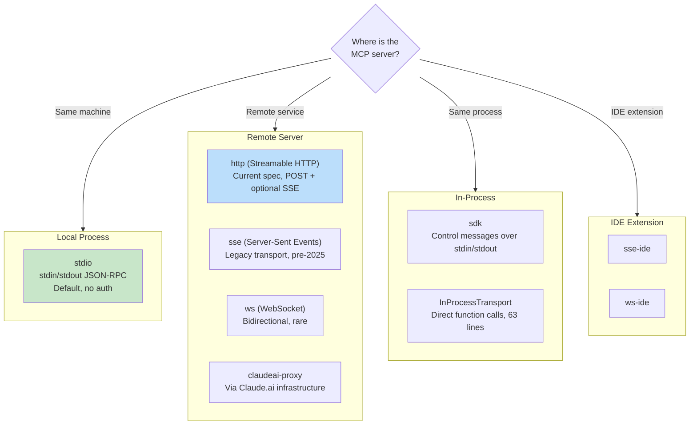
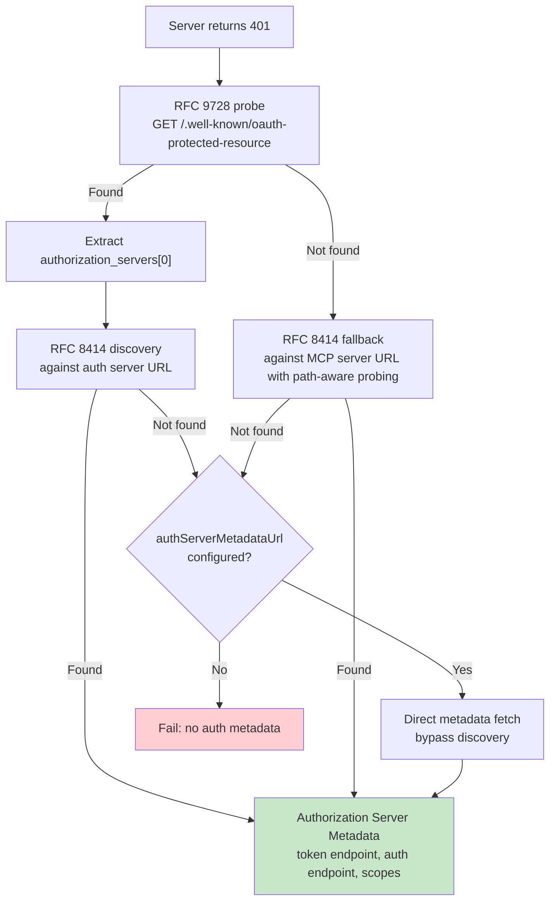

# Chương 15: MCP -- The Universal Tool Protocol

## Why MCP Matters Beyond Claude Code

Mọi chương khác trong cuốn sách này đều nói về nội tại của Claude Code. Chương này thì khác. Model Context Protocol (Giao thức Ngữ cảnh Mô hình) là một đặc tả mở mà bất kỳ agent nào cũng có thể triển khai, và phân hệ MCP của Claude Code là một trong những client production đầy đủ nhất hiện có. Nếu bạn đang xây một agent cần gọi công cụ bên ngoài -- bất kỳ agent nào, bằng bất kỳ ngôn ngữ nào, trên bất kỳ model nào -- các mẫu trong chương này đều chuyển giao trực tiếp được.

Giá trị cốt lõi rất thẳng: MCP định nghĩa một giao thức JSON-RPC 2.0 để khám phá và gọi công cụ giữa client (agent) và server (nhà cung cấp công cụ). Client gửi `tools/list` để khám phá server cung cấp gì, rồi `tools/call` để thực thi. Server mô tả từng công cụ bằng tên, mô tả, và JSON Schema cho đầu vào của nó. Đó là toàn bộ hợp đồng. Mọi thứ còn lại -- chọn transport, xác thực, nạp config, chuẩn hóa tên công cụ -- là phần triển khai biến một đặc tả gọn gàng thành thứ có thể sống sót khi va chạm với thế giới thực.

Triển khai MCP của Claude Code trải dài trên bốn file lõi: `types.ts`, `client.ts`, `auth.ts`, và `InProcessTransport.ts`. Gộp lại, chúng hỗ trợ tám loại transport, bảy phạm vi cấu hình, OAuth discovery qua hai RFC, và một lớp bọc công cụ khiến công cụ MCP không thể phân biệt với công cụ built-in -- cùng interface `Tool` đã nói ở Chương 6. Chương này đi qua từng lớp.

---

## Eight Transport Types

Quyết định thiết kế đầu tiên trong mọi tích hợp MCP là client nói chuyện với server bằng cách nào. Claude Code hỗ trợ tám cấu hình transport:



Ba lựa chọn thiết kế đáng chú ý. Thứ nhất, `stdio` là mặc định -- khi bỏ qua `type`, hệ thống giả định một subprocess cục bộ. Điều này tương thích ngược với các cấu hình MCP sớm nhất. Thứ hai, các fetch wrapper được xếp chồng: lớp timeout bọc ngoài lớp step-up detection, rồi bọc ngoài base fetch. Mỗi wrapper xử lý một mối quan tâm. Thứ ba, nhánh `ws-ide` có tách runtime Bun/Node -- `WebSocket` của Bun nhận tùy chọn proxy và TLS theo chuẩn native, còn Node thì cần package `ws`.

**When to use which.** Với công cụ cục bộ (filesystem, database, script tùy chỉnh), dùng `stdio` -- không mạng, không auth, chỉ có pipe. Với dịch vụ từ xa, `http` (Streamable HTTP) là khuyến nghị đặc tả hiện tại. `sse` là legacy nhưng vẫn triển khai rộng. Các loại `sdk`, IDE, và `claudeai-proxy` là nội bộ trong hệ sinh thái tương ứng của chúng.

---

## Configuration Loading and Scoping

Cấu hình server MCP được nạp từ bảy scope, rồi hợp nhất và loại trùng:

| Scope | Nguồn | Mức tin cậy |
|-------|--------|-------|
| `local` | `.mcp.json` trong thư mục làm việc | Cần người dùng phê duyệt |
| `user` | Trường mcpServers trong `~/.claude.json` | Do người dùng quản lý |
| `project` | Cấu hình cấp dự án | Thiết lập dùng chung cho dự án |
| `enterprise` | Cấu hình enterprise được quản trị | Được tổ chức phê duyệt sẵn |
| `managed` | Server do plugin cung cấp | Tự động khám phá |
| `claudeai` | Giao diện web Claude.ai | Được ủy quyền sẵn qua web |
| `dynamic` | Tiêm lúc runtime (SDK) | Được thêm bằng chương trình |

**Deduplication is content-based, not name-based.** Hai server tên khác nhau nhưng cùng command hoặc URL được nhận diện là cùng một server. Hàm `getMcpServerSignature()` tính khóa canonical: `stdio:["command","arg1"]` cho server cục bộ, `url:https://example.com/mcp` cho server từ xa. Server do plugin cung cấp có signature trùng với config thủ công sẽ bị suppress.

---

## Tool Wrapping: From MCP to Claude Code

Khi kết nối thành công, client gọi `tools/list`. Mỗi định nghĩa công cụ được chuyển thành interface `Tool` nội bộ của Claude Code -- cùng interface mà công cụ built-in dùng. Sau khi bọc, model không thể phân biệt công cụ built-in với công cụ MCP.

Quy trình bọc có bốn giai đoạn:

**1. Name normalization.** `normalizeNameForMCP()` thay ký tự không hợp lệ bằng dấu gạch dưới. Fully qualified name theo dạng `mcp__{serverName}__{toolName}`.

**2. Description truncation.** Giới hạn ở 2,048 ký tự. Các server sinh từ OpenAPI đã từng đổ 15-60KB vào `tool.description` -- khoảng 15,000 token mỗi lượt cho chỉ một công cụ.

**3. Schema passthrough.** `inputSchema` của công cụ đi thẳng tới API. Không biến đổi, không kiểm tra ở thời điểm bọc. Lỗi schema lộ ra ở lúc gọi, không phải lúc đăng ký.

**4. Annotation mapping.** Annotation MCP ánh xạ thành cờ hành vi: `readOnlyHint` đánh dấu công cụ an toàn để thực thi đồng thời (như đã bàn trong streaming executor của Chương 7), `destructiveHint` kích hoạt soi xét quyền kỹ hơn. Các annotation này đến từ MCP server -- một server độc hại có thể đánh dấu công cụ phá hủy là read-only. Đây là trust boundary được chấp nhận, nhưng cần hiểu rõ: người dùng đã chủ động chọn server đó, và server độc hại đánh dấu sai là một vector tấn công có thật. Hệ thống chấp nhận đánh đổi này vì phương án ngược lại -- bỏ qua hoàn toàn annotation -- sẽ ngăn các server hợp lệ cải thiện trải nghiệm người dùng.

---

## OAuth for MCP Servers

MCP server từ xa thường cần xác thực. Claude Code triển khai đầy đủ luồng OAuth 2.0 + PKCE với discovery theo RFC, Cross-App Access, và Error Body Normalization (Chuẩn hóa phần thân lỗi).

### Discovery Chain



Lối thoát `authServerMetadataUrl` tồn tại vì một số OAuth server không triển khai RFC nào trong hai RFC đó.

### Cross-App Access (XAA)

Khi cấu hình MCP server có `oauth.xaa: true`, hệ thống thực hiện federated token exchange thông qua một Identity Provider -- một lần đăng nhập IdP mở khóa nhiều MCP server.

### Error Body Normalization

Hàm `normalizeOAuthErrorBody()` xử lý các OAuth server vi phạm đặc tả. Slack trả về HTTP 200 cho phản hồi lỗi với lỗi bị chôn trong JSON body. Hàm này soi body của phản hồi POST 2xx, và khi body khớp `OAuthErrorResponseSchema` nhưng không khớp `OAuthTokensSchema`, nó ghi đè phản hồi thành HTTP 400. Nó cũng chuẩn hóa các mã lỗi riêng của Slack (`invalid_refresh_token`, `expired_refresh_token`, `token_expired`) về chuẩn `invalid_grant`.

---

## In-Process Transport

Không phải MCP server nào cũng cần là process riêng. Lớp `InProcessTransport` cho phép chạy MCP server và client trong cùng một process:

```typescript
class InProcessTransport implements Transport {
  async send(message: JSONRPCMessage): Promise<void> {
    if (this.closed) throw new Error('Transport is closed')
    queueMicrotask(() => { this.peer?.onmessage?.(message) })
  }
  async close(): Promise<void> {
    if (this.closed) return
    this.closed = true
    this.onclose?.()
    if (this.peer && !this.peer.closed) {
      this.peer.closed = true
      this.peer.onclose?.()
    }
  }
}
```

Toàn bộ file chỉ 63 dòng. Hai quyết định thiết kế đáng chú ý. Thứ nhất, `send()` chuyển qua `queueMicrotask()` để tránh vấn đề độ sâu stack trong các chu kỳ request/response đồng bộ. Thứ hai, `close()` cascade sang peer, ngăn trạng thái half-open. Cả Chrome MCP server và Computer Use MCP server đều dùng mẫu này.

---

## Connection Management

### Connection States

Mỗi kết nối MCP server tồn tại trong một trong năm trạng thái: `connected`, `failed`, `needs-auth` (với cache TTL 15 phút để ngăn 30 server tự khám phá cùng một token đã hết hạn một cách độc lập), `pending`, hoặc `disabled`.

### Session Expiry Detection

Transport Streamable HTTP của MCP dùng session ID. Khi server khởi động lại, request trả về HTTP 404 với mã lỗi JSON-RPC -32001. Hàm `isMcpSessionExpiredError()` kiểm tra cả hai tín hiệu -- lưu ý rằng hàm dùng phép chứa chuỗi trên thông báo lỗi để phát hiện mã lỗi, thực dụng nhưng mong manh:

```typescript
export function isMcpSessionExpiredError(error: Error): boolean {
  const httpStatus = 'code' in error ? (error as any).code : undefined
  if (httpStatus !== 404) return false
  return error.message.includes('"code":-32001') ||
    error.message.includes('"code": -32001')
}
```

Khi phát hiện, cache kết nối bị xóa và lệnh gọi được thử lại một lần.

### Batched Connections

Server cục bộ kết nối theo lô 3 (spawn process có thể làm cạn file descriptor), server từ xa theo lô 20. React context provider `MCPConnectionManager.tsx` quản lý vòng đời, diff các kết nối hiện tại với config mới.

---

## Claude.ai Proxy Transport

Transport `claudeai-proxy` minh họa một mẫu tích hợp agent phổ biến: kết nối qua một trung gian. Người dùng Claude.ai cấu hình MCP "connectors" qua giao diện web, và CLI định tuyến qua hạ tầng Claude.ai, nơi xử lý OAuth phía nhà cung cấp.

Hàm `createClaudeAiProxyFetch()` chụp `sentToken` tại thời điểm gửi request, không đọc lại sau 401. Dưới các 401 đồng thời từ nhiều connector, retry của connector khác có thể đã refresh token xong. Hàm cũng kiểm tra refresh đồng thời ngay cả khi trình xử lý refresh trả false -- trường hợp tranh chấp "ELOCKED contention" khi connector khác thắng cuộc đua lockfile.

---

## Timeout Architecture

Timeout MCP được phân lớp, mỗi lớp bảo vệ trước một kiểu lỗi khác nhau:

| Layer | Thời lượng | Bảo vệ trước |
|-------|----------|------------------|
| Connection | 30s | Server không tới được hoặc khởi động chậm |
| Per-request | 60s (mới cho mỗi request) | Lỗi stale timeout signal |
| Tool call | ~27.8 giờ | Tác vụ thực sự chạy rất lâu |
| Auth | 30s cho mỗi OAuth request | OAuth server không tới được |

Timeout per-request đáng nhấn mạnh. Các bản triển khai sớm tạo một `AbortSignal.timeout(60000)` duy nhất ở thời điểm kết nối. Sau 60 giây rỗi, request kế tiếp sẽ abort ngay -- signal đã hết hạn sẵn. Bản sửa: `wrapFetchWithTimeout()` tạo timeout signal mới cho từng request. Nó cũng chuẩn hóa header `Accept` như lớp phòng thủ bước cuối trước runtime và proxy có thể làm rơi header này.

---

## Apply This: Integrating MCP Into Your Own Agent

**Start with stdio, add complexity later.** `StdioClientTransport` xử lý tất cả: spawn, pipe, kill. Một dòng config, một lớp transport, và bạn có công cụ MCP.

**Normalize names and truncate descriptions.** Tên phải khớp `^[a-zA-Z0-9_-]{1,64}$`. Thêm tiền tố `mcp__{serverName}__` để tránh đụng tên. Giới hạn mô tả ở 2,048 ký tự -- server sinh từ OpenAPI nếu không sẽ lãng phí token ngữ cảnh.

**Handle auth lazily.** Đừng cố OAuth cho tới khi server trả 401. Phần lớn server `stdio` không cần auth.

**Use in-process transport for built-in servers.** `createLinkedTransportPair()` loại bỏ overhead subprocess cho các server bạn kiểm soát.

**Respect tool annotations and sanitize output.** `readOnlyHint` bật thực thi đồng thời. Làm sạch phản hồi trước Unicode độc hại (bidirectional overrides, zero-width joiners) có thể đánh lừa model.

Giao thức MCP cố ý tối giản -- hai phương thức JSON-RPC. Mọi thứ giữa hai phương thức đó và một triển khai production là kỹ thuật: tám transport, bảy scope config, hai OAuth RFC, và timeout layering. Triển khai của Claude Code cho thấy phần kỹ thuật đó trông như thế nào ở quy mô lớn.

Chương tiếp theo xem điều gì xảy ra khi agent vươn ra ngoài localhost: các giao thức thực thi từ xa cho phép Claude Code chạy trong container đám mây, nhận chỉ thị từ trình duyệt web, và tunnel lưu lượng API qua các proxy tiêm credential.
