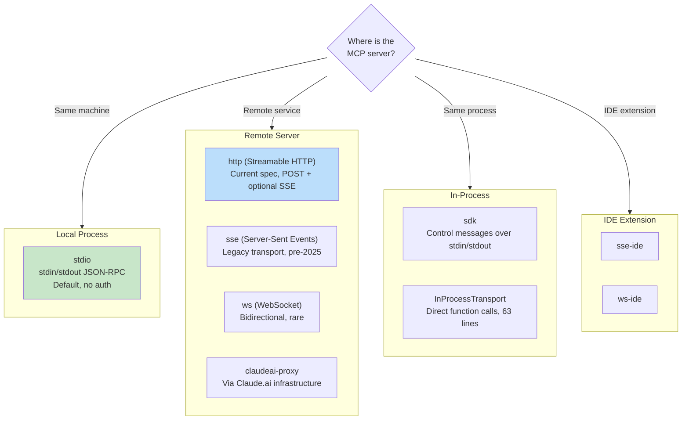
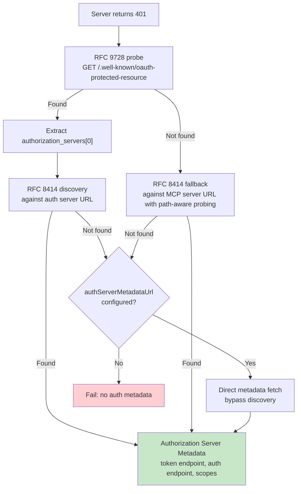

# Chương 15: MCP -- The Universal Tool Protocol

## Why MCP Matters Beyond Claude Code

Các chương còn lại trong cuốn sách này tập trung vào nội tại của Claude Code. Chương này thì khác. Model Context Protocol là một đặc tả mở mà bất kỳ agent nào cũng có thể triển khai, và phân hệ MCP của Claude Code là một trong những client production đầy đủ nhất hiện nay. Nếu bạn đang xây dựng một agent cần gọi công cụ bên ngoài -- bất kỳ agent nào, bằng bất kỳ ngôn ngữ nào, trên bất kỳ model nào -- các pattern trong chương này đều có thể chuyển giao trực tiếp.

Giá trị cốt lõi rất đơn giản: MCP định nghĩa một giao thức JSON-RPC 2.0 cho việc tool discovery và tool invocation giữa client (agent) và server (nhà cung cấp công cụ). Client gửi `tools/list` để khám phá server cung cấp gì, rồi gửi `tools/call` để thực thi. Server mô tả từng tool bằng tên, mô tả, và JSON Schema cho input. Đó là toàn bộ contract. Mọi phần còn lại -- chọn transport, authentication, config loading, tool name normalization -- là phần triển khai biến một đặc tả gọn gàng thành hệ thống chịu được va chạm thực tế.

Triển khai MCP của Claude Code trải trên bốn file cốt lõi: `types.ts`, `client.ts`, `auth.ts`, và `InProcessTransport.ts`. Kết hợp lại, chúng hỗ trợ tám transport type, bảy configuration scope, OAuth discovery qua hai RFC, và một lớp tool wrapping khiến MCP tools không thể phân biệt với built-in tools -- cùng interface `Tool` đã phân tích ở Chương 6. Chương này sẽ đi qua từng lớp.

---

## Eight Transport Types

Quyết định thiết kế đầu tiên trong mọi tích hợp MCP là client nói chuyện với server bằng cách nào. Claude Code hỗ trợ tám cấu hình transport:



Có ba điểm thiết kế đáng chú ý. Thứ nhất, `stdio` là mặc định -- khi thiếu `type`, hệ thống giả định một local subprocess. Cách này backwards-compatible với các cấu hình MCP đời đầu. Thứ hai, các fetch wrapper được xếp lớp: timeout wrapping nằm ngoài step-up detection, rồi mới đến base fetch. Mỗi wrapper xử lý đúng một concern. Thứ ba, nhánh `ws-ide` tách theo runtime Bun/Node -- `WebSocket` của Bun nhận proxy và TLS options theo cách native, còn Node cần package `ws`.

**When to use which.** Với local tools (filesystem, database, custom scripts), dùng `stdio` -- không network, không auth, chỉ pipes. Với remote services, `http` (Streamable HTTP) là khuyến nghị của đặc tả hiện tại. `sse` là legacy nhưng vẫn được triển khai rộng. Các type `sdk`, IDE, và `claudeai-proxy` là nội bộ cho từng hệ sinh thái tương ứng.

---

## Configuration Loading and Scoping

Cấu hình MCP server được nạp từ bảy scope, sau đó merge và deduplicate:

| Scope | Source | Trust |
|-------|--------|-------|
| `local` | `.mcp.json` trong thư mục làm việc | Cần người dùng phê duyệt |
| `user` | Trường mcpServers trong `~/.claude.json` | Người dùng quản lý |
| `project` | Cấu hình cấp dự án | Thiết lập chia sẻ cho dự án |
| `enterprise` | Cấu hình enterprise được quản trị | Tổ chức phê duyệt sẵn |
| `managed` | Server do plugin cung cấp | Tự động khám phá |
| `claudeai` | Giao diện web Claude.ai | Được ủy quyền sẵn qua web |
| `dynamic` | Runtime injection (SDK) | Được thêm bằng chương trình |

**Deduplication is content-based, not name-based.** Hai server khác tên nhưng cùng command hoặc URL sẽ được nhận diện là cùng một server. Hàm `getMcpServerSignature()` tạo canonical key: `stdio:["command","arg1"]` cho local servers, `url:https://example.com/mcp` cho remote servers. Plugin-provided servers có signature trùng với cấu hình thủ công sẽ bị suppress.

---

## Tool Wrapping: From MCP to Claude Code

Khi kết nối thành công, client gọi `tools/list`. Mỗi tool definition được chuyển thành interface `Tool` nội bộ của Claude Code -- cùng interface mà built-in tools sử dụng. Sau khi wrap, model không thể phân biệt built-in tool và MCP tool.

Quy trình wrapping có bốn giai đoạn:

**1. Name normalization.** `normalizeNameForMCP()` thay các ký tự không hợp lệ bằng dấu gạch dưới. Fully qualified name có dạng `mcp__{serverName}__{toolName}`.

**2. Description truncation.** Giới hạn ở 2,048 ký tự. Các server sinh từ OpenAPI từng bị ghi nhận đổ 15-60KB vào `tool.description` -- xấp xỉ 15,000 token mỗi lượt chỉ cho một tool.

**3. Schema passthrough.** `inputSchema` của tool đi thẳng tới API. Không biến đổi, không validation ở thời điểm wrapping. Lỗi schema chỉ lộ ra khi call, không phải lúc đăng ký.

**4. Annotation mapping.** MCP annotations được ánh xạ sang behavior flags: `readOnlyHint` đánh dấu tool an toàn cho concurrent execution (như đã bàn trong streaming executor ở Chương 7), `destructiveHint` kích hoạt kiểm tra quyền nghiêm ngặt hơn. Các annotation này đến từ MCP server -- một server độc hại có thể gắn nhãn công cụ phá hủy là read-only. Đây là trust boundary được chấp nhận, nhưng cần hiểu rõ: người dùng đã chủ động chọn server, và server độc hại gắn nhãn sai là một attack vector có thật. Hệ thống chấp nhận đánh đổi này vì phương án ngược lại -- bỏ qua hoàn toàn annotations -- sẽ ngăn các server hợp lệ cải thiện trải nghiệm người dùng.

---

## OAuth for MCP Servers

Remote MCP servers thường yêu cầu authentication. Claude Code triển khai đầy đủ luồng OAuth 2.0 + PKCE với discovery dựa trên RFC, Cross-App Access, và error body normalization.

### Discovery Chain



Lối thoát `authServerMetadataUrl` tồn tại vì một số OAuth server không triển khai RFC nào.

### Cross-App Access (XAA)

Khi cấu hình MCP server có `oauth.xaa: true`, hệ thống thực hiện federated token exchange qua một Identity Provider -- một lần đăng nhập IdP mở khóa nhiều MCP server.

### Error Body Normalization

Hàm `normalizeOAuthErrorBody()` xử lý các OAuth server vi phạm đặc tả. Slack trả về HTTP 200 cho phản hồi lỗi, với lỗi nằm trong JSON body. Hàm này kiểm tra body của phản hồi POST 2xx, và khi body khớp `OAuthErrorResponseSchema` nhưng không khớp `OAuthTokensSchema`, nó viết lại phản hồi thành HTTP 400. Hàm cũng chuẩn hóa các mã lỗi riêng của Slack (`invalid_refresh_token`, `expired_refresh_token`, `token_expired`) về mã chuẩn `invalid_grant`.

---

## In-Process Transport

Không phải MCP server nào cũng cần chạy như process riêng. Lớp `InProcessTransport` cho phép chạy MCP server và client trong cùng một process:

```typescript
class InProcessTransport implements Transport {
  async send(message: JSONRPCMessage): Promise<void> {
    if (this.closed) throw new Error('Transport is closed')
    queueMicrotask(() => { this.peer?.onmessage?.(message) })
  }
  async close(): Promise<void> {
    if (this.closed) return
    this.closed = true
    this.onclose?.()
    if (this.peer && !this.peer.closed) {
      this.peer.closed = true
      this.peer.onclose?.()
    }
  }
}
```

Toàn bộ file chỉ 63 dòng. Hai quyết định thiết kế đáng chú ý. Thứ nhất, `send()` gửi qua `queueMicrotask()` để tránh vấn đề độ sâu stack trong vòng request/response đồng bộ. Thứ hai, `close()` cascade sang peer, tránh half-open states. Cả Chrome MCP server và Computer Use MCP server đều dùng pattern này.

---

## Connection Management

### Connection States

Mỗi kết nối MCP server nằm ở một trong năm trạng thái: `connected`, `failed`, `needs-auth` (kèm cache TTL 15 phút để tránh 30 server tự discovery cùng một expired token một cách độc lập), `pending`, hoặc `disabled`.

### Session Expiry Detection

Transport Streamable HTTP của MCP dùng session IDs. Khi server restart, request trả về HTTP 404 cùng mã lỗi JSON-RPC -32001. Hàm `isMcpSessionExpiredError()` kiểm tra cả hai tín hiệu -- lưu ý rằng nó dùng kiểm tra chứa chuỗi trong error message để phát hiện error code, cách làm thực dụng nhưng mong manh:

```typescript
export function isMcpSessionExpiredError(error: Error): boolean {
  const httpStatus = 'code' in error ? (error as any).code : undefined
  if (httpStatus !== 404) return false
  return error.message.includes('"code":-32001') ||
    error.message.includes('"code": -32001')
}
```

Khi phát hiện, connection cache bị xóa và lệnh gọi được retry một lần.

### Batched Connections

Local servers kết nối theo batch 3 (spawn process có thể làm cạn file descriptors), remote servers theo batch 20. React context provider `MCPConnectionManager.tsx` quản lý lifecycle, diff current connections với cấu hình mới.

---

## Claude.ai Proxy Transport

Transport `claudeai-proxy` minh họa một pattern tích hợp agent rất phổ biến: kết nối qua lớp trung gian. Người dùng Claude.ai cấu hình MCP "connectors" qua giao diện web, và CLI định tuyến qua hạ tầng Claude.ai, nơi xử lý vendor-side OAuth.

Hàm `createClaudeAiProxyFetch()` chụp `sentToken` tại thời điểm gửi request, không re-read sau 401. Khi có nhiều 401 đồng thời từ nhiều connector, retry của connector khác có thể đã refresh token xong trước đó. Hàm cũng kiểm tra concurrent refresh ngay cả khi refresh handler trả về false -- trường hợp "ELOCKED contention" khi connector khác thắng cuộc đua lockfile.

---

## Timeout Architecture

MCP timeouts được phân lớp, mỗi lớp bảo vệ một failure mode khác nhau:

| Layer | Duration | Protects Against |
|-------|----------|------------------|
| Connection | 30s | Server không truy cập được hoặc khởi động chậm |
| Per-request | 60s (fresh per request) | Lỗi stale timeout signal |
| Tool call | ~27.8 hours | Các tác vụ hợp lệ chạy rất lâu |
| Auth | 30s per OAuth request | OAuth server không truy cập được |

Per-request timeout đặc biệt đáng nhấn mạnh. Các bản triển khai sớm tạo một `AbortSignal.timeout(60000)` duy nhất tại thời điểm kết nối. Sau 60 giây idle, request kế tiếp sẽ abort ngay -- signal đã hết hạn từ trước. Bản sửa: `wrapFetchWithTimeout()` tạo timeout signal mới cho từng request. Hàm này cũng chuẩn hóa header `Accept` như lớp phòng thủ cuối trước các runtime và proxy làm rơi header.

---

## Apply This: Integrating MCP Into Your Own Agent

**Start with stdio, add complexity later.** `StdioClientTransport` xử lý toàn bộ: spawn, pipe, kill. Một dòng config, một lớp transport, là bạn có MCP tools.

**Normalize names and truncate descriptions.** Tên phải khớp `^[a-zA-Z0-9_-]{1,64}$`. Tiền tố `mcp__{serverName}__` giúp tránh va chạm tên. Giới hạn mô tả ở 2,048 ký tự -- nếu không, server sinh từ OpenAPI sẽ lãng phí context tokens.

**Handle auth lazily.** Đừng thực hiện OAuth trước khi server thực sự trả 401. Đa số server `stdio` không cần auth.

**Use in-process transport for built-in servers.** `createLinkedTransportPair()` loại bỏ overhead subprocess cho các server bạn kiểm soát.

**Respect tool annotations and sanitize output.** `readOnlyHint` cho phép concurrent execution. Hãy sanitize phản hồi để chống Unicode độc hại (bidirectional overrides, zero-width joiners) có thể đánh lừa model.

Giao thức MCP được thiết kế tối giản có chủ đích -- chỉ hai JSON-RPC methods. Mọi thứ nằm giữa hai methods đó và một triển khai production là engineering: tám transport, bảy config scope, hai OAuth RFC, và timeout layering. Triển khai của Claude Code cho thấy engineering đó trông như thế nào ở quy mô lớn.

Chương tiếp theo sẽ xem điều gì xảy ra khi agent vượt ra ngoài localhost: các giao thức remote execution cho phép Claude Code chạy trong cloud containers, nhận chỉ thị từ web browsers, và tunnel lưu lượng API qua các proxy tiêm credentials.
