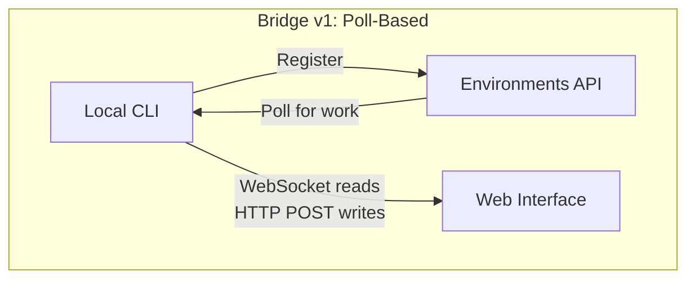
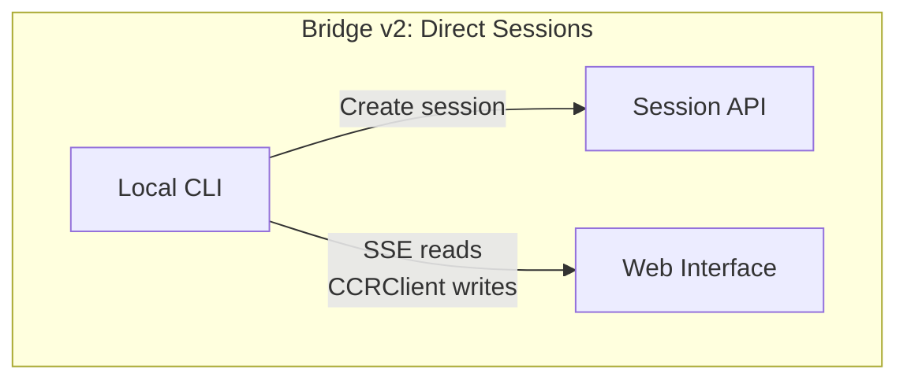
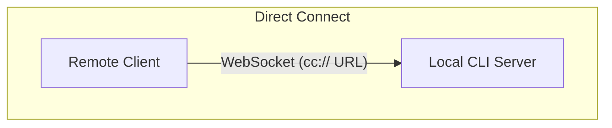
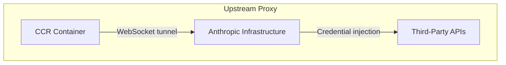

# Chapter 16: Remote Control and Cloud Execution

## The Agent Reaches Beyond Localhost

Tất cả các chương trước đến giờ đều giả định Claude Code chạy trên cùng máy với nơi chứa code. Terminal là local. Filesystem là local. Phản hồi từ model stream về một process đang nắm cả bàn phím lẫn thư mục làm việc.

Giả định đó vỡ ngay khi bạn muốn điều khiển Claude Code từ trình duyệt, chạy nó trong container cloud, hoặc mở nó thành một service trên LAN. Agent cần một cách để nhận chỉ thị từ web browser, mobile app, hoặc pipeline tự động -- chuyển tiếp permission prompt tới người không ngồi ở terminal, và tunnel lưu lượng API qua hạ tầng có thể inject credential hoặc terminate TLS thay mặt agent.

Claude Code giải bài toán này bằng bốn hệ thống, mỗi hệ thống xử lý một topology khác nhau:

<div class="diagram-grid">









</div>

Các hệ thống này chia sẻ cùng một triết lý thiết kế: reads và writes là bất đối xứng, reconnect là tự động, và failure sẽ `graceful degradation` thay vì đổ vỡ toàn cục.

---

## Bridge v1: Poll, Dispatch, Spawn

Bridge v1 là hệ thống remote control dựa trên environment. Khi developer chạy `claude remote-control`, CLI đăng ký với Environments API, poll để lấy việc, rồi spawn một child process cho mỗi session.

Trước khi đăng ký, hệ thống đi qua một chuỗi pre-flight checks: runtime feature gate, OAuth token validation, organization policy check, dead token detection (cơ chế backoff liên process sau ba lần fail liên tiếp với cùng token đã hết hạn), và proactive token refresh giúp loại bỏ khoảng 9% lượt đăng ký lẽ ra sẽ fail ngay lần đầu.

Sau khi đăng ký, bridge đi vào long-poll loop. Work item đi vào dưới dạng session (với trường `secret` chứa session tokens, API base URL, MCP configs, và environment variables) hoặc healthcheck. Bridge throttle log "no work" xuống còn mỗi 100 lượt poll rỗng mới ghi một lần.

Mỗi session spawn một child Claude Code process giao tiếp bằng NDJSON qua stdin/stdout. Permission request đi qua bridge transport tới web interface để user approve hoặc deny. Vòng round-trip này phải hoàn tất trong khoảng 10-14 giây.

---

## Bridge v2: Direct Sessions and SSE

Bridge v2 loại bỏ toàn bộ Environments API layer -- không registration, không polling, không acknowledgment, không heartbeat, không deregistration. Động cơ chính: v1 buộc server phải biết capability của máy trước khi dispatch work. V2 rút lifecycle xuống còn ba bước:

1. **Create session**: `POST /v1/code/sessions` với OAuth credentials.
2. **Connect bridge**: `POST /v1/code/sessions/{id}/bridge`. Trả về `worker_jwt`, `api_base_url`, và `worker_epoch`. Mỗi lần gọi `/bridge` sẽ tăng epoch -- đó chính là registration.
3. **Open transport**: SSE cho reads, `CCRClient` cho writes.

Transport abstraction (`ReplBridgeTransport`) hợp nhất v1 và v2 sau một interface chung, nên message handling không cần biết đang nói chuyện với thế hệ nào.

Khi kết nối SSE rớt vì 401, transport tự rebuild bằng credentials mới từ lần gọi `/bridge` mới, đồng thời giữ nguyên sequence number cursor -- không mất message nào. Write path dùng các `getAuthToken` closure theo từng instance thay vì environment variables toàn process, ngăn JWT leakage giữa các session chạy đồng thời.

### The FlushGate

Một bài toán ordering tinh vi: bridge cần gửi conversation history trong khi vẫn nhận live writes từ web interface. Nếu live write tới trong lúc history flush, message có thể bị giao sai thứ tự. `FlushGate` queue live writes trong lúc flush POST và drain theo đúng thứ tự khi flush xong.

### Token Refresh and Epoch Management

Bridge v2 proactive refresh worker JWT trước khi hết hạn. Epoch mới báo cho server rằng đây vẫn là worker cũ với credentials mới. Epoch mismatch (409 response) được xử lý dứt khoát: đóng cả hai kết nối và throw exception ngược lên caller, để chặn split-brain scenarios.

---

## Message Routing and Echo Deduplication

Cả hai thế hệ bridge đều dùng `handleIngressMessage()` làm router trung tâm:

1. Parse JSON, normalize control message keys.
2. Route `control_response` tới permission handler, `control_request` tới request handler.
3. Check UUID với `recentPostedUUIDs` (echo dedup) và `recentInboundUUIDs` (re-delivery dedup).
4. Forward user messages đã được validate.

### BoundedUUIDSet: O(1) Lookup, O(capacity) Memory

Bridge có bài toán echo -- message có thể echo ngược trên read stream hoặc bị giao lại hai lần khi switch transport. `BoundedUUIDSet` là một FIFO-bounded set dựng trên circular buffer:

```typescript
class BoundedUUIDSet {
  private buffer: string[]
  private set: Set<string>
  private head = 0

  add(uuid: string): void {
    if (this.set.size >= this.capacity) {
      this.set.delete(this.buffer[this.head])
    }
    this.buffer[this.head] = uuid
    this.set.add(uuid)
    this.head = (this.head + 1) % this.capacity
  }

  has(uuid: string): boolean { return this.set.has(uuid) }
}
```

Hai instance chạy song song, mỗi instance capacity 2000. Lookup O(1) qua Set, memory O(capacity) nhờ eviction bằng circular buffer, không cần timer hay TTL. Unknown control request subtypes sẽ nhận error response thay vì im lặng -- tránh để server chờ mãi một phản hồi không bao giờ tới.

---

## The Asymmetric Design: Persistent Reads, HTTP POST Writes

CCR protocol dùng asymmetric transport: reads đi qua persistent connection (WebSocket hoặc SSE), writes đi qua HTTP POST. Cách này phản ánh đúng bất đối xứng nền tảng trong communication pattern.

Reads có tần suất cao, độ trễ thấp, server-initiated -- hàng trăm message nhỏ mỗi giây trong lúc token streaming. Persistent connection là lựa chọn hợp lý duy nhất. Writes có tần suất thấp, client-initiated, và cần acknowledgment -- tính theo message mỗi phút, không phải mỗi giây. HTTP POST cho reliable delivery, idempotency qua UUID, và tích hợp tự nhiên với load balancer.

Nếu cố hợp nhất cả hai lên một WebSocket, bạn tạo coupling: nếu WebSocket rớt đúng lúc write, bạn phải thêm retry logic và phải phân biệt "not sent" với "sent but acknowledgment lost." Tách kênh giúp mỗi phía được tối ưu và phục hồi độc lập.

---

## Remote Session Management

`SessionsWebSocket` quản lý phía client của kết nối CCR WebSocket. Reconnection strategy của nó phân biệt theo failure type:

| Failure | Strategy |
|---------|----------|
| 4003 (unauthorized) | Stop immediately, no retries |
| 4001 (session not found) | Max 3 retries, linear backoff (transient during compaction) |
| Other transient | Exponential backoff, max 5 attempts |

Type guard `isSessionsMessage()` chấp nhận mọi object có trường `type` kiểu string -- chủ ý nới lỏng. Nếu dùng hardcoded allowlist, client có thể âm thầm drop message types mới trước khi kịp được cập nhật.

---

## Direct Connect: The Local Server

Direct Connect là topology đơn giản nhất: Claude Code chạy như một server và client kết nối qua WebSocket. Không qua cloud intermediary, không cần OAuth tokens.

Session có năm trạng thái: `starting`, `running`, `detached`, `stopping`, `stopped`. Metadata được lưu vào `~/.claude/server-sessions.json` để resume sau khi server restart. URL scheme `cc://` cung cấp cách định địa chỉ gọn cho kết nối local.

---

## Upstream Proxy: Credential Injection in Containers

Upstream proxy chạy trong CCR containers và giải một bài toán cụ thể: inject organization credentials vào outbound HTTPS traffic từ container, nơi agent có thể chạy untrusted commands.

Chuỗi setup được sắp thứ tự rất chặt:

1. Đọc session token từ `/run/ccr/session_token`.
2. Set `prctl(PR_SET_DUMPABLE, 0)` qua Bun FFI -- chặn ptrace cùng UID vào process heap. Nếu thiếu bước này, một prompt injection kiểu `gdb -p $PPID` có thể scrape token khỏi memory.
3. Tải upstream proxy CA certificate và concat với system CA bundle.
4. Start local CONNECT-to-WebSocket relay trên một ephemeral port.
5. Unlink file token -- từ đây token chỉ còn tồn tại trên heap.
6. Export environment variables cho toàn bộ subprocesses.

Mọi bước đều fail open: nếu lỗi thì disable proxy thay vì kill session. Đây là tradeoff đúng -- proxy fail khiến một số integrations không hoạt động, nhưng core functionality vẫn còn.

### Protobuf Hand-Encoding

Bytes đi qua tunnel được bọc trong protobuf message `UpstreamProxyChunk`. Schema rất đơn giản -- `message UpstreamProxyChunk { bytes data = 1; }` -- và Claude Code hand-encode trong mười dòng thay vì kéo cả protobuf runtime:

```typescript
export function encodeChunk(data: Uint8Array): Uint8Array {
  const varint: number[] = []
  let n = data.length
  while (n > 0x7f) { varint.push((n & 0x7f) | 0x80); n >>>= 7 }
  varint.push(n)
  const out = new Uint8Array(1 + varint.length + data.length)
  out[0] = 0x0a  // field 1, wire type 2
  out.set(varint, 1)
  out.set(data, 1 + varint.length)
  return out
}
```

Mười dòng thay cho cả một protobuf runtime đầy đủ. Một message một-field không đáng để thêm dependency -- chi phí bảo trì vài phép bit manipulation thấp hơn nhiều so với supply chain risk.

---

## Apply This: Designing Remote Agent Execution

**Tách read và write channels.** Khi reads là stream tần suất cao còn writes là RPC tần suất thấp, hợp nhất chúng tạo coupling không cần thiết. Hãy để từng channel fail và recover độc lập.

**Giới hạn bộ nhớ deduplication.** Mẫu BoundedUUIDSet cho dedup cố định bộ nhớ. Bất kỳ hệ thống at-least-once delivery nào cũng cần một dedup buffer có giới hạn, không phải Set tăng vô hạn.

**Thiết kế reconnection strategy tỷ lệ với tín hiệu failure.** Lỗi vĩnh viễn thì không retry. Lỗi tạm thời thì retry với backoff. Lỗi mơ hồ thì retry nhưng đặt trần thấp.

**Giữ secrets chỉ tồn tại trên heap trong môi trường đối kháng.** Đọc token từ file, tắt ptrace, rồi unlink file giúp loại bỏ cả tấn công qua filesystem lẫn memory inspection.

**Fail open cho hệ thống phụ trợ.** Upstream proxy fail open vì nó cung cấp enhanced functionality (credential injection), không phải core functionality (model inference).

Các hệ thống remote execution này mã hóa một nguyên tắc sâu hơn: core loop của agent (Chapter 5) phải agnostic với nơi chỉ thị đi vào và nơi kết quả đi ra. Bridge, Direct Connect, và upstream proxy là transport layers. Message handling, tool execution, và permission flows phía trên chúng là như nhau, bất kể user ngồi ngay terminal hay ở đầu kia của WebSocket.

Chương tiếp theo đi vào mối quan tâm vận hành còn lại: performance -- cách Claude Code tối ưu từng millisecond và token trên startup, rendering, search, và API costs.
