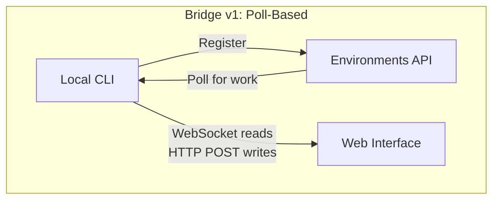
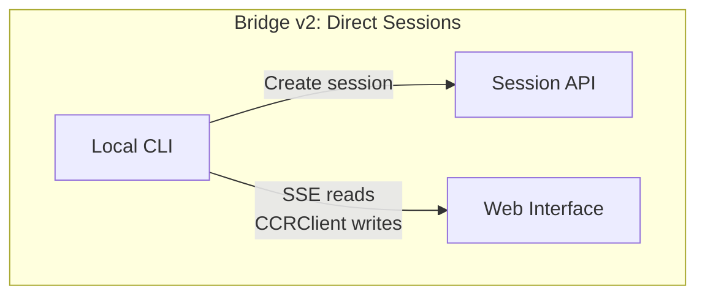
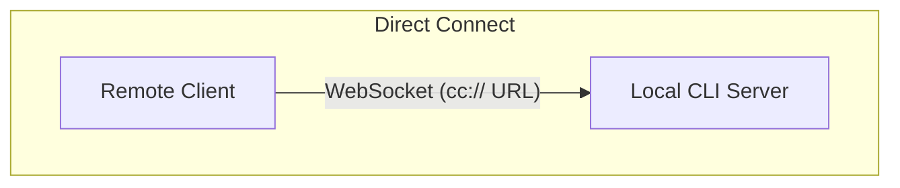
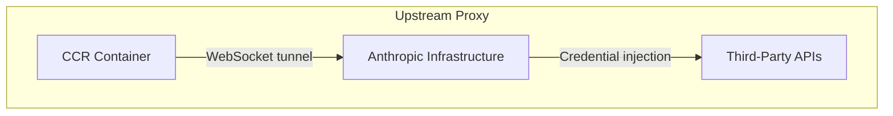

# Chương 16: Remote Control and Cloud Execution

## The Agent Reaches Beyond Localhost (Agent vươn ra ngoài localhost)

Mọi chương cho tới đây đều giả định Claude Code chạy trên cùng máy nơi mã nguồn đang nằm. Terminal là cục bộ. Filesystem là cục bộ. Phản hồi model được stream ngược về một process đang nắm cả bàn phím lẫn thư mục làm việc.

Giả định đó vỡ ngay khi bạn muốn điều khiển Claude Code từ trình duyệt, chạy nó trong container đám mây, hoặc phơi nó như một dịch vụ trên LAN. Agent cần một cách để nhận chỉ thị từ trình duyệt web, ứng dụng di động, hoặc pipeline tự động -- chuyển tiếp prompt quyền hạn đến một người không ngồi ở terminal, và tunnel lưu lượng API của nó qua hạ tầng có thể chèn credential hoặc terminate TLS thay mặt agent.

Claude Code giải quyết việc này bằng bốn hệ thống, mỗi hệ thống xử lý một topology khác nhau:

<div class="diagram-grid">









</div>

Các hệ thống này chia sẻ cùng một triết lý thiết kế: đường đọc và đường ghi bất đối xứng, tự động kết nối lại, và hỏng thì thoái hóa mềm (graceful degradation) thay vì sập cứng.

---

## Bridge v1: Poll, Dispatch, Spawn (Cầu nối v1: thăm dò, điều phối, khởi chạy)

Bridge v1 là hệ thống remote control dựa trên environment. Khi lập trình viên chạy `claude remote-control`, CLI đăng ký với Environments API, thăm dò để lấy việc, rồi spawn một tiến trình con cho mỗi session.

Trước khi đăng ký, một chuỗi kiểm tra pre-flight chạy qua: runtime feature gate, xác thực OAuth token, kiểm tra policy tổ chức, dead token detection (backoff liên tiến trình sau ba lần thất bại liên tiếp với cùng token đã hết hạn), và làm mới token chủ động để loại bỏ khoảng 9% lượt đăng ký vốn sẽ thất bại ở lần thử đầu tiên.

Sau khi đăng ký, bridge đi vào vòng long-poll. Work item đến dưới dạng session (với trường `secret` chứa session token, API base URL, cấu hình MCP, và biến môi trường) hoặc healthcheck. Bridge throttle log "không có việc" xuống còn mỗi 100 lần poll rỗng mới ghi một lần.

Mỗi session spawn một tiến trình con Claude Code giao tiếp bằng NDJSON qua stdin/stdout. Yêu cầu quyền hạn chảy qua transport của bridge tới giao diện web, nơi người dùng cho phép hoặc từ chối. Vòng khứ hồi này phải hoàn tất trong khoảng 10-14 giây.

---

## Bridge v2: Direct Sessions and SSE (Cầu nối v2: phiên trực tiếp và SSE)

Bridge v2 loại bỏ toàn bộ lớp Environments API -- không đăng ký, không polling, không acknowledgment, không heartbeat, không hủy đăng ký. Động cơ chính: v1 buộc server phải biết năng lực máy trước khi điều phối việc. V2 rút vòng đời xuống còn ba bước:

1. **Create session**: `POST /v1/code/sessions` với OAuth credential.
2. **Connect bridge**: `POST /v1/code/sessions/{id}/bridge`. Trả về `worker_jwt`, `api_base_url`, và `worker_epoch`. Mỗi lần gọi `/bridge` sẽ tăng epoch -- nó CHÍNH LÀ hành vi đăng ký.
3. **Open transport**: SSE cho đường đọc, `CCRClient` cho đường ghi.

Lớp trừu tượng transport (`ReplBridgeTransport`) hợp nhất v1 và v2 sau một interface chung, nên phần xử lý message không cần biết nó đang nói chuyện với thế hệ nào.

Khi kết nối SSE rớt vì 401, transport tự dựng lại bằng credential mới từ một lần gọi `/bridge` mới trong khi vẫn giữ sequence number cursor -- không mất message nào. Đường ghi dùng các closure `getAuthToken` theo từng instance thay vì biến môi trường toàn process, ngăn rò rỉ JWT giữa các session đồng thời.

### The FlushGate (Cổng xả tuần tự)

Một bài toán thứ tự tinh vi: bridge cần gửi lịch sử hội thoại trong lúc vẫn nhận ghi trực tiếp từ giao diện web. Nếu một lượt ghi trực tiếp đến trong lúc flush lịch sử, message có thể được giao sai thứ tự. `FlushGate` xếp hàng các lượt ghi trực tiếp trong lúc flush POST và xả ra theo đúng thứ tự khi flush xong.

### Token Refresh and Epoch Management (Làm mới token và quản lý epoch)

Bridge v2 chủ động làm mới worker JWT trước khi hết hạn. Epoch mới báo cho server rằng đây vẫn là worker cũ nhưng với credential mới. Sai lệch epoch (phản hồi 409) được xử lý quyết liệt: đóng cả hai kết nối và ném exception ngược lên caller, ngăn kịch bản split-brain.

---

## Message Routing and Echo Deduplication (Định tuyến thông điệp và khử trùng lặp echo)

Cả hai thế hệ bridge dùng chung `handleIngressMessage()` làm router trung tâm:

1. Parse JSON, chuẩn hóa khóa của control message.
2. Định tuyến `control_response` tới permission handler, `control_request` tới request handler.
3. Kiểm tra UUID đối chiếu `recentPostedUUIDs` (echo dedup) và `recentInboundUUIDs` (re-delivery dedup).
4. Chuyển tiếp các user message đã được xác thực.

### BoundedUUIDSet: O(1) Lookup, O(capacity) Memory (Tập UUID giới hạn: tra cứu O(1), bộ nhớ O(sức chứa))

Bridge có bài toán echo -- message có thể dội ngược trên luồng đọc hoặc bị giao hai lần khi switch transport. `BoundedUUIDSet` là một FIFO-bounded set dựng trên circular buffer:

```typescript
class BoundedUUIDSet {
  private buffer: string[]
  private set: Set<string>
  private head = 0

  add(uuid: string): void {
    if (this.set.size >= this.capacity) {
      this.set.delete(this.buffer[this.head])
    }
    this.buffer[this.head] = uuid
    this.set.add(uuid)
    this.head = (this.head + 1) % this.capacity
  }

  has(uuid: string): boolean { return this.set.has(uuid) }
}
```

Hai instance chạy song song, mỗi instance sức chứa 2000. Tra cứu O(1) nhờ Set, bộ nhớ O(capacity) nhờ cơ chế đẩy-vòng của circular buffer, không cần timer hay TTL. Các subtype control request không nhận diện sẽ nhận phản hồi lỗi thay vì im lặng -- tránh để server chờ một phản hồi không bao giờ đến.

---

## The Asymmetric Design: Persistent Reads, HTTP POST Writes (Thiết kế bất đối xứng: đọc bền vững, ghi bằng HTTP POST)

Giao thức CCR dùng transport bất đối xứng: đọc đi qua kết nối bền (WebSocket hoặc SSE), ghi đi qua HTTP POST. Điều này phản ánh một bất đối xứng nền tảng trong mẫu giao tiếp.

Đọc có tần suất cao, độ trễ thấp, do server khởi phát -- hàng trăm message nhỏ mỗi giây trong lúc token streaming. Kết nối bền là lựa chọn hợp lý duy nhất. Ghi có tần suất thấp, do client khởi phát, và cần acknowledgment -- tính theo message mỗi phút, không phải mỗi giây. HTTP POST cho giao hàng tin cậy, idempotency qua UUID, và tích hợp tự nhiên với load balancer.

Nếu cố hợp nhất cả hai lên một WebSocket, bạn tạo coupling: nếu WebSocket rớt trong lúc ghi, bạn cần logic retry và phải phân biệt "chưa gửi" với "đã gửi nhưng mất acknowledgment". Tách kênh cho phép mỗi bên được tối ưu và hồi phục độc lập.

---

## Remote Session Management (Quản lý phiên từ xa)

`SessionsWebSocket` quản lý phía client của kết nối CCR WebSocket. Chiến lược kết nối lại của nó phân biệt theo loại lỗi:

| Failure | Strategy |
|---------|----------|
| 4003 (unauthorized) | Stop immediately, no retries |
| 4001 (session not found) | Max 3 retries, linear backoff (transient during compaction) |
| Other transient | Exponential backoff, max 5 attempts |

Type guard `isSessionsMessage()` chấp nhận mọi object có trường `type` kiểu chuỗi -- chủ ý nới lỏng. Một allowlist hardcode sẽ âm thầm làm rơi loại message mới trước khi client được cập nhật.

---

## Direct Connect: The Local Server (Kết nối trực tiếp: server cục bộ)

Direct Connect là topology đơn giản nhất: Claude Code chạy như một server và client kết nối qua WebSocket. Không có trung gian đám mây, không có OAuth token.

Session có năm trạng thái: `starting`, `running`, `detached`, `stopping`, `stopped`. Metadata được lưu vào `~/.claude/server-sessions.json` để resume qua các lần server khởi động lại. URL scheme `cc://` cung cấp cơ chế địa chỉ gọn cho kết nối cục bộ.

---

## Upstream Proxy: Credential Injection in Containers (Proxy thượng nguồn: tiêm credential trong container)

Upstream proxy chạy bên trong container CCR và giải một vấn đề cụ thể: tiêm credential tổ chức vào lưu lượng HTTPS đi ra từ container, nơi agent có thể thực thi lệnh không đáng tin.

Trình tự thiết lập được sắp xếp rất chặt:

1. Đọc session token từ `/run/ccr/session_token`.
2. Đặt `prctl(PR_SET_DUMPABLE, 0)` qua Bun FFI -- chặn ptrace cùng UID lên heap của process. Không có bước này, một prompt bị tiêm kiểu `gdb -p $PPID` có thể cào token khỏi bộ nhớ.
3. Tải chứng chỉ CA của upstream proxy và nối với system CA bundle.
4. Khởi chạy relay CONNECT-to-WebSocket cục bộ trên một cổng ephemeral.
5. Unlink file token -- từ thời điểm này token chỉ còn tồn tại trên heap.
6. Export biến môi trường cho toàn bộ subprocess.

Mọi bước đều fail open: lỗi sẽ vô hiệu hóa proxy thay vì giết session. Đây là đánh đổi đúng -- proxy hỏng nghĩa là một số tích hợp không chạy, nhưng chức năng lõi vẫn còn.

### Protobuf Hand-Encoding (Mã hóa Protobuf thủ công)

Byte đi qua tunnel được bọc trong message protobuf `UpstreamProxyChunk`. Schema cực đơn giản -- `message UpstreamProxyChunk { bytes data = 1; }` -- và Claude Code tự mã hóa bằng tay trong mười dòng thay vì kéo cả runtime protobuf:

```typescript
export function encodeChunk(data: Uint8Array): Uint8Array {
  const varint: number[] = []
  let n = data.length
  while (n > 0x7f) { varint.push((n & 0x7f) | 0x80); n >>>= 7 }
  varint.push(n)
  const out = new Uint8Array(1 + varint.length + data.length)
  out[0] = 0x0a  // field 1, wire type 2
  out.set(varint, 1)
  out.set(data, 1 + varint.length)
  return out
}
```

Mười dòng thay cho cả một runtime protobuf đầy đủ. Message một trường không đáng để thêm dependency -- gánh nặng bảo trì của vài phép thao tác bit thấp hơn nhiều so với rủi ro supply chain.

---

## Apply This: Designing Remote Agent Execution (Áp dụng điều này: thiết kế thực thi agent từ xa)

**Tách kênh đọc và ghi.** Khi đọc là luồng tần suất cao còn ghi là RPC tần suất thấp, hợp nhất chúng sẽ tạo coupling không cần thiết. Hãy để từng kênh tự lỗi và tự phục hồi độc lập.

**Giới hạn bộ nhớ cho khử trùng lặp.** Mẫu BoundedUUIDSet cung cấp dedup bộ nhớ cố định. Mọi hệ thống giao hàng at-least-once đều cần bộ đệm dedup có giới hạn, không phải một Set tăng vô hạn.

**Làm chiến lược kết nối lại tỷ lệ với tín hiệu lỗi.** Lỗi vĩnh viễn thì không nên retry. Lỗi tạm thời thì retry với backoff. Lỗi mơ hồ thì retry nhưng đặt trần thấp.

**Giữ bí mật chỉ tồn tại trên heap trong môi trường đối kháng.** Đọc token từ file, tắt ptrace, rồi unlink file sẽ loại bỏ cả vector tấn công qua filesystem lẫn qua kiểm tra bộ nhớ.

**Fail open cho hệ thống phụ trợ.** Upstream proxy fail open vì nó cung cấp chức năng tăng cường (credential injection), không phải chức năng lõi (model inference).

Các hệ thống thực thi từ xa mã hóa một nguyên lý sâu hơn: vòng lặp lõi của agent (Chương 5) nên bất khả tri với nơi chỉ thị đi vào và nơi kết quả đi ra. Bridge, Direct Connect, và upstream proxy là các lớp transport. Phần xử lý message, thực thi tool, và luồng quyền hạn phía trên chúng là như nhau, bất kể người dùng đang ngồi ở terminal hay ở đầu bên kia của một WebSocket.

Chương tiếp theo sẽ xem mối quan tâm vận hành còn lại: hiệu năng -- cách Claude Code tận dụng từng mili giây và từng token qua khởi động, rendering, search, và chi phí API.
