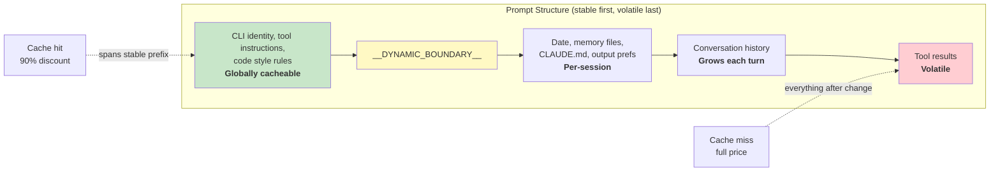

# Chương 17: Performance -- Every Millisecond and Token Counts

## The Senior Engineer's Playbook (Sổ tay của kỹ sư cấp cao)

Tối ưu hiệu năng trong một hệ thống agentic không phải một bài toán. Nó là năm bài toán:

1. **Startup latency** -- thời gian từ lúc gõ phím đến khi có đầu ra hữu ích đầu tiên. Người dùng sẽ bỏ công cụ nếu cảm giác khởi chạy chậm.
2. **Token efficiency** -- tỷ lệ context window được dùng cho nội dung hữu ích so với phần overhead. Context window là tài nguyên bị ràng buộc chặt nhất.
3. **API cost** -- chi phí tiền cho mỗi lượt. Prompt caching có thể giảm 90%, nhưng chỉ khi hệ thống giữ được cache stability qua các lượt.
4. **Rendering throughput** -- số khung hình/giây trong lúc stream đầu ra. Chương 13 đã nói về kiến trúc rendering; chương này nói về đo đạc hiệu năng và các tối ưu giúp nó luôn nhanh.
5. **Search speed** -- thời gian tìm một file trong codebase 270.000 đường dẫn ở mỗi lần gõ phím.

Claude Code tấn công cả năm mặt này bằng các kỹ thuật từ hiển nhiên (memoization) đến tinh vi (bitmap 26-bit để pre-filter fuzzy search). Một ghi chú về phương pháp luận: đây không phải tối ưu lý thuyết. Claude Code phát hành kèm hơn 50 startup profiling checkpoints, lấy mẫu ở 100% người dùng nội bộ và 0.5% người dùng bên ngoài. Mọi tối ưu bên dưới đều được thúc đẩy bởi dữ liệu từ lớp instrumentation này, không phải trực giác.

---

## Saving Milliseconds at Startup

### Module-Level I/O Parallelism (song song hóa I/O ở cấp module)

Điểm vào `main.tsx` cố ý vi phạm nguyên tắc "không side effects ở phạm vi module":

```typescript
profileCheckpoint('main_tsx_entry');
startMdmRawRead();       // fires plutil/reg-query subprocesses
startKeychainPrefetch();  // fires both macOS keychain reads in parallel
```

Hai mục keychain trên macOS nếu chạy tuần tự sẽ tốn khoảng ~65ms do spawn đồng bộ. Bằng cách khởi chạy cả hai dưới dạng promise fire-and-forget ở cấp module, chúng chạy song song với ~135ms thời gian nạp module mà nếu không thì CPU sẽ rỗi.

### API Preconnection (kết nối trước API)

`apiPreconnect.ts` bắn một request `HEAD` đến Anthropic API trong lúc khởi tạo, chồng lấp bắt tay TCP+TLS (100-200ms) với công việc setup. Ở interactive mode, phần chồng lấp này là không bị chặn trên -- kết nối được làm ấm trong lúc người dùng đang gõ. Request được gửi sau `applyExtraCACertsFromConfig()` và `configureGlobalAgents()` để kết nối đã làm ấm dùng đúng cấu hình transport.

### Fast-Path Dispatch and Deferred Imports (điều phối fast-path và import trì hoãn)

Điểm vào CLI có các nhánh trả về sớm cho subcommand chuyên biệt -- `claude mcp` không bao giờ nạp React REPL, `claude daemon` không bao giờ nạp tool system. Module nặng được nạp bằng `import()` động chỉ khi cần: OpenTelemetry (~400KB + ~700KB gRPC), event logging, error dialogs, upstream proxy. `LazySchema` trì hoãn việc dựng Zod schema đến lần validate đầu tiên, đẩy chi phí ra sau giai đoạn startup.

---

## Saving Tokens in the Context Window

### Slot Reservation: 8K Default, 64K Escalation

Tối ưu có tác động lớn nhất nếu xét đơn lẻ:

Mức dự trữ output slot mặc định là 8.000 token, tăng lên 64.000 khi bị truncation. API dự trữ `max_output_tokens` dung lượng cho phản hồi của model. Giá trị SDK mặc định là 32K-64K, nhưng dữ liệu production cho thấy độ dài output p99 là 4.911 token. Mặc định này đang dự trữ thừa 8-16x, lãng phí 24.000-59.000 token mỗi lượt. Claude Code chặn ở 8K và retry ở 64K trong trường hợp truncation hiếm gặp (<1% request). Với cửa sổ 200K, đây là mức cải thiện 12-28% cho usable context -- miễn phí.

### Tool Result Budgeting (phân bổ ngân sách kết quả tool)

| Limit | Value | Purpose |
|-------|-------|---------|
| Per-tool characters | 50,000 | Kết quả được ghi xuống đĩa khi vượt ngưỡng |
| Per-tool tokens | 100,000 | Cận trên ~400KB văn bản |
| Per-message aggregate | 200,000 chars | Ngăn N tool chạy song song làm nổ ngân sách trong một lượt |

Per-message aggregate là insight quan trọng. Nếu không có nó, "read all files in src/" có thể tạo 10 lượt đọc song song, mỗi lượt trả về 40K ký tự.

### Context Window Sizing (định cỡ context window)

Context window mặc định 200K token có thể mở rộng lên 1M qua hậu tố `[1m]` trên tên model hoặc qua treatment thử nghiệm. Khi mức sử dụng tiến gần giới hạn, hệ thống compaction 4 lớp sẽ tóm tắt dần nội dung cũ hơn. Việc đếm token bám theo trường `usage` thực tế từ API, không dựa vào ước lượng phía client -- vì vậy đã tính cả prompt caching credits, thinking tokens, và các biến đổi phía server.

---

## Saving Money on API Calls

### The Prompt Cache Architecture



Prompt cache của Anthropic hoạt động theo exact prefix matching. Nếu chỉ một token thay đổi giữa prefix, toàn bộ phần sau đó sẽ thành cache miss. Claude Code cấu trúc toàn bộ prompt sao cho phần ổn định ở trước và phần biến động ở sau.

Khi `shouldUseGlobalCacheScope()` trả về true, các mục system prompt trước dynamic boundary sẽ được gán `scope: 'global'` -- hai người dùng chạy cùng phiên bản Claude Code có thể chia sẻ prefix cache. Global scope bị tắt khi có MCP tools, vì MCP schema mang tính từng người dùng.

### Sticky Latch Fields

Năm trường boolean dùng mẫu sticky-on (bật là dính) -- một khi đã true thì giữ true suốt phiên:

| Latch Field | What It Prevents |
|-------------|-----------------|
| `promptCache1hEligible` | Overage lật giữa phiên làm đổi cache TTL |
| `afkModeHeaderLatched` | Bật/tắt Shift+Tab làm vỡ cache |
| `fastModeHeaderLatched` | Vào/ra cooldown làm vỡ cache hai lần |
| `cacheEditingHeaderLatched` | Bật/tắt config giữa phiên làm vỡ cache |
| `thinkingClearLatched` | Đổi thinking mode sau khi đã xác nhận cache miss |

Mỗi trường tương ứng với một header hoặc tham số mà nếu đổi giữa phiên sẽ làm vỡ khoảng ~50.000-70.000 token prompt đã cache. Các latch chấp nhận hy sinh khả năng toggle giữa phiên để giữ cache.

### Memoized Session Date

```typescript
const getSessionStartDate = memoize(getLocalISODate)
```

Nếu không có dòng này, ngày sẽ đổi lúc nửa đêm và làm vỡ toàn bộ cached prefix. Ngày cũ thì chỉ ảnh hưởng bề mặt; cache bust thì phải xử lý lại toàn bộ hội thoại.

### Section Memoization

Các section của system prompt dùng cache hai tầng. Phần lớn nội dung dùng `systemPromptSection(name, compute)`, được cache tới khi `/clear` hoặc `/compact`. Tùy chọn mạnh tay `DANGEROUS_uncachedSystemPromptSection(name, compute, reason)` sẽ tính lại mỗi lượt -- quy ước đặt tên này ép lập trình viên phải ghi rõ WHY việc phá cache là cần thiết.

---

## Saving CPU in Rendering

Chương 13 đã đi sâu vào kiến trúc rendering -- packed typed arrays, pool-based interning, double buffering, và cell-level diffing. Ở đây ta tập trung vào số đo hiệu năng và hành vi thích nghi giúp nó luôn nhanh.

Terminal renderer throttle ở 60fps qua `throttle(deferredRender, FRAME_INTERVAL_MS)`. Khi terminal bị blur, chu kỳ tăng gấp đôi thành 30fps. Các scroll drain frame chạy ở một phần tư chu kỳ để đạt tốc độ cuộn tối đa. Cơ chế throttle thích nghi này đảm bảo rendering không bao giờ ăn nhiều CPU hơn mức cần thiết.

React Compiler (`react/compiler-runtime`) tự động memoize việc render component trên toàn codebase. Việc dùng tay `useMemo` và `useCallback` dễ sai; compiler làm đúng theo thiết kế. Các object đóng băng dựng sẵn (`Object.freeze()`) loại bỏ allocation cho các giá trị phổ biến trên render path -- tiết kiệm một allocation mỗi frame ở alt-screen mode sẽ cộng dồn qua hàng nghìn frame.

Để xem chi tiết đầy đủ của rendering pipeline -- hệ thống interning `CharPool`/`StylePool`/`HyperlinkPool`, tối ưu blit, theo dõi damage rectangle, component OffscreenFreeze -- xem Chương 13.

---

## Saving Memory and Time in Search

Fuzzy file search chạy ở mọi lần gõ phím, tìm trên hơn 270.000 đường dẫn. Ba lớp tối ưu giữ thời gian dưới vài mili giây.

### The Bitmap Pre-Filter

Mỗi đường dẫn được index sẽ có một bitmap 26-bit biểu diễn các chữ cái thường mà nó chứa:

```typescript
// Pseudocode — illustrates the 26-bit bitmap concept
function buildCharBitmap(filepath: string): number {
  let mask = 0
  for (const ch of filepath.toLowerCase()) {
    const code = ch.charCodeAt(0)
    if (code >= 97 && code <= 122) mask |= 1 << (code - 97)
  }
  return mask  // Each bit represents presence of a-z
}
```

Ở thời điểm tìm: `if ((charBits[i] & needleBitmap) !== needleBitmap) continue`. Bất kỳ đường dẫn nào thiếu một ký tự trong truy vấn đều rớt ngay -- một phép so sánh số nguyên, không thao tác chuỗi. Tỷ lệ loại bỏ: ~10% cho truy vấn rộng như "test", và 90%+ cho truy vấn chứa ký tự hiếm. Chi phí: 4 byte mỗi đường dẫn, khoảng ~1MB cho 270.000 đường dẫn.

### Score-Bound Rejection and Fused indexOf Scan

Các đường dẫn qua được lớp bitmap sẽ bị kiểm tra score ceiling trước khi vào bước chấm điểm boundary/camelCase đắt đỏ. Nếu điểm tốt nhất có thể đạt vẫn không vượt ngưỡng top-K hiện tại, đường dẫn bị bỏ qua.

Khâu matching thực tế gộp luôn việc tìm vị trí với tính bonus khoảng cách/liền kề bằng `String.indexOf()`, vốn được SIMD-accelerated trong cả JSC (Bun) và V8 (Node). Bộ máy tìm kiếm đã tối ưu của engine nhanh hơn đáng kể so với vòng lặp ký tự viết tay.

### Async Indexing with Partial Queryability

Với codebase lớn, `loadFromFileListAsync()` nhường lại event loop sau mỗi ~4ms công việc (dựa theo thời gian, không theo số lượng -- tự thích nghi với tốc độ máy). Nó trả về hai promise: `queryable` (resolve ở chunk đầu tiên, cho phép kết quả một phần ngay lập tức) và `done` (hoàn tất toàn bộ index). Người dùng có thể bắt đầu tìm trong 5-10ms sau khi danh sách file sẵn sàng.

Kiểm tra điểm nhường dùng `(i & 0xff) === 0xff` -- branchless modulo-256 để phân bổ chi phí gọi `performance.now()`.

---

## The Memory Relevance Side-Query

Một tối ưu nằm ở giao điểm giữa token efficiency và API cost. Như đã mô tả ở Chương 11, hệ thống memory dùng một lệnh gọi model Sonnet nhẹ -- không dùng model Opus chính -- để chọn các file memory cần đưa vào. Chi phí (tối đa 256 output token trên model nhanh) là không đáng kể so với số token tiết kiệm được khi không đưa file memory không liên quan. Chỉ một file memory 2.000 token không liên quan đã tốn context lãng phí nhiều hơn cả chi phí API của side query.

---

## Speculative Tool Execution

`StreamingToolExecutor` bắt đầu chạy tool ngay khi chúng được stream tới, trước khi toàn bộ response hoàn tất. Tool chỉ đọc (Glob, Grep, Read) có thể chạy song song; tool ghi cần quyền truy cập độc quyền. Hàm `partitionToolCalls()` nhóm các tool an toàn liên tiếp thành từng batch: [Read, Read, Grep, Edit, Read, Read] thành ba batch -- [Read, Read, Grep] chạy đồng thời, [Edit] tuần tự, [Read, Read] đồng thời.

Kết quả luôn được yield theo đúng thứ tự tool ban đầu để model suy luận một cách xác định. Một sibling abort controller sẽ hủy các subprocess song song khi Bash tool lỗi, tránh lãng phí tài nguyên.

---

## Streaming and the Raw API

Claude Code dùng raw streaming API thay vì helper `BetaMessageStream` của SDK. Helper này gọi `partialParse()` ở mọi `input_json_delta` -- độ phức tạp O(n^2) theo độ dài input của tool. Claude Code tích lũy chuỗi thô và parse một lần khi block hoàn tất.

Một streaming watchdog (`CLAUDE_STREAM_IDLE_TIMEOUT_MS`, mặc định 90 giây) sẽ abort và retry nếu không có chunk nào đến, đồng thời fallback sang `messages.create()` không stream khi proxy lỗi.

---

## Apply This: Performance for Agentic Systems

**Audit ngân sách context window của bạn.** Độ chênh giữa phần dự trữ `max_output_tokens` và độ dài output p99 thực tế chính là context lãng phí. Đặt mặc định chặt và chỉ tăng khi gặp truncation.

**Thiết kế cho cache stability.** Mọi trường trong prompt của bạn hoặc là ổn định hoặc là biến động. Đặt phần ổn định trước, phần biến động sau. Hãy coi mọi thay đổi giữa hội thoại lên stable prefix là bug có chi phí tiền thật.

**Song song hóa I/O lúc startup.** Nạp module là CPU-bound. Đọc keychain và bắt tay mạng là I/O-bound. Hãy khởi chạy I/O trước import.

**Dùng bitmap pre-filter cho search.** Một lớp pre-filter rẻ loại 10-90% ứng viên trước bước chấm điểm đắt là lợi ích lớn với chi phí chỉ 4 byte mỗi phần tử.

**Đo nơi thật sự quan trọng.** Claude Code có hơn 50 startup checkpoints, lấy mẫu 100% nội bộ và 0.5% bên ngoài. Làm hiệu năng mà không đo đạc thì chỉ là đoán mò.

---

Một quan sát cuối: phần lớn các tối ưu này không hề tinh vi về mặt thuật toán. Bitmap pre-filter, circular buffers, memoization, interning -- đây đều là nền tảng khoa học máy tính. Sự tinh vi nằm ở chỗ biết áp dụng chúng ở đâu. Startup profiler cho bạn biết mili giây nằm ở đâu. Trường API usage cho bạn biết token nằm ở đâu. Cache hit rate cho bạn biết tiền nằm ở đâu. Đo trước, tối ưu sau, luôn luôn.