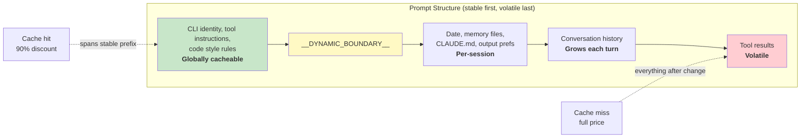

# Chương 17: Performance -- Every Millisecond and Token Counts

## The Senior Engineer's Playbook

Tối ưu hiệu năng trong một hệ thống agentic không phải là một vấn đề. Nó là năm vấn đề:

1. **Startup latency** -- thời gian từ lúc gõ phím đến khi có đầu ra hữu ích đầu tiên. Người dùng sẽ rời bỏ công cụ nếu cảm thấy khởi chạy chậm.
2. **Token efficiency** -- tỷ lệ context window được dùng cho nội dung hữu ích so với phần overhead. Context window là tài nguyên bị giới hạn chặt nhất.
3. **API cost** -- chi phí tiền cho mỗi lượt. Prompt caching có thể giảm con số này tới 90%, nhưng chỉ khi hệ thống giữ được cache stability qua các lượt.
4. **Rendering throughput** -- số khung hình mỗi giây trong lúc stream đầu ra. Chương 13 đã trình bày kiến trúc rendering; chương này tập trung vào số đo hiệu năng và các tối ưu giúp nó luôn nhanh.
5. **Search speed** -- thời gian tìm một file trong codebase 270.000 đường dẫn ở mỗi lần gõ phím.

Claude Code xử lý cả năm vấn đề bằng các kỹ thuật từ hiển nhiên (memoization) đến tinh tế (bitmap 26-bit để pre-filter fuzzy search). Một lưu ý về phương pháp: đây không phải tối ưu lý thuyết. Claude Code được phát hành với hơn 50 startup profiling checkpoints, lấy mẫu ở 100% người dùng nội bộ và 0.5% người dùng bên ngoài. Mọi tối ưu bên dưới đều xuất phát từ dữ liệu instrumentation này, không phải từ trực giác.

---

## Saving Milliseconds at Startup

### Module-Level I/O Parallelism

Điểm vào `main.tsx` chủ đích vi phạm nguyên tắc "không side effects ở module scope":

```typescript
profileCheckpoint('main_tsx_entry');
startMdmRawRead();       // fires plutil/reg-query subprocesses
startKeychainPrefetch();  // fires both macOS keychain reads in parallel
```

Hai mục keychain trên macOS nếu chạy tuần tự sẽ tốn khoảng ~65ms do spawn đồng bộ. Bằng cách khởi chạy cả hai dưới dạng promise fire-and-forget ở module level, chúng chạy song song với ~135ms thời gian nạp module mà nếu không thì CPU sẽ nhàn rỗi.

### API Preconnection

`apiPreconnect.ts` gửi một request `HEAD` đến Anthropic API trong giai đoạn khởi tạo, chồng lấp bắt tay TCP+TLS (100-200ms) với công việc setup. Ở interactive mode, phần chồng lấp này là không bị chặn trên -- kết nối được làm ấm trong lúc người dùng gõ. Request được gửi sau `applyExtraCACertsFromConfig()` và `configureGlobalAgents()` để kết nối đã làm ấm dùng đúng cấu hình transport.

### Fast-Path Dispatch and Deferred Imports

Điểm vào CLI có các nhánh trả về sớm cho subcommand chuyên biệt -- `claude mcp` không bao giờ nạp React REPL, `claude daemon` không bao giờ nạp tool system. Module nặng được nạp bằng `import()` động chỉ khi cần: OpenTelemetry (~400KB + ~700KB gRPC), event logging, error dialogs, upstream proxy. `LazySchema` hoãn việc dựng Zod schema đến lần validation đầu tiên, đẩy chi phí ra sau startup.

---

## Saving Tokens in the Context Window

### Slot Reservation: 8K Default, 64K Escalation

Tối ưu đơn lẻ có tác động lớn nhất:

Mức dự trữ output slot mặc định là 8.000 token, tăng lên 64.000 khi truncation. API dự trữ `max_output_tokens` dung lượng cho phản hồi của model. Giá trị mặc định của SDK là 32K-64K, nhưng dữ liệu production cho thấy độ dài output p99 là 4.911 token. Mặc định này đang dự trữ thừa 8-16x, lãng phí 24.000-59.000 token mỗi lượt. Claude Code giới hạn ở 8K và retry ở 64K trong trường hợp truncation hiếm gặp (<1% request). Với cửa sổ 200K, đây là mức cải thiện 12-28% usable context -- miễn phí.

### Tool Result Budgeting

| Limit | Value | Purpose |
|-------|-------|---------|
| Per-tool characters | 50,000 | Kết quả được ghi xuống đĩa khi vượt ngưỡng |
| Per-tool tokens | 100,000 | Cận trên ~400KB văn bản |
| Per-message aggregate | 200,000 chars | Ngăn N tool chạy song song làm nổ ngân sách trong một lượt |

Per-message aggregate là insight then chốt. Nếu không có nó, "read all files in src/" có thể tạo 10 lượt đọc song song, mỗi lượt trả về 40K ký tự.

### Context Window Sizing

Context window mặc định 200K token có thể mở rộng lên 1M qua hậu tố `[1m]` trong tên model hoặc qua experiment treatment. Khi mức sử dụng tiến gần giới hạn, một hệ thống compaction 4 lớp sẽ tóm tắt dần nội dung cũ. Việc đếm token dựa vào trường `usage` thực tế từ API, không dựa vào ước lượng phía client -- nên đã tính cả prompt caching credits, thinking tokens, và biến đổi phía server.

---

## Saving Money on API Calls

### The Prompt Cache Architecture



Prompt cache của Anthropic hoạt động theo exact prefix matching. Nếu chỉ một token thay đổi giữa prefix, toàn bộ phần sau đó sẽ thành cache miss. Claude Code cấu trúc toàn bộ prompt sao cho phần ổn định đứng trước và phần biến động đứng sau.

Khi `shouldUseGlobalCacheScope()` trả về true, các mục system prompt trước dynamic boundary sẽ được gán `scope: 'global'` -- hai người dùng chạy cùng phiên bản Claude Code có thể chia sẻ prefix cache. Global scope bị tắt khi có MCP tools, vì MCP schemas là theo từng người dùng.

### Sticky Latch Fields

Năm trường boolean dùng mẫu "sticky-on" -- một khi đã true thì giữ true trong suốt session:

| Latch Field | What It Prevents |
|-------------|-----------------|
| `promptCache1hEligible` | Mid-session overage flip changing cache TTL |
| `afkModeHeaderLatched` | Shift+Tab toggles busting cache |
| `fastModeHeaderLatched` | Cooldown enter/exit double-busting cache |
| `cacheEditingHeaderLatched` | Mid-session config toggles busting cache |
| `thinkingClearLatched` | Flipping thinking mode after confirmed cache miss |

Mỗi trường tương ứng với một header hoặc tham số mà nếu đổi giữa session sẽ làm vỡ ~50.000-70.000 token prompt đã cache. Các latch chấp nhận đánh đổi khả năng toggle giữa session để bảo toàn cache.

### Memoized Session Date

```typescript
const getSessionStartDate = memoize(getLocalISODate)
```

Nếu không có dòng này, ngày sẽ đổi lúc nửa đêm, làm vỡ toàn bộ cached prefix. Ngày cũ chỉ là khác biệt hiển thị; cache bust buộc phải xử lý lại toàn bộ cuộc hội thoại.

### Section Memoization

Các section của system prompt dùng cache hai tầng. Phần lớn nội dung dùng `systemPromptSection(name, compute)`, được cache đến khi `/clear` hoặc `/compact`. Tùy chọn mạnh tay `DANGEROUS_uncachedSystemPromptSection(name, compute, reason)` sẽ tính lại mỗi lượt -- quy ước đặt tên này buộc lập trình viên ghi rõ WHY việc phá cache là cần thiết.

---

## Saving CPU in Rendering

Chương 13 đã đi sâu vào kiến trúc rendering -- packed typed arrays, pool-based interning, double buffering, và cell-level diffing. Ở đây ta tập trung vào số đo hiệu năng và hành vi thích nghi giúp nó luôn nhanh.

Terminal renderer throttle ở 60fps qua `throttle(deferredRender, FRAME_INTERVAL_MS)`. Khi terminal bị blur, chu kỳ tăng gấp đôi thành 30fps. Scroll drain frames chạy ở một phần tư chu kỳ để đạt tốc độ cuộn tối đa. Cơ chế throttle thích nghi này đảm bảo rendering không bao giờ tiêu thụ CPU nhiều hơn mức cần thiết.

React Compiler (`react/compiler-runtime`) tự động memoizes render component trên toàn bộ codebase. Việc dùng tay `useMemo` và `useCallback` dễ lỗi; compiler làm đúng ngay từ cấu trúc. Các object bất biến dựng sẵn (`Object.freeze()`) loại bỏ allocation cho các giá trị phổ biến trên render path -- tiết kiệm một allocation mỗi frame ở alt-screen mode sẽ cộng dồn qua hàng nghìn frame.

Để xem chi tiết đầy đủ của rendering pipeline -- hệ thống interning `CharPool`/`StylePool`/`HyperlinkPool`, blit optimization, damage rectangle tracking, component OffscreenFreeze -- xem Chương 13.

---

## Saving Memory and Time in Search

Fuzzy file search chạy ở mỗi lần gõ phím, quét trên 270.000+ đường dẫn. Ba lớp tối ưu giữ thời gian ở mức vài mili giây.

### The Bitmap Pre-Filter

Mỗi đường dẫn được index có một bitmap 26-bit biểu diễn các chữ cái thường mà nó chứa:

```typescript
// Pseudocode — illustrates the 26-bit bitmap concept
function buildCharBitmap(filepath: string): number {
  let mask = 0
  for (const ch of filepath.toLowerCase()) {
    const code = ch.charCodeAt(0)
    if (code >= 97 && code <= 122) mask |= 1 << (code - 97)
  }
  return mask  // Each bit represents presence of a-z
}
```

Tại thời điểm tìm: `if ((charBits[i] & needleBitmap) !== needleBitmap) continue`. Bất kỳ đường dẫn nào thiếu một ký tự truy vấn đều bị loại ngay -- một phép so sánh số nguyên, không thao tác chuỗi. Tỷ lệ loại bỏ: ~10% với truy vấn rộng như "test", và 90%+ với truy vấn chứa ký tự hiếm. Chi phí: 4 byte mỗi đường dẫn, ~1MB cho 270.000 đường dẫn.

### Score-Bound Rejection and Fused indexOf Scan

Các đường dẫn qua được lớp bitmap sẽ bị kiểm tra score ceiling trước khi vào bước chấm điểm boundary/camelCase tốn kém. Nếu best-case score vẫn không thể vượt ngưỡng top-K hiện tại, đường dẫn bị bỏ qua.

Khâu matching thực tế gộp việc tìm vị trí với tính bonus khoảng cách/liền kề bằng `String.indexOf()`, vốn được SIMD-accelerated trong cả JSC (Bun) và V8 (Node). Search engine đã tối ưu của runtime nhanh hơn đáng kể so với vòng lặp ký tự viết tay.

### Async Indexing with Partial Queryability

Với codebase lớn, `loadFromFileListAsync()` nhường lại event loop sau mỗi ~4ms công việc (dựa trên thời gian, không dựa trên số lượng -- tự thích nghi theo tốc độ máy). Nó trả về hai promises: `queryable` (resolve ở chunk đầu tiên, cho kết quả một phần ngay lập tức) và `done` (hoàn tất toàn bộ index). Người dùng có thể bắt đầu tìm trong 5-10ms sau khi danh sách file sẵn sàng.

Kiểm tra điểm nhường dùng `(i & 0xff) === 0xff` -- branchless modulo-256 để dàn đều chi phí gọi `performance.now()`.

---

## The Memory Relevance Side-Query

Một tối ưu nằm ở giao điểm giữa token efficiency và API cost. Như mô tả ở Chương 11, hệ thống memory dùng một lệnh gọi model Sonnet nhẹ -- không phải model Opus chính -- để chọn các file memory cần đưa vào. Chi phí (256 max output tokens trên một model nhanh) là không đáng kể so với token tiết kiệm được khi không đưa các file memory không liên quan. Chỉ một file memory 2.000 token không liên quan đã tốn context lãng phí nhiều hơn chi phí API của side query.

---

## Speculative Tool Execution

`StreamingToolExecutor` bắt đầu chạy tools ngay khi chúng được stream vào, trước khi toàn bộ phản hồi hoàn tất. Read-only tools (Glob, Grep, Read) có thể chạy song song; write tools cần quyền truy cập độc quyền. Hàm `partitionToolCalls()` gom các tools an toàn liên tiếp thành batches: [Read, Read, Grep, Edit, Read, Read] thành ba batches -- [Read, Read, Grep] concurrent, [Edit] serial, [Read, Read] concurrent.

Kết quả luôn được yield theo đúng thứ tự tool ban đầu để bảo đảm model reasoning xác định. Một sibling abort controller hủy các subprocess song song khi Bash tool lỗi, tránh lãng phí tài nguyên.

---

## Streaming and the Raw API

Claude Code dùng raw streaming API thay vì helper `BetaMessageStream` của SDK. Helper này gọi `partialParse()` ở mỗi `input_json_delta` -- O(n^2) theo độ dài tool input. Claude Code tích lũy chuỗi thô và parse một lần khi block hoàn tất.

Một streaming watchdog (`CLAUDE_STREAM_IDLE_TIMEOUT_MS`, mặc định 90 giây) sẽ abort và retry nếu không có chunk nào đến, với fallback sang `messages.create()` không stream khi proxy lỗi.

---

## Apply This: Performance for Agentic Systems

**Audit ngân sách context window của bạn.** Khoảng cách giữa phần dự trữ `max_output_tokens` và độ dài output p99 thực tế là context lãng phí. Hãy đặt mặc định chặt và chỉ tăng khi truncation.

**Thiết kế cho cache stability.** Mọi trường trong prompt của bạn đều là stable hoặc volatile. Đặt stable trước, volatile sau. Hãy xem mọi thay đổi giữa cuộc hội thoại lên stable prefix là một bug có chi phí tiền thật.

**Parallelize startup I/O.** Module loading là CPU-bound. Keychain reads và network handshakes là I/O-bound. Hãy khởi chạy I/O trước imports.

**Dùng bitmap pre-filters cho search.** Một pre-filter rẻ loại 10-90% ứng viên trước bước scoring đắt tiền là một lợi ích lớn với chi phí 4 byte mỗi entry.

**Đo lường ở nơi quan trọng.** Claude Code có 50+ startup checkpoints, lấy mẫu ở 100% nội bộ và 0.5% bên ngoài. Làm hiệu năng mà không đo đạc chỉ là phỏng đoán.

---

Một quan sát cuối: phần lớn các tối ưu này không tinh vi về mặt thuật toán. Bitmap pre-filters, circular buffers, memoization, interning -- đây đều là nền tảng khoa học máy tính. Sự tinh vi nằm ở việc biết áp dụng chúng ở đâu. Startup profiler cho bạn biết mili giây nằm ở đâu. Trường `usage` của API cho bạn biết token nằm ở đâu. Cache hit rate cho bạn biết tiền nằm ở đâu. Luôn đo trước, tối ưu sau.